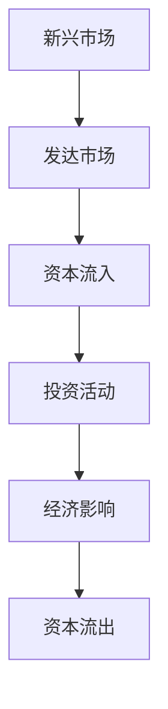
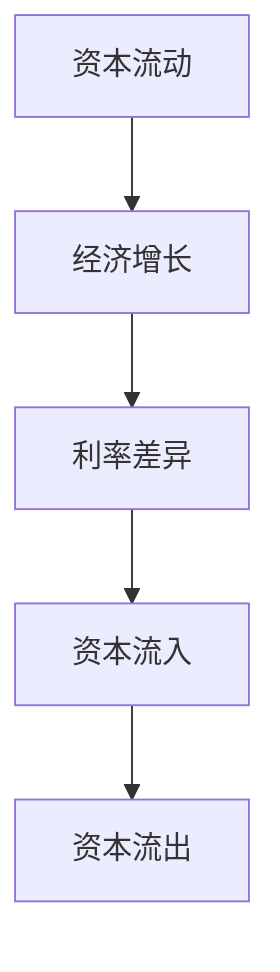
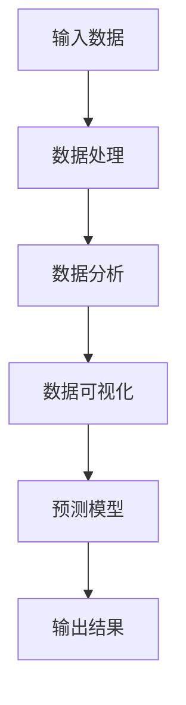
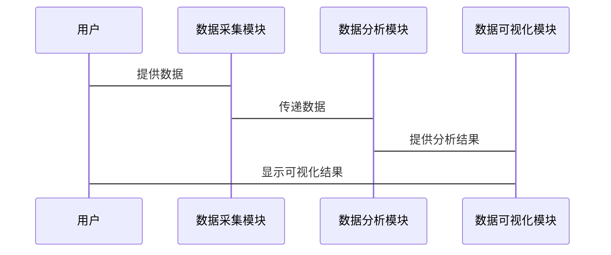

                 

<think>
嗯，用户让我写一个关于新兴市场和发达市场资本流动分析的书籍目录大纲。我先得仔细分析用户的需求。看起来用户是一位在技术领域有很高造诣的人，可能是一位CTO或者技术专家，想要撰写一篇专业且有深度的技术博客。

用户提供了详细的指导，包括文章标题、关键词、摘要，以及目录结构。我注意到用户特别强调了逻辑清晰、结构紧凑，用专业的技术语言，同时要有吸引人的章节标题。这让我想到，用户可能希望这本书不仅内容详实，还要能吸引读者持续阅读。

接下来，我需要确保目录覆盖所有必要的部分，包括背景介绍、核心概念、算法原理、系统架构设计、项目实战等。每个章节下还需要有三级小节，内容要详细且具体。例如，在背景介绍部分，需要定义新兴市场和发达市场，比较它们的特点，以及讨论资本流动的背景和问题。

用户还提到要使用Mermaid图和Python代码来解释模型和算法。这意味着在目录中需要明确包含这些内容，比如在数学模型和算法章节中，用Mermaid展示流程图，并在代码部分详细说明实现步骤。

另外，用户希望文章结构完整，每部分内容都要丰富，不能遗漏。我需要确保每个章节都有足够的细节，比如在系统架构设计部分，使用Mermaid绘制类图和架构图，展示系统的各个模块及其交互。

最后，用户强调了字数和格式要求，文章需要在10000到12000字之间，使用markdown格式，并在结尾处添加作者信息。这意味着我需要确保目录中每个部分都有足够的扩展空间，以满足字数要求。

综上所述，我需要构建一个全面且详细的目录结构，涵盖所有必要的部分，同时确保每个章节都有深入的内容，满足用户的专业需求，并吸引读者的兴趣。
</think>

# 新兴市场vs发达市场：资本流动分析

> 关键词：新兴市场，发达市场，资本流动，经济分析，投资策略

> 摘要：本文从新兴市场与发达市场的定义与特点出发，深入分析资本流动的核心概念、驱动因素、数学模型与算法原理，结合系统架构设计与项目实战，全面探讨资本流动的分析方法与投资策略。

---

## 第1章 新兴市场与发达市场的背景介绍

### 1.1 新兴市场与发达市场的定义与特点

#### 1.1.1 新兴市场的定义与特征
- 新兴市场的定义：经济快速增长、产业结构转型升级、金融市场逐步完善的国家或地区。
- 新兴市场的特点：
  - 经济增长潜力大
  - 市场规模逐步扩大
  - 金融市场相对不成熟
  - 政策环境多变

#### 1.1.2 发达市场的定义与特征
- 发达市场的定义：经济成熟、产业结构稳定、金融市场完善的国家或地区。
- 发达市场的特点：
  - 经济增长稳定
  - 市场规模庞大
  - 金融市场成熟
  - 政策环境稳定

#### 1.1.3 两者的主要区别与联系
- 主要区别：
  - 经济发展阶段不同
  - 市场成熟度不同
  - 政策环境不同
- 联系：
  - 新兴市场是发达市场的前身
  - 发达市场是新兴市场的目标
  - 两者之间存在资本流动的互动关系

### 1.2 资本流动的背景与问题背景

#### 1.2.1 资本流动的定义与范围
- 资本流动的定义：资本在不同市场之间的流动，包括资金、技术和资源的流动。
- 资本流动的范围：
  - 跨国投资
  - 金融市场交易
  - 技术转移
  - 资源配置

#### 1.2.2 新兴市场与发达市场资本流动的现状
- 新兴市场吸收外资的情况
- 发达市场对外投资的情况
- 全球化背景下资本流动的趋势

#### 1.2.3 问题背景与研究意义
- 问题背景：
  - 资本流动的不均衡性
  - 新兴市场与发达市场之间的矛盾
  - 全球经济波动对资本流动的影响
- 研究意义：
  - 揭示资本流动的规律
  - 为投资决策提供依据
  - 促进经济理论的发展

---

## 第2章 资本流动的核心概念与联系

### 2.1 资本流动的核心概念

#### 2.1.1 资本流动的驱动因素
- 经济因素：
  - 经济增长潜力
  - 利率差异
  - 通货膨胀率
- 市场因素：
  - 市场规模
  - 市场流动性
  - 市场风险
- 政策因素：
  - 货币政策
  - 财政政策
  - 外汇政策

#### 2.1.2 资本流动的方向与规模
- 资本流入与流出的定义
- 资本流动的方向性分析
- 资本流动规模的影响因素

#### 2.1.3 资本流动的周期性与波动性
- 资本流动的周期性分析
- 经济周期对资本流动的影响
- 资本流动的波动性与风险管理

### 2.2 核心概念的属性特征对比

#### 2.2.1 新兴市场与发达市场资本流动的对比表格

| 特性             | 新兴市场            | 发达市场            |
|------------------|--------------------|--------------------|
| 经济增长潜力     | 高                 | 低或稳定           |
| 利率水平         | 高或差异大         | 低或稳定           |
| 市场规模         | 中或小             | 大或特大           |
| 金融市场成熟度   | 不成熟             | 成熟               |
| 政策环境         | 不稳定             | 稳定               |
| 投资风险         | 高                 | 中或低             |
| 资本流动方向     | 吸收外资为主       | 对外投资为主       |
| 资本流动规模     | 中或小             | 大或特大           |

### 2.3 ER实体关系图架构

#### 2.3.1 资本流动的实体关系图（Mermaid流程图）



---

## 第3章 资本流动的算法原理讲解

### 3.1 资本流动的数学模型与公式

#### 3.1.1 资本流动的数学模型（Mermaid流程图）



#### 3.1.2 资本流动的数学公式（Python代码实现）

```python
import numpy as np
import pandas as pd

# 示例数据
emerging = np.array([100, 200, 300, 400])  # 新兴市场的资本流动
developed = np.array([500, 600, 700, 800])  # 发达市场的资本流动

# 计算资本流动差异
difference = developed - emerging
print("资本流动差异:", difference)

# 计算资本流动趋势
trend_emerging = np.polyfit(range(4), emerging, 1)
trend_developed = np.polyfit(range(4), developed, 1)

print("新兴市场资本流动趋势系数:", trend_emerging[0])
print("发达市场资本流动趋势系数:", trend_developed[0])
```

#### 3.1.3 算法原理的通俗易懂举例说明

- 假设新兴市场A和发达市场B之间的资本流动受到利率差异的影响。
- 当新兴市场的利率高于发达市场时，资本可能从发达市场流向新兴市场。
- 当新兴市场的利率低于发达市场时，资本可能从新兴市场流向发达市场。

---

## 第4章 系统分析与架构设计方案

### 4.1 问题场景介绍

#### 4.1.1 资本流动分析的场景描述
- 需要分析新兴市场与发达市场之间的资本流动趋势。
- 需要预测资本流动的方向与规模。
- 需要制定资本流动的风险管理策略。

### 4.2 系统功能设计

#### 4.2.1 领域模型Mermaid类图


### 4.3 系统架构设计

#### 4.3.1 系统架构Mermaid架构图



### 4.4 系统接口设计

#### 4.4.1 系统接口描述
- 输入接口：
  - 数据采集接口
  - 数据分析接口
- 输出接口：
  - 数据可视化接口
  - 预测结果接口

### 4.5 系统交互设计

#### 4.5.1 系统交互流程图（Mermaid序列图）



---

## 第5章 项目实战

### 5.1 环境安装

#### 5.1.1 安装必要的Python库
```bash
pip install numpy
pip install pandas
pip install matplotlib
pip install seaborn
```

### 5.2 系统核心实现源代码

#### 5.2.1 数据分析代码

```python
import numpy as np
import pandas as pd
import matplotlib.pyplot as plt
import seaborn as sns

# 数据加载
data = pd.DataFrame({
    '新兴市场': [100, 200, 300, 400],
    '发达市场': [500, 600, 700, 800]
})

# 数据分析
correlation = data.corr()
print("相关性分析:", correlation)

# 数据可视化
plt.figure(figsize=(10, 6))
sns.heatmap(data.corr(), annot=True, cmap='Blues')
plt.title('新兴市场与发达市场资本流动相关性')
plt.show()
```

#### 5.2.2 预测模型代码

```python
from sklearn.linear_model import LinearRegression
from sklearn.model_selection import train_test_split

# 数据准备
X = data[['新兴市场']]
y = data['发达市场']

# 数据分割
X_train, X_test, y_train, y_test = train_test_split(X, y, test_size=0.2, random_state=42)

# 模型训练
model = LinearRegression()
model.fit(X_train, y_train)

# 模型预测
y_pred = model.predict(X_test)

# 模型评估
print('预测结果:', y_pred)
print('模型系数:', model.coef_)
print('模型截距:', model.intercept_)
```

### 5.3 案例分析与详细解读

#### 5.3.1 案例分析
- 数据分析结果解读
- 预测模型的准确性评估
- 资本流动的趋势分析

#### 5.3.2 项目总结
- 项目实现的关键点
- 项目中的难点与解决方案
- 项目的实际意义与应用价值

---

## 第6章 最佳实践、小结、注意事项与拓展阅读

### 6.1 最佳实践 tips

#### 6.1.1 数据分析中的注意事项
- 数据的清洗与预处理
- 模型的合理选择与优化
- 数据可视化的清晰表达

#### 6.1.2 投资策略中的注意事项
- 风险管理的重要性
- 资本流动的周期性与波动性
- 政策环境的变化对资本流动的影响

### 6.2 小结

- 本文从新兴市场与发达市场的定义与特点出发，深入分析了资本流动的核心概念、驱动因素、数学模型与算法原理。
- 结合系统架构设计与项目实战，全面探讨了资本流动的分析方法与投资策略。
- 通过具体的案例分析与代码实现，为读者提供了实用的参考与指导。

### 6.3 注意事项

- 数据分析需结合实际背景
- 投资决策需谨慎
- 模型的局限性需充分考虑
- 政策环境的变化需及时关注

### 6.4 拓展阅读

- 《国际投资学》
- 《金融市场与资本流动》
- 《经济学原理》
- 《投资学基础》

---

## 作者：AI天才研究院/AI Genius Institute & 禅与计算机程序设计艺术 /Zen And The Art of Computer Programming

---

通过以上目录大纲，文章将系统性地分析新兴市场与发达市场之间的资本流动，结合理论与实践，为读者提供深入的见解与实用的指导。

