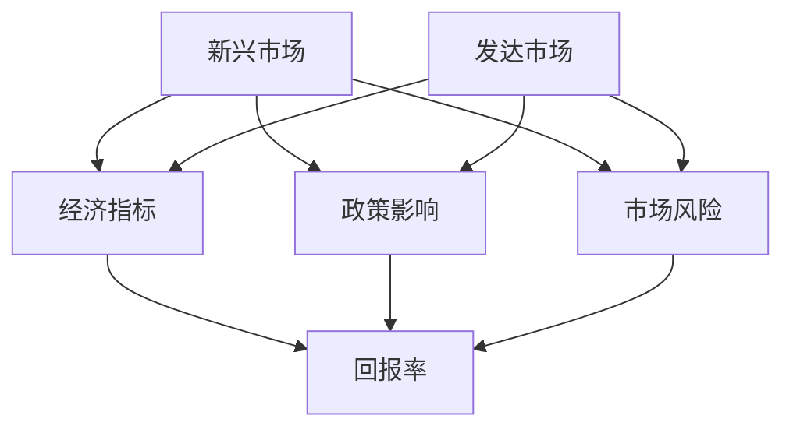

                 


# 《新兴市场与发达市场未来回报率预测的差异》

## 关键词：新兴市场，发达市场，回报率预测，时间序列分析，机器学习，ARIMA模型，GARCH模型

## 摘要：本文探讨新兴市场与发达市场在回报率预测上的差异，通过分析两者的市场特性、数据获取难度和算法适用性，揭示不同市场环境下预测模型的选择与优化策略。文章结合时间序列分析和机器学习方法，详细阐述了ARIMA、GARCH等模型的原理及应用，最后通过系统架构设计和项目实战，为读者提供了一套完整的预测解决方案。

---

# 第1章 新兴市场与发达市场背景介绍

## 1.1 问题背景

### 1.1.1 新兴市场与发达市场的定义与特点

- **新兴市场**：指那些经济快速发展但尚未完全成熟的国家或地区，如中国、印度等。这些市场具有较高的增长潜力，但也伴随着较高的波动性和不确定性。
- **发达市场**：指经济成熟、市场结构完善、金融体系发达的国家，如美国、日本等。这些市场的波动性较低，但增长潜力有限。

### 1.1.2 回报率预测的核心问题

- 回报率预测的核心问题在于如何捕捉市场波动性、识别趋势，并在此基础上构建有效的预测模型。
- 在新兴市场，由于数据稀疏性和市场不成熟，预测模型的构建更具挑战性。
- 在发达市场，由于数据丰富且市场结构稳定，预测模型的构建相对更为可靠。

### 1.1.3 问题的边界与外延

- **边界**：本文仅关注金融市场的回报率预测，不涉及其他类型的资产或市场。
- **外延**：本文的研究方法可以扩展到其他类型的市场分析，如外汇市场、商品市场等。

## 1.2 核心概念与联系

### 1.2.1 新兴市场与发达市场的对比分析

| **特征**       | **新兴市场**                     | **发达市场**                     |
|----------------|----------------------------------|----------------------------------|
| 市场成熟度     | 较低                             | 较高                             |
| 数据可得性     | 有限                             | 丰富                             |
| 波动性         | 高                               | 低                               |
| 预测难度       | 高                               | 中等                             |

### 1.2.2 实体关系图（ER图）



---

# 第2章 回报率预测的算法原理

## 2.1 时间序列分析

### 2.1.1 ARIMA模型

- **ARIMA模型**：Autoregressive Integrated Moving Average，是一种广泛应用于时间序列预测的线性模型。
- **公式**：$$ARIMA(p, d, q)$$
  - $p$：自回归部分的阶数
  - $d$：差分阶数
  - $q$：移动平均部分的阶数

### 2.1.2 GARCH模型

- **GARCH模型**：Generalized Autoregressive Conditional Heteroskedasticity，用于捕捉时间序列中的波动性。
- **公式**：$$GARCH(p, q)$$
  - $p$：自回归部分的阶数
  - $q$：移动平均部分的阶数

### 2.1.3 模型选择与优化

- **步骤**：
  1. 数据预处理：去除趋势和季节性。
  2. 模型选择：通过AIC、BIC等指标选择最优模型。
  3. 模型验证：使用滚动预测法验证模型的准确性。

## 2.2 机器学习模型

### 2.2.1 线性回归模型

- **公式**：$$y = \beta_0 + \beta_1x + \epsilon$$
- **优点**：简单易懂，计算效率高。
- **缺点**：无法捕捉非线性关系。

### 2.2.2 支持向量回归

- **原理**：通过构建支持向量回归模型，将输入特征映射到高维空间，寻找最优超平面。
- **优点**：适用于非线性关系，泛化能力强。
- **缺点**：计算复杂度较高。

---

# 第3章 数学模型与公式

## 3.1 时间序列模型

### 3.1.1 ARIMA模型公式

$$ARIMA(p, d, q)$$

### 3.1.2 GARCH模型公式

$$GARCH(p, q)$$

## 3.2 机器学习模型

### 3.2.1 线性回归公式

$$y = \beta_0 + \beta_1x + \epsilon$$

---

# 第4章 系统架构设计

## 4.1 系统功能设计

### 4.1.1 数据预处理

- 数据清洗：去除缺失值、异常值。
- 数据转换：标准化、归一化。

### 4.1.2 特征提取

- 从经济指标、政策影响中提取特征。

### 4.1.3 模型训练

- 使用ARIMA、GARCH等模型进行训练。

### 4.1.4 预测结果

- 生成预测回报率。

---

# 第5章 项目实战

## 5.1 环境安装

- **Python**：安装`pandas`、`numpy`、`sklearn`等库。

## 5.2 系统核心实现源代码

```python
import pandas as pd
from statsmodels.tsa.arima_model import ARIMA
from sklearn.svm import SVR

# 数据加载
data = pd.read_csv('market_returns.csv')

# 数据预处理
data = data.dropna()

# 特征提取
X = data[['economic_indicators', 'policy_impact']]
y = data['return_rate']

# 模型训练
model_arima = ARIMA(y, order=(5, 1, 0)).fit()
model_svr = SVR(kernel='rbf', C=1e3).fit(X, y)

# 预测结果
forecast_arima = model_arima.forecast(steps=10)
forecast_svr = model_svr.predict(X[-10:])
```

## 5.3 代码应用解读与分析

- **ARIMA模型**：用于捕捉时间序列的趋势和季节性。
- **SVR模型**：用于捕捉非线性关系。

---

# 第6章 总结与展望

## 6.1 总结

- 新兴市场与发达市场的回报率预测存在显著差异。
- 时间序列分析和机器学习模型各有优劣。

## 6.2 展望

- 组合模型：结合ARIMA和SVR模型，提升预测精度。
- 实时预测：开发实时预测系统，提供动态反馈。

---

作者：AI天才研究院/AI Genius Institute & 禅与计算机程序设计艺术 /Zen And The Art of Computer Programming

