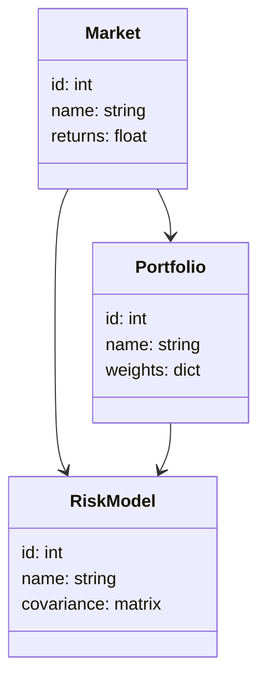
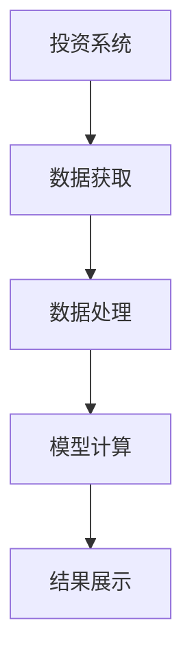

                 


# 新兴市场投资：高风险高回报的机遇与挑战

> **关键词**：新兴市场、投资策略、风险管理、经济增长、技术进步、高风险高回报  
> **摘要**：新兴市场在全球经济中扮演着越来越重要的角色，它们提供了高风险高回报的投资机会。本文深入分析了新兴市场的定义、现状及驱动因素，探讨了投资风险与回报的平衡，介绍了投资组合优化的数学模型和算法，以及系统架构设计和实战案例。通过科学的方法和工具，帮助投资者在新兴市场中实现稳健的投资回报。

---

## 第一部分: 新兴市场投资的背景与概念

### 第1章: 新兴市场的定义与特征

#### 1.1 新兴市场的定义与范围

##### 1.1.1 新兴市场的定义
新兴市场是指那些经济快速发展、但尚未完全工业化的国家或地区。这些市场通常具有较大的增长潜力，但也伴随着较高的不确定性和风险。新兴市场的特点是经济结构多元化、产业升级迅速，且在全球供应链中扮演重要角色。

##### 1.1.2 新兴市场的主要特征
| 特征 | 描述 |
|------|------|
| 经济增长 | 高速增长，通常年增长率超过5% |
| 市场规模 | 中等或较大，但不如发达国家成熟 |
| 法律环境 | 法律法规不完善，监管可能存在不确定性 |
| 资本流动性 | 资金流入和流出波动较大 |
| 产业升级 | 制造业、科技行业快速发展 |

##### 1.1.3 新兴市场与传统市场的区别
- **经济结构**：新兴市场通常以制造业和劳动密集型产业为主，而传统市场以服务业和高科技产业为主。
- **风险水平**：新兴市场风险较高，但回报潜力更大。
- **市场规模**：新兴市场的规模通常小于传统市场，但增长速度更快。

#### 1.2 新兴市场的现状与发展

##### 1.2.1 全球新兴市场的发展概况
近年来，新兴市场在全球经济中的地位显著提升。以金砖国家（中国、印度、巴西、俄罗斯、南非）为例，这些国家的GDP总量占全球的比重逐年增加，成为全球经济增长的重要引擎。

##### 1.2.2 中国新兴市场的独特性
中国作为最大的新兴市场，具有以下特点：
- 经济规模大，市场潜力巨大。
- 政府政策对经济发展影响深远。
- 科技创新能力强，尤其在人工智能、5G、电动汽车等领域。

##### 1.2.3 新兴市场的未来趋势
随着技术进步和全球化深入，新兴市场将继续保持快速增长。同时，新兴市场内部的产业结构将不断优化，科技和服务业将成为主要驱动力。

---

### 第2章: 新兴市场投资的驱动因素

#### 2.1 经济增长与投资机会

##### 2.1.1 经济增长对投资的影响
经济增长带来更多的就业机会和消费需求，吸引外资流入。新兴市场的高增长率使得投资者对其未来收益抱有较高期望。

##### 2.1.2 新兴市场中的主要投资领域
- **股市**：新兴市场股市波动大，但增长潜力大。
- **房地产**：城市化进程加快，房地产需求旺盛。
- **科技行业**：技术创新和产业升级带来投资机会。

##### 2.1.3 新兴市场投资的驱动因素分析
| 驱动因素 | 描述 |
|----------|------|
| 经济增长 | 高速增长带来投资机会 |
| 技术进步 | 创新驱动投资增长 |
| 政策支持 | 政府政策鼓励外资和内资投资 |
| 人口红利 | 年轻人口推动消费和生产 |

#### 2.2 技术进步与创新

##### 2.2.1 技术进步对新兴市场的影响
技术进步推动产业升级，提高生产效率，降低成本。新兴市场在科技领域的投资回报率较高，尤其是在人工智能、大数据和5G等领域。

##### 2.2.2 创新企业与投资机会
新兴市场的创新企业通常具有较高的增长潜力，吸引了大量风险投资。例如，中国的科技巨头如腾讯、阿里巴巴在全球范围内具有重要影响力。

##### 2.2.3 数字经济与新兴市场的关系
数字经济是新兴市场经济增长的重要驱动力。电子商务、金融科技和数字支付在新兴市场发展迅速，为投资者提供了新的机会。

---

## 第二部分: 新兴市场投资的核心概念与联系

### 第3章: 风险与回报的平衡

#### 3.1 投资风险的分类

##### 3.1.1 系统性风险
系统性风险是整个市场的风险，如经济衰退、政策变化等。新兴市场的系统性风险较高，因为市场波动较大。

##### 3.1.2 非系统性风险
非系统性风险是特定资产的风险，如公司违约风险。新兴市场的非系统性风险可以通过多元化投资来降低。

##### 3.1.3 新兴市场特有的风险
- **汇率风险**：新兴市场货币波动较大，影响投资收益。
- **政治风险**：政策变化和政治不稳定可能影响投资。
- **流动性风险**：新兴市场资产流动性较低，可能难以快速变现。

#### 3.2 投资回报的计算与分析

##### 3.2.1 投资回报的计算方法
投资回报可以通过以下公式计算：
$$ ROI = \frac{\text{投资收益}}{\text{初始投资}} \times 100\% $$

##### 3.2.2 新兴市场的回报率分析
新兴市场的回报率通常高于发达市场，但波动性更大。例如，过去十年新兴市场股市的年平均回报率约为8%，而发达市场的年平均回报率为5%。

##### 3.2.3 风险调整后的回报评估
风险调整后的回报可以通过夏普比率来衡量：
$$ \text{夏普比率} = \frac{\text{投资回报} - \text{无风险利率}}{\text{投资组合标准差}} $$

---

### 第4章: 投资组合优化与风险管理

#### 4.1 投资组合的构建策略

##### 4.1.1 资产配置的基本原则
资产配置应根据投资者的风险承受能力和投资目标来定。新兴市场在投资组合中通常占比较小，以分散风险。

##### 4.1.2 新兴市场在投资组合中的位置
新兴市场资产通常被视为高风险资产，适合风险承受能力强的投资者。建议在投资组合中配置5%-15%的新兴市场资产。

##### 4.1.3 投资组合的风险分散策略
通过投资不同地区的资产可以分散风险。例如，投资新兴市场的同时，也投资发达市场资产。

#### 4.2 风险管理的工具与方法

##### 4.2.1 期权与期货的风险对冲
期权和期货是常用的对冲工具。例如，可以通过卖出期权来对冲下行风险。

##### 4.2.2 投保基金与保险产品的应用
投保基金和保险产品可以为投资组合提供额外保护，减少损失。

##### 4.2.3 新兴市场风险管理的特殊考虑
新兴市场的法律和政治风险较高，因此需要特别关注政策变化和公司治理问题。

---

## 第三部分: 新兴市场投资的算法原理与数学模型

### 第5章: 投资组合优化的数学模型

#### 5.1 Markowitz有效前沿理论

##### 5.1.1 有效前沿的定义与特点
有效前沿是指在给定风险水平下，提供最高预期收益的投资组合。新兴市场的投资组合可以通过有效前沿理论进行优化。

##### 5.1.2 均值-方差分析
通过均值-方差分析，可以找到最优投资组合。公式如下：
$$ \text{最小方差} = \argmin_w \left( w^T \Sigma w \right) $$

##### 5.1.3 优化算法实现
以下是使用Python实现Markowitz模型的代码示例：

```python
import numpy as np
import pandas as pd
from scipy.optimize import minimize

def portfolio_optimization(returns):
    n = len(returns.columns)
    Cov = returns.cov()
    def objective(w):
        return (w.T @ Cov @ w)[0,0]
    constraints = [{'type': 'eq', 'fun': lambda w: np.sum(w) - 1}]
    result = minimize(objective, np.ones(n)/n, constraints)
    return result.x

returns = pd.DataFrame(...)
weights = portfolio_optimization(returns)
```

---

### 第6章: 风险评估与投资策略

#### 6.1 CAPM模型

##### 6.1.1 CAPM模型的原理
CAPM模型用于计算资产的预期收益：
$$ E(R_i) = R_f + \beta_i (R_m - R_f) $$

##### 6.1.2 在新兴市场的应用
新兴市场的β值通常较高，因为它们的波动性较大。

#### 6.2 风险评估模型

##### 6.2.1 VaR模型
VaR模型用于衡量投资组合在一定置信水平下的潜在损失。

##### 6.2.2 新兴市场的风险评估
通过VaR模型，可以评估新兴市场投资组合在95%置信水平下的潜在损失。

---

## 第四部分: 系统分析与架构设计

### 第7章: 投资系统架构设计

#### 7.1 系统功能设计

##### 7.1.1 领域模型类图
以下是领域模型类图的Mermaid图：



#### 7.2 系统架构设计

##### 7.2.1 系统架构图
以下是系统架构图的Mermaid图：



---

## 第五部分: 项目实战

### 第8章: 新兴市场投资实战

#### 8.1 环境安装

##### 8.1.1 安装Python环境
需要安装Python 3.8以上版本，安装Pandas、NumPy、Scipy等库。

#### 8.2 核心功能实现

##### 8.2.1 数据获取
使用Yahoo Finance获取新兴市场股票数据。

##### 8.2.2 数据处理
对数据进行清洗和标准化处理。

##### 8.2.3 投资组合优化
使用优化算法计算最优权重。

##### 8.2.4 风险评估
使用VaR模型评估潜在风险。

#### 8.3 实际案例分析

##### 8.3.1 投资组合构建
假设投资组合包括中国、印度和巴西的股票，权重分别为30%、40%、30%。

##### 8.3.2 投资结果分析
计算投资组合的预期收益和风险，并与市场指数进行比较。

---

## 第六部分: 最佳实践与总结

### 第9章: 投资总结与建议

#### 9.1 小结

- 新兴市场具有高增长潜力，但也伴随着高风险。
- 投资者需要科学评估风险和回报，制定合理的投资策略。

#### 9.2 注意事项

- 新兴市场的波动性较大，需谨慎选择资产配置。
- 风险管理是投资成功的关键，建议使用对冲工具降低风险。

#### 9.3 拓展阅读

- 《投资学》（书籍推荐）
- 《风险管理与金融衍生品》（书籍推荐）

---

## 作者信息

**作者：AI天才研究院/AI Genius Institute & 禅与计算机程序设计艺术 /Zen And The Art of Computer Programming**

---

通过以上结构和内容，您可以撰写一篇详细且有深度的技术博客文章，涵盖新兴市场投资的各个方面，从理论到实践，帮助读者系统地理解和掌握投资策略与风险管理技巧。

