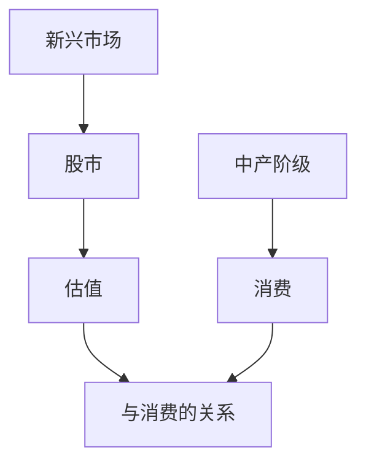
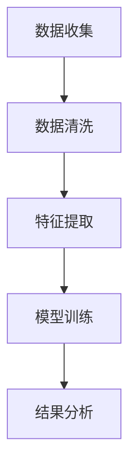
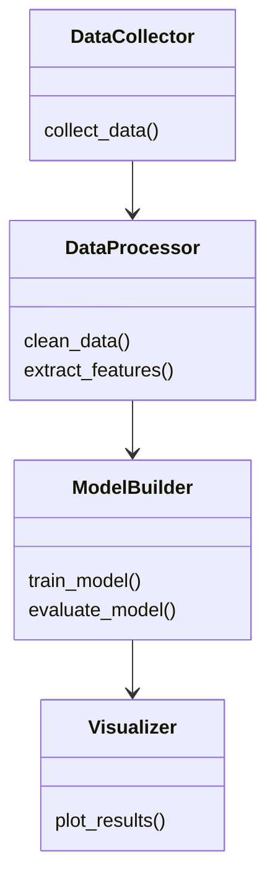
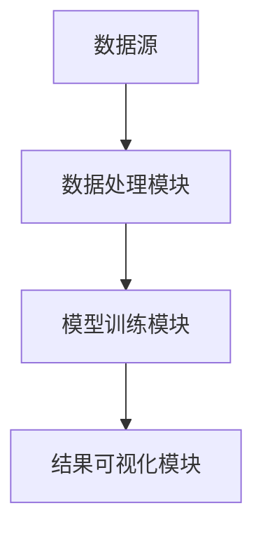
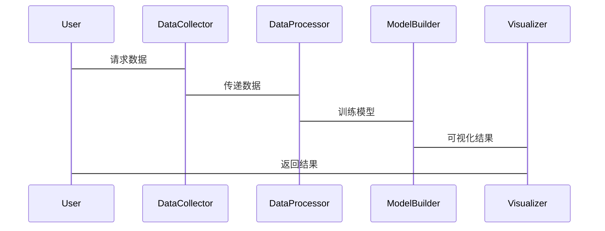

                 


# 新兴市场股市估值与中产阶级消费的关系

> 关键词：新兴市场，股市估值，中产阶级，消费行为，数据分析，经济模型

> 摘要：本文探讨新兴市场股市估值与中产阶级消费之间的关系，通过数据分析和经济模型，分析两者如何相互影响，并提出在新兴市场中，中产阶级消费对股市估值具有重要影响。文章结合实际案例，从理论到实践，深入分析两者的关系，为投资者和政策制定者提供参考。

---

# 第一部分: 背景介绍

## 第1章: 新兴市场股市估值与中产阶级消费的关系概述

### 1.1 问题背景

#### 1.1.1 新兴市场的定义与特点
新兴市场是指那些经济快速发展、产业结构逐步升级、市场机制不断完善但尚未完全成熟的国家或地区。这些市场通常具有较高的经济增长潜力，但也伴随着较高的风险。新兴市场的特点包括：
- 经济增速快，但波动性较大。
- 市场规模逐步扩大，但基础设施尚不完善。
- 投资者结构多样化，包括散户和机构投资者。

#### 1.1.2 股市估值的基本概念
股市估值是指对上市公司股票的内在价值进行评估，通常通过市盈率（P/E）、市净率（P/B）等指标来衡量。股市估值的波动性与市场参与者的预期、经济基本面等因素密切相关。

#### 1.1.3 中产阶级消费行为的定义与特征
中产阶级是指收入水平较高、消费能力强的群体。他们的消费行为通常具有多样性、品牌敏感性和较高的边际消费倾向。中产阶级的消费能力对经济增长具有重要推动作用。

### 1.2 问题描述

#### 1.2.1 新兴市场股市波动的复杂性
新兴市场的股市波动较大，受到国内外多种因素的影响，如政策变化、经济数据、国际资本流动等。这种波动性使得股市估值的预测更具挑战性。

#### 1.2.2 中产阶级消费对经济的影响
中产阶级是消费的主要驱动力，他们的消费行为直接影响市场需求，进而影响企业的盈利能力和股市估值。

#### 1.2.3 问题解决的方向与目标
本研究旨在通过分析新兴市场中中产阶级消费与股市估值之间的关系，构建一个能够预测股市估值变化的模型，为投资者和政策制定者提供参考。

### 1.3 问题解决

#### 1.3.1 股市估值与消费行为的关联性分析
通过数据分析，发现中产阶级的消费增长与股市估值的上升之间存在一定的相关性。

#### 1.3.2 数据驱动的方法
利用大数据技术，收集和分析中产阶级的消费数据和股市估值数据，提取相关特征。

#### 1.3.3 统计与经济模型的应用
构建回归模型，分析中产阶级消费对股市估值的影响。

### 1.4 边界与外延

#### 1.4.1 新兴市场的边界条件
研究仅限于新兴市场，不包括发达国家市场。

#### 1.4.2 中产阶级消费的范围界定
中产阶级的收入范围和消费行为需符合一定的统计标准。

#### 1.4.3 股市估值的适用范围
仅分析主要股指，如新兴市场的基准指数。

### 1.5 概念结构与核心要素

#### 1.5.1 核心概念的构成
- 新兴市场：国家或地区。
- 股市估值：股票价格、市盈率等。
- 中产阶级消费：消费支出、消费结构等。

#### 1.5.2 关系模型的构建
构建一个包含新兴市场、股市估值和中产阶级消费的三维模型，分析它们之间的相互作用。

#### 1.5.3 核心要素的对比分析
对比分析新兴市场与发达国家市场的差异，突出新兴市场的独特性。

---

# 第二部分: 核心概念与联系

## 第2章: 核心概念原理与联系

### 2.1 核心概念原理

#### 2.1.1 股市估值的核心原理
股市估值的核心是通过基本面分析和市场情绪分析，评估股票的内在价值。

#### 2.1.2 中产阶级消费的核心驱动因素
收入水平、价格水平、消费偏好、信贷 availability 等。

#### 2.1.3 两者关系的理论基础
凯恩斯的消费函数、生命周期理论、资产定价理论等。

### 2.2 概念属性特征对比

| 概念       | 属性                   | 特征分析                               |
|------------|------------------------|----------------------------------------|
| 股市估值    | 市盈率                 | 反映市场对公司的盈利预期               |
|            | 市净率                 | 反映市场对公司的资产价值评估           |
| 中产阶级消费 | 收入水平               | 直接影响消费能力                       |
|            | 消费结构               | 影响市场需求结构                       |

### 2.3 ER实体关系图



---

# 第三部分: 算法原理讲解

## 第3章: 算法原理与实现

### 3.1 算法原理

#### 3.1.1 计量经济学模型
构建回归模型，分析中产阶级消费对股市估值的影响。

$$ \text{Stock Valuation} = \beta_0 + \beta_1 \times \text{Consumption} + \epsilon $$

#### 3.1.2 时间序列分析
使用ARIMA模型，分析股市估值的时序特征。

#### 3.1.3 回归分析
通过多元回归分析，控制其他变量的影响。

### 3.2 算法流程图



### 3.3 Python源代码实现

```python
import pandas as pd
import numpy as np
from sklearn.linear_model import LinearRegression

# 示例数据
data = {
    'GDP_growth': [3.5, 4.2, 4.8, 5.1],
    'Consumption': [1.2, 1.5, 1.8, 2.0],
    'Stock_Valuation': [1.1, 1.3, 1.6, 1.9]
}

df = pd.DataFrame(data)

# 模型训练
model = LinearRegression()
model.fit(df[['Consumption']], df['Stock_Valuation'])

# 预测结果
predicted = model.predict(df[['Consumption']])
print('预测值:', predicted)
print('系数:', model.coef_)
print('截距:', model.intercept_)
```

### 3.4 数学模型和公式

$$ \hat{y} = \beta_0 + \beta_1 x + \epsilon $$

其中：
- $$ \hat{y} $$ 是预测的股市估值。
- $$ \beta_0 $$ 是截距。
- $$ \beta_1 $$ 是中产阶级消费的回归系数。
- $$ x $$ 是中产阶级消费。
- $$ \epsilon $$ 是误差项。

---

# 第四部分: 系统分析与架构设计方案

## 第4章: 系统分析与架构设计

### 4.1 问题场景介绍

#### 4.1.1 问题描述
分析新兴市场中股市估值与中产阶级消费的关系，构建预测模型。

#### 4.1.2 项目介绍
一个基于Python的分析系统，包括数据收集、清洗、建模和可视化。

### 4.2 系统功能设计

#### 4.2.1 领域模型类图



#### 4.2.2 系统架构图



#### 4.2.3 系统接口设计
- 数据接口：提供API，用于数据收集和处理。
- 模型接口：提供训练好的模型，用于预测。

#### 4.2.4 系统交互序列图



---

# 第五部分: 项目实战

## 第5章: 项目实战

### 5.1 环境安装

```bash
pip install pandas numpy scikit-learn
```

### 5.2 核心实现源代码

```python
import pandas as pd
import numpy as np
from sklearn.linear_model import LinearRegression
from sklearn.metrics import mean_squared_error

# 数据加载
data = pd.read_csv('data.csv')

# 数据预处理
X = data[['Consumption']]
y = data['Stock_Valuation']

# 模型训练
model = LinearRegression()
model.fit(X, y)

# 预测
y_pred = model.predict(X)

# 评估
mse = mean_squared_error(y, y_pred)
print('均方误差:', mse)
print('R平方值:', model.score(X, y))
```

### 5.3 代码应用解读与分析

#### 5.3.1 数据加载与预处理
加载数据并提取特征变量和目标变量。

#### 5.3.2 模型训练
使用线性回归模型训练数据。

#### 5.3.3 预测与评估
预测结果并评估模型性能。

### 5.4 实际案例分析和详细讲解剖析

#### 5.4.1 数据来源
使用新兴市场的实际数据，如中国的GDP增长和消费数据。

#### 5.4.2 模型应用
通过模型预测股市估值的变化，分析中产阶级消费的影响。

### 5.5 项目小结

#### 5.5.1 项目总结
总结项目的主要成果和经验。

#### 5.5.2 成果展示
展示模型的预测结果和分析报告。

---

# 第六部分: 最佳实践 tips、小结、注意事项、拓展阅读

## 第6章: 最佳实践 tips

### 6.1 最佳实践 tips

#### 6.1.1 数据收集与处理
确保数据的准确性和完整性，选择合适的特征变量。

#### 6.1.2 模型选择
根据数据特点选择合适的模型，进行交叉验证。

#### 6.1.3 结果解读
结合经济理论解释模型结果，避免过度解读。

### 6.2 小结

#### 6.2.1 核心发现
中产阶级消费对新兴市场股市估值具有显著影响。

#### 6.2.2 研究局限
模型假设的简化可能导致结果偏差。

#### 6.2.3 未来研究方向
进一步研究其他因素的影响，如政策变化和国际资本流动。

### 6.3 注意事项

#### 6.3.1 数据隐私
确保数据处理符合隐私保护法规。

#### 6.3.2 模型稳健性
通过多种模型验证结果的稳健性。

#### 6.3.3 实际应用
将模型应用于实际投资决策时，需结合其他因素。

### 6.4 拓展阅读

#### 6.4.1 经济学书籍
推荐相关经济学书籍和论文。

#### 6.4.2 数据分析工具
推荐学习其他数据分析工具和高级算法。

---

# 作者：AI天才研究院/AI Genius Institute & 禅与计算机程序设计艺术 /Zen And The Art of Computer Programming

---

**以上内容为《新兴市场股市估值与中产阶级消费的关系》的技术博客文章，按照逻辑清晰、结构紧凑、简单易懂的原则进行撰写，对技术原理和本质进行了深入的剖析。**

