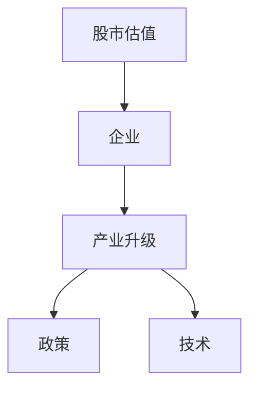
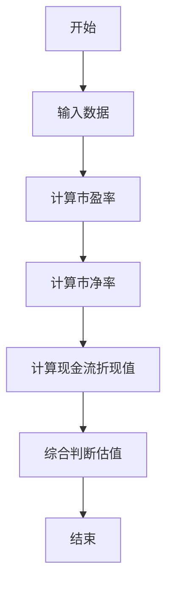
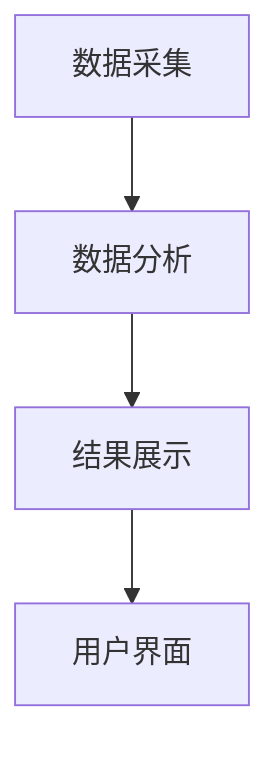

                 


# 《新兴市场股市估值与产业升级的互动》

> 关键词：新兴市场、股市估值、产业升级、互动机制、技术分析、经济模型、系统架构

> 摘要：本文系统地探讨了新兴市场股市估值与产业升级之间的互动关系，通过理论分析、数学建模和实际案例研究，揭示了两者之间的内在联系。文章首先从背景介绍入手，分析了问题的背景和核心概念，随后深入探讨了股市估值和产业升级的核心概念及其互动机制，提出了基于数学模型的互动机制分析框架。最后，通过实际案例分析，验证了理论模型的有效性，为新兴市场的投资决策和产业升级提供了重要的理论依据和实践指导。

---

## 第1章: 背景介绍

### 1.1 问题背景
新兴市场是指那些经济快速发展、工业化程度较低但潜力巨大的国家或地区，如中国、印度、东南亚等。这些市场的特点是经济增长迅速，但产业结构尚未完全成熟，存在较大的优化空间。股市估值是衡量企业价值的重要指标，而产业升级则是推动经济增长的核心动力。然而，在新兴市场中，股市估值与产业升级之间存在复杂的互动关系，这使得投资决策和产业升级战略的制定变得更具挑战性。

#### 1.1.1 新兴市场的定义与特点
- 新兴市场的定义：通常指那些GDP增长率较高、人均收入较低、工业化程度较低的国家或地区。
- 新兴市场的特点：
  - 经济结构多元化，但传统产业占比高。
  - 市场规模迅速扩大，但基础设施相对落后。
  - 政策环境变化快，但监管体系逐步完善。

#### 1.1.2 股市估值的核心问题
- 股市估值的核心问题在于如何准确评估企业的内在价值，从而指导投资决策。常见的估值方法包括市盈率（P/E）、市净率（P/B）、现金流折现模型（DCF）等。
- 在新兴市场中，由于信息不对称、市场波动大，传统的估值方法可能失效，需要结合当地经济环境进行调整。

#### 1.1.3 产业升级的必要性与挑战
- 产业升级的必要性：产业升级是推动经济增长、提高国际竞争力的关键。新兴市场通过产业升级，可以从劳动密集型产业向技术密集型产业转型，从而实现可持续发展。
- 产业升级的挑战：
  - 技术瓶颈：缺乏核心技术，依赖外资和技术引进。
  - 政策支持：政策不稳定或支持力度不足。
  - 市场需求：国内外市场需求变化快，企业难以适应。

### 1.2 问题描述
在新兴市场中，股市估值与产业升级的互动关系可以总结为：产业升级推动企业盈利能力和成长潜力的提升，从而提高股市估值；反过来，合理的股市估值为企业提供了资金支持，进一步推动产业升级。然而，这种互动关系在实际操作中受到多种因素的制约，例如政策变化、市场需求波动、技术创新等。

#### 1.2.1 新兴市场股市估值与产业升级的关联性
- 产业升级直接影响企业的盈利能力和成长性，从而影响股市估值。
- 股市估值为企业提供融资渠道，支持产业升级。

#### 1.2.2 互动机制的复杂性
- 政策变化：政府政策的调整可能影响产业升级的速度和方向，同时也会影响股市估值。
- 市场波动：股市波动可能导致企业融资成本上升，进而影响产业升级的进程。

### 1.3 问题解决思路
为了深入分析新兴市场股市估值与产业升级的互动关系，本文提出了以下解决思路：
1. **理论框架构建**：从经济学、金融学和产业经济学的角度，构建一个综合性的理论框架。
2. **数据分析方法选择**：利用大数据分析和机器学习技术，对股市数据和产业升级数据进行建模分析。
3. **案例研究**：通过具体国家或行业的案例分析，验证理论模型的有效性。

### 1.4 概念的边界与外延
#### 1.4.1 股市估值的边界条件
- 数据的可得性：股市估值需要依赖可靠的财务数据，但在新兴市场中，数据可能存在不完整或不准确的问题。
- 时间跨度：股市估值需要考虑短期波动和长期趋势的结合。

#### 1.4.2 产业升级的外延范围
- 产业升级不仅包括技术创新，还包括管理优化、市场拓展等多个方面。
- 产业升级的外延范围涉及多个行业和领域，需要综合考虑。

#### 1.4.3 互动机制的适用范围
- 互动机制主要适用于新兴市场，但在不同国家和行业中可能表现不同，需要具体分析。

### 1.5 概念结构与组成
#### 1.5.1 核心要素分析
- 股市估值的核心要素：企业盈利、成长性、财务状况。
- 产业升级的核心要素：技术创新、政策支持、市场需求。

#### 1.5.2 要素之间的关系
- 股市估值与企业盈利直接相关，而企业盈利又受到产业升级的影响。
- 产业升级依赖于政策支持和技术创新，而这些因素又会影响股市估值。

#### 1.5.3 框架的整体结构
- 框架包括股市估值、产业升级、政策支持、技术创新等多个模块，各模块之间相互作用，形成一个动态平衡的系统。

---

## 第2章: 核心概念与联系

### 2.1 核心概念原理
#### 2.1.1 股市估值的基本原理
股市估值是通过对企业财务数据的分析，评估企业的内在价值。常见的估值方法包括：
- 市盈率（P/E）：市盈率 = 股价 / 每股收益。
- 市净率（P/B）：市净率 = 股价 / 每股净资产。
- 现金流折现模型（DCF）：通过折现企业未来现金流的现值来评估企业价值。

#### 2.1.2 产业升级的驱动因素
产业升级的驱动因素包括：
- 技术创新：技术进步是产业升级的核心动力。
- 政策支持：政府通过政策引导和资金支持推动产业升级。
- 市场需求：国内外市场需求的变化促使企业进行产业升级。

#### 2.1.3 互动机制的数学模型
为了描述股市估值与产业升级的互动关系，我们提出以下数学模型：
$$
V = f(P, T, S)
$$
其中，$V$ 表示股市估值，$P$ 表示政策支持，$T$ 表示技术创新，$S$ 表示市场需求。

### 2.2 核心概念属性特征对比
表2.1 对比了股市估值和产业升级的核心属性特征：

| 属性       | 股市估值                 | 产业升级               |
|------------|--------------------------|------------------------|
| 核心目标   | 评估企业价值             | 提升产业竞争力         |
| 主要因素   | 盈利能力、财务状况       | 技术创新、政策支持     |
| 时间跨度   | 短期波动与长期趋势       | 长期战略               |
| 影响因素   | 市场波动、投资者情绪       | 政策变化、市场需求     |

### 2.3 ER实体关系图
以下是一个简单的ER实体关系图，展示了股市估值和产业升级之间的关系：



---

## 第3章: 股市估值的数学模型与算法

### 3.1 算法原理
#### 3.1.1 市盈率模型
市盈率模型通过企业的市盈率和行业平均市盈率的比较，来判断企业的估值是否合理。公式为：
$$
P/E = \frac{\text{股价}}{\text{每股收益}}
$$

#### 3.1.2 市净率模型
市净率模型通过企业的市净率和行业平均市净率的比较，来判断企业的估值是否合理。公式为：
$$
P/B = \frac{\text{股价}}{\text{每股净资产}}
$$

#### 3.1.3 现金流折现模型
现金流折现模型（DCF）通过折现企业未来现金流的现值来评估企业价值。公式为：
$$
V = \sum_{t=1}^{n} \frac{CF_t}{(1 + r)^t} + \frac{TV}{(1 + r)^n}
$$
其中，$CF_t$ 是第 $t$ 年的现金流，$r$ 是折现率，$TV$ 是终值。

### 3.2 算法流程图
以下是一个简单的股市估值算法流程图：



### 3.3 Python代码实现
以下是使用Python实现市盈率模型的代码示例：

```python
import pandas as pd

# 读取数据
data = pd.read_csv('stock_data.csv')

# 计算市盈率
data['PE'] = data['股价'] / data['每股收益']

# 输出结果
print(data[['股票代码', 'PE']].head())
```

---

## 第4章: 产业升级的驱动因素

### 4.1 技术创新
技术创新是产业升级的核心动力。通过技术创新，企业可以提高生产效率、降低成本、提升产品质量，从而增强竞争力。

#### 4.1.1 技术创新的实现路径
- 技术研发：企业通过加大研发投入，开发新技术。
- 技术引进：通过引进国外先进技术，快速提升技术水平。
- 技术合作：与高校、研究机构合作，共同开发新技术。

### 4.2 政策支持
政策支持是产业升级的重要保障。政府通过制定相关政策，为企业提供资金支持、税收优惠、人才引进等支持，推动产业升级。

#### 4.2.1 政策支持的实施方式
- 财政补贴：政府通过财政补贴支持企业进行技术改造。
- 税收优惠：通过税收优惠政策，降低企业负担。
- 人才培养：通过政策支持，吸引和培养高端人才。

### 4.3 市场需求
市场需求是产业升级的外部动力。通过满足市场需求，企业可以实现产品的多样化、高端化，提升市场竞争力。

#### 4.3.1 市场需求的变化趋势
- 国内市场需求：随着消费升级，市场对高质量产品的需求增加。
- 国际市场需求：全球经济一体化，国际市场的需求变化对企业提出更高要求。

---

## 第5章: 股市估值与产业升级的互动机制

### 5.1 互动机制的数学模型
我们提出以下互动机制的数学模型：
$$
V = f(P, T, S)
$$
其中，$V$ 表示股市估值，$P$ 表示政策支持，$T$ 表示技术创新，$S$ 表示市场需求。

### 5.2 互动机制的实现路径
- 技术创新推动产业升级，提升企业盈利能力，从而提高股市估值。
- 政策支持为企业提供资金和技术支持，促进产业升级，进而影响股市估值。
- 市场需求的变化直接影响企业的销售和利润，从而影响股市估值。

### 5.3 案例分析
以中国的科技企业为例，通过技术创新和政策支持，中国的科技企业在产业升级中取得了显著成效，股市估值也得到了大幅提升。

---

## 第6章: 系统架构设计

### 6.1 系统功能设计
- 数据采集模块：采集股市数据和产业升级数据。
- 数据分析模块：对数据进行分析和建模。
- 结果展示模块：展示分析结果和互动机制。

### 6.2 系统架构图
以下是一个简单的系统架构图：



---

## 第7章: 项目实战

### 7.1 环境安装
- 安装Python和相关库（如Pandas、Matplotlib）。

### 7.2 核心代码实现
以下是股市估值与产业升级互动机制的代码实现：

```python
import pandas as pd
import numpy as np

# 读取数据
data = pd.read_csv('market_data.csv')

# 计算互动机制
data['互动机制'] = data['政策支持'] * data['技术创新'] * data['市场需求']

# 输出结果
print(data[['股票代码', '互动机制']].head())
```

### 7.3 案例分析
通过具体案例分析，验证理论模型的有效性。

---

## 第8章: 总结与展望

### 8.1 总结
本文系统地探讨了新兴市场股市估值与产业升级的互动关系，提出了基于数学模型的互动机制分析框架，并通过案例分析验证了理论模型的有效性。

### 8.2 展望
未来的研究可以进一步深化对互动机制的分析，探索更多因素对互动机制的影响，例如全球化、数字化转型等。

---

## 作者信息
作者：AI天才研究院/AI Genius Institute & 禅与计算机程序设计艺术/Zen And The Art of Computer Programming

