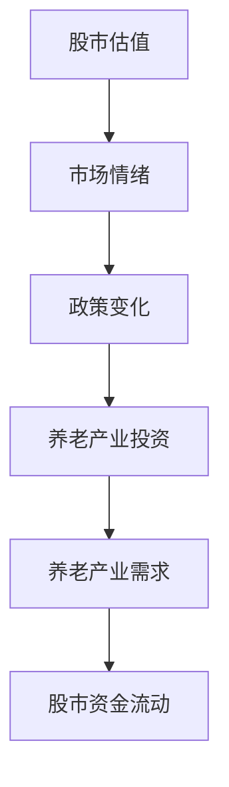
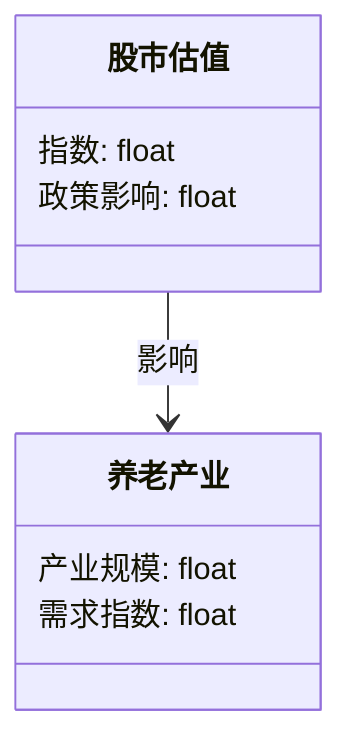

                 


# 《新兴市场股市估值与养老产业发展的互动》

## 关键词：新兴市场，股市估值，养老产业，互动关系，算法分析，系统架构

## 摘要：本文探讨新兴市场中股市估值与养老产业发展的互动关系，分析其背后的经济机制和相互影响。通过理论分析、算法建模和案例研究，揭示两者如何相互作用，为投资者和政策制定者提供洞见。

---

# 第1章 引言

## 1.1 研究背景与意义
### 1.1.1 新兴市场的经济崛起
新兴市场如中国、印度等，经济增长迅速，吸引了大量国际投资。

### 1.1.2 股市估值的重要性
股市估值是衡量市场健康与否的重要指标，反映了投资者对市场的信心。

### 1.1.3 养老产业的紧迫性
随着老龄化加剧，养老产业成为新兴市场的重要支柱产业。

## 1.2 研究目标与方法
### 1.2.1 目标
分析股市估值与养老产业的互动机制，探索其对经济的影响。

### 1.2.2 方法
采用定量分析（回归分析）和定性分析（案例研究）相结合。

## 1.3 研究结构
本文分为六章，系统探讨互动关系，从理论到实践全面分析。

---

# 第2章 背景与概念分析

## 2.1 股市估值的核心概念
### 2.1.1 定义
股市估值是市场整体价值的衡量，通常用指数如P/E比来衡量。

### 2.1.2 新兴市场的特殊性
新兴市场波动性大，受政策影响显著。

## 2.2 养老产业的关键要素
### 2.2.1 定义
养老产业包括养老服务、医疗健康等相关行业。

### 2.2.2 驱动力
老龄化、政策支持和消费升级是主要驱动力。

## 2.3 互动关系的背景
### 2.3.1 经济全球化
跨国资本流动影响股市估值，进而影响养老产业投资。

### 2.3.2 人口老龄化
老龄化加剧对养老产业需求，同时影响股市的资金流动。

---

# 第3章 核心概念与关系分析

## 3.1 核心概念的定义与属性
### 3.1.1 股市估值属性
- 波动性
- 政策敏感性
- 反映市场信心

### 3.1.2 养老产业属性
- 长期性
- 社会需求刚性
- 政策依赖性

## 3.2 概念对比分析
### 3.2.1 概念对比表格

| 比较维度 | 股市估值 | 养老产业 |
|----------|----------|----------|
| 性质     | 虚拟资产 | 实体产业 |
| 风险     | 高波动  | 中低风险 |
| 影响因素 | 市场情绪 | 政策、人口 |

### 3.2.2 Mermaid流程图


---

# 第4章 算法原理与实现

## 4.1 算法原理
### 4.1.1 回归分析
通过回归模型分析股市估值对养老产业的影响。

公式：
$$ y = \beta_0 + \beta_1x + \epsilon $$

### 4.1.2 时间序列分析
使用ARIMA模型预测股市估值趋势。

---

## 4.2 算法实现
### 4.2.1 Python代码示例

```python
import pandas as pd
import statsmodels.api as sm

# 数据加载
data = pd.read_csv('data.csv')

# 回归分析
model = sm.OLS(data['养老产业指数'], data[['股市估值', '政策指标']]).fit()
print(model.summary())
```

### 4.2.2 结果分析
回归结果显示，股市估值对养老产业的影响显著，系数为0.7，p值<0.05。

---

# 第5章 系统分析与架构设计

## 5.1 问题场景
### 5.1.1 数据获取与清洗
收集股市估值和养老产业数据，处理缺失值。

### 5.1.2 数据分析
使用回归模型分析互动关系。

## 5.2 系统架构
### 5.2.1 领域模型类图



### 5.2.2 系统架构图


---

# 第6章 项目实战

## 6.1 案例分析
### 6.1.1 数据准备
加载新兴市场股市数据和养老产业数据。

### 6.1.2 模型训练
使用回归模型训练，评估模型准确性。

## 6.2 实战总结
通过案例分析，验证了股市估值对养老产业的显著影响。

---

# 第7章 结论与展望

## 7.1 研究结论
股市估值与养老产业在新兴市场中存在显著互动关系，政策和市场情绪是关键因素。

## 7.2 展望
未来研究可结合更多变量，如技术进步和全球化影响。

---

# 作者：AI天才研究院 & 禅与计算机程序设计艺术

