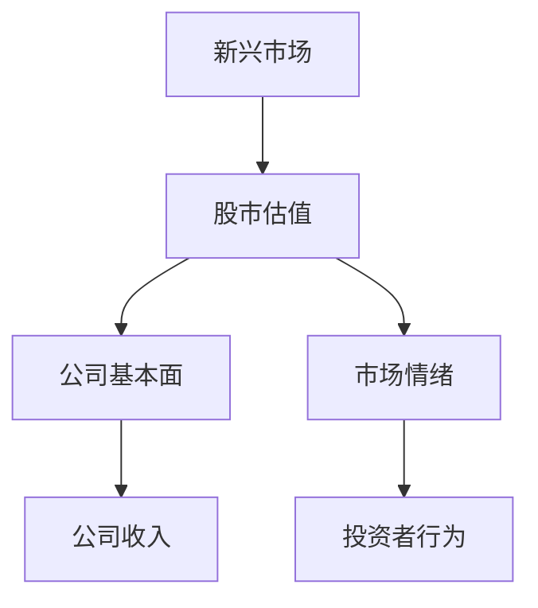
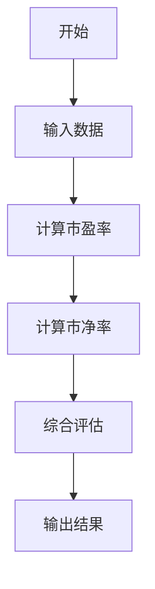
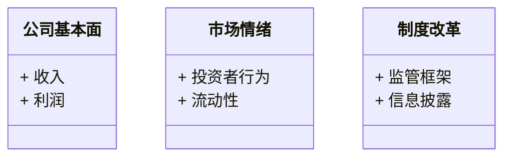
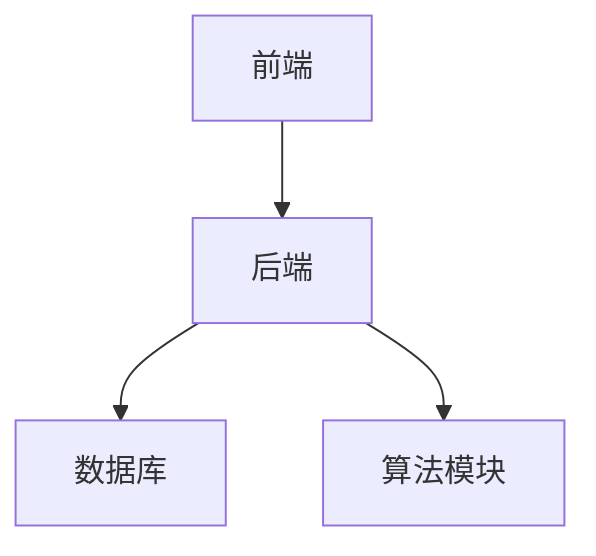

                 


# 新兴市场股市估值与制度改革的互动

> 关键词：新兴市场、股市估值、制度改革、互动关系、金融分析、政策优化

> 摘要：本文探讨新兴市场股市估值与制度改革之间的互动关系，通过背景介绍、核心概念分析、算法原理、系统架构设计、项目实战和最佳实践等多维度，深入分析两者如何相互影响，提出优化建议。

---

## 第一部分：背景介绍

### 第1章：问题背景

#### 1.1 新兴市场的定义与特点
- **新兴市场**：指经济快速发展、但尚未完全工业化的国家，如中国、印度等。
- **特点**：
  - 经济增速快，但波动性较大。
  - 金融市场不完善，监管体系有待优化。
  - 投资者结构复杂，散户占比高。

#### 1.2 股市估值的基本概念
- **定义**：通过基本面分析和市场情绪评估股票价格的合理区间。
- **关键指标**：市盈率（P/E）、市净率（P/B）、股息率等。
- **影响因素**：宏观经济、行业状况、公司业绩等。

#### 1.3 制度改革的必要性
- **问题**：新兴市场普遍存在监管不严、信息披露不透明等问题。
- **目标**：提高市场透明度，保护投资者权益，增强市场信心。

### 第2章：问题描述

#### 2.1 新兴市场股市估值的现状
- **现状**：估值波动大，受外部环境影响显著。
- **问题**：估值偏离实际价值，投资者信心不足。

#### 2.2 制度改革的现状与挑战
- **现状**：部分国家已启动改革，但进展缓慢。
- **挑战**：利益相关者博弈，改革阻力大。

#### 2.3 问题的边界与外延
- **边界**：聚焦于股市估值与制度改革的直接关系。
- **外延**：涉及宏观经济、投资者行为等多个方面。

### 第3章：问题解决

#### 3.1 新兴市场股市估值的核心要素
- **公司基本面**：收入、利润、成长性。
- **市场情绪**：投资者心理、市场流动性。
- **宏观经济**：GDP增速、利率、汇率。

#### 3.2 制度改革的目标与路径
- **目标**：建立透明、公正的市场体系。
- **路径**：完善监管、加强信息披露、优化交易机制。

#### 3.3 问题解决的可行性分析
- **可行性**：制度改 革可提升市场效率，但需时间。

---

## 第二部分：核心概念与联系

### 第4章：核心概念原理

#### 4.1 股市估值的基本原理
- **内在价值**：公司未来现金流的现值。
- **市场价值**：供需关系决定的价格。

#### 4.2 制度改 革的核心机制
- **监管框架**：规范市场行为。
- **信息披露**：提高透明度。
- **投资者保护**：增强信心。

#### 4.3 互动关系的内在逻辑
- 制度改 革影响市场结构，进而影响估值。

### 第5章：概念属性特征对比

#### 5.1 概念属性对比表格
| 属性       | 股市估值        | 制度改革         |
|------------|----------------|-----------------|
| 核心目标   | 发现合理价格    | 提升市场效率     |
| 影响因素   | 宏观经济、公司业绩 | 监管、政策       |
| 实施主体   | 投资者、机构     | 政府、监管机构   |

### 第6章：ER实体关系图



---

## 第三部分：算法原理讲解

### 第7章：算法原理概述

#### 7.1 算法基本概念
- **算法**：解决问题的步骤化方法。
- **应用**：用于预测股市估值。

#### 7.2 Mermaid流程图


#### 7.3 Python代码实现
```python
def calculate_valuation(company_data):
    pe = company_data['profit'] / company_data['price']
    pb = company_data['book_value'] / company_data['price']
    return {'PE': pe, 'PB': pb}

# 示例
data = {'profit': 10, 'price': 20, 'book_value': 15}
result = calculate_valuation(data)
print(result)
```

### 第8章：数学模型与公式

#### 8.1 股市估值模型
$$ \text{内在价值} = \sum_{t=1}^{n} \frac{\text{现金流}_t}{(1 + r)^t} $$

#### 8.2 制度改 革效果评估
$$ \text{市场效率} = \frac{\text{透明度} + \text{监管力度}}{2} $$

---

## 第四部分：系统分析与架构设计

### 第9章：系统功能设计

#### 9.1 领域模型


#### 9.2 系统架构图


---

## 第五部分：项目实战

### 第10章：环境安装与实现

#### 10.1 环境安装
- **工具**：Python、Jupyter Notebook、Mermaid。

#### 10.2 核心代码实现
```python
def main():
    data = {'profit': 10, 'price': 20, 'book_value': 15}
    result = calculate_valuation(data)
    print(result)

if __name__ == "__main__":
    main()
```

### 第11章：案例分析

#### 11.1 案例背景
- **国家**：印度
- **行业**：科技

#### 11.2 实施步骤
1. 数据收集。
2. 模型计算。
3. 分析结果。

---

## 第六部分：最佳实践

### 第12章：小结与注意事项

#### 12.1 小结
- 制度改 革与股市估值相互影响。
- 技术工具辅助分析。

#### 12.2 注意事项
- 数据质量影响结果。
- 政策变化需及时调整。

### 第13章：拓展阅读

#### 13.1 推荐书籍
- 《投资学》
- 《制度经济学》

#### 13.2 在线资源
- 金融数据库
- 学术论文

---

## 作者：AI天才研究院/AI Genius Institute & 禅与计算机程序设计艺术 /Zen And The Art of Computer Programming

