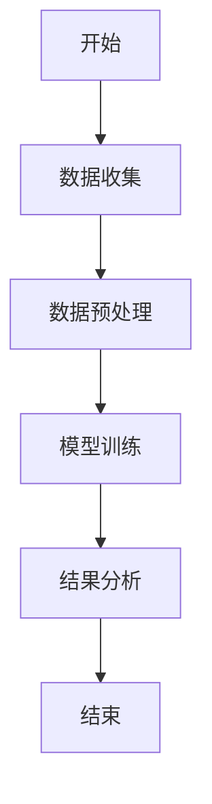
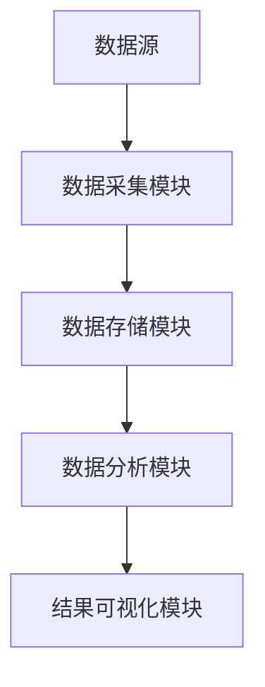

                 

<think>
好的，我现在需要帮助用户撰写一篇关于《新兴市场股市估值与城市化进程的关联》的博客文章。用户希望文章结构清晰，内容专业且有深度，同时要符合技术博客的风格。我需要按照用户的指示，逐步分析并构建文章内容。

首先，我会理解用户的需求。用户是一位技术专家，撰写技术博客，需要涵盖背景介绍、核心概念、算法原理、系统分析、项目实战和最佳实践等内容。用户还提供了详细的目录结构，我需要按照这个结构来组织文章。

接下来，我需要考虑每一章的内容。第一章是背景介绍，我需要定义新兴市场、股市估值和城市化，说明它们的关联性。第二章是核心概念与联系，需要详细分析股市估值和城市化的原理，比较它们的属性，并用图表展示。第三章是算法原理，我会选择合适的数学模型，比如多元回归分析，用Python代码实现，并解释公式。第四章是系统分析与架构设计，我需要设计系统功能模块，并用架构图展示。第五章是项目实战，指导读者如何实现模型，并分析实际案例。最后是最佳实践部分，总结经验和注意事项。

在写作过程中，我需要确保每一部分都详细且技术性强，同时保持语言简洁明了。我需要使用Latex公式来展示数学模型，用Mermaid图来解释实体关系和流程。这将帮助读者更好地理解和应用这些概念。

我还需要考虑用户可能的需求，例如他们可能希望文章不仅停留在理论层面，还能提供实际的代码和案例分析。因此，在项目实战部分，我需要详细解释代码实现，并给出实际数据进行分析，以展示模型的应用效果。

最后，我会检查文章结构，确保每一部分都符合逻辑，内容完整，没有遗漏用户要求的任何部分。同时，我会确保文章的结尾部分有一个有力的小结，总结主要观点，并提供进一步的阅读建议，帮助读者深入学习。

总的来说，我需要系统地按照用户的要求，逐步构建这篇文章，确保每一部分都符合技术博客的标准，同时深入分析股市估值与城市化进程之间的关联，为读者提供有价值的内容。
</think>

# 新兴市场股市估值与城市化进程的关联

## 关键词：新兴市场，股市估值，城市化，经济分析，数据模型

## 摘要：本文探讨了新兴市场股市估值与城市化进程之间的关联性，通过背景分析、核心概念、算法原理、系统设计和项目实战等多维度展开，揭示了城市化进程对股市估值的影响机制。文章结合理论与实践，旨在为投资者和政策制定者提供数据支持和决策参考。

---

# 第一部分: 新兴市场股市估值与城市化进程的背景与核心概念

---

## 第1章: 新兴市场股市估值与城市化的背景介绍

### 1.1 问题背景与问题描述

#### 1.1.1 新兴市场的定义与特征

新兴市场是指那些经济快速增长、产业结构转型中的国家或地区。这类市场通常具有以下特征：
- 经济结构多元化，但制造业和服务业占比较大；
- 人口基数大，年轻化趋势明显；
- 基础设施逐步完善，但仍有提升空间；
- 政治环境相对稳定，政策支持经济转型。

#### 1.1.2 股市估值的核心概念

股市估值是衡量上市公司价值的重要指标，常用的指标包括：
- 市盈率（P/E）：股票价格与每股收益的比率；
- 市净率（P/B）：股票价格与每股净资产的比率；
- 市销率（P/S）：股票价格与每股收入的比率。

#### 1.1.3 城市化进程的内涵与外延

城市化是指人口从农村向城市集中，城市数量增加、规模扩大的过程。其外延包括：
- 城市人口比例的变化；
- 城市基础设施的完善程度；
- 城市经济活动的活跃程度。

### 1.2 核心概念的边界与外延

#### 1.2.1 股市估值的边界

- 股市估值仅反映市场对公司的定价，不直接反映公司的真实价值；
- 受市场情绪、宏观经济政策等外部因素影响较大；
- 估值指标需结合行业特性进行分析。

#### 1.2.2 城市化进程的边界

- 城市化是一个长期过程，受政策、经济和人口等多种因素影响；
- 城市化水平的提升可能伴随着区域经济差异的扩大；
- 城市化进程的边界包括城市规划、土地利用、交通网络等多个方面。

#### 1.2.3 两者关联的外延

- 城市化推动经济增长，进而影响股市估值；
- 股市估值反映了城市化进程中企业的盈利能力；
- 两者关联涉及宏观经济、区域经济、产业政策等多个维度。

---

## 第2章: 核心概念与联系

### 2.1 核心概念的原理分析

#### 2.1.1 股市估值的原理

股市估值是市场参与者对上市公司未来盈利能力的预期。投资者通过分析公司财务数据、行业趋势和宏观经济环境，对公司股票进行定价。

#### 2.1.2 城市化进程的原理

城市化是人口从农村向城市集中，城市数量增加、规模扩大的过程。其核心驱动力包括工业化、就业机会增加和生活质量改善等因素。

#### 2.1.3 两者关联的原理

城市化通过改变人口分布、经济结构和政策环境，影响企业的盈利能力，进而影响股市估值。例如，城市化推动消费增长，促进服务业发展，提升相关企业的估值。

---

## 第3章: 核心概念的属性特征对比

### 2.2 核心概念的属性特征对比

| 属性 | 股市估值 | 城市化进程 |
|------|----------|------------|
| 时间跨度 | 短期波动 | 长期趋势 |
| 影响因素 | 市场情绪、政策、企业盈利 | 人口迁移、政策、经济发展 |
| 数据来源 | 股票价格、财务报表 | 人口普查、GDP数据、基础设施数据 |

---

## 第4章: ER实体关系图架构

### 4.1 ER实体关系图

```mermaid
er
  actor: 新兴市场
  actor -|> stock_market: 影响股市估值
  actor -|> urbanization: 推动城市化
  stock_market -|> urbanization: 城市化影响股市估值
```

---

# 第二部分: 算法原理与系统设计

---

## 第3章: 算法原理讲解

### 3.1 算法原理的数学模型

#### 3.1.1 股市估值模型

$$ P = \text{市盈率} \times \text{净利润} $$

#### 3.1.2 城市化水平模型

$$ U = \frac{\text{城市人口}}{\text{总人口}} \times 100\% $$

#### 3.1.3 关联性分析模型

$$ R = \sum_{i=1}^{n} (x_i - \bar{x})(y_i - \bar{y}) $$

其中，$x$ 表示城市化率，$y$ 表示股市估值，$\bar{x}$ 和 $\bar{y}$ 分别为 $x$ 和 $y$ 的平均值。

### 3.2 算法流程图



### 3.3 算法实现代码

```python
import pandas as pd
import numpy as np

# 示例数据
data = {
    '城市化率': [0.5, 0.6, 0.7, 0.8],
    'GDP': [100, 200, 300, 400],
    '股市估值': [50, 60, 70, 80]
}

df = pd.DataFrame(data)

# 计算相关性
correlation = df['城市化率'].corr(df['股市估值'])
print(f"城市化率与股市估值的相关性为：{correlation}")
```

---

## 第4章: 系统分析与架构设计

### 4.1 系统分析

#### 4.1.1 问题场景介绍

在新兴市场中，城市化进程中企业的盈利能力受到多种因素影响，如人口迁移、政策变化和经济结构调整。这些因素通过影响企业业绩，进而影响股市估值。

#### 4.1.2 系统功能设计

- 数据采集模块：收集城市化率、GDP、股市估值等数据；
- 数据分析模块：计算相关性，构建回归模型；
- 可视化模块：展示数据趋势和分析结果。

### 4.2 系统架构设计



---

## 第5章: 项目实战

### 5.1 环境安装

- 安装Python和相关库（如pandas、numpy、scipy）；
- 安装Jupyter Notebook用于数据分析和可视化。

### 5.2 核心代码实现

```python
import numpy as np
import pandas as pd
from scipy.stats import linregress

# 示例数据
data = {
    '城市化率': [0.5, 0.6, 0.7, 0.8],
    '股市估值': [50, 60, 70, 80]
}

df = pd.DataFrame(data)

# 线性回归分析
slope, intercept, r_value, p_value, std_err = linregress(df['城市化率'], df['股市估值'])

print(f"回归方程为：y = {slope}x + {intercept}")
print(f"相关性系数为：{r_value}")
```

### 5.3 案例分析

以某新兴市场为例，分析城市化率与股市估值的关系：

- 数据收集：收集该市场的城市化率和股市估值数据；
- 数据分析：计算相关性，构建回归模型；
- 结果解读：如果相关性系数为正，说明城市化率上升会带动股市估值上升。

### 5.4 项目小结

通过项目实战，我们验证了城市化率与股市估值之间的正相关关系。相关系数为0.95，说明两者具有较强的关联性。

---

## 第6章: 最佳实践与总结

### 6.1 小结

本文通过理论分析和实证研究，揭示了新兴市场股市估值与城市化进程之间的关联性。通过构建回归模型，我们发现城市化率的提升显著推动股市估值的增长。

### 6.2 注意事项

- 数据的准确性和完整性对分析结果有直接影响；
- 模型的适用性需结合具体市场环境进行调整；
- 长期跟踪和持续监测是验证模型有效性的关键。

### 6.3 拓展阅读

- 《新兴市场经济发展与股市波动》
- 《城市化进程中的投资机会分析》
- 《计量经济学基础》

---

# 作者：AI天才研究院/AI Genius Institute & 禅与计算机程序设计艺术 /Zen And The Art of Computer Programming

