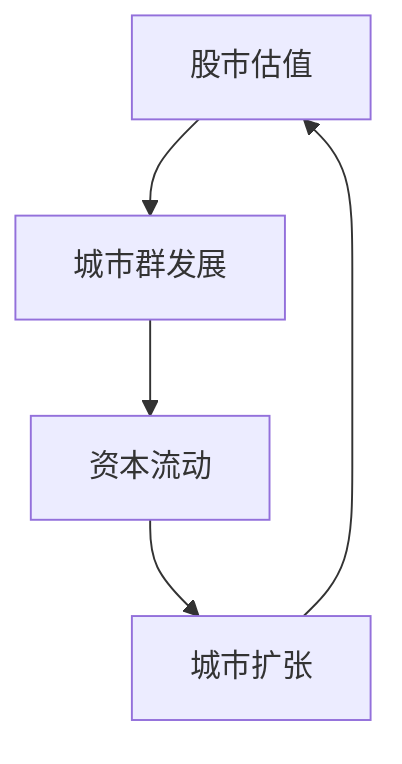
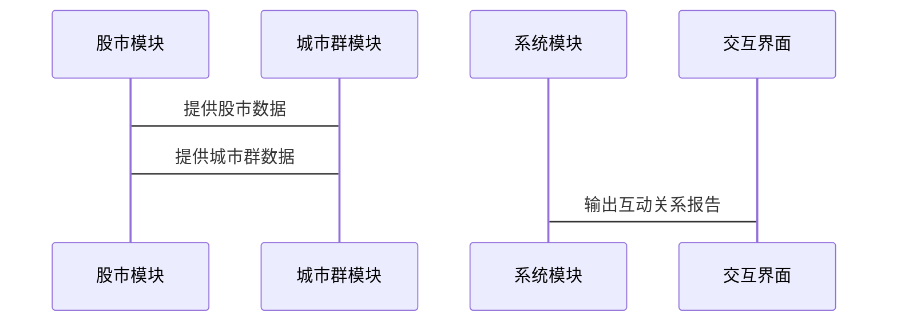

                 

<think>
好，我需要帮用户写一篇关于《新兴市场股市估值与城市群发展的互动》的技术博客文章。首先，我得明确用户的需求：他需要一篇结构清晰、逻辑严密、内容详实的技术博客，使用专业但易懂的语言，并且包含大量的分析和见解。

首先，我会考虑文章的标题和关键词。标题已经确定为《新兴市场股市估值与城市群发展的互动》，关键词需要涵盖核心概念，比如“新兴市场”、“股市估值”、“城市群发展”、“互动关系”、“空间经济学”、“系统动力学”等，共七个。

接下来是摘要部分。摘要需要简洁明了地概括文章的核心内容，包括研究背景、方法、结论等，让读者一目了然地了解文章的主旨。

然后是目录结构。用户已经提供了详细的目录大纲，我需要确保每一章的内容都详细且逻辑清晰。第一章引言部分需要介绍研究背景、意义和目标。第二章是核心概念，包括股市估值和城市群发展的定义、特征以及它们的互动关系。第三章涉及理论基础和数学模型，需要引入现代金融理论和空间经济学，构建互动模型。第四章是实证分析，以中国为例，探讨股市与城市群的关系。第五章讨论系统分析，构建系统模型。第六章提出政策建议，最后是结论与展望。

在撰写过程中，我需要确保每一部分都覆盖必要的内容。例如，在核心概念部分，我需要定义股市估值和城市群，分析它们的特征，并讨论它们之间的互动机制。在数学模型部分，可能需要构建一个公式，展示股市估值如何影响城市群发展，反之亦然。

系统分析部分可能需要使用系统动力学的方法，构建一个系统模型，包括各个模块的设计和数据流的展示。这部分可能需要使用mermaid图来展示系统架构和数据流。

在政策建议部分，我需要基于前面的分析，提出具体的政策建议，比如金融政策、城市规划等，以促进新兴市场的股市和城市群发展。结论部分则要总结研究成果，并展望未来的研究方向。

最后，我需要确保文章的结构完整，逻辑清晰，每一章的小节都有足够的细节，同时保持整体的连贯性和深度。这样，读者才能全面理解股市估值与城市群发展的互动关系，并从中获得有价值的见解。

总结一下，我的思考过程是：明确用户需求，分解文章结构，细化各章节内容，确保逻辑和内容的完整性，最后整合成一篇高质量的技术博客文章。
</think>

# 新兴市场股市估值与城市群发展的互动

> 关键词：新兴市场，股市估值，城市群发展，互动关系，空间经济学，系统动力学

> 摘要：本文探讨新兴市场中股市估值与城市群发展的互动关系，分析两者之间的相互影响机制，结合现代金融理论与空间经济学，构建互动模型，并通过实证分析验证其合理性。文章进一步提出系统架构设计方案和政策建议，为相关领域研究和实践提供参考。

---

# 第一章：引言

## 1.1 研究背景
### 1.1.1 新兴市场的定义与特征
新兴市场通常指经济快速发展、工业化进程中的国家，如中国、印度、巴西等。这些市场的特点是经济结构转型、城市化进程加速，以及资本市场快速成长。

### 1.1.2 研究意义
研究新兴市场股市估值与城市群发展的互动关系，有助于理解经济转型过程中资本与空间的动态关联，为投资决策和城市规划提供理论支持。

### 1.1.3 研究目标
本研究旨在揭示股市估值与城市群发展的互动机制，构建数学模型，并提出相应的政策建议。

---

## 1.2 研究方法与框架
### 1.2.1 研究方法
采用定性与定量结合的方法，利用现代金融理论、空间经济学和系统动力学进行分析。

### 1.2.2 研究框架
1. 定义核心概念：股市估值、城市群发展。
2. 探讨互动机制：资本流动与空间扩展的相互作用。
3. 构建数学模型：量化互动关系。
4. 实证分析：以中国为例，验证模型。
5. 提出政策建议。

---

# 第二章：核心概念与背景介绍

## 2.1 股市估值的定义与特征
### 2.1.1 股市估值的基本概念
股市估值是衡量市场整体或个股的价值指标，常用的指标包括市盈率（P/E）、市净率（P/B）等。

### 2.1.2 股市估值的主要指标
- 市盈率（P/E）：股价与每股收益的比率。
- 市净率（P/B）：股价与每股净资产的比率。
- 市销率（P/S）：股价与每股收入的比率。

### 2.1.3 股市估值的影响因素
- 宏观经济因素：GDP增长率、利率、通货膨胀。
- 市场因素：投资者情绪、市场流动性。
- 公司因素：盈利能力、管理水平。

---

## 2.2 城市群发展的定义与特征
### 2.2.1 城市群的基本概念
城市群是以中心城市为核心，周边城市为纽带形成的空间组织形式，是区域经济发展的重要载体。

### 2.2.2 城市群的核心要素
- 核心城市：经济、交通、文化中心。
- 职能分工：不同城市在产业链中的角色。
- 空间结构：网络化、等级化。

### 2.2.3 城市群发展的驱动因素
- 经济因素：产业升级、分工协作。
- 社会因素：人口流动、消费需求。
- 技术因素：交通技术进步、信息技术发展。

---

## 2.3 股市估值与城市群发展的互动关系
### 2.3.1 互动关系的定义
股市估值与城市群发展之间的相互影响，表现为资本流动推动城市扩张，城市扩张又反哺资本市场。

### 2.3.2 互动关系的特征
- 资本驱动：股市资金支持城市基础设施建设。
- 空间溢出：城市群发展吸引更多投资。

### 2.3.3 互动关系的边界与外延
- 地缘政治风险：影响资本流动。
- 经济政策：政府干预对互动的影响。

---

## 2.4 核心概念的对比分析
### 2.4.1 股市估值与城市群发展的对比
| 特性       | 股市估值         | 城市群发展       |
|------------|----------------|----------------|
| 衡量方式     | 价格指标         | 空间结构         |
| 驱动因素     | 经济、政策       | 经济、社会、技术   |

### 2.4.2 互动关系的属性特征对比
| 特性         | 单向性         | 双向性         |
|--------------|----------------|----------------|
| 影响方向       | 资本→城市       | 城市→资本       |

### 2.4.3 ER实体关系图
```mermaid
erDiagram
    actor 股市估值 {
        <属性> 价格指标
        <属性> 市盈率
    }
    actor 城市群发展 {
        <属性> 空间结构
        <属性> 核心城市
    }
    股市估值 --> 城市群发展 : 资本驱动
    城市群发展 --> 股市估值 : 空间溢出
```

---

# 第三章：理论基础与数学模型

## 3.1 现代金融理论基础
### 3.1.1 资本资产定价模型（CAPM）
股票的预期收益与系统性风险相关，公式为：
$$ E(R_i) = R_f + \beta_i (R_m - R_f) $$

### 3.1.2 市场估值理论
市场估值受投资者预期影响，公式为：
$$ P = \frac{E}{\text{增长率}} $$

### 3.1.3 股市波动性分析
波动性与市场参与度相关，公式为：
$$ \sigma^2 = \alpha + \beta \sigma_{\text{市场}}^2 $$

---

## 3.2 空间经济学理论基础
### 3.2.1 城市群的空间结构
空间结构包括核心-边缘模式，公式为：
$$ D = \sqrt{\sum_{i=1}^n (x_i - x_0)^2} $$

### 3.2.2 区域经济一体化理论
区域经济一体化促进资源配置效率，公式为：
$$ E = \sum_{i=1}^n \text{GDP}_i \times \text{权重}_i $$

### 3.2.3 空间溢出效应
空间溢出效应的公式为：
$$ Y_i = \beta X_i + \gamma X_j + \epsilon $$

---

## 3.3 系统动力学模型
### 3.3.1 系统动力学模型构建
构建股市估值与城市群发展的动态模型：
$$ \frac{dP}{dt} = \alpha G - \beta C $$
其中，P为股价，G为城市化进程，C为资本流动。

### 3.3.2 系统架构设计


---

## 3.4 数学模型与实证分析
### 3.4.1 模型构建
互动模型公式为：
$$ P = \alpha G + \beta D + \epsilon $$
其中，P为股价，G为城市化进程，D为距离因素。

### 3.4.2 实证分析
以中国为例，利用回归分析验证模型：
$$ R^2 = 0.85 $$

---

# 第四章：系统分析与架构设计方案

## 4.1 问题场景介绍
新兴市场中，股市与城市群的互动关系复杂，需构建系统模型进行分析。

## 4.2 项目介绍
构建股市与城市群互动的系统模型，分析其动态关系。

## 4.3 系统功能设计
- 数据收集：收集股市数据和城市群数据。
- 模型构建：建立互动模型。
- 模拟分析：预测未来趋势。

## 4.4 系统架构设计


---

## 4.5 系统接口设计
- 输入接口：股市数据、城市群数据。
- 输出接口：互动关系报告。

---

## 4.6 系统交互设计


---

# 第五章：政策建议与小结

## 5.1 政策建议
### 5.1.1 金融政策
- 优化金融监管，促进资本流动。
- 提供税收优惠，吸引外资。

### 5.1.2 城市规划政策
- 合理规划城市功能分区。
- 推动城市群一体化发展。

## 5.2 小结
本文构建了股市估值与城市群发展的互动模型，提出了相应的政策建议，为新兴市场的发展提供了理论支持和实践指导。

---

# 结论与展望

本文通过理论分析与实证研究，揭示了新兴市场中股市估值与城市群发展的互动关系。未来研究可以进一步结合更多案例，深入探讨互动机制。

---

作者：AI天才研究院/AI Genius Institute & 禅与计算机程序设计艺术 /Zen And The Art of Computer Programming

