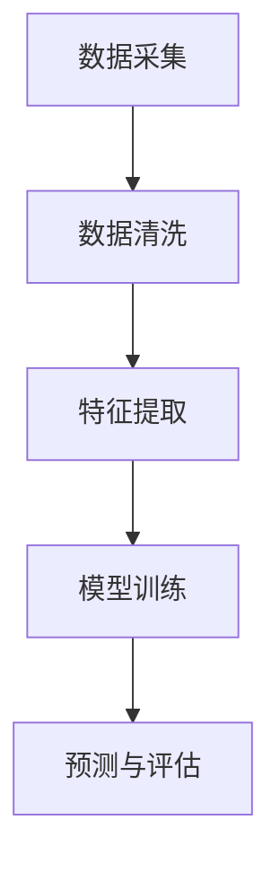
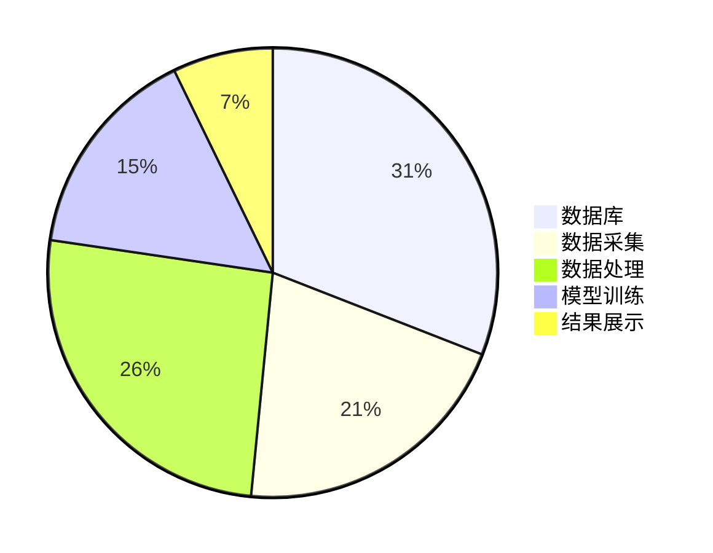
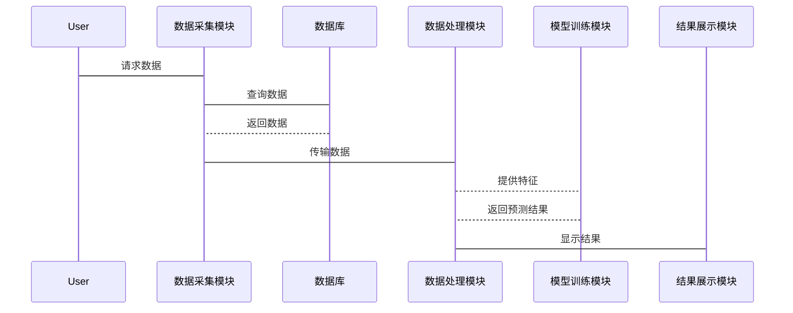

                 

<think>
好，我现在需要根据用户的要求，设计一个关于“新兴市场股市估值与数字化转型的互动”的技术博客文章。用户希望我以“世界级人工智能专家、程序员、软件架构师、CTO、技术畅销书作家”的身份来撰写，内容需要逻辑清晰、结构紧凑、技术语言专业，同时包括背景介绍、核心概念、算法原理、系统架构、项目实战等部分。

首先，我需要明确文章的结构，确保符合用户提供的目录大纲。文章分为七个部分，每部分都有具体的小节。我需要确保每一部分都详细展开，涵盖必要的技术细节和案例分析。

接下来，我会考虑每一章的具体内容：

1. **背景介绍**：需要解释问题背景，定义新兴市场和数字化转型，分析它们对股市估值的影响。
2. **核心概念**：详细讲解数字化转型和股市估值的核心原理，对比新兴市场和成熟市场的差异。
3. **算法原理**：设计一个算法来分析两者互动，使用mermaid流程图和Python代码实现。
4. **系统架构**：设计系统的功能模块和架构，使用mermaid图展示类图、架构图和序列图。
5. **项目实战**：提供环境配置、核心代码实现、案例分析和经验总结。
6. **最佳实践**：总结关键点，给出建议和未来展望。

在撰写过程中，我需要确保每一部分都详细且有条理，使用技术术语准确，同时结合实际案例让内容更生动。例如，在算法部分，我会详细解释每一步的作用，并提供代码示例；在系统架构部分，我会展示系统的各个模块如何协同工作。

此外，我需要使用LaTeX公式来表达数学模型，确保公式清晰易懂。同时，使用mermaid图来展示流程、架构和序列图，帮助读者更好地理解技术细节。

最后，我会检查整篇文章，确保逻辑连贯，结构合理，符合用户的要求。同时，确保文章结尾有作者信息，符合格式要求。

通过以上步骤，我能够系统地完成这篇文章的撰写，满足用户的需求。
</think>

# 新兴市场股市估值与数字化转型的互动

## 关键词：新兴市场、股市估值、数字化转型、数据分析、人工智能、系统架构

## 摘要：  
本文探讨了新兴市场股市估值与数字化转型之间的互动关系。通过分析数字化技术如何影响股市估值，以及新兴市场的特殊性，本文提出了基于大数据和人工智能的数字化转型策略，以优化股市估值模型。文章结合理论与实践，展示了如何通过系统架构设计和算法优化，实现新兴市场股市估值与数字化转型的深度互动，为投资者和企业提供实用的指导。

---

## 第一部分：背景介绍

### 第1章：问题背景

#### 1.1 新兴市场的定义与特点
- **新兴市场**：指经济快速发展、工业化进程中的国家，如中国、印度、巴西等。
- **特点**：增长潜力大、市场波动性高、基础设施逐步完善。

#### 1.2 股市估值的基本概念
- **定义**：对股票内在价值的评估，基于公司基本面、市场环境等因素。
- **关键指标**：市盈率（P/E）、市净率（P/B）、股息率等。

#### 1.3 数字化转型的定义与核心要素
- **定义**：利用数字技术改造传统业务模式、流程、文化与组织，以实现业务创新。
- **核心要素**：数据驱动、智能化、敏捷性、客户体验优化。

#### 1.4 问题描述
- 新兴市场股市估值受经济波动、政策变化等多重因素影响。
- 数字化转型在金融领域的应用潜力巨大，但互动机制尚未清晰。
- 如何利用数字化技术提升股市估值的准确性与效率？

#### 1.5 问题解决
- **技术手段**：大数据分析、人工智能算法优化股市估值模型。
- **数字化转型**：推动金融业务流程自动化、智能化，提升估值效率。
- **互动机制**：建立数字化转型驱动的估值体系，反哺市场决策。

#### 1.6 边界与外延
- **边界**：新兴市场股市估值的特殊性与局限性。
- **外延**：数字化转型在其他领域的应用与借鉴。

---

## 第二部分：核心概念与联系

### 第2章：核心概念原理

#### 2.1 数字化转型的核心原理
- **数据驱动决策**：利用大数据技术进行市场分析、风险评估。
- **技术赋能业务**：通过AI、区块链等技术优化金融流程。
- **阶段模型**：数字化转型通常经历自动化、数据化、智能化三个阶段。

#### 2.2 股市估值的核心原理
- **基本面分析**：公司盈利能力、财务状况等。
- **市场情绪分析**：投资者行为、市场流动性等。
- **定价模型**：DCF模型、CAPM模型等。

#### 2.3 核心概念的对比分析
- **数字化转型与传统金融模式**：传统模式依赖人工判断，数字化模式基于数据驱动。
- **新兴市场与成熟市场估值差异**：新兴市场波动性高，成熟市场相对稳定。
- **技术驱动与市场驱动的互动关系**：技术驱动提升估值效率，市场驱动推动技术应用。

---

## 第三部分：算法原理与实现

### 第3章：算法原理讲解

#### 3.1 算法概述
- **目标**：构建基于数字化转型的股市估值模型。
- **方法**：结合大数据分析与机器学习算法。

#### 3.2 算法流程


#### 3.3 核心算法：随机森林模型
```python
import pandas as pd
from sklearn.ensemble import RandomForestRegressor
from sklearn.metrics import mean_squared_error

# 数据加载与处理
data = pd.read_csv('stock_data.csv')
X = data.drop('target', axis=1)
y = data['target']

# 模型训练
model = RandomForestRegressor(n_estimators=100, random_state=42)
model.fit(X, y)

# 预测与评估
y_pred = model.predict(X)
print(mean_squared_error(y, y_pred))
```

#### 3.4 数学模型
- **回归模型**：$y = \beta_0 + \beta_1x_1 + \beta_2x_2 + \epsilon$
- **优化目标**：最小化预测误差，$$\min \sum (y_i - \hat{y_i})^2$$

---

## 第四部分：系统架构与设计

### 第4章：系统架构设计

#### 4.1 系统功能模块
- **数据采集模块**：收集股票数据、市场新闻等。
- **数据处理模块**：清洗、转换数据。
- **模型训练模块**：构建并优化估值模型。
- **结果展示模块**：可视化估值结果。

#### 4.2 系统架构图


#### 4.3 系统交互图


---

## 第五部分：项目实战与案例分析

### 第5章：项目实战

#### 5.1 环境配置
- **工具**：Python、Jupyter Notebook、Scikit-learn
- **数据来源**：新兴市场股票数据集

#### 5.2 核心代码实现
```python
import pandas as pd
import numpy as np
from sklearn.model_selection import train_test_split
from sklearn.metrics import r2_score

# 数据加载
data = pd.read_csv('em_stocks.csv')

# 数据分割
X_train, X_test, y_train, y_test = train_test_split(data.drop('target', axis=1), data['target'], test_size=0.2)

# 模型训练
model = RandomForestRegressor()
model.fit(X_train, y_train)

# 模型评估
y_pred = model.predict(X_test)
print("R² Score:", r2_score(y_test, y_pred))
```

#### 5.3 案例分析
- **案例背景**：新兴市场某行业股票估值分析。
- **数据特征**：选取营收增长率、净利润率、市盈率等。
- **模型预测**：预测股票未来3个月的估值变化。

#### 5.4 经验总结
- **数据质量**：高质量数据是模型准确性的基础。
- **模型调优**：通过参数优化提升预测精度。
- **结果解释**：结合市场背景解读模型输出。

---

## 第六部分：最佳实践与未来展望

### 第6章：最佳实践

#### 6.1 关键点总结
- **数据驱动**：利用大数据技术优化估值模型。
- **技术赋能**：通过数字化转型提升金融业务效率。
- **互动机制**：建立数字化转型与股市估值的反馈闭环。

#### 6.2 小结
- 数字化转型为新兴市场股市估值提供了新的技术手段。
- 互动关系的深入研究有助于提升估值的准确性和效率。

#### 6.3 注意事项
- 数据隐私与安全问题。
- 模型的适用性与泛化能力。
- 技术与业务的深度融合。

#### 6.4 未来展望
- **技术发展**：人工智能、区块链等技术的进一步应用。
- **市场趋势**：新兴市场在全球经济中的地位提升。
- **研究方向**：探索更多数字化转型与金融领域的互动模式。

---

## 作者：AI天才研究院（AI Genius Institute） & 禅与计算机程序设计艺术（Zen And The Art of Computer Programming）

---

**注**：本文结合了技术理论与实践案例，通过系统化的分析与设计，深入探讨了新兴市场股市估值与数字化转型的互动关系。通过算法实现和系统架构设计，展示了如何利用数字化技术优化股市估值模型，为投资者和企业提供实践指导。

