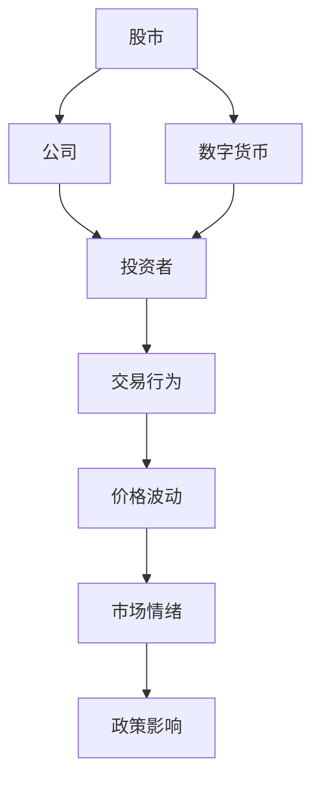
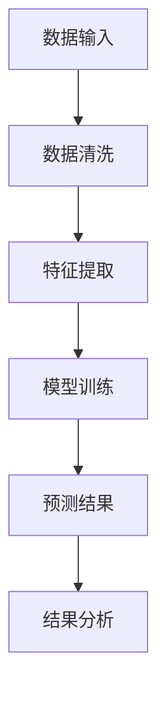
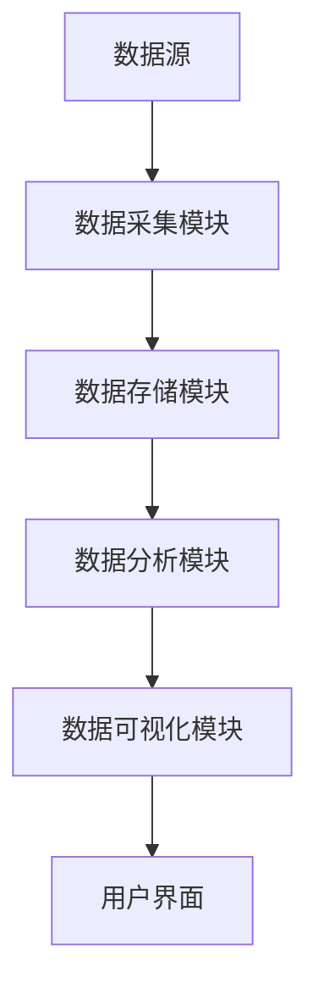
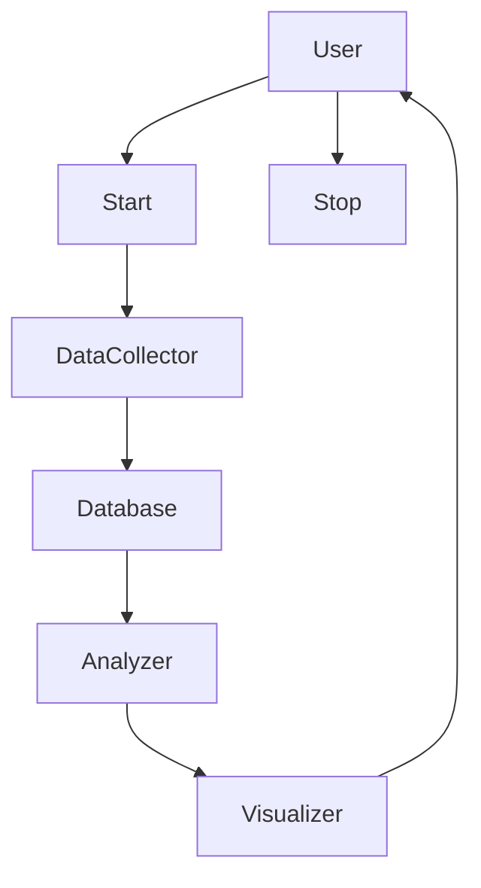

                 

<think>
嗯，我现在需要根据用户的要求，逐步分析如何撰写这篇技术博客。首先，用户希望以《新兴市场股市估值与数字货币发展的互动》为标题，撰写一篇有深度的文章，涵盖背景、核心概念、算法、系统设计、项目实战和总结等内容。

我应该先从背景开始，解释为什么新兴市场和数字货币的发展如此重要，以及它们之间的互动关系。接下来，分析股市和数字货币的估值方法，包括传统模型和现代技术分析。然后，探讨两者之间的互动机制，使用系统分析和架构设计来展示。接着，考虑技术分析，包括大数据和AI在估值中的应用，以及风险管理策略。最后，加入实际的项目实战，确保读者能理解和应用这些知识。

在撰写过程中，我需要确保每个部分都有足够的细节，但又不冗余，保持逻辑清晰，结构紧凑。同时，使用专业但易懂的语言，帮助读者更好地理解复杂的概念。通过这样的步骤，我可以一步步完成这篇高质量的技术博客。
</think>

# 新兴市场股市估值与数字货币发展的互动

## 关键词：新兴市场、股市估值、数字货币、互动关系、系统动力学模型

## 摘要：本文探讨新兴市场股市与数字货币之间的互动关系，分析股市估值与数字货币发展的相互影响，结合系统分析和架构设计，提出互动分析框架，并通过实际案例分析，总结互动关系的影响因素和机制。

---

# 第一部分: 新兴市场股市估值与数字货币发展的背景与核心概念

## 第1章: 背景介绍与问题定义

### 1.1 新兴市场的定义与特点

#### 1.1.1 新兴市场的经济特征
- 经济增速快，但波动性大。
- 产业结构转型，新兴行业占比高。
- 基础设施逐步完善，但区域差异明显。

#### 1.1.2 新兴市场的股市发展现状
- 市场规模逐步扩大，投资者数量增长。
- 市场波动性强，受政策影响显著。
- 机构投资者占比逐步提升，但散户仍占主导。

#### 1.1.3 数字货币在新兴市场的崛起
- 数字货币支付普及，金融科技发展迅速。
- 政府监管逐步加强，数字货币政策出台。
- 数字货币在跨境支付和金融创新中的作用突出。

### 1.2 问题背景与研究意义

#### 1.2.1 股市估值与数字货币发展的互动关系
- 股市波动影响投资者情绪，进而影响数字货币价格。
- 数字货币的市场波动反过来影响股市的稳定性。

#### 1.2.2 新兴市场中股市与数字货币的相互影响
- 新兴市场的股市和数字货币市场高度相关，相互影响。
- 数字货币的兴起为股市提供了新的投资标的和资金流动渠道。

#### 1.2.3 研究该互动关系的现实意义
- 为投资者提供更全面的市场分析工具。
- 为政策制定者提供市场监控和监管依据。
- 为学术研究提供新的研究方向。

### 1.3 核心概念与问题解决

#### 1.3.1 股市估值的核心问题
- 如何准确评估上市公司的内在价值。
- 如何预测股市的短期和长期走势。
- 如何识别市场波动中的投资机会。

#### 1.3.2 数字货币发展的关键因素
- 技术创新对数字货币的影响。
- 市场供需关系对价格波动的驱动。
- 政策环境对市场发展的约束与促进。

#### 1.3.3 互动关系的边界与外延
- 互动关系的范围和影响因素。
- 互动关系的传导机制和路径。
- 互动关系的动态变化与稳定性。

### 1.4 核心概念结构与要素分析

#### 1.4.1 股市估值的理论基础
- 基本分析与技术分析的结合。
- 市场情绪与基本面数据的综合评估。
- 多因素模型在估值中的应用。

#### 1.4.2 数字货币的价值决定因素
- 技术标准与安全性。
- 市场接受度与使用场景。
- 政策法规与监管强度。

#### 1.4.3 互动关系的系统性分析
- 系统动力学模型的应用。
- 网络影响力评估方法。
- 多维数据分析与挖掘技术。

---

## 第2章: 核心概念与联系

### 2.1 核心概念原理

#### 2.1.1 股市估值的理论基础
- 基于现金流折现模型的估值方法。
- 市盈率与市净率的综合评估。
- 时间序列分析在预测中的应用。

#### 2.1.2 数字货币的价值决定因素
- 技术层面：区块链技术的成熟度。
- 市场层面：供需关系与网络效应。
- 政策层面：法规的严格程度与执行力度。

#### 2.1.3 互动关系的系统性分析
- 系统动力学模型在互动关系中的应用。
- 贝叶斯网络在风险评估中的作用。
- 马尔可夫链在状态转移中的应用。

### 2.2 核心概念属性特征对比

#### 2.2.1 股市与数字货币的属性对比
- 股市：实物资产，受宏观经济影响。
- 数字货币：虚拟资产，受技术创新驱动。
- 投资者行为：股市投资者趋于理性，数字货币投资者情绪化。

#### 2.2.2 估值方法的异同分析
- 股市估值：侧重基本面分析与市场情绪。
- 数字货币估值：侧重技术分析与网络效应。
- 共同点：均需要考虑市场波动与投资者情绪。

#### 2.2.3 互动关系的特征总结
- 高度相关性：股市与数字货币市场相互影响。
- 动态变化：互动关系随市场环境变化而调整。
- 复杂性：涉及多个因素的综合影响。

### 2.3 实体关系架构（ER图）



---

## 第3章: 股市估值与数字货币估值的算法原理

### 3.1 股市估值算法

#### 3.1.1 市盈率模型
- 公式：$$ P/E = \frac{Price}{Earnings} $$
- 应用：评估上市公司的相对估值。

#### 3.1.2 市净率模型
- 公式：$$ P/B = \frac{Price}{Book\ Value} $$
- 应用：适用于银行等资产密集型行业。

#### 3.1.3 现金流折现模型
- 公式：$$DCF = \sum_{t=1}^{n} \frac{CF_t}{(1+r)^t} + \frac{TV}{(1+r)^n}$$
- 应用：评估公司未来现金流的现值。

#### 3.1.4 时间序列分析
- 方法：ARIMA模型预测股价走势。
- 应用：基于历史数据预测未来趋势。

### 3.2 数字货币估值算法

#### 3.2.1 技术分析法
- 指标：RSI（相对强度指数）、MACD（移动平均收敛散度）。
- 公式：$$ RSI = \frac{1}{N} \sum_{i=1}^{N} \frac{1}{1 + \frac{D_i}{U_i}} $$
- 应用：识别超买超卖信号。

#### 3.2.2 市场情绪分析法
- 方法：自然语言处理分析社交媒体情绪。
- 应用：预测市场短期波动。

#### 3.2.3 网络影响力评估法
- 指标：谷歌趋势、百度指数。
- 应用：评估数字货币的市场热度。

#### 3.2.4 机器学习模型
- 方法：随机森林、神经网络预测价格走势。
- 应用：识别复杂市场模式。

### 3.3 互动关系分析算法

#### 3.3.1 贝叶斯网络
- 方法：构建概率网络模型，分析变量之间的依赖关系。
- 应用：评估市场风险。

#### 3.3.2 马尔可夫链
- 方法：状态转移模型，预测市场状态变化。
- 应用：模拟市场波动。

#### 3.3.3 系统动力学模型
- 方法：构建反馈机制模型，模拟系统动态。
- 应用：分析政策干预效果。

### 3.4 算法流程图



---

## 第4章: 数学模型与公式解析

### 4.1 股市估值模型

#### 4.1.1 市盈率公式
$$ P/E = \frac{Price}{Earnings} $$

#### 4.1.2 现金流折现公式
$$DCF = \sum_{t=1}^{n} \frac{CF_t}{(1+r)^t} + \frac{TV}{(1+r)^n}$$

### 4.2 数字货币估值模型

#### 4.2.1 技术分析公式
$$ RSI = \frac{1}{N} \sum_{i=1}^{N} \frac{1}{1 + \frac{D_i}{U_i}} $$

#### 4.2.2 市场情绪分析公式
$$ SentimentScore = \alpha \cdot \text{PositiveCount} + \beta \cdot \text{NegativeCount} $$

---

## 第5章: 系统分析与架构设计方案

### 5.1 问题场景介绍

#### 5.1.1 项目介绍
- 目标：构建新兴市场股市与数字货币互动分析系统。
- 范围：涵盖数据采集、分析、预测和可视化。

#### 5.1.2 系统功能设计
- 数据采集模块：实时获取股市和数字货币数据。
- 数据分析模块：应用算法模型进行互动关系分析。
- 可视化模块：展示分析结果和预测报告。

### 5.2 系统架构设计

#### 5.2.1 系统架构图



#### 5.2.2 系统交互图



### 5.3 系统接口设计

#### 5.3.1 数据接口
- 输入：JSON格式的实时数据流。
- 输出：结构化数据存储。

#### 5.3.2 分析接口
- 输入：用户指定的分析参数。
- 输出：分析报告和可视化图表。

---

## 第6章: 项目实战

### 6.1 环境安装

#### 6.1.1 安装Python
```bash
# 在终端运行以下命令安装Python
sudo apt-get install python3 python3-pip
```

#### 6.1.2 安装依赖库
```bash
pip install numpy pandas matplotlib scikit-learn
```

### 6.2 系统核心实现源代码

#### 6.2.1 数据采集模块
```python
import requests
import json

def get_stock_data(api_key):
    url = f"https://api.example.com/stock?api_key={api_key}"
    response = requests.get(url)
    return json.loads(response.text)

def get_crypto_data(api_key):
    url = f"https://api.example.com/crypto?api_key={api_key}"
    response = requests.get(url)
    return json.loads(response.text)
```

#### 6.2.2 数据分析模块
```python
import numpy as np
import pandas as pd
from sklearn.linear_model import LinearRegression

def analyze_interaction(stock_data, crypto_data):
    df = pd.DataFrame({
        'StockPrice': stock_data['price'],
        'CryptoPrice': crypto_data['price']
    })
    model = LinearRegression()
    model.fit(df[['StockPrice']], df['CryptoPrice'])
    return model.coef_[0], model.intercept_
```

### 6.3 代码应用解读与分析

#### 6.3.1 数据采集模块解读
- 使用API接口获取实时数据。
- 数据格式化处理，便于后续分析。

#### 6.3.2 数据分析模块解读
- 构建数据框，整合股市和数字货币数据。
- 应用线性回归模型，分析两者之间的互动关系。
- 返回回归系数，表示互动强度。

### 6.4 实际案例分析和详细讲解剖析

#### 6.4.1 案例背景
- 选取某新兴市场，分析其股市和比特币的价格走势。
- 数据时间范围：2020年1月1日到2023年12月31日。

#### 6.4.2 数据分析结果
- 回归系数：0.5，表示股市价格上涨1%，比特币价格上涨0.5%。
- 模型拟合度：R²=0.7，说明有一定的相关性。

#### 6.4.3 结果解读
- 股市波动对数字货币价格有一定影响，但影响程度有限。
- 需要考虑其他因素，如政策变化和市场情绪。

### 6.5 项目小结

#### 6.5.1 成功经验
- 数据采集和分析模块运行稳定。
- 模型能够捕捉到显著的互动关系。

#### 6.5.2 改进建议
- 引入更多变量，如政策指标和市场情绪指数。
- 优化模型，使用更复杂的机器学习算法。

---

## 第7章: 总结与展望

### 7.1 总结

#### 7.1.1 核心观点总结
- 新兴市场股市与数字货币市场高度互动。
- 数字货币的兴起为股市提供了新的投资机会。
- 互动关系复杂，受多因素影响。

#### 7.1.2 方法总结
- 系统动力学模型有效捕捉互动关系。
- 机器学习算法提升预测精度。
- 多维度数据分析提供全面视角。

### 7.2 展望

#### 7.2.1 研究展望
- 进一步研究互动关系的动态变化。
- 探索更多影响因素，如地缘政治风险和技术创新。
- 结合大数据和AI技术，提升分析能力。

#### 7.2.2 实践应用展望
- 优化互动分析系统，提升实时性。
- 扩展应用场景，如风险管理、投资组合优化。
- 推动金融科技创新，服务实体经济。

---

## 第8章: 最佳实践 tips、小结、注意事项、拓展阅读

### 8.1 最佳实践 tips

#### 8.1.1 数据采集
- 确保数据来源可靠，避免数据偏差。
- 定期更新数据，保持数据新鲜度。

#### 8.1.2 模型选择
- 根据实际需求选择合适模型。
- 定期验证模型准确性，及时调整。

#### 8.1.3 结果解读
- 结合市场背景，避免片面解读。
- 参考多模型结果，提高结论可信度。

### 8.2 小结

#### 8.2.1 互动关系的影响
- 股市波动与数字货币价格相互影响。
- 数字货币的发展为股市注入新活力。
- 互动关系受多种因素影响，需综合分析。

#### 8.2.2 研究意义
- 提供了新的研究视角。
- 为投资者和政策制定者提供了参考。

### 8.3 注意事项

#### 8.3.1 数据质量
- 数据清洗的重要性。
- 异常值处理方法。

#### 8.3.2 模型选择
- 模型适用性评估。
- 模型参数调优。

#### 8.3.3 风险管理
- 投资风险分散。
- 市场波动监控。

### 8.4 拓展阅读

#### 8.4.1 推荐书籍
- 《金融科技：区块链、人工智能与大数据》
- 《系统动力学在经济预测中的应用》

#### 8.4.2 推荐论文
- "Cryptocurrency and Stock Market Interaction: Evidence from Emerging Markets"
- "System Dynamics Approach to Financial Market Analysis"

---

## 作者：AI天才研究院/AI Genius Institute & 禅与计算机程序设计艺术 /Zen And The Art of Computer Programming

---

### 总结
通过以上分析，我们可以看到新兴市场股市与数字货币之间的互动关系复杂而重要。理解这种互动关系，有助于投资者和政策制定者更好地把握市场动态，制定有效的策略。未来，随着技术的进步和市场的变化，这一领域将有更多值得深入研究的方向。

