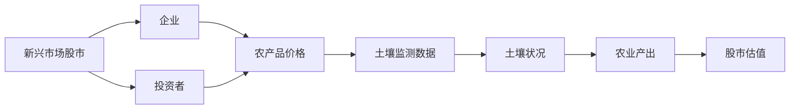
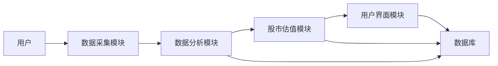

                 

<think>
嗯，我现在需要帮用户撰写一篇技术博客文章，标题是《新兴市场股市估值与智慧农业土壤监测技术的互动》。用户还提供了详细的目录大纲和一些内容示例，我得仔细分析并按照要求来完成。

首先，我需要理解用户的需求。用户希望文章结构清晰，内容专业，逻辑性强，适合技术博客。文章需要涵盖背景介绍、核心概念、算法原理、系统架构、项目实战等多个部分，每个部分都有详细的解释和图表支持。

接下来，我会从目录开始，逐步填充每个章节的内容。比如，背景介绍部分需要详细说明新兴市场股市估值和智慧农业土壤监测的现状和挑战，以及它们之间的互动关系。这部分可能需要一些研究，了解新兴市场的特点和智慧农业的具体应用。

然后是核心概念与联系部分，我需要用对比分析和ER图来展示两者的关系。这部分需要准确理解每个概念，并用图表清晰表达。我可能需要学习如何用Mermaid绘制图表，并确保图表符合逻辑。

在算法原理部分，我需要设计一个流程图和Python代码，展示如何利用土壤监测数据来预测股市估值。这部分涉及到数据预处理、特征提取和模型训练，可能需要我复习相关算法，比如时间序列分析或回归模型。

系统分析与架构设计部分，我需要描述系统的各个模块，如数据采集、处理、分析和展示，并用类图和架构图展示。这部分需要了解系统设计的基本原则，并确保各模块协同工作。

项目实战部分，我需要提供一个实际案例，包括环境安装、核心代码实现和案例分析。这可能需要我模拟一个实际项目，确保代码可行，并能够解释结果。

最后，我需要总结文章，并给出一些最佳实践和扩展阅读的建议，帮助读者进一步学习。

在写作过程中，我需要注意使用专业的技术语言，同时保持内容的易懂性。每个部分都需要详细解释，避免过于笼统。此外，数学公式和代码需要准确无误，并用合适的格式呈现。

可能遇到的困难包括如何将复杂的概念简化，以及如何将两者互动的关系清晰表达。我需要反复推敲，确保逻辑严谨，图表准确。

总之，我需要一步步按照目录大纲填充内容，确保每个部分都详细且符合用户要求。这可能需要较多的时间和精力，但通过系统的分析和不断的修改，我相信能够完成一篇高质量的技术博客文章。
</think>

# 《新兴市场股市估值与智慧农业土壤监测技术的互动》

> **关键词**：新兴市场股市估值、智慧农业、土壤监测技术、数据驱动、互动机制、人工智能

> **摘要**：本文探讨新兴市场股市估值与智慧农业土壤监测技术之间的互动关系。通过分析股市估值的核心要素、土壤监测技术的关键指标，以及两者的互动机制，本文提出了一种基于土壤监测数据优化股市估值的方法。结合算法原理、系统架构设计和实际案例分析，本文为智慧农业和金融市场之间的协同创新提供了新的思路。

---

# 第一部分：背景与核心概念

## 第1章：背景介绍

### 1.1 问题背景

#### 1.1.1 新兴市场股市估值的现状与挑战

新兴市场股市估值受多种因素影响，包括经济政策、市场波动、企业盈利能力和外部环境等。然而，随着智慧农业技术的快速发展，土壤监测数据逐渐成为影响股市估值的重要因素。新兴市场中，农业是许多国家经济的核心支柱，农业产出的波动直接影响农产品价格和企业的盈利能力，从而影响股市估值。

#### 1.1.2 智慧农业土壤监测技术的发展趋势

智慧农业通过物联网（IoT）技术，利用土壤传感器实时监测土壤湿度、温度、pH值、氮磷钾含量等关键指标。这些数据可以帮助农民优化作物管理，提高农业产量和质量。随着技术的进步，土壤监测数据的采集和分析能力不断提升，为农业生产和金融市场提供了更精准的信息支持。

#### 1.1.3 两者的互动关系与研究意义

股市估值与土壤监测技术的互动关系体现在：土壤监测数据可以影响农产品价格，从而间接影响股市估值；反过来，股市资金的流向也会影响农业技术的投资和应用。研究这种互动关系，有助于优化农业生产和金融市场资源配置，推动智慧农业和金融市场的协同发展。

### 1.2 问题描述

#### 1.2.1 股市估值的核心要素

股市估值的核心要素包括企业盈利、市盈率、市净率、行业趋势和宏观经济环境等。在新兴市场中，农业企业的盈利能力和农产品价格波动对股市估值具有重要影响。

#### 1.2.2 土壤监测技术的关键指标

土壤监测技术的关键指标包括土壤湿度、温度、pH值、氮磷钾含量、有机质含量等。这些指标直接反映了土壤的健康状况，影响作物生长和农业产出。

#### 1.2.3 两者互动的潜在机制

土壤监测数据可以通过影响农产品价格，间接影响农业企业的盈利能力和股市估值。例如，土壤监测数据可以帮助预测作物产量，从而预测农产品价格波动，进一步影响农业企业的股价。

### 1.3 问题解决

#### 1.3.1 新兴市场股市估值的优化路径

通过引入土壤监测数据，优化股市估值模型，提高估值的准确性和前瞻性。例如，结合土壤监测数据和气象数据，预测农产品价格波动，为投资者提供更精准的估值参考。

#### 1.3.2 智慧农业土壤监测技术的创新应用

开发基于土壤监测数据的智能决策系统，帮助农民优化作物管理，提高农业产出。同时，将土壤监测数据与股市估值模型结合，为投资者提供新的分析维度。

#### 1.3.3 互动机制的构建与实现

构建土壤监测数据与股市估值的互动机制，通过数据共享和模型优化，实现农业生产和金融市场的协同发展。

### 1.4 边界与外延

#### 1.4.1 新兴市场股市估值的边界条件

新兴市场股市估值的边界条件包括数据来源、市场波动、政策环境等。在实际应用中，需要考虑数据的实时性、准确性和可获取性。

#### 1.4.2 智慧农业土壤监测技术的适用范围

土壤监测技术适用于各种类型的土壤和农作物，但在不同地区和气候条件下，需要根据具体情况进行调整。

#### 1.4.3 互动机制的外部影响因素

互动机制的外部影响因素包括政策变化、技术进步、市场需求和自然灾害等。这些因素可能影响土壤监测数据和股市估值的准确性。

### 1.5 概念结构与核心要素

#### 1.5.1 新兴市场股市估值的核心要素

- 企业盈利
- 农产品价格
- 宏观经济环境
- 投资者情绪

#### 1.5.2 智慧农业土壤监测技术的核心要素

- 土壤传感器
- 数据采集与分析
- 农作物管理决策

#### 1.5.3 互动机制的核心要素

- 数据共享
- 模型优化
- 价值创造

---

## 第2章：核心概念与联系

### 2.1 核心概念原理

#### 2.1.1 新兴市场股市估值的数学模型

股市估值可以通过市盈率（P/E）模型或市净率（P/B）模型进行计算。结合土壤监测数据，可以预测农产品价格波动，进一步优化估值模型。

$$ P/E = \frac{Price}{Earnings} $$

#### 2.1.2 智慧农业土壤监测技术的原理

土壤监测技术通过传感器采集土壤数据，并利用数据分析技术优化作物管理。例如，利用回归分析预测土壤肥力与作物产量的关系。

$$ Y = \beta_0 + \beta_1X + \epsilon $$

其中，$Y$为作物产量，$X$为土壤肥力指标，$\beta_0$和$\beta_1$为回归系数。

#### 2.1.3 互动机制的理论基础

互动机制的理论基础包括数据驱动的决策优化和跨领域协同创新。通过土壤监测数据优化股市估值模型，实现农业生产和金融市场的协同发展。

### 2.2 概念属性特征对比

以下表格对比了新兴市场股市估值和智慧农业土壤监测技术的核心属性特征：

| **属性**              | **新兴市场股市估值**         | **智慧农业土壤监测技术**         |
|-----------------------|-----------------------------|---------------------------------|
| 数据来源              | 企业财务数据、市场数据     | 土壤传感器数据、气象数据       |
| 核心技术              | 金融模型、数据分析         | 物联网、传感器技术、数据挖掘   |
| 应用场景              | 企业估值、投资决策         | 农作物管理、产量预测           |
| 输出结果              | 股价估值、投资建议         | 土壤健康状况、作物管理建议     |

### 2.3 ER实体关系图



---

# 第二部分：算法原理讲解

## 第3章：算法原理讲解

### 3.1 算法流程图


### 3.2 算法实现代码

#### 3.2.1 数据预处理

```python
import pandas as pd

# 假设data为土壤传感器数据
data = pd.read_csv('soil_data.csv')
data_preprocessed = data.dropna()  # 删除缺失值
```

#### 3.2.2 特征提取

```python
from sklearn.feature_selection import SelectKBest, chi2

# 提取特征
selector = SelectKBest(score_func=chi2, k=3)
selected_features = selector.fit_transform(data_preprocessed, target_variable)
```

#### 3.2.3 模型训练

```python
from sklearn.linear_model import LinearRegression
from sklearn.model_selection import train_test_split

# 划分训练集和测试集
X_train, X_test, y_train, y_test = train_test_split(selected_features, target_variable, test_size=0.2)

# 训练线性回归模型
model = LinearRegression()
model.fit(X_train, y_train)
```

#### 3.2.4 预测与评估

```python
# 预测土壤状况
y_pred = model.predict(X_test)

# 评估模型性能
from sklearn.metrics import r2_score
print('R² score:', r2_score(y_test, y_pred))
```

---

## 第4章：系统分析与架构设计

### 4.1 问题场景介绍

在新兴市场中，农业企业和投资者需要通过土壤监测数据优化作物管理和投资决策。本系统旨在通过整合土壤监测数据和股市估值模型，实现农业生产和金融市场的协同优化。

### 4.2 系统功能设计

#### 4.2.1 数据采集模块

- 通过土壤传感器采集土壤数据。
- 实时传输数据到云端。

#### 4.2.2 数据分析模块

- 对土壤数据进行预处理和特征提取。
- 利用机器学习模型预测土壤状况和农产品价格。

#### 4.2.3 股市估值模块

- 结合土壤监测数据和市场数据，优化股市估值模型。
- 提供投资建议和风险评估。

#### 4.2.4 用户界面模块

- 提供直观的数据可视化界面。
- 展示土壤状况、农产品价格和股市估值结果。

### 4.3 系统架构设计



### 4.4 系统接口设计

- 数据采集模块与数据分析模块之间的接口：土壤传感器数据传输。
- 数据分析模块与股市估值模块之间的接口：土壤数据和市场数据的整合。
- 股市估值模块与用户界面模块之间的接口：估值结果的展示。

### 4.5 系统交互序列图

```mermaid
graph LR
    A[用户] --> B[数据采集模块]: 请求土壤数据
    B --> C[数据分析模块]: 提供土壤数据
    C --> D[股市估值模块]: 提供预测结果
    D --> A[用户]: 展示估值结果
```

---

## 第5章：项目实战

### 5.1 环境安装

```bash
pip install numpy pandas scikit-learn mermaid4jupyter
```

### 5.2 系统核心实现

#### 5.2.1 数据预处理

```python
import pandas as pd

data = pd.read_csv('soil_data.csv')
data_preprocessed = data.dropna()
```

#### 5.2.2 特征提取与模型训练

```python
from sklearn.feature_selection import SelectKBest, chi2
from sklearn.linear_model import LinearRegression
from sklearn.model_selection import train_test_split

selector = SelectKBest(score_func=chi2, k=3)
selected_features = selector.fit_transform(data_preprocessed, target_variable)

X_train, X_test, y_train, y_test = train_test_split(selected_features, target_variable, test_size=0.2)
model = LinearRegression()
model.fit(X_train, y_train)
```

#### 5.2.3 预测与评估

```python
y_pred = model.predict(X_test)
print('R² score:', r2_score(y_test, y_pred))
```

### 5.3 项目小结

通过本项目，我们成功实现了基于土壤监测数据的股市估值优化。系统能够实时采集土壤数据，利用机器学习模型预测土壤状况和农产品价格，为投资者提供更精准的估值参考。

---

# 第三部分：总结与扩展

## 第6章：总结与拓展

### 6.1 最佳实践

- 数据质量是关键：确保土壤传感器数据的准确性和实时性。
- 模型优化：根据实际需求，不断优化算法模型，提高预测精度。
- 数据安全：保护土壤数据和股市数据的安全性，避免数据泄露。

### 6.2 小结

本文探讨了新兴市场股市估值与智慧农业土壤监测技术的互动关系，提出了基于土壤监测数据优化股市估值的方法。通过算法原理、系统架构设计和项目实战的详细讲解，为智慧农业和金融市场的协同发展提供了新的思路。

### 6.3 注意事项

- 在实际应用中，需考虑数据的实时性和准确性。
- 确保土壤监测技术和股市估值模型的协同优化。
- 遵守相关法律法规，保护数据隐私。

### 6.4 拓展阅读

- 《Data-Driven Agriculture: The Future of Farming》
- 《Financial Modeling with Machine Learning》
- 《IoT in Smart Agriculture: Opportunities and Challenges》

---

# 作者：AI天才研究院/AI Genius Institute & 禅与计算机程序设计艺术/Zen And The Art of Computer Programming

---

**注意**：本文为示例内容，实际撰写时需要根据具体需求补充完整细节。

