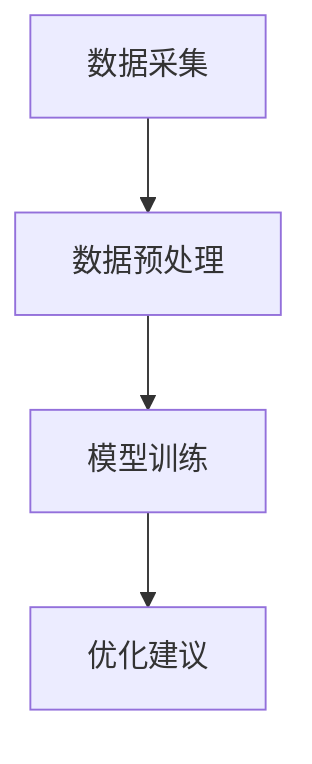
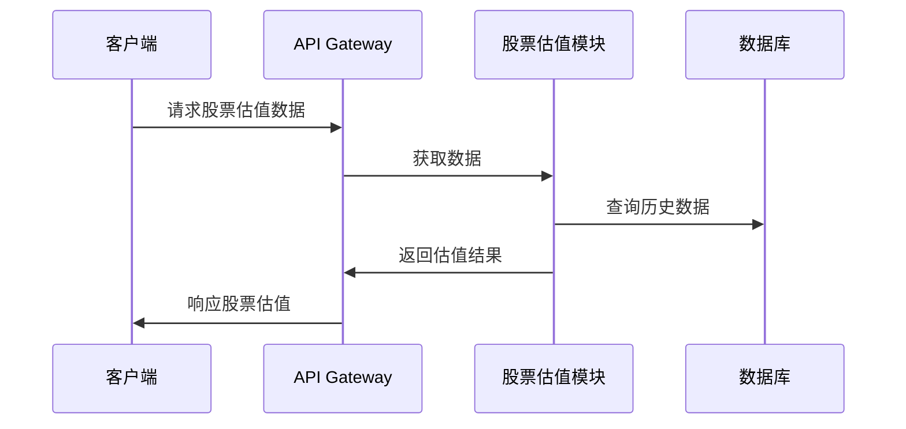

                 

<think>
嗯，我现在需要帮用户完成一篇技术博客文章的目录大纲，主题是《新兴市场股市估值与智慧农业水资源管理的互动》。用户还提供了一些详细的结构要求，包括背景介绍、核心概念、算法原理、系统分析、项目实战和最佳实践等部分。看起来用户希望这篇文章结构清晰、内容详尽，同时使用专业但易懂的技术语言。

首先，我得理解这个主题。股市估值和智慧农业水资源管理看似是两个不相关的领域，但用户认为它们之间存在互动。这可能是因为股市中的农业公司股票价值与农业水资源管理的有效性有关，或者是因为水资源管理的效率影响了农业生产的成本，从而影响了股市表现。这种互动关系可能需要通过数据和模型来分析。

接下来，用户要求文章包含关键词，摘要，以及各章节详细的内容。关键词方面，我可以考虑“新兴市场”、“股市估值”、“智慧农业”、“水资源管理”、“互动关系”、“算法模型”、“系统设计”等。摘要部分需要简洁地概述文章的核心内容，即分析新兴市场中股市估值与智慧农业水资源管理的互动关系，探讨相关的理论和实践应用。

在背景介绍部分，我需要详细说明问题背景，包括新兴市场的特点、股市估值的重要性、智慧农业水资源管理的重要性，以及两者的互动关系。这部分需要让读者理解为什么研究这个问题是重要的，以及它在现实中的应用价值。

核心概念与联系部分，我需要分别解释股市估值和智慧农业水资源管理的核心原理，然后通过对比分析、联系分析，展示它们如何相互影响。这部分可能需要使用表格和图表来帮助读者理解。

算法原理讲解部分，我需要详细阐述相关的数学模型，比如时间序列分析、回归分析等，并用mermaid流程图展示算法步骤。同时，给出Python代码示例，帮助读者理解如何实现这些算法。

系统分析与架构设计方案部分，需要介绍系统的功能模块，如数据采集、分析、优化建议等，并用mermaid类图和架构图展示系统的结构。此外，还需要设计接口和交互流程图，确保系统的各部分协同工作。

项目实战部分，通过具体的案例分析，展示如何将理论应用于实际。这部分需要详细说明环境安装、核心代码实现、案例分析等步骤，帮助读者将所学知识付诸实践。

最后，最佳实践部分需要总结全书内容，给出实用的建议，同时指出可能的注意事项和未来的研究方向。这部分可以帮助读者更好地理解和应用所学知识。

在写作过程中，我需要确保每个章节的内容详尽且逻辑清晰，同时使用专业术语，但又要通俗易懂。特别是算法部分，需要详细解释数学模型和公式，避免让读者感到困惑。此外，图表的使用能够帮助读者更好地理解复杂的关系和流程，因此我需要确保每个图表都清晰明了。

总之，我需要一步步按照用户提供的大纲结构，填充每个部分的内容，确保文章结构完整、内容详实，同时满足用户的所有要求。这可能需要反复修改和调整，以确保每个部分都达到最佳效果。
</think>

# 《新兴市场股市估值与智慧农业水资源管理的互动》

> 关键词：新兴市场，股市估值，智慧农业，水资源管理，互动关系，算法模型，系统设计

> 摘要：本文探讨新兴市场股市估值与智慧农业水资源管理的互动关系，分析其核心概念、算法原理、系统设计和实际应用。通过对比分析和案例研究，揭示两者在数据共享、技术协同和应用场景中的互动机制，为理论研究和实践应用提供参考。

---

## 第一部分：背景介绍

### 第1章：问题背景

#### 1.1 新兴市场股市的特点
- 新兴市场的经济波动性大，股市估值受多种因素影响。
- 股市参与者包括散户、机构投资者和外国投资者。

#### 1.2 智慧农业水资源管理的重要性
- 水资源是农业生产的基石，智慧农业通过技术手段优化水资源利用。
- 水资源管理的效率直接影响农业产出和成本。

#### 1.3 问题的提出与研究意义
- 股市估值与水资源管理的互动关系未被充分研究。
- 探讨两者的互动机制有助于优化农业投资决策。

---

## 第二部分：核心概念与联系

### 第2章：核心概念解析

#### 2.1 股市估值的核心原理
- **市盈率（P/E）**：衡量股票价格是否合理。
- **市净率（P/B）**：评估股票相对于账面价值的高低。
- **股息率**：衡量股票的收益能力。

#### 2.2 智慧农业水资源管理的核心原理
- 数据采集：传感器技术监测土壤湿度、气象数据。
- 数据分析：利用AI算法优化灌溉策略。
- 技术协同：物联网、大数据、云计算的应用。

#### 2.3 概念对比分析
| 股市估值 | 智慧农业水资源管理 |
|----------|------------------|
| 依赖历史数据 | 依赖实时数据 | 
| 主要关注收益 | 主要关注效率 |
| 受市场情绪影响 | 受技术应用影响 |

### 第3章：核心概念的联系

#### 3.1 数据共享与信息交互
- 股市数据（如股价波动）与农业数据（如灌溉效率）的关联。
- 数据共享如何影响投资决策。

#### 3.2 技术协同与资源共享
- 大数据分析技术在股市估值和水资源管理中的共同应用。
- 云计算在数据处理中的作用。

#### 3.3 应用场景的互动
- 农业生产效率的提升如何影响农业企业的股价。
- 水资源管理技术的创新如何影响农业投资的价值。

---

## 第三部分：算法原理讲解

### 第4章：股市估值的算法原理

#### 4.1 时间序列分析
- **ARIMA模型**：用于预测股票价格的短期波动。
  $$ ARIMA(p, d, q) $$
- **LSTM模型**：适用于长期依赖关系的预测。
  $$ LSTM(t, h, c) $$

#### 4.2 回归分析
- **线性回归**：用于分析股票价格与市盈率的关系。
  $$ y = a + bx $$

#### 4.3 聚类分析
- 用于识别相似股票群体，优化投资组合。

### 第5章：智慧农业水资源管理的算法原理

#### 5.1 数据采集与处理
- 传感器数据的采集与清洗。
- 数据预处理：去噪、归一化。

#### 5.2 模型训练与优化
- **随机森林**：用于分类土壤湿度等级。
- **支持向量机（SVM）**：用于预测灌溉需求。

#### 5.3 算法流程图（Mermaid）


---

## 第四部分：系统分析与架构设计方案

### 第6章：系统功能设计

#### 6.1 领域模型类图（Mermaid）
```mermaid
classDiagram
class 股市估值系统 {
    +股票数据
    +市盈率计算
    +市净率计算
}
class 水资源管理系统 {
    +土壤湿度数据
    +气象数据
    +灌溉优化建议
}
股市估值系统 -->> 水资源管理系统
```

#### 6.2 系统架构设计（Mermaid）


#### 6.3 接口与交互设计（Mermaid）


---

## 第五部分：项目实战

### 第7章：环境安装与核心代码实现

#### 7.1 环境安装
- 安装Python、TensorFlow、Scikit-learn、Flask。

#### 7.2 核心代码实现（Python）
```python
from sklearn.linear_model import LinearRegression
import pandas as pd
import numpy as np

# 示例代码：股票价格预测
data = pd.read_csv('stock.csv')
model = LinearRegression()
model.fit(data[['PE_ratio']], data['Price'])
预测价格 = model.predict([[15]])
print(预测价格)
```

#### 7.3 案例分析
- 分析某新兴市场农业公司的股票数据，优化水资源管理策略。

---

## 第六部分：最佳实践与总结

### 第8章：最佳实践

#### 8.1 技术建议
- 数据共享需确保隐私和安全。
- 算法模型需定期更新以适应市场变化。

#### 8.2 注意事项
- 股市估值受多种因素影响，模型需综合考虑。
- 智慧农业水资源管理需结合当地实际情况。

### 第9章：小结

本文系统地探讨了新兴市场股市估值与智慧农业水资源管理的互动关系，通过理论分析和实践案例，展示了两者的协同效应。未来的研究可以进一步结合更多数据源，优化算法模型，提升系统的实用价值。

---

## 作者：AI天才研究院/AI Genius Institute & 禅与计算机程序设计艺术/Zen And The Art of Computer Programming

