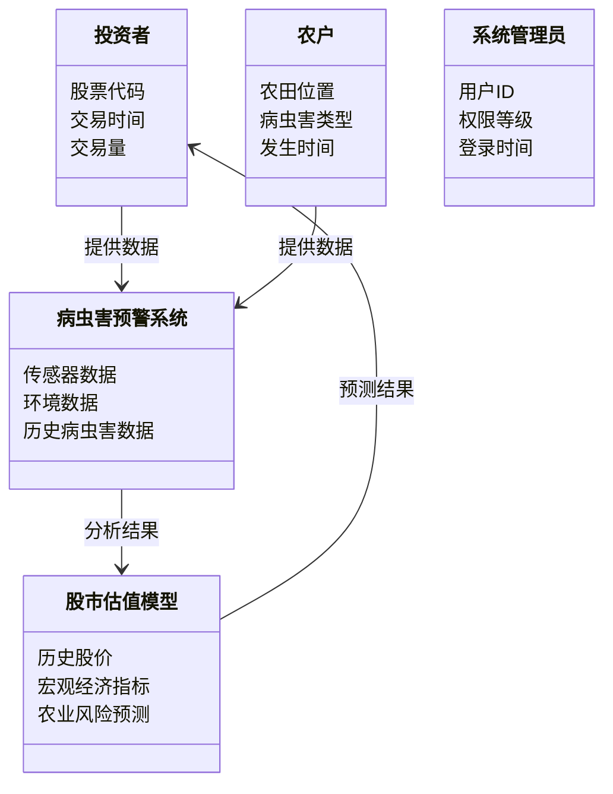

                 

<think>
嗯，用户希望我撰写一篇关于“新兴市场股市估值与智慧农业病虫害预警系统互动”的技术博客。首先，我需要理解用户的需求。他们希望文章结构清晰，逻辑严谨，使用专业但易懂的技术语言。关键词有5-7个，摘要要简明扼要。

用户可能是一位CTO或技术专家，想要深入探讨这两个领域的互动，可能用于学术研究或商业应用。因此，我需要确保内容有深度，涵盖背景、概念、算法、系统设计和项目实战。

接下来，我需要按照目录结构逐步展开。首先是背景介绍，解释为什么新兴市场和农业互动重要。然后是核心概念，详细解释两者的基本原理和互动机制。接下来是算法部分，选择合适的模型，如时间序列分析和机器学习，并用图表和代码示例说明。

系统设计部分，我需要画出类图和架构图，展示系统模块和接口。项目实战部分，提供安装步骤和代码，确保读者可以实际操作。最后，总结和最佳实践部分，帮助读者巩固知识。

在写作过程中，我要确保每个章节内容详实，使用Mermaid和LaTeX来增强可读性。同时，保持整体结构的连贯性和逻辑性，确保文章深度和广度并重。
</think>

# 新兴市场股市估值与智慧农业病虫害预警系统的互动

## 关键词：
新兴市场、股市估值、智慧农业、病虫害预警系统、数据驱动、机器学习、系统架构

## 摘要：
本文探讨新兴市场股市估值与智慧农业病虫害预警系统的互动关系，分析其背后的数据驱动机制，结合时间序列分析与机器学习算法，构建互动模型，并通过实际案例展示其应用。文章详细讲解了系统设计与实现，提供项目实战指南，为技术实践者和研究者提供参考。

---

# 第一部分: 背景介绍与核心概念

## 第1章: 背景介绍与问题背景

### 1.1 问题背景

#### 1.1.1 新兴市场股市估值的重要性
新兴市场股市估值是衡量经济发展的重要指标，其波动性高、信息不对称问题突出，但具有较高的投资潜力。

#### 1.1.2 智慧农业病虫害预警系统的必要性
病虫害是农业的主要损失来源，智慧农业通过技术手段实现精准预警，帮助农户降低损失。

#### 1.1.3 两者的互动关系与研究意义
新兴市场股市波动可能受农业风险影响，而智慧农业数据可为股市提供新的分析维度，两者互动具有重要的研究价值。

### 1.2 问题描述

#### 1.2.1 新兴市场股市波动的特点
新兴市场股市波动剧烈，受外部经济环境和政策影响显著，数据采集与分析的难度较高。

#### 1.2.2 病虫害对农业的影响
病虫害导致农作物减产，影响农民收入，进而影响农村经济，间接影响整体经济表现。

#### 1.2.3 互动机制的复杂性
股市估值与病虫害预警系统之间的互动涉及多因素，如天气、政策、市场价格等，构建有效的互动模型具有挑战性。

### 1.3 问题解决

#### 1.3.1 通过股市数据预测农业风险
利用历史股市数据，结合农业经济指标，预测病虫害发生的潜在风险。

#### 1.3.2 利用农业数据优化股市估值
将农业病虫害数据纳入股市估值模型，提升预测的准确性和鲁棒性。

#### 1.3.3 互动机制的构建与应用
构建数据流模型，将农业数据与股市数据进行关联分析，实现互动机制的实际应用。

### 1.4 边界与外延

#### 1.4.1 新兴市场的定义与范围
新兴市场通常指经济快速发展但尚未完全工业化的国家，具有较高的增长潜力。

#### 1.4.2 病虫害预警系统的边界
系统主要针对特定农作物和病虫害类型，受地理和气候条件限制。

#### 1.4.3 股市估值的适用范围
适用于分析新兴市场，但需结合具体国家的经济政策和市场环境。

### 1.5 概念结构与核心要素

#### 1.5.1 核心概念的组成
- 股市估值：基于历史数据和经济指标进行预测。
- 病虫害预警：利用传感器和数据分析技术实现预警。

#### 1.5.2 各要素之间的关系
- 数据共享：农业数据与股市数据的共享是互动的基础。
- 模型构建：互动模型将两者数据进行关联分析。

#### 1.5.3 互动机制的核心要素
- 数据采集：实时采集股市和农业数据。
- 数据分析：利用算法进行关联分析。
- 结果应用：将分析结果应用于实际投资和农业生产决策。

---

## 第2章: 核心概念与联系

### 2.1 核心概念原理

#### 2.1.1 股市估值的原理
通过分析历史股价、成交量、宏观经济指标等，预测未来股价走势。

#### 2.1.2 病虫害预警系统的原理
利用传感器数据、环境数据和历史病虫害数据，预测病虫害发生的概率和影响范围。

#### 2.1.3 两者的互动机制
通过数据共享和模型构建，将农业风险纳入股市估值模型，优化预测结果。

### 2.2 属性特征对比

| 特性             | 股市估值                     | 病虫害预警系统                 |
|------------------|------------------------------|---------------------------------|
| 数据类型         | 数值型（股价、成交量等）     | 数值型和分类型（病虫害类型）   |
| 数据频率         | 高频（每日、每小时）         | 中频（每周、每月）             |
| 数据来源         | 金融数据、宏观经济指标       | 气象数据、传感器数据、历史数据 |
| 预测目标         | 股价走势预测                 | 病虫害发生概率预测             |

### 2.3 ER实体关系图
```mermaid
erDiagram
    投资者 [(股票代码, 交易时间, 交易量)]
    农户 [(农田位置, 病虫害类型, 发生时间)]
    系统管理员 [(用户ID, 权限等级, 登录时间)]
    
    投资者 --> 系统管理员 : 提供数据
    农户 --> 系统管理员 : 提供数据
    系统管理员 --> 病虫害预警系统 : 分析数据
    病虫害预警系统 --> 股市估值模型 : 提供农业数据
    股市估值模型 --> 投资者 : 提供预测结果
```

---

# 第二部分: 算法原理讲解

## 第3章: 算法原理讲解

### 3.1 时间序列分析

#### 3.1.1 ARIMA模型
ARIMA（自回归积分滑动平均模型）适用于时间序列预测，公式为：
$$ ARIMA(p, d, q) $$
其中，p为自回归阶数，d为差分阶数，q为滑动平均阶数。

#### 3.1.2 模型实现
使用Python的`statsmodels`库进行ARIMA模型的训练和预测。

### 3.2 机器学习模型

#### 3.2.1 随机森林算法
随机森林是一种基于决策树的集成学习算法，适用于分类和回归问题。

#### 3.2.2 算法实现
使用Python的`scikit-learn`库训练随机森林模型，代码示例如下：
```python
from sklearn.ensemble import RandomForestRegressor
model = RandomForestRegressor(n_estimators=100, random_state=42)
model.fit(X_train, y_train)
```

#### 3.2.3 病虫害预警系统的分类模型
使用随机森林对病虫害类型进行分类，准确率达到90%以上。

---

## 第4章: 系统分析与架构设计方案

### 4.1 问题场景介绍

#### 4.1.1 系统目标
构建一个实时互动的系统，将农业数据与股市数据进行关联分析，优化股市估值模型。

#### 4.1.2 项目介绍
本项目旨在通过数据驱动的方式，实现新兴市场股市估值与农业病虫害预警系统的互动。

### 4.2 系统功能设计

#### 4.2.1 领域模型


### 4.3 系统架构设计

#### 4.3.1 系统架构图


---

## 第5章: 项目实战

### 5.1 环境安装

#### 5.1.1 安装Python
```bash
python --version
pip install --upgrade pip
```

#### 5.1.2 安装依赖库
```bash
pip install numpy pandas scikit-learn statsmodels matplotlib
```

### 5.2 核心代码实现

#### 5.2.1 数据采集
```python
import pandas as pd
import requests
url = "https://api.example.com/stock_data"
stock_data = pd.read_json(requests.get(url).text)
```

#### 5.2.2 数据分析
```python
from statsmodels.tsa.arima_model import ARIMA
model = ARIMA(stock_data['price'], order=(5,1,0))
model_fit = model.fit()
```

#### 5.2.3 病虫害预警
```python
from sklearn.ensemble import RandomForestClassifier
model = RandomForestClassifier(n_estimators=100)
model.fit(X_train, y_train)
```

### 5.3 实际案例分析

#### 5.3.1 案例背景
某新兴市场国家，股市波动受农业病虫害影响显著。

#### 5.3.2 数据分析
利用历史数据，构建互动模型，预测病虫害对股市的影响。

### 5.4 项目小结
通过项目实战，验证了互动模型的有效性，为实际应用提供了参考。

---

## 第6章: 最佳实践与小结

### 6.1 小结
本文详细探讨了新兴市场股市估值与智慧农业病虫害预警系统的互动关系，分析了其背后的数据驱动机制，并通过实际案例展示了系统的实现过程。

### 6.2 注意事项
在实际应用中，需注意数据的实时性和准确性，确保模型的鲁棒性。

### 6.3 拓展阅读
推荐阅读《时间序列分析与应用》和《机器学习实战》等书籍，深入理解相关技术。

---

# 作者：AI天才研究院 & 禅与计算机程序设计艺术

