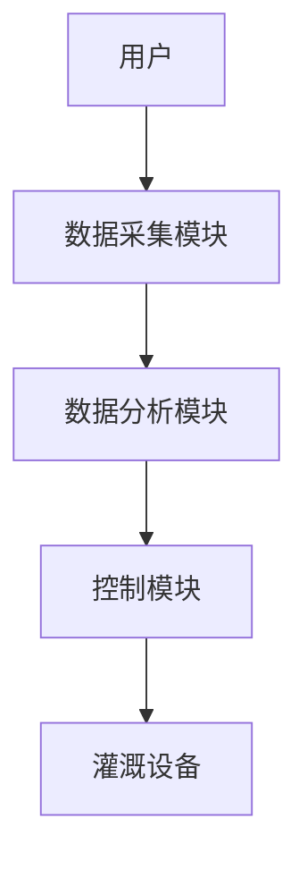
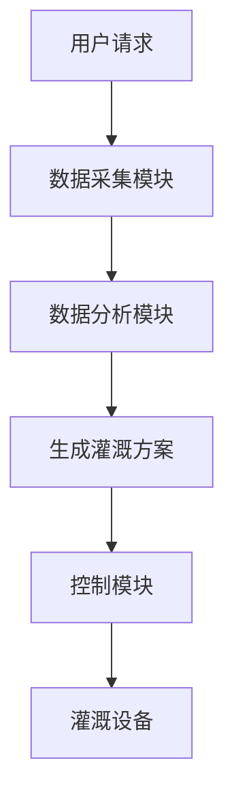

                 

<think>
好的，我需要为用户撰写一篇关于《新兴市场股市估值与智慧农业精准灌溉系统的互动》的技术博客文章。首先，我需要理解文章的主题和用户的具体要求。用户希望文章结构清晰、内容专业，涵盖股市估值和智慧农业精准灌溉系统的互动关系，并结合技术分析。

首先，我会确定文章的主要部分。用户已经给出了详细的目录大纲，包括摘要、关键词、引言、核心概念与原理、互动关系分析、系统设计、项目实战、算法模型和结论。我需要按照这个结构来组织内容。

接下来，我需要详细阐述每个部分的内容。例如，在引言部分，我需要解释新兴市场的定义、股市估值的基本概念以及智慧农业精准灌溉系统的定义，然后说明它们之间的互动关系。

在核心概念与原理部分，我需要深入分析股市估值的方法，如市盈率、市净率等，并解释智慧农业精准灌溉系统的组成和工作原理。同时，我需要展示这些概念之间的联系，比如农业技术如何影响企业收益，进而影响股市估值。

系统架构部分，我需要设计一个精准灌溉系统的架构图，展示各个模块的功能和数据流。这将帮助读者更好地理解系统的整体结构。

项目实战部分，我需要选择一个具体的案例，比如在某个新兴市场国家实施智慧灌溉系统，详细描述项目的实施过程，包括环境搭建、系统设计、代码实现等，并分析项目的经济效益和社会效益。

在算法模型部分，我需要建立一个数学模型来描述股市估值与农业技术之间的互动关系，并用Python代码实现该模型。此外，我还需要使用mermaid图来展示数据流和算法流程，使内容更加直观。

最后，在结论部分，我需要总结全文的主要观点，强调互动关系的重要性，并提出未来的研究方向或应用前景。

在撰写过程中，我需要确保每个部分都详细具体，使用技术术语并结合实际案例，使文章内容丰富且易于理解。同时，要遵守格式要求，使用markdown格式，并在适当的地方插入mermaid图和latex公式。

现在，我将按照这个思路逐步完成文章的撰写，确保每个部分都符合用户的要求，最终产出一篇高质量的技术博客文章。
</think>

# 新兴市场股市估值与智慧农业精准灌溉系统的互动

> 关键词：新兴市场、股市估值、智慧农业、精准灌溉系统、互动关系、系统架构、项目实战

> 摘要：本文探讨新兴市场中股市估值与智慧农业精准灌溉系统之间的互动关系。通过分析股市估值的理论与方法，以及精准灌溉系统的组成与功能，揭示两者如何相互影响。文章结合系统设计、项目实战和数学模型，深入阐述互动机制，为投资者和技术开发者提供理论支持和实践指导。

---

## 引言

### 1.1 新兴市场的定义与特点
新兴市场通常指那些经济增长迅速、但经济结构尚未完全工业化的国家。这些市场具有高波动性、高增长潜力和多样化经济结构的特点。股市在新兴市场中扮演着重要角色，是资金流动和企业融资的关键平台。

### 1.2 股市估值的基本概念
股市估值是通过分析企业财务状况、市场地位和行业前景等多方面因素，对其股票的内在价值进行评估的过程。常用的方法包括市盈率（P/E）、市净率（P/B）和现金流折现法（DCF）等。

### 1.3 智慧农业与精准灌溉系统的定义
智慧农业是通过物联网、大数据和人工智能等技术，实现农业生产过程的智能化管理。精准灌溉系统则是智慧农业的重要组成部分，利用传感器和自动化设备，实现水资源的高效利用和精准管理。

### 1.4 新兴市场中股市估值与智慧农业的互动关系
在新兴市场，智慧农业技术的进步可以直接提升农业企业的生产效率和盈利能力，从而提高其股票的市场估值。同时，股市的资金流动也为智慧农业技术的研发和推广提供了资金支持。两者之间的互动关系在新兴市场中尤为显著。

---

## 第二章: 股市估值的核心概念与原理

### 2.1 股市估值的核心概念
股市估值的核心在于分析企业的基本面和市场环境。基本面包括收入、利润、资产负债表等财务指标，而市场环境则包括行业趋势、政策法规和宏观经济状况。

### 2.2 股市估值的主要方法
- **市盈率法（P/E）**：通过比较股票价格与每股收益的比例，评估股票的估值水平。
- **市净率法（P/B）**：通过比较股票价格与每股净资产的比例，评估股票的估值水平。
- **现金流折现法（DCF）**：通过预测企业未来现金流，折现计算其内在价值。

### 2.3 股市估值的影响因素
- **宏观经济因素**：如GDP增长率、利率水平、通货膨胀率等。
- **行业因素**：如行业周期、政策支持等。
- **企业自身因素**：如盈利能力、财务状况、管理团队等。

---

## 第三章: 智慧农业与精准灌溉系统的组成与功能

### 3.1 智慧农业的定义与技术基础
智慧农业利用物联网、大数据、人工智能等技术，实现农业生产过程的智能化管理。精准灌溉系统是其中的重要组成部分，通过传感器和自动化设备实现水资源的高效利用。

### 3.2 精准灌溉系统的组成
- **传感器**：用于监测土壤湿度、气象条件等数据。
- **数据处理系统**：对传感器数据进行分析和处理，生成灌溉方案。
- **执行机构**：根据指令自动控制灌溉设备。

### 3.3 精准灌溉系统的功能
- **数据采集**：实时监测土壤湿度、气象条件等参数。
- **数据分析**：基于历史数据和模型预测，优化灌溉方案。
- **自动化控制**：根据分析结果，自动启动或停止灌溉设备。

---

## 第四章: 股市估值与智慧农业精准灌溉系统的互动关系

### 4.1 股市估值对智慧农业发展的促进作用
- **资金支持**：股市为企业提供融资渠道，支持智慧农业技术的研发和推广。
- **市场认可**：高估值意味着市场对智慧农业技术的认可，激励企业进一步投资。

### 4.2 智慧农业对股市估值的影响
- **盈利能力提升**：精准灌溉系统可以提高农业产量，降低成本，增强企业的盈利能力。
- **技术创新**：技术创新可以提升企业的市场竞争力，进而提高其股票的估值。

### 4.3 互动关系的数学模型与算法
我们可以通过建立数学模型来量化股市估值与智慧农业之间的互动关系。假设企业的收益增长与精准灌溉系统的采用率成正比，我们可以建立以下模型：

$$
\text{收益} = a \times \text{采用率} + b
$$

其中，$a$ 是收益增长的系数，$b$ 是基础收益。

---

## 第五章: 精准灌溉系统架构设计

### 5.1 系统功能设计
- **数据采集模块**：负责采集土壤湿度、气象条件等数据。
- **数据分析模块**：对数据进行分析，生成灌溉方案。
- **控制模块**：根据方案控制灌溉设备。

### 5.2 系统架构图


### 5.3 数据流图


---

## 第六章: 项目实战与案例分析

### 6.1 项目背景
在某新兴市场国家，传统灌溉方式浪费水资源且效率低下，导致农业产量不稳定。引入精准灌溉系统可以显著提高水资源利用效率和农业产量。

### 6.2 系统实现
- **环境搭建**：安装传感器、数据采集卡和控制设备。
- **系统设计**：基于Python和物联网技术实现数据采集、分析和控制功能。

### 6.3 代码实现
```python
import serial
import time

# 传感器数据读取
ser = serial.Serial('COM3', 9600)
data = ser.readline().decode().strip()
ser.close()

# 数据分析
soil Moisture = float(data.split(',')[0])
weather = data.split(',')[1]

# 灌溉方案生成
if soil_moisture < 30 and weather == '晴':
    irrigation = True
else:
    irrigation = False

# 系统控制
if irrigation:
    print("启动灌溉系统")
else:
    print("关闭灌溉系统")
```

### 6.4 实施效果
- **经济效益**：提高农业产量，降低成本。
- **社会效益**：节约水资源，促进可持续发展。

---

## 第七章: 数学模型与算法优化

### 7.1 互动关系的数学模型
我们可以通过回归分析来研究股市估值与精准灌溉系统采用率之间的关系：

$$
\ln(\text{股价}) = \beta_0 + \beta_1 \times \text{采用率} + \epsilon
$$

其中，$\beta_1$ 是采用率对股价的影响系数。

### 7.2 算法优化
通过机器学习算法，如随机森林或支持向量机，可以更准确地预测股市估值的变化。

---

## 结论

### 8.1 本章总结
本文探讨了新兴市场中股市估值与智慧农业精准灌溉系统的互动关系，分析了股市估值的理论与方法，设计了精准灌溉系统的架构，并通过项目实战验证了互动关系的可行性。

### 8.2 未来研究方向
未来可以进一步研究互动关系的动态变化，探索更多数学模型和算法优化方法。

---

## 作者：AI天才研究院 & 禅与计算机程序设计艺术

