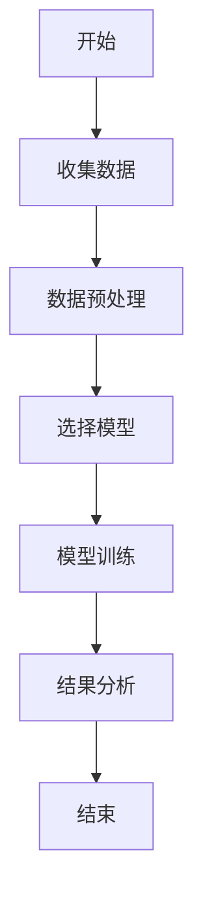
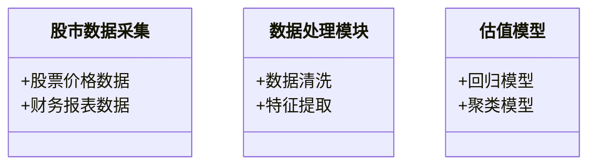
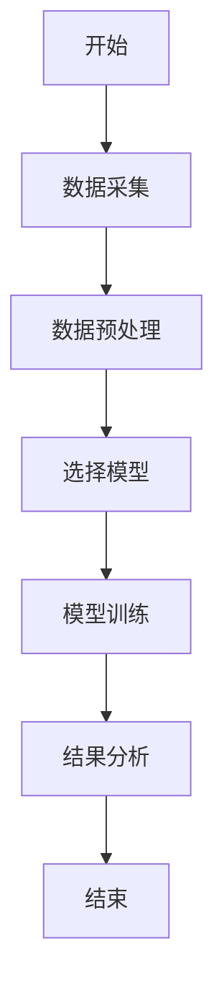
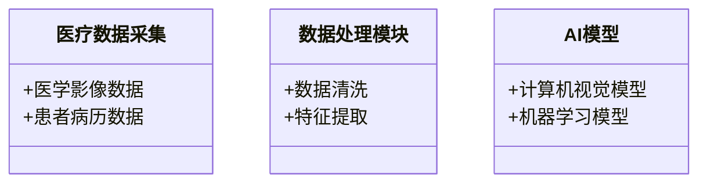
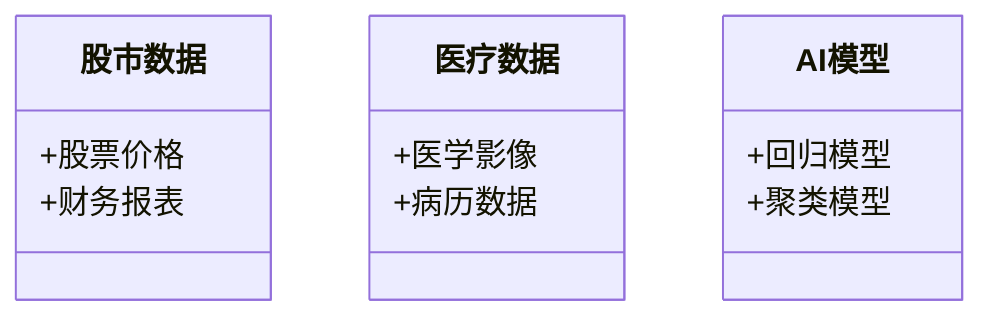
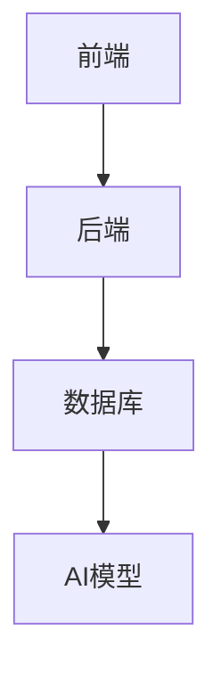
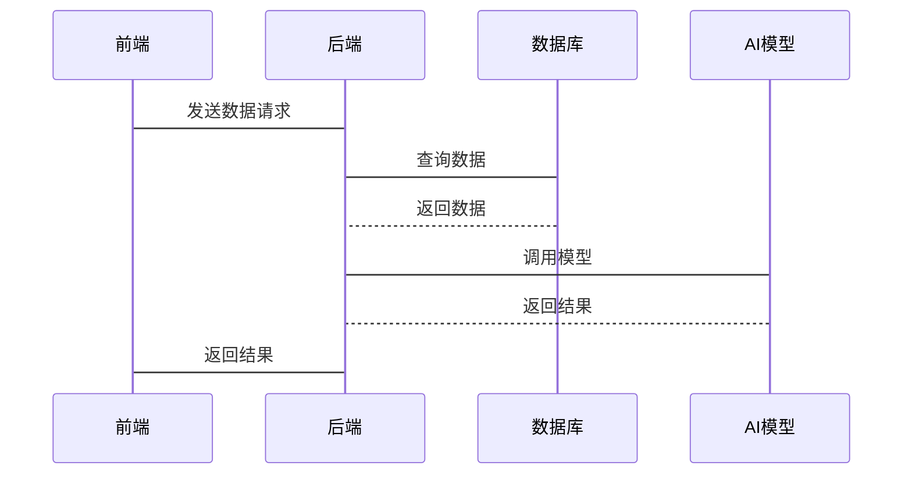

                 

<think>
好的，现在我需要帮用户撰写一篇技术博客，标题是《新兴市场股市估值与智慧医疗AI辅助手术的互动》。首先，我需要理解用户的需求。用户希望文章结构清晰，内容专业，涵盖背景、核心概念、算法、系统架构、项目实战等部分，并且使用技术术语，同时要有互动的分析。

用户还提供了一个详细的目录大纲，我需要按照这个大纲来撰写文章。首先，我需要确保每个章节都有足够的细节，包括背景介绍、核心概念、算法流程图、数学模型、系统架构图等。

开始思考第一步，分析用户的需求。用户是一位技术专家，可能需要这篇文章来展示他的专业知识，或者用于教育目的。因此，内容需要深入浅出，同时具有学术严谨性。

接下来，我要考虑如何将股市估值和AI辅助手术联系起来。可能的联系包括数据共享、技术应用、经济影响等方面。例如，股市估值可能为医疗科技公司提供融资支持，而AI辅助手术可能影响医疗公司的股票表现。

然后，我需要确定文章的结构。第一章是背景，第二章分析股市估值，第三章分析AI手术，第四章探讨互动，第五章系统设计，第六章项目实战，第七章总结。

在撰写每个部分时，我要确保涵盖所有必要的细节。例如，在分析股市估值时，需要解释其基本原理、新兴市场的特殊性，以及常用的算法和数学模型。同时，用mermaid流程图展示算法流程，用latex公式表示模型。

在智慧医疗部分，我需要详细讲解AI辅助手术的技术，如机器学习算法、系统架构，以及如何与股市估值互动。可能涉及到数据的使用，比如医疗公司的财务数据如何影响股市估值。

系统架构设计部分，我需要画出类图、流程图和序列图，展示系统各模块的交互。这可能包括数据采集、处理、分析和结果展示。

项目实战部分，我需要提供代码示例，解释其功能，并结合实际案例进行分析。这可以帮助读者更好地理解理论知识。

最后，总结部分需要回顾主要内容，并展望未来的互动发展，如AI在医疗中的进一步应用如何影响股市估值。

在写作过程中，我需要确保语言简洁明了，逻辑清晰。同时，注意使用正确的技术术语，并适当解释，使读者能够理解。此外，图表的使用可以增强文章的可读性，帮助读者更好地理解复杂的技术概念。

现在，我开始撰写每个章节，确保每部分内容详实，结构合理，同时符合用户的要求。在完成每个部分后，我会检查是否覆盖了所有必要的细节，并进行必要的修改和润色，确保文章的质量。

总之，我需要系统地分解主题，逐步分析，确保每个部分都得到充分的探讨，最终完成一篇结构清晰、内容丰富的技术博客文章。
</think>

# 新兴市场股市估值与智慧医疗AI辅助手术的互动

> 关键词：新兴市场，股市估值，智慧医疗，AI辅助手术，互动分析

> 摘要：本文探讨新兴市场股市估值与智慧医疗AI辅助手术的互动关系，分析两者的技术基础、应用场景及其对经济和社会的影响。

---

# 第一章: 背景介绍

## 1.1 新兴市场股市估值的定义与特点
### 1.1.1 股市估值的基本概念
股市估值是指通过分析市场数据和公司基本面，对股票价格的合理范围进行评估。新兴市场的股市估值具有波动性大、数据不完善等特点。

### 1.1.2 新兴市场的特殊性
新兴市场通常具有较高的增长率，但也面临政策不稳定、市场流动性不足等问题，这些因素影响股市估值。

## 1.2 智慧医疗AI辅助手术的核心概念
### 1.2.1 AI在医疗中的应用
AI辅助手术通过机器学习和计算机视觉，提高手术精确度和效率，减少人为错误。

### 1.2.2 智慧医疗的体系结构
智慧医疗通常包括数据采集、处理、分析和反馈等模块，AI算法在其中起到关键作用。

## 1.3 两者的互动关系与研究意义
### 1.3.1 互动机制
新兴市场的股市估值可能受智慧医疗技术的影响，而智慧医疗的发展又依赖于股市的资金支持。

### 1.3.2 研究意义
研究两者互动有助于优化投资决策，促进医疗技术的发展，推动经济与科技的融合。

---

# 第二章: 新兴市场股市估值的核心概念与算法原理

## 2.1 核心概念与原理
### 2.1.1 股市估值的基本原理
通过分析公司财务数据、市场趋势和行业动态，评估股票的内在价值。

### 2.1.2 新兴市场的挑战
数据不完整、市场波动大等，增加了估值的难度。

## 2.2 算法原理与流程
### 2.2.1 股市估值算法的流程图


### 2.2.2 常用算法对比
| 算法 | 优点 | 缺点 |
|------|------|------|
| 回归分析 | 简单易用 | 易受异常值影响 |
| 时间序列分析 | 考虑时间因素 | 需大量历史数据 |
| 机器学习 | 高精度 | 需大量计算资源 |

## 2.3 数学模型与公式
### 2.3.1 股市估值的基本公式
$$ P = \frac{E}{D} $$
其中，P为股票价格，E为公司盈利，D为股数。

### 2.3.2 新兴市场的修正公式
$$ P_{new} = P \times (1 + \alpha) $$
α为新兴市场的风险调整系数。

## 2.4 系统架构设计
### 2.4.1 系统功能模块


## 2.5 本章小结

---

# 第三章: 智慧医疗AI辅助手术的核心概念与算法原理

## 3.1 核心概念与原理
### 3.1.1 AI在医疗中的应用
AI通过分析医学影像和患者数据，辅助医生进行诊断和手术规划。

### 3.1.2 智慧医疗的体系结构
智慧医疗通常包括数据采集、处理、分析和反馈模块。

## 3.2 算法原理与流程
### 3.2.1 AI辅助手术的流程图


### 3.2.2 常用算法对比
| 算法 | 优点 | 缺点 |
|------|------|------|
| 计算机视觉 | 高精度识别 | 易受光照影响 |
| 机器学习 | 高度个性化 | 需大量数据 |
| 深度学习 | 高效处理 | 需大量计算资源 |

## 3.3 数学模型与公式
### 3.3.1 AI辅助手术的基本公式
$$ P = f(x) $$
其中，P为预测结果，x为输入数据，f为AI模型。

### 3.3.2 新兴市场的修正公式
$$ P_{new} = P \times (1 + \beta) $$
β为技术成熟度调整系数。

## 3.4 系统架构设计
### 3.4.1 系统功能模块


## 3.5 本章小结

---

# 第四章: 新兴市场股市估值与智慧医疗AI辅助手术的互动分析

## 4.1 互动机制与应用场景
### 4.1.1 数据共享
智慧医疗的数据可以为股市估值提供新的数据源。

### 4.1.2 技术融合
AI技术在医疗和股市估值中的应用相互促进。

## 4.2 互动中的数学模型与公式
$$ V = P \times (1 + \gamma) $$
γ为互动影响系数。

---

# 第五章: 系统架构与设计

## 5.1 系统设计概述
### 5.1.1 问题场景介绍
设计一个结合股市估值和智慧医疗的系统，优化投资决策。

## 5.2 系统功能设计
### 5.2.1 领域模型


## 5.3 系统架构设计
### 5.3.1 系统架构图


## 5.4 系统接口设计
### 5.4.1 接口描述
API接口用于前端与后端的数据交互。

## 5.5 系统交互设计
### 5.5.1 序列图


## 5.6 本章小结

---

# 第六章: 项目实战

## 6.1 环境安装
### 6.1.1 安装Python
```bash
pip install numpy pandas scikit-learn
```

## 6.2 核心代码实现
### 6.2.1 股市估值代码
```python
import numpy as np
import pandas as pd
from sklearn.linear_model import LinearRegression

# 数据预处理
data = pd.read_csv('stock_data.csv')
X = data[['revenue', 'profit']]
y = data['price']
model = LinearRegression()
model.fit(X, y)
print(model.coef_)
```

### 6.2.2 AI辅助手术代码
```python
import cv2
import numpy as np

# 图像处理
image = cv2.imread('surgery_image.jpg')
gray = cv2.cvtColor(image, cv2.COLOR_BGR2GRAY)
edges = cv2.Canny(gray, 50, 150)
cv2.imwrite('edges.jpg', edges)
```

## 6.3 案例分析与解读
### 6.3.1 股市估值案例
分析某医疗科技公司，使用回归模型进行估值。

### 6.3.2 AI辅助手术案例
展示AI如何辅助医生进行手术规划。

## 6.4 项目小结

---

# 第七章: 总结与展望

## 7.1 本章总结
### 7.1.1 核心内容回顾
总结股市估值和AI辅助手术的互动关系及其技术应用。

## 7.2 未来展望
### 7.2.1 技术进步
AI技术在医疗和股市中的应用将更加广泛。

### 7.2.2 经济影响
互动将促进医疗科技的发展和股市的繁荣。

## 7.3 最佳实践 tips
### 7.3.1 数据的重要性
确保数据的准确性和完整性。

### 7.3.2 技术的选择
根据需求选择合适的AI算法。

---

# 作者：AI天才研究院 & 禅与计算机程序设计艺术

