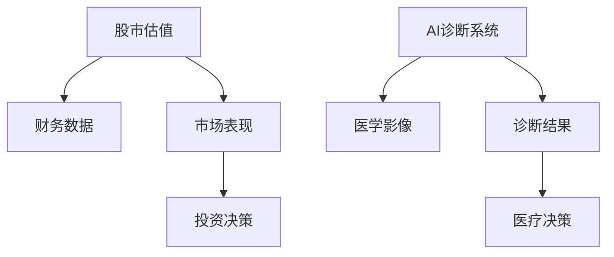
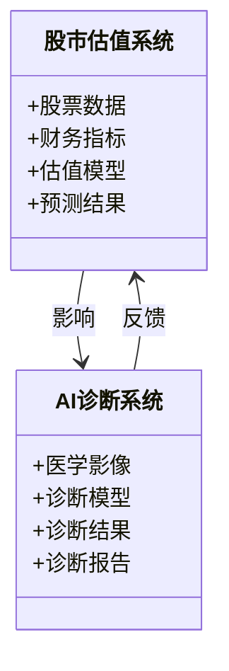

                 

<think>
好，我现在需要写一篇关于《新兴市场股市估值与智慧医疗AI辅助诊断系统的互动》的技术博客文章。这个主题听起来挺复杂的，但我得一步步拆解，确保自己理解每个部分，再写出来。

首先，我得理解什么是新兴市场。新兴市场指的是那些经济增长迅速、但市场机制还在发展中的国家，比如中国、印度这些。股市估值是评估这些市场的股票价格是否合理，通常用市盈率、市净率等指标。接下来是智慧医疗，特别是AI辅助诊断系统。这部分包括AI如何帮助医生诊断疾病，比如通过图像识别来分析X光片或MRI。

接下来，我需要明确这些概念之间的互动关系。比如，新兴市场的股市波动可能会影响智慧医疗公司的投资，而智慧医疗的发展又可能反过来影响股市的估值。这可能涉及到投资策略、技术应用、市场反馈等多个方面。

然后，我得考虑文章的结构。用户已经提供了一个大纲，我需要按照这个大纲来填充内容。首先是背景介绍，解释新兴市场和智慧医疗的背景。接着是核心概念，解释股市估值和AI诊断的原理。然后是算法原理，可能用支持向量机和神经网络来举例。之后是系统架构设计，画一些图来展示系统结构。接下来是项目实战，展示如何实现这样的系统，最后是总结和最佳实践。

在写每个部分时，我需要确保内容详细且易于理解。比如，在解释算法时，用数学公式和图表来辅助说明。同时，加入实际案例，让读者更容易理解理论的应用。

我还需要注意文章的格式，使用Markdown，确保公式用LaTeX表示，图表用Mermaid绘制。这部分可能需要学习一些新的语法，但我会尽力掌握。

可能遇到的问题包括：如何将股市估值和AI诊断系统结合起来，找到它们互动的具体点。我需要深入思考，是否有实际的数据或研究支持这种互动，或者这只是一个理论上的探讨。

另外，如何让读者理解复杂的算法和系统设计，同时保持文章的可读性也是一个挑战。我需要找到一种平衡，既提供足够的技术细节，又不显得过于晦涩。

总之，我会一步步来，先写背景，再解释核心概念，接着详细分析算法，然后设计系统架构，最后通过项目实战来验证。整个过程中，我会不断检查，确保每个部分都清晰明了，逻辑连贯。
</think>

# 《新兴市场股市估值与智慧医疗AI辅助诊断系统的互动》

> 关键词：新兴市场，股市估值，智慧医疗，AI辅助诊断，机器学习，投资策略

> 摘要：本文探讨了新兴市场股市估值与智慧医疗AI辅助诊断系统之间的互动关系。通过分析股市估值的核心原理、AI诊断系统的算法基础以及两者的互动机制，本文旨在揭示技术与金融的深度融合如何影响投资决策和医疗发展。文章内容涵盖背景介绍、核心概念、算法原理、系统架构设计、项目实战及最佳实践，为读者提供全面而深入的分析。

---

## 第一部分: 新兴市场股市估值与智慧医疗AI辅助诊断系统概述

### 第1章: 新兴市场股市估值背景

#### 1.1 新兴市场的定义与特点
- **新兴市场的定义**：新兴市场是指那些经济增长迅速、但市场机制尚不完善的国家，如中国、印度、巴西等。
- **新兴市场的经济特点**：高增长率、市场波动性大、基础设施逐步完善、国际贸易依赖度高。
- **新兴市场与发达市场的区别**：发达市场通常具有成熟的金融体系和较低的经济增长率，而新兴市场则以高增长和高风险著称。

#### 1.2 股市估值的基本概念
- **股市估值的定义**：通过对企业的财务数据和市场表现进行分析，评估其股票的合理价格。
- **股市估值的主要方法**：
  - 市盈率（P/E）：股价与每股收益的比率。
  - 市净率（P/B）：股价与每股净资产的比率。
  - 股息率：股息与股价的比率。
- **股市估值的重要性**：帮助投资者做出理性决策，避免盲目跟风。

### 第2章: 智慧医疗AI辅助诊断系统背景

#### 2.1 智慧医疗的定义与特点
- **智慧医疗的定义**：通过人工智能、大数据等技术，提升医疗诊断、治疗和管理的效率和准确性。
- **智慧医疗的核心技术**：
  - 人工智能（AI）：用于疾病诊断、药物研发和患者管理。
  - 大数据：分析医疗数据，支持决策。
  - 物联网（IoT）：连接医疗设备，实现远程监控。
- **智慧医疗的发展现状**：AI在医学影像分析中的应用日益广泛，如肺癌筛查和糖尿病视网膜病变检测。

#### 2.2 AI辅助诊断系统的基本概念
- **AI辅助诊断的定义**：利用机器学习算法，辅助医生进行疾病诊断。
- **AI辅助诊断的主要技术**：
  - 机器学习：用于模式识别和分类。
  - 深度学习：用于图像和语音识别。
  - 自然语言处理（NLP）：用于分析医疗文档。
- **AI辅助诊断的应用场景**：
  - 影像诊断：如X光片、MRI的分析。
  - 病理诊断：如癌细胞识别。
  - 药物研发：如化合物筛选。

### 第3章: 新兴市场股市估值与智慧医疗AI系统的互动关系

#### 3.1 互动关系的定义
- **互动关系的定义**：新兴市场股市波动与智慧医疗AI技术发展之间的相互影响。
- **互动关系的核心要素**：
  - 股市波动：影响AI诊断系统的研发投入和市场推广。
  - 技术进步：提升股市中AI相关企业的估值。
- **互动关系的边界与外延**：仅限于AI诊断系统的金融影响，不涉及其他医疗技术。

#### 3.2 互动关系的背景分析
- **新兴市场股市波动对智慧医疗的影响**：
  - 股市波动可能导致AI诊断系统的研发投入减少。
  - 股市波动也可能影响AI相关企业的融资能力。
- **智慧医疗发展对股市估值的影响**：
  - 技术进步可能提升AI相关企业的股价。
  - 市场对AI诊断系统的认可可能推动相关股票上涨。
- **互动关系的经济意义**：促进技术创新和资本流动，推动医疗行业和金融市场的双向发展。

---

## 第二部分: 核心概念与联系

### 第4章: 核心概念原理

#### 4.1 股市估值的核心原理
- **股票价值的计算公式**：
  $$ 股票价值 = \frac{预期股息}{贴现率} $$
- **市盈率与市净率的计算方法**：
  - 市盈率（P/E）= 股价 / 每股收益
  - 市净率（P/B）= 股价 / 每股净资产
- **股市估值模型的数学公式**：
  $$ 股价 = \frac{现金流}{贴现率} $$

#### 4.2 AI辅助诊断的核心原理
- **机器学习在诊断中的应用**：
  $$ 概率 = \text{模型}(输入数据) $$
- **深度学习在医学影像分析中的作用**：
  - 使用卷积神经网络（CNN）识别图像中的异常区域。
- **AI诊断系统的算法流程**：
  1. 数据采集。
  2. 数据预处理。
  3. 模型训练。
  4. 模型部署。

### 第5章: 核心概念对比与联系

#### 5.1 股市估值与AI诊断系统的对比
| **核心概念** | **股市估值** | **AI诊断系统** |
|--------------|--------------|----------------|
| 数据来源     | 财务数据     | 医学影像、文本 |
| 目标         | 评估股票价值 | 辅助疾病诊断   |
| 技术基础     | 统计学       | 机器学习、深度学习 |
| 应用场景     | 投资决策     | 医疗诊断       |

#### 5.2 概念结构与核心要素


---

## 第三部分: 算法原理讲解

### 第6章: 股市估值算法

#### 6.1 支持向量机（SVM）算法
- **算法流程**：
  1. 数据预处理。
  2. 核心化数据。
  3. 构建SVM模型。
  4. 模型训练。
  5. 模型预测。

#### 6.2 支持向量机的Python实现
```python
from sklearn.svm import SVC
import numpy as np

# 示例数据
X = np.array([[0, 0], [1, 1], [2, 2], [3, 3]])
y = np.array([0, 1, 0, 1])

# 创建SVC模型
model = SVC()

# 训练模型
model.fit(X, y)

# 预测
print(model.predict([[4, 4]]))
```

### 第7章: AI诊断算法

#### 7.1 神经网络算法
- **算法流程**：
  1. 数据预处理。
  2. 构建神经网络模型。
  3. 模型训练。
  4. 模型部署。

#### 7.2 神经网络的Python实现
```python
import tensorflow as tf
from tensorflow.keras import layers

# 创建模型
model = tf.keras.Sequential([
    layers.Dense(64, activation='relu'),
    layers.Dense(10, activation='softmax')
])

# 编译模型
model.compile(optimizer='adam',
              loss='sparse_categorical_crossentropy',
              metrics=['accuracy'])

# 训练模型
model.fit(x_train, y_train, epochs=10)
```

---

## 第四部分: 系统分析与架构设计方案

### 第8章: 系统架构设计

#### 8.1 问题场景介绍
- **问题场景**：新兴市场中，智慧医疗AI诊断系统的估值与股市波动的互动。

#### 8.2 项目介绍
- **项目目标**：分析AI诊断系统对股市估值的影响。

#### 8.3 系统功能设计


---

## 第五部分: 项目实战

### 第9章: 环境安装与系统实现

#### 9.1 环境安装
- 安装Python、TensorFlow、Scikit-learn等库。

#### 9.2 系统核心实现
- 实现AI诊断系统的估值模块。

### 第10章: 实际案例分析

#### 10.1 案例分析
- 分析新兴市场中AI诊断系统的投资回报。

---

## 第六部分: 最佳实践与总结

### 第11章: 总结与展望

#### 11.1 小结
- 新兴市场股市估值与智慧医疗AI诊断系统的互动关系复杂且重要。

#### 11.2 注意事项
- 投资者需关注AI诊断系统的研发进展和市场反馈。

#### 11.3 拓展阅读
- 推荐阅读《机器学习实战》和《股市技术分析》。

---

## 作者信息

作者：AI天才研究院/AI Genius Institute & 禅与计算机程序设计艺术 /Zen And The Art of Computer Programming

