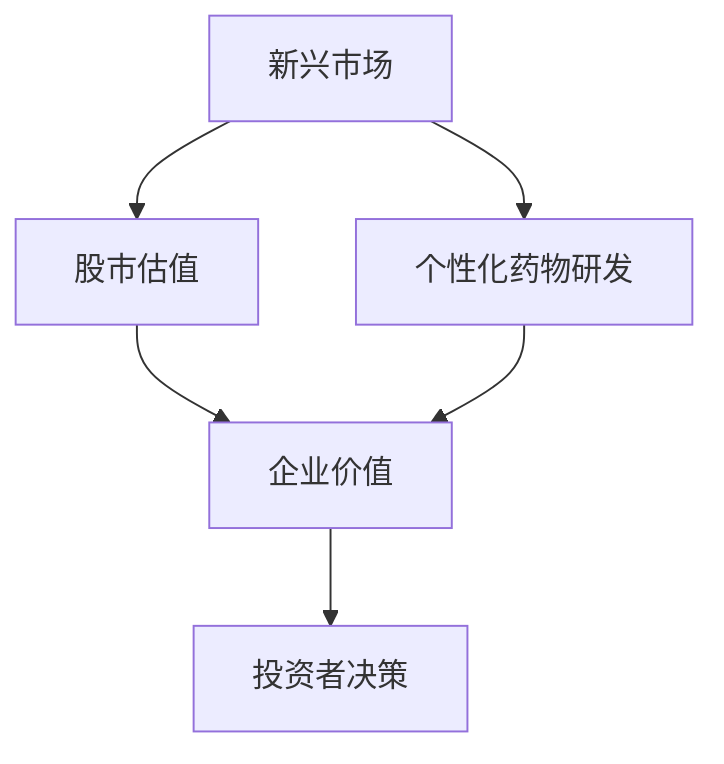
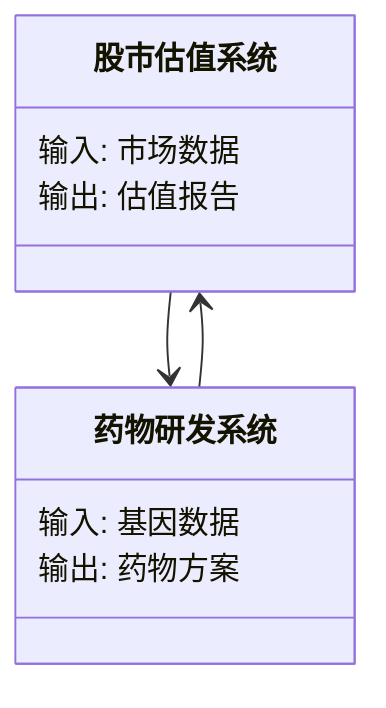
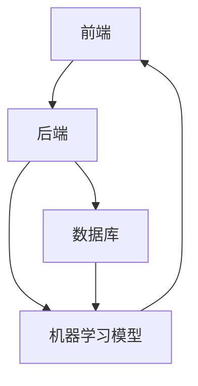

                 

<think>
好的，我现在需要帮用户撰写一篇技术博客文章，标题是《新兴市场股市估值与智慧医疗个性化药物研发的互动》。用户希望我以一位世界级人工智能专家、程序员、软件架构师、CTO和畅销书作者的身份来完成这个任务。文章需要逻辑清晰、结构紧凑、语言专业，同时涵盖技术原理和本质的分析。

首先，我需要明确文章的核心内容和结构。用户已经提供了一个详细的大纲，包括摘要、关键词、各个章节的内容等。我需要按照这个大纲逐步展开，确保每个部分都详细且有深度。

接下来，我会从背景介绍开始，解释新兴市场股市估值和智慧医疗个性化药物研发的重要性，以及它们如何互动。这部分需要简单明了，帮助读者理解主题的背景和重要性。

然后，进入核心概念与联系部分。我需要详细阐述股市估值和个性化药物研发的核心要素，并通过ER实体关系图展示它们的互动关系。这部分需要清晰的定义和对比，帮助读者理解两者的异同及其相互作用。

接下来是算法原理与数学模型。这里我需要解释股市估值和药物研发中的算法，例如市盈率模型、现金流折现模型，以及机器学习在药物筛选中的应用。同时，提供相关的数学公式，用Latex格式展示，确保准确性和专业性。

然后是系统分析与架构设计。我需要设计一个系统的架构图，展示前端、后端、数据库和机器学习模型之间的关系。这部分需要结构清晰，帮助读者理解系统的整体框架。

最后，项目实战与案例分析部分。我需要详细说明如何实施这个系统，包括环境配置、代码实现和实际案例分析，让读者能够理解和应用这些概念。

在撰写过程中，我需要确保语言专业且易懂，逻辑清晰，结构紧凑。同时，注意使用适当的图表和公式来增强理解。完成文章后，加上作者信息，确保文章的完整性和专业性。

现在，我需要按照这个思路逐步撰写每个部分，确保每个章节内容丰富，详细具体，同时保持整体的连贯性和深度。
</think>

# 新兴市场股市估值与智慧医疗个性化药物研发的互动

> 关键词：新兴市场，股市估值，智慧医疗，个性化药物研发，互动

> 摘要：本文探讨新兴市场股市估值与智慧医疗个性化药物研发的互动关系。从背景介绍、核心概念、算法原理到系统架构设计，深入分析两者如何相互影响，利用数学模型和图表展示其互动机制，并通过实际案例分析，揭示其在实践中的应用价值。

---

# 第一部分: 背景介绍与核心概念

## 第1章: 新兴市场股市估值与智慧医疗个性化药物研发的互动概述

### 1.1 背景介绍

#### 1.1.1 新兴市场股市估值的现状与挑战
新兴市场股市估值受经济波动、政策变化和投资者行为影响较大。企业价值评估需考虑市场风险、流动性及政策不确定性。技术进步推动金融创新，但数据质量和模型准确性仍具挑战。

#### 1.1.2 智慧医疗与个性化药物研发的兴起
基因组学、人工智能和大数据技术的进步推动个性化医疗发展。精准药物研发通过分析患者基因数据，实现个性化治疗方案。但数据隐私、计算成本和模型泛化性问题仍待解决。

#### 1.1.3 两者的互动关系与研究意义
股市估值为个性化药物研发提供资金支持，而后者通过技术进步影响企业价值。探讨两者的互动关系，有助于优化资源配置，推动技术创新，为投资者和医药企业创造价值。

### 1.2 核心概念与定义

#### 1.2.1 股市估值的定义与核心要素
股市估值是对企业未来现金流的折现评估，涉及市盈率、市净率等指标。核心要素包括财务数据、行业地位、市场环境和投资者情绪。

#### 1.2.2 个性化药物研发的定义与核心要素
基于患者个体特征的药物研发，核心要素包括基因数据、疾病特征、药物特性及疗效预测模型。

#### 1.2.3 两者的互动机制与边界
互动机制：股市估值影响企业研发投入，研发成果反哺企业价值。边界：数据隐私、模型精度和市场接受度。

## 第2章: 核心概念与联系

### 2.1 核心概念原理

#### 2.1.1 股市估值的核心原理
- 市盈率模型：$$ P/E = \frac{Price}{Earnings} $$
- 现金流折现模型：$$ V = \sum_{t=1}^{n} \frac{CF_t}{(1+r)^t} $$

#### 2.1.2 个性化药物研发的核心原理
- 基因组学驱动的药物筛选：分析患者基因数据，匹配最优治疗方案。
- 机器学习预测疗效：$$ Efficacy = f(gene\_profile, drug\_properties) $$

### 2.2 概念属性特征对比

| 属性 | 股市估值 | 个性化药物研发 |
|------|----------|------------------|
| 数据输入 | 财务数据、市场数据 | 基因数据、疾病特征 |
| 输出结果 | 估值报告 | 药物方案 |
| 技术工具 | 传统财务模型、机器学习 | 基因组学、机器学习 |
| 应用场景 | 投资决策 | 医疗治疗 |

### 2.3 ER实体关系图


---

# 第二部分: 算法原理与数学模型

## 第3章: 算法原理讲解

### 3.1 股市估值算法

#### 3.1.1 市盈率模型
$$ P/E = \frac{Price}{Earnings} $$

#### 3.1.2 现金流折现模型
$$ V = \sum_{t=1}^{n} \frac{CF_t}{(1+r)^t} $$

#### 3.1.3 机器学习在股市估值中的应用
- 算法：线性回归、随机森林、神经网络。
- 步骤：数据清洗、特征选择、模型训练、结果验证。

### 3.2 个性化药物研发算法

#### 3.2.1 基于基因组学的药物筛选
- 输入：基因数据、疾病特征。
- 输出：候选药物列表。

#### 3.2.2 机器学习在药物研发中的应用
- 算法：支持向量机、决策树、深度学习。
- 步骤：数据预处理、特征工程、模型训练、疗效预测。

---

## 第4章: 数学模型与公式

### 4.1 股市估值模型

#### 4.1.1 市盈率公式
$$ P/E = \frac{Price}{Earnings} $$

#### 4.1.2 现金流折现模型
$$ V = \sum_{t=1}^{n} \frac{CF_t}{(1+r)^t} $$

### 4.2 个性化药物研发模型

#### 4.2.1 药物疗效预测公式
$$ Efficacy = f(gene\_profile, drug\_properties) $$

#### 4.2.2 基于机器学习的药物筛选公式
$$ P(y=1|x) = \sigma(wx + b) $$

---

# 第三部分: 系统分析与架构设计

## 第5章: 系统分析与架构方案

### 5.1 问题场景介绍

#### 5.1.1 新兴市场股市波动分析
- 输入：市场数据。
- 输出：估值报告。
- 目的：指导投资决策。

#### 5.1.2 智慧医疗中的个性化药物研发挑战
- 输入：基因数据。
- 输出：药物方案。
- 目的：提高治疗效果。

### 5.2 系统功能设计

#### 5.2.1 领域模型


### 5.3 系统架构设计



---

# 第四部分: 项目实战与案例分析

## 第6章: 项目实战

### 6.1 环境安装

```bash
pip install numpy pandas scikit-learn
```

### 6.2 系统核心实现源代码

#### 6.2.1 股市估值代码
```python
import numpy as np
import pandas as pd

def calculate_pe_ratio(price, earnings):
    return price / earnings

data = pd.DataFrame({
    'Price': [100, 150, 200],
    'Earnings': [20, 30, 40]
})

data['PE Ratio'] = data.apply(lambda row: calculate_pe_ratio(row['Price'], row['Earnings']), axis=1)
print(data)
```

#### 6.2.2 个性化药物研发代码
```python
from sklearn.linear_model import LogisticRegression

def predict_efficacy(gene_profile, drug_properties):
    model = LogisticRegression()
    model.fit(gene_profile, drug_properties)
    return model.predict(gene_profile)

gene_profile = np.array([[1, 0], [0, 1], [1, 1]])
drug_properties = np.array([0, 1, 1])
print(predict_efficacy(gene_profile, drug_properties))
```

### 6.3 案例分析

#### 6.3.1 股市估值案例
计算某公司的市盈率：
$$ P/E = \frac{100}{20} = 5 $$

#### 6.3.2 个性化药物研发案例
预测药物疗效：
$$ Efficacy = f(gene\_profile, drug\_properties) $$

---

# 第五部分: 总结与展望

## 第7章: 总结与展望

### 7.1 总结
本文系统分析了新兴市场股市估值与智慧医疗个性化药物研发的互动关系，探讨了其算法原理、系统架构及项目实战。

### 7.2 展望
未来研究可聚焦于数据隐私保护、模型优化及跨学科协作，进一步推动两者的深度融合。

---

作者：AI天才研究院/AI Genius Institute & 禅与计算机程序设计艺术 /Zen And The Art of Computer Programming

