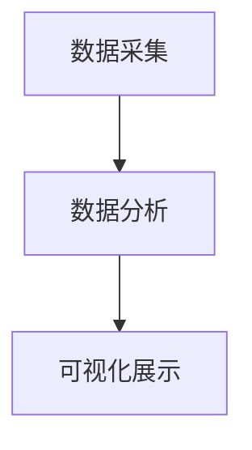

                 


# 新兴市场股市估值与智慧医疗发展的互动

> 关键词：新兴市场、股市估值、智慧医疗、互动关系、投资分析、技术应用、数据分析

> 摘要：本文探讨新兴市场股市估值与智慧医疗发展的互动关系，通过分析股市估值的核心方法、智慧医疗的发展现状，以及两者之间的相互作用机制，结合数学模型和实证分析，为投资者和研究者提供理论支持和实践指导。

---

## 第1章: 背景介绍

### 1.1 问题背景与问题描述

#### 1.1.1 新兴市场的定义与特点
新兴市场是指那些经济增长迅速、但尚未达到发达经济体水平的国家。这些市场通常具有较大的发展潜力，但也伴随着较高的风险。新兴市场的特点包括：
- 经济波动较大
- 市场流动性相对不足
- 政策环境复杂多变

#### 1.1.2 智慧医疗的概念与内涵
智慧医疗（Smart Healthcare）是通过互联网、大数据、人工智能等技术手段，优化医疗资源分配、提升医疗服务质量和效率的新型医疗模式。其核心在于利用技术创新实现医疗资源的高效利用和患者体验的提升。

#### 1.1.3 问题解决：新兴市场与智慧医疗的互动关系
新兴市场与智慧医疗的互动关系体现在股市估值与智慧医疗发展的相互作用上。股市估值为智慧医疗的发展提供资金支持，而智慧医疗的发展则反过来影响股市的估值水平和市场表现。

### 1.2 核心概念与联系

#### 1.2.1 核心概念原理
- **新兴市场**：经济增长快，但市场波动大。
- **股市估值**：通过市盈率、市净率等指标衡量企业价值。
- **智慧医疗**：利用技术提升医疗服务效率和质量。

#### 1.2.2 概念属性特征对比表格
| 特性        | 新兴市场                | 智慧医疗              |
|-------------|------------------------|-----------------------|
| 核心驱动     | 经济增长与政策支持      | 技术创新与数据驱动    |
| 风险因素     | 经济波动、政策风险      | 技术不确定性、数据隐私 |
| 发展潜力     | 高                     | 高                     |

#### 1.2.3 ER实体关系图架构
```mermaid
erd
  机构: 智慧医疗公司
  机构: 股市
  机构: 新兴市场
  股市 --> 智慧医疗公司: 投资与融资
  智慧医疗公司 --> 新兴市场: 技术应用与市场拓展
```

---

## 第2章: 股市估值的核心方法

### 2.1 股市估值的基本原理

#### 2.1.1 市盈率（P/E）模型
市盈率是衡量企业价值的重要指标，公式为：
$$ P/E = \frac{\text{股票价格}}{\text{每股收益}} $$

#### 2.1.2 市净率（P/B）模型
市净率是衡量企业资产价值的指标，公式为：
$$ P/B = \frac{\text{股票价格}}{\text{每股净资产}} $$

#### 2.1.3 现金流折现模型（DCF）
DCF模型通过将未来现金流折现到当前价值来评估企业价值：
$$ V = \sum_{t=1}^{n} \frac{CF_t}{(1 + r)^t} + \frac{TV}{(1 + r)^n} $$

### 2.2 新兴市场的特殊性

#### 2.2.1 经济波动与股市估值
新兴市场的经济波动较大，直接影响股市估值的稳定性。

#### 2.2.2 政策环境的影响
政策变化对新兴市场股市估值有显著影响，尤其是智慧医疗领域的政策支持或限制。

#### 2.2.3 市场流动性分析
新兴市场流动性不足可能导致股市估值的波动性增加。

---

## 第3章: 智慧医疗的发展现状

### 3.1 智慧医疗的核心技术

#### 3.1.1 人工智能在医疗中的应用
人工智能技术在疾病诊断、药物研发等领域发挥重要作用。

#### 3.1.2 大数据与医疗信息管理
通过大数据分析优化医疗资源配置和患者管理。

#### 3.1.3 医疗物联网（IoMT）的发展
医疗物联网通过智能设备实现医疗资源的实时监控和管理。

### 3.2 智慧医疗的商业模式

#### 3.2.1 服务订阅模式
企业通过订阅模式提供持续的医疗服务。

#### 3.2.2 数据变现模式
通过医疗数据的收集和分析实现盈利。

#### 3.2.3 平台化运营模式
构建医疗服务平台，整合多方资源。

---

## 第4章: 股市估值与智慧医疗发展的互动关系

### 4.1 股市估值对智慧医疗发展的促进作用

#### 4.1.1 资本支持与技术创新
股市估值的提升为企业提供更多的融资机会，促进技术创新。

#### 4.1.2 市场预期与企业战略
投资者的市场预期影响企业的战略规划和投资决策。

#### 4.1.3 投资者行为与行业趋势
投资者的行为推动行业趋势的变化，影响智慧医疗的发展方向。

### 4.2 智慧医疗发展对股市估值的影响

#### 4.2.1 企业盈利与股价关系
智慧医疗企业的盈利能力直接影响其股价表现。

#### 4.2.2 行业风险与市场波动
行业风险的增加会导致股市估值的下降。

#### 4.2.3 技术壁垒与估值溢价
技术壁垒的高低影响企业的估值溢价。

---

## 第5章: 数学模型与实证分析

### 5.1 股市估值与智慧医疗发展的数学模型

#### 5.1.1 回归分析模型
回归模型用于分析股市估值与智慧医疗发展的相关性：
$$ y = \beta_0 + \beta_1x_1 + \beta_2x_2 + \epsilon $$

#### 5.1.2 时间序列分析模型
时间序列模型用于分析股市估值的动态变化：
$$ ARIMA(p, d, q) $$

### 5.2 实证分析与案例研究

#### 5.2.1 数据来源与处理
选取新兴市场中智慧医疗企业的相关数据，进行清洗和预处理。

#### 5.2.2 模型验证与结果解读
通过回归分析验证股市估值与智慧医疗发展的相关性。

#### 5.2.3 案例分析：印度智慧医疗企业的估值变化
以印度为例，分析智慧医疗企业如何通过技术创新提升股市估值。

---

## 第6章: 系统分析与架构设计方案

### 6.1 系统分析

#### 6.1.1 问题场景介绍
新兴市场中智慧医疗企业的股市估值受到哪些因素的影响？

#### 6.1.2 项目介绍
构建一个基于智慧医疗的股市估值分析系统。

### 6.2 系统架构设计

#### 6.2.1 系统功能设计
- 数据采集模块：收集智慧医疗企业的相关数据。
- 数据分析模块：应用回归模型和时间序列模型进行分析。
- 可视化模块：展示分析结果。

#### 6.2.2 系统架构图


---

## 第7章: 项目实战

### 7.1 环境安装

#### 7.1.1 数据分析工具
- Python编程语言
- Pandas、NumPy、Scikit-learn等库

#### 7.1.2 可视化工具
- Matplotlib
- Seaborn

### 7.2 核心实现源代码

#### 7.2.1 回归分析代码
```python
import pandas as pd
import numpy as np
from sklearn.linear_model import LinearRegression
from sklearn.metrics import mean_squared_error

# 数据加载
data = pd.read_csv('data.csv')

# 特征与目标变量分离
X = data[['研发投入', '政策支持']]
y = data['股价']

# 模型训练
model = LinearRegression()
model.fit(X, y)

# 预测与评估
y_pred = model.predict(X)
mse = mean_squared_error(y, y_pred)
print(f'MSE: {mse}')
```

---

## 第8章: 总结与建议

### 8.1 总结

#### 8.1.1 互动关系的核心结论
股市估值与智慧医疗发展之间存在显著的互动关系，技术创新和政策支持是关键驱动因素。

#### 8.1.2 案例分析的启示
新兴市场中的智慧医疗企业应注重技术创新和政策适应性，以提升股市估值。

### 8.2 投资建议

#### 8.2.1 投资策略
- 关注政策支持的智慧医疗企业。
- 选择具有技术壁垒的企业进行投资。

#### 8.2.2 风险提示
- 经济波动可能导致股市估值下降。
- 技术不确定性带来投资风险。

---

## 作者信息

作者：AI天才研究院（AI Genius Institute） & 禅与计算机程序设计艺术（Zen And The Art of Computer Programming）

---

通过以上结构和内容，本文详细分析了新兴市场股市估值与智慧医疗发展的互动关系，结合数学模型和实证分析，为投资者和研究者提供了理论支持和实践指导。

