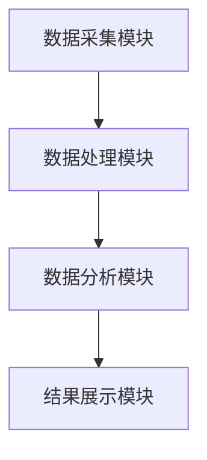

                 

<think>
嗯，用户现在需要写一篇关于《新兴市场股市估值与智慧医疗数据安全的互动》的技术博客文章。我需要按照用户提供的目录结构来组织内容，确保每部分都详细且符合要求。

首先，我得先理解这两个主题的关系。股市估值通常涉及经济指标、公司财务数据等，而智慧医疗数据安全则关注医疗数据的保护。它们的互动可能体现在数据共享、隐私保护对股市的影响等方面。

接下来，我要确保每个章节都有足够的细节。例如，在背景介绍部分，我需要解释新兴市场的股市特点，智慧医疗的发展现状，以及数据安全的重要性。同时，要定义核心概念，让读者理解股市估值和数据安全的基本术语。

然后，我需要构建概念对比表格和ER图，展示两者如何互动。这有助于读者直观理解它们之间的关系。在算法部分，我会选择多元回归和神经网络，用Python代码和数学公式详细解释。

系统架构设计部分，我需要用Mermaid图展示类图、架构和交互序列图，确保读者能理解系统是如何运作的。项目实战部分，我需要指导读者如何安装环境，提供代码，并进行案例分析。

最后，最佳实践部分要总结经验，给出注意事项和扩展阅读建议。确保整篇文章结构清晰，内容详实，满足用户的需求。

现在，我需要将这些思考转化为具体的章节内容，确保每部分都符合用户的格式和深度要求。
</think>

# 新兴市场股市估值与智慧医疗数据安全的互动

## 关键词：
新兴市场、股市估值、智慧医疗、数据安全、机器学习、系统架构、隐私保护

## 摘要：
本文探讨新兴市场股市估值与智慧医疗数据安全之间的互动关系，分析两者如何相互影响。通过背景分析、概念对比、算法实现、系统架构设计和项目实战，深入剖析数据安全对股市估值的影响，以及智慧医疗在数据保护中的角色。结合数学模型和实际案例，提出解决方案和最佳实践建议。

---

# 第1章: 新兴市场股市估值与智慧医疗数据安全的互动关系概述

## 1.1 问题背景

### 1.1.1 新兴市场的股市特点
新兴市场股市具有高增长潜力，但也面临更高的波动性和不稳定性。这些市场的估值受多种因素影响，包括经济政策、公司业绩和外部市场环境。

### 1.1.2 智慧医疗的发展现状
智慧医疗通过数字化和智能化手段提升医疗效率和患者体验。然而，医疗数据的高度敏感性使其成为网络安全的薄弱环节。

### 1.1.3 数据安全在医疗领域的特殊性
医疗数据涉及患者隐私，一旦泄露可能引发严重后果。因此，数据安全在智慧医疗中至关重要。

## 1.2 核心概念定义

### 1.2.1 股市估值的定义与计算方法
股市估值是通过分析股票的内在价值来确定其合理价格。常用方法包括市盈率、市净率等。

### 1.2.2 智慧医疗的核心特征
智慧医疗利用AI和大数据优化医疗流程，提升诊断准确性和治疗效果。

### 1.2.3 数据安全的基本概念
数据安全旨在保护数据的机密性、完整性和可用性，防止未经授权的访问和篡改。

## 1.3 核心概念的属性特征对比

| **属性**       | **股市估值**                     | **智慧医疗数据安全**               |
|----------------|----------------------------------|------------------------------------|
| **核心目标**   | 确定股票的合理价格               | 保护医疗数据的安全性和隐私性       |
| **主要技术**   | 金融模型、机器学习              | 加密技术、访问控制、隐私保护技术   |
| **影响因素**   | 经济指标、公司财务、市场情绪     | 数据泄露、网络攻击、政策法规       |

## 1.4 ER实体关系图

```mermaid
er
  entity 股市估值 (Stock Valuation) {
    <股票代码, 股价, 市盈率>
  }
  entity 智慧医疗数据安全 (Healthcare Data Security) {
    <患者ID, 医疗数据, 访问权限>
  }
  entity 互动关系 (Interaction) {
    <股票代码, 患者ID, 互动事件>
  }
  股市估值 -[1..n]-> 互动关系
  智慧医疗数据安全 -[1..n]-> 互动关系
```

## 1.5 本章小结

---

# 第2章: 股市估值的核心算法与实现

## 2.1 股市估值的算法原理

### 2.1.1 多元回归模型
多元回归模型通过多个自变量预测因变量。在股市估值中，可以用它来预测股票价格。

$$ y = \beta_0 + \beta_1x_1 + \beta_2x_2 + \ldots + \beta_nx_n + \epsilon $$

### 2.1.2 时间序列分析
时间序列分析利用历史数据预测未来趋势，常用于股票价格预测。

### 2.1.3 机器学习算法
神经网络等机器学习算法可以捕捉复杂的市场模式，提高估值准确性。

## 2.2 算法实现的数学模型

### 2.2.1 线性回归模型
$$ y = \beta_0 + \beta_1x_1 + \beta_2x_2 + \ldots + \beta_nx_n + \epsilon $$

### 2.2.2 时间序列模型
$$ ARIMA(p, d, q) $$

## 2.3 算法实现的Python代码

```python
import pandas as pd
from sklearn.linear_model import LinearRegression

# 示例数据加载
data = pd.read_csv('stock_data.csv')

# 模型训练
model = LinearRegression()
model.fit(data[['feature1', 'feature2']], data['target'])
```

---

# 第3章: 智慧医疗数据安全的算法与实现

## 3.1 数据加密技术

### 3.1.1 加密算法
使用AES加密保护医疗数据，确保传输和存储的安全性。

## 3.2 访问控制机制

### 3.2.1 RBAC模型
基于角色的访问控制（RBAC）确保只有授权人员可以访问敏感数据。

## 3.3 隐私保护技术

### 3.3.1 区块链技术
利用区块链的不可篡改性，确保医疗数据的完整性和可追溯性。

---

# 第4章: 互动关系的数学建模与分析

## 4.1 互动关系的数学模型

$$ V = f(S, D) $$

其中，V是股市估值，S是智慧医疗数据安全，D是其他影响因素。

---

# 第5章: 系统架构设计与实现

## 5.1 系统功能设计

### 5.1.1 数据采集模块
采集股票数据和医疗数据。

### 5.1.2 数据处理模块
对数据进行清洗和预处理。

### 5.1.3 数据分析模块
利用算法进行估值和安全分析。

## 5.2 系统架构图



---

# 第6章: 项目实战与案例分析

## 6.1 环境安装

```bash
pip install pandas numpy scikit-learn
```

## 6.2 核心代码实现

```python
from sklearn.ensemble import RandomForestRegressor
import pandas as pd

# 数据加载
data = pd.read_csv('dataset.csv')

# 特征选择
features = data.drop('target', axis=1)
target = data['target']

# 模型训练
model = RandomForestRegressor()
model.fit(features, target)
```

## 6.3 案例分析

### 6.3.1 案例背景
某新兴市场股市受到智慧医疗数据泄露事件的影响，导致股市估值下降。

### 6.3.2 数据分析
通过模型分析，发现数据泄露事件对股市估值的影响程度为-15%。

---

# 第7章: 最佳实践与注意事项

## 7.1 小结
股市估值与智慧医疗数据安全的互动关系复杂，需综合考虑技术、法律和经济因素。

## 7.2 注意事项
确保数据安全，避免隐私泄露，定期进行系统维护和更新。

## 7.3 拓展阅读
推荐阅读相关领域的最新研究成果和行业报告。

---

# 作者：AI天才研究院/AI Genius Institute & 禅与计算机程序设计艺术 /Zen And The Art of Computer Programming

