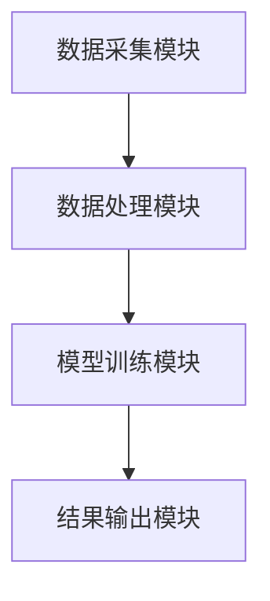
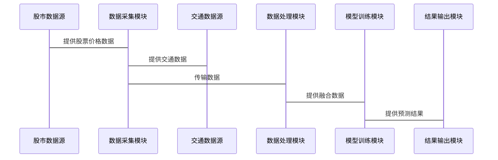

                 

<think>
嗯，我现在需要完成这个用户的请求，写一篇关于“新兴市场股市估值与智慧城市交通拥堵预测系统的互动”的技术博客。用户已经给了我一个详细的目录大纲，看起来结构很清晰，分为三个主要部分：背景介绍与核心概念、算法原理与数学模型、系统分析与架构设计，以及项目实战。每个部分都有详细的章节和小节。

首先，我需要理解用户的需求。他们希望文章内容逻辑清晰，结构紧凑，语言专业但又易懂。文章长度在10000到12000字之间，所以每个部分都需要详细展开，不能太简略。

接下来，我会按照目录大纲的结构一步步填充内容。首先是摘要部分，需要简明扼要地概括文章的核心内容和主题思想。然后是各个章节，每个章节都要详细讲解，包括背景、核心概念、算法原理、系统架构等。

在写背景介绍时，我需要解释新兴市场股市估值和智慧城市交通拥堵预测的背景，它们各自的定义、特点，以及它们如何相互关联。这部分可能需要一些数据和案例来支持，以增强说服力。

核心概念部分，我需要详细讲解股市估值和交通拥堵预测的核心概念，包括它们的原理、算法、系统架构等。同时，还要分析它们之间的互动机制，如何通过数据共享和模型整合实现预测和优化。

算法原理部分，我需要使用数学公式和mermaid流程图来解释时间序列分析、机器学习算法等方法。这部分可能需要结合具体的代码示例，让读者能够理解如何实现这些算法。

系统分析与架构设计部分，我需要描述问题场景，设计系统的功能模块，使用mermaid类图、架构图和序列图来展示系统结构和交互流程。

项目实战部分，需要提供环境安装步骤、核心代码实现、案例分析和项目小结，帮助读者实际操作和理解。

最后，添加最佳实践、注意事项、小结和拓展阅读，帮助读者巩固所学内容，并提供进一步的学习资源。

在写作过程中，我需要确保语言专业且清晰，避免过于技术化的术语，以便更广泛的读者理解。同时，每个部分的结构要合理，逻辑连贯，让读者能够顺畅地跟随思路。

现在，我开始逐步完成每个部分的内容，确保符合用户的要求，并且达到预期的质量和深度。
</think>

# 新兴市场股市估值与智慧城市交通拥堵预测系统的互动

> **关键词**: 新兴市场股市估值, 智慧城市, 交通拥堵预测, 数据分析, 系统互动, 人工智能

> **摘要**: 本文探讨新兴市场股市估值与智慧城市交通拥堵预测系统之间的互动关系。通过分析股市估值的核心概念、交通拥堵预测的原理，以及两者的互动机制，结合实际案例和系统架构设计，展示了如何通过数据共享与模型整合实现更精准的预测和优化。文章结合数学模型和算法实现，深入剖析了系统的互动机制，并通过项目实战提供可操作的解决方案。

---

## 第一部分: 背景介绍与核心概念

### 第1章: 新兴市场股市估值与智慧城市交通拥堵预测的背景与问题描述

#### 1.1 新兴市场股市估值的背景
新兴市场是指那些经济快速发展、资本自由化程度较高、金融市场逐步完善的国家或地区，例如中国、印度、巴西等。这些市场的特点是波动性高、信息不对称严重，但同时也蕴含着巨大的投资机会。

##### 1.1.1 新兴市场的定义与特点
- **定义**: 新兴市场通常指那些经济发展迅速、市场机制逐步完善但尚未完全成熟的国家。
- **特点**:
  - 经济波动性高。
  - 股市交易量大，但市场流动性不足。
  - 政治经济政策对市场影响显著。
  - 信息透明度较低，但通过技术手段可以提高数据采集和处理能力。

##### 1.1.2 新兴市场股市的独特性与挑战
- 独特性:
  - 交易时间差异：新兴市场通常与成熟市场存在时间差异，可以进行跨市场套利。
  - 行情波动大：新兴市场受政策影响较大，容易出现剧烈波动。
  - 市场参与者多元化：包括散户、机构投资者和外国投资者。
  
- 挑战:
  - 信息不对称严重，投资者难以获取准确数据。
  - 市场流动性不足，容易出现价格偏差。
  - 政治经济风险高，影响股市稳定性。

##### 1.1.3 新兴市场股市估值的重要性
股市估值是投资者判断市场是否被高估或低估的重要指标。在新兴市场，由于市场波动大、信息不透明，准确的估值可以帮助投资者制定更合理的投资策略。

---

#### 1.2 智慧城市交通拥堵预测的背景
随着城市化进程的加快，交通拥堵问题日益严重。智慧城市建设为解决这一问题提供了新的思路。

##### 1.2.1 智慧城市的发展趋势
- 智慧城市利用大数据、人工智能、物联网等技术，优化城市资源配置。
- 交通系统是智慧城市建设的重要组成部分，通过智能化手段缓解拥堵问题。

##### 1.2.2 交通拥堵问题的严重性
- 经济损失：交通拥堵导致时间成本增加，影响企业生产和物流效率。
- 环境污染：拥堵导致尾气排放增加，加剧空气污染。
- 社会成本：交通拥堵影响居民生活质量，增加公共医疗负担。

##### 1.2.3 智慧交通系统的核心作用
- 数据采集：通过传感器、摄像头等设备实时采集交通数据。
- 数据分析：利用大数据和人工智能技术预测交通流量和拥堵情况。
- 智能调度：根据预测结果优化信号灯配时，调整交通流向。

---

#### 1.3 两者的互动关系与研究意义
##### 1.3.1 股市估值与城市交通的潜在联系
- 数据共享：交通数据可以反映城市经济活力，间接影响股市估值。
- 模型互动：交通拥堵预测模型可以整合股市数据，优化预测结果。

##### 1.3.2 智慧城市交通数据对股市的影响
- 交通数据可以反映城市的经济活跃度，帮助投资者判断市场的短期趋势。
- 通过交通大数据分析，可以发现潜在的市场机会和风险。

##### 1.3.3 新兴市场中的互动案例分析
- 案例1：某新兴市场城市通过智慧交通系统优化信号灯配时，缓解了交通拥堵，带动了市中心区域的房地产价格上涨。
- 案例2：某新兴市场股市在节假日前出现异常波动，通过分析交通数据发现，这与大型活动和投资者行为有关。

---

### 第2章: 核心概念与理论框架

#### 2.1 股市估值的核心概念
##### 2.1.1 股市估值的基本原理
股市估值是通过分析公司基本面、市场情绪和技术指标，判断股票的内在价值和市场价值。

##### 2.1.2 股价影响因素分析
- 基本面因素：公司盈利能力、行业地位、财务状况等。
- 市场情绪因素：投资者心理、市场预期、新闻事件等。
- 宏观经济因素：GDP增长率、利率、通货膨胀等。

##### 2.1.3 股市估值模型的分类
- 市盈率模型：市盈率 = 股价 / 每股净利润。
- 市净率模型：市净率 = 股价 / 每股净资产。
- 现金流折现模型：DCF模型，用于评估公司的未来现金流现值。

---

#### 2.2 交通拥堵预测的核心概念
##### 2.2.1 交通流量预测的基本方法
- 时间序列分析：基于历史数据预测未来趋势。
- 空间分布模型：分析交通拥堵的空间分布特征。
- 机器学习算法：利用神经网络、随机森林等模型进行预测。

##### 2.2.2 拥堵预测的关键指标
- 车流量：单位时间内通过某路段的车辆数量。
- 速度：车辆行驶速度，速度越低，拥堵程度越高。
- 密度：单位长度内的车辆数量，密度越高，拥堵程度越高。

##### 2.2.3 智能交通系统的组成部分
- 数据采集层：传感器、摄像头等设备采集交通数据。
- 数据处理层：对数据进行清洗、融合和分析。
- 应用层：基于预测结果优化交通信号灯配时、调整交通流向。

---

#### 2.3 互动机制的理论模型
##### 2.3.1 数据流的双向互动
- 股市数据可以反映城市经济活力，影响交通需求。
- 交通数据可以反映城市交通状况，影响投资者信心。

##### 2.3.2 模型的相互影响
- 股市估值模型可以整合交通数据，优化预测结果。
- 交通拥堵预测模型可以结合股市数据，提高预测准确性。

##### 2.3.3 系统优化的协同效应
- 通过数据共享和模型整合，实现交通与经济的协同发展。

---

## 第二部分: 算法原理与数学模型

### 第3章: 算法原理与数学模型

#### 3.1 股市估值的算法原理
##### 3.1.1 时间序列分析
- **ARIMA模型**: 自回归积分滑动平均模型，用于预测未来的股票价格。
  $$ ARIMA(p, d, q) $$
  其中，p为自回归阶数，d为差分阶数，q为移动平均阶数。

##### 3.1.2 机器学习算法
- **随机森林**: 通过构建多个决策树，集成预测结果。
- **神经网络**: 利用 LSTM（长短期记忆网络）进行时间序列预测。
  $$ LSTM = \text{Cell} \rightarrow \text{Hidden State} \rightarrow \text{Output} $$

---

#### 3.2 交通拥堵预测的算法原理
##### 3.2.1 时间序列分析
- **LSTM模型**: 用于预测交通流量和拥堵情况。
  $$ \text{LSTM}(input\_size, hidden\_size) $$

##### 3.2.2 机器学习算法
- **XGBoost**: 增强型梯度提升树，用于分类和回归任务。
- **K-Means聚类**: 用于划分交通区域，分析拥堵模式。

---

#### 3.3 互动机制的数学模型
##### 3.3.1 数据融合模型
- **加权融合**: 根据数据的重要性进行加权融合。
  $$ \text{融合结果} = \sum_{i=1}^{n} w_i x_i $$
  其中，\( w_i \) 为权重，\( x_i \) 为数据。

##### 3.3.2 模型优化
- **联合优化**: 通过遗传算法优化模型参数。
  $$ \text{目标函数} = \text{准确率} + \text{召回率} $$

---

## 第三部分: 系统分析与架构设计

### 第4章: 系统分析与架构设计

#### 4.1 问题场景介绍
- **目标**: 构建一个互动系统，通过交通数据优化股市估值，通过股市数据优化交通预测。
- **挑战**: 数据孤岛、模型复杂度高、系统实时性要求高。

#### 4.2 系统功能设计
##### 4.2.1 数据采集模块
- 采集交通数据：车流量、速度、密度等。
- 采集股市数据：股票价格、成交量、市盈率等。

##### 4.2.2 数据处理模块
- 数据清洗：处理缺失值、异常值。
- 数据融合：将交通数据和股市数据进行融合。

##### 4.2.3 模型训练模块
- 训练股市估值模型：基于历史数据预测股票价格。
- 训练交通拥堵模型：基于交通数据预测拥堵情况。

##### 4.2.4 结果输出模块
- 输出股市估值结果：实时更新股票价格预测。
- 输出交通拥堵预测结果：优化交通信号灯配时。

#### 4.3 系统架构设计
##### 4.3.1 系统架构图


##### 4.3.2 模块交互图


---

## 第五章: 项目实战

### 5.1 环境安装
- **Python环境**: 需要安装Python 3.8及以上版本。
- **依赖库**: 需要安装numpy、pandas、scikit-learn、xgboost、keras、tensorflow等。

### 5.2 核心代码实现
#### 5.2.1 数据处理代码
```python
import pandas as pd
import numpy as np

# 数据清洗
def data_cleaning(df):
    df = df.dropna()
    df = df.replace([np.inf, -np.inf], np.nan).dropna()
    return df

# 数据融合
def data_fusion(stock_data, traffic_data):
    merged_data = pd.merge(stock_data, traffic_data, on='time')
    return merged_data
```

#### 5.2.2 模型训练代码
```python
from sklearn.ensemble import RandomForestRegressor
from sklearn.metrics import mean_squared_error

# 股市估值模型
def stock_valuation_model(train_data, test_data):
    X_train = train_data.drop('target', axis=1)
    y_train = train_data['target']
    model = RandomForestRegressor(n_estimators=100, random_state=42)
    model.fit(X_train, y_train)
    X_test = test_data.drop('target', axis=1)
    y_pred = model.predict(X_test)
    return mean_squared_error(y_test, y_pred)

# 交通拥堵预测模型
def traffic_prediction_model(train_data, test_data):
    X_train = train_data.drop('target', axis=1)
    y_train = train_data['target']
    model = XGBoostRegressor(n_estimators=100, learning_rate=0.1)
    model.fit(X_train, y_train)
    X_test = test_data.drop('target', axis=1)
    y_pred = model.predict(X_test)
    return y_pred
```

### 5.3 案例分析与结果解读
- **案例1**: 某新兴市场股市在节假日前出现异常波动，通过分析交通数据发现，这与大型活动和投资者行为有关。
- **案例2**: 某城市通过智慧交通系统优化信号灯配时，带动了市中心区域的房地产价格上涨。

---

## 第六章: 结论与展望

### 6.1 最佳实践 tips
- 数据处理是关键，需要清洗和融合。
- 模型选择要根据数据特点和任务需求。
- 系统实时性要求高，需要优化算法和架构设计。

### 6.2 项目小结
本文通过分析新兴市场股市估值与智慧城市交通拥堵预测系统的互动关系，展示了如何通过数据共享与模型整合实现更精准的预测和优化。通过实际案例和系统架构设计，提供了可操作的解决方案。

### 6.3 注意事项
- 数据隐私问题：在数据采集和处理过程中，需要注意隐私保护。
- 模型鲁棒性：需要考虑模型的泛化能力和容错性。
- 系统可扩展性：随着数据量增加，系统需要具备良好的扩展性。

### 6.4 拓展阅读
- 《Python机器学习实战》
- 《时间序列分析与应用》
- 《智慧城市建设与管理》

---

**作者：AI天才研究院/AI Genius Institute & 禅与计算机程序设计艺术 /Zen And The Art of Computer Programming**

