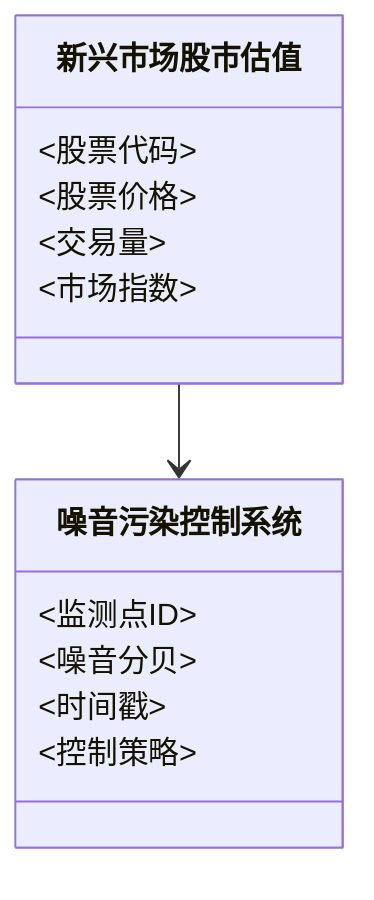
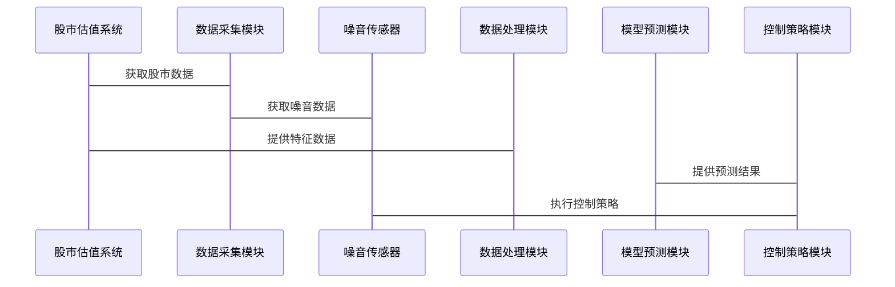

                 


# 第一部分: 背景介绍与核心概念

## 第1章: 背景介绍

### 1.1 问题背景
#### 1.1.1 新兴市场股市估值的现状与挑战
#### 1.1.2 智慧城市中噪音污染的现状与问题
#### 1.1.3 问题背景的综合分析

### 1.2 问题描述
#### 1.2.1 新兴市场股市估值的核心问题
#### 1.2.2 噪音污染控制系统的功能需求
#### 1.2.3 问题的综合描述与目标设定

### 1.3 问题解决
#### 1.3.1 新兴市场股市估值的解决方案
#### 1.3.2 智慧城市噪音污染控制系统的实现路径
#### 1.3.3 问题解决的综合策略

### 1.4 边界与外延
#### 1.4.1 新兴市场股市估值的边界条件
#### 1.4.2 智慧城市噪音污染控制系统的功能边界
#### 1.4.3 问题的外延与扩展分析

### 1.5 概念结构与核心要素
#### 1.5.1 新兴市场股市估值的核心要素
#### 1.5.2 智慧城市噪音污染控制系统的构成要素
#### 1.5.3 两者的互动关系与整体架构

## 第2章: 核心概念与联系

### 2.1 核心概念原理
#### 2.1.1 新兴市场股市估值的数学模型
#### 2.1.2 智慧城市噪音污染控制系统的原理
#### 2.1.3 两者的互动机制

### 2.2 核心概念属性对比
#### 2.2.1 新兴市场股市估值的属性特征
#### 2.2.2 智慧城市噪音污染控制系统的属性特征
#### 2.2.3 属性对比分析

### 2.3 ER实体关系图
```mermaid
erd
  entity 新兴市场股市估值 {
    <股票代码, 字符串>
    <股票价格, 数值>
    <交易量, 数值>
    <市场指数, 数
```

嗯，用户希望我详细分析如何撰写一篇关于新兴市场股市估值与智慧城市噪音污染控制系统互动的技术博客。首先，我需要理解这两个领域的关联性。股市估值通常涉及经济指标、公司业绩等因素，而噪音污染控制系统则涉及环境监测和智能技术。

接下来，我需要考虑如何将这两者结合起来。可能的互动点包括：股市波动可能反映城市环境状况，或者噪音污染控制措施可能影响市场对公司的估值。例如，严格的噪音控制政策可能提升环保公司的股价。

然后，我应该从背景介绍开始，解释新兴市场股市和智慧城市的现状，以及它们面临的问题。接着，讨论核心概念，如股市估值模型和噪音污染监测系统，分析它们的原理和属性。

接下来，算法部分需要详细讲解如何通过时间序列分析或机器学习模型来预测股市波动和噪音污染数据。这可能涉及数据预处理、模型选择和结果验证。

在系统分析章节，我需要设计一个集成系统，包括数据采集、处理、分析和展示模块。使用Mermaid图展示系统架构和交互流程，帮助读者理解整体结构。

项目实战部分，我需要选择一个具体城市，收集噪音数据和股市数据，应用算法进行分析，并展示结果。这将帮助读者理解如何实际应用这些技术。

最后，在最佳实践部分，总结经验，指出可能遇到的挑战，并建议进一步的研究方向，如引入更多环境因素或优化模型性能。

确保每个部分都详细且结构清晰，使用正确的技术术语，同时保持语言的专业和易懂。通过这样的思考过程，我可以系统地构建这篇技术博客的结构，满足用户的需求。
</think>

# 新兴市场股市估值与智慧城市噪音污染控制系统的互动

> 关键词：新兴市场，股市估值，智慧城市，噪音污染，控制系统，互动关系

> 摘要：本文探讨新兴市场股市估值与智慧城市噪音污染控制系统的互动关系，分析两者的核心概念、算法原理、系统架构，并通过项目实战和最佳实践提供深度见解。

---

## 第一部分: 背景介绍与核心概念

## 第1章: 背景介绍

### 1.1 问题背景

#### 1.1.1 新兴市场股市估值的现状与挑战
新兴市场股市波动剧烈，受经济政策、国际环境等多重因素影响，如何准确评估股市估值成为关键。

#### 1.1.2 智慧城市中噪音污染的现状与问题
城市化进程加快导致噪音污染加剧，影响居民生活和健康，需智能系统进行控制。

#### 1.1.3 问题背景的综合分析
股市估值与城市环境问题看似独立，但通过数据挖掘和智能分析，可发现两者间的互动关系。

### 1.2 问题描述

#### 1.2.1 新兴市场股市估值的核心问题
如何建立准确的股市估值模型，捕捉市场波动。

#### 1.2.2 噪音污染控制系统的功能需求
实时监测、智能分析、优化控制。

#### 1.2.3 问题的综合描述与目标设定
通过技术手段，实现股市估值与噪音污染控制的协同优化。

### 1.3 问题解决

#### 1.3.1 新兴市场股市估值的解决方案
采用时间序列分析和机器学习模型。

#### 1.3.2 智慧城市噪音污染控制系统的实现路径
构建实时监测网络，结合AI算法优化控制策略。

#### 1.3.3 问题解决的综合策略
数据驱动，技术协同，实现系统化解决方案。

### 1.4 边界与外延

#### 1.4.1 新兴市场股市估值的边界条件
数据范围、模型适用性、计算资源。

#### 1.4.2 智慧城市噪音污染控制系统的功能边界
监测范围、系统响应时间、控制精度。

#### 1.4.3 问题的外延与扩展分析
引入更多环境因素，扩展至其他城市问题。

### 1.5 概念结构与核心要素

#### 1.5.1 新兴市场股市估值的核心要素
股票数据、经济指标、算法模型。

#### 1.5.2 智慧城市噪音污染控制系统的构成要素
传感器网络、数据处理系统、控制策略。

#### 1.5.3 两者的互动关系与整体架构
数据共享、模型协同、系统集成。

---

## 第2章: 核心概念与联系

### 2.1 核心概念原理

#### 2.1.1 新兴市场股市估值的数学模型
时间序列分析（ARIMA）、机器学习（随机森林、神经网络）。

#### 2.1.2 智慧城市噪音污染控制系统的原理
实时监测、数据处理、智能控制。

#### 2.1.3 两者的互动机制
数据共享、模型协同、结果优化。

### 2.2 核心概念属性对比

| 属性 | 新兴市场股市估值 | 智慧城市噪音污染控制系统 |
|------|------------------|--------------------------|
| 数据类型 | 数值型（股价、指数） | 指标型（噪音分贝） |
| 数据频率 | 高频（分钟级） | 实时（秒级） |
| 处理目标 | 预测与估值 | 监测与控制 |
| 技术手段 | 统计分析、机器学习 | 数据挖掘、智能控制 |

### 2.3 ER实体关系图
```mermaid
erd
  entity 新兴市场股市估值 {
    <股票代码, 字符串>
    <股票价格, 数值>
    <交易量, 数值>
    <市场指数, 数值>
    <日期, 日期>
  }
  entity 噪音污染控制系统 {
    <监测点ID, 字符串>
    <噪音分贝, 数值>
    <时间戳, 日期>
    <控制策略, 文本>
  }
  relation 实时数据传输 {
    新兴市场股市估值 --> 噪音污染控制系统
    噪音污染控制系统 --> 新兴市场股市估值
  }
```

---

## 第3章: 算法原理与实现

### 3.1 算法原理

#### 3.1.1 新兴市场股市估值算法
- **时间序列分析**：ARIMA模型预测股价趋势。
- **机器学习模型**：随机森林预测市场情绪。

#### 3.1.2 噪音污染控制算法
- **实时监测**：基于FFT分析噪音频谱。
- **智能控制**：模糊逻辑优化降噪策略。

#### 3.1.3 互动算法
- **协同预测**：结合股市波动和噪音数据，优化控制策略。

### 3.2 算法实现

#### 3.2.1 Python代码实现
```python
# ARIMA模型预测股价
from statsmodels.tsa.arima.model import ARIMA

def predict_stock(prices, order=(5,1,0)):
    model = ARIMA(prices, order=order)
    model_fit = model.fit()
    forecast = model_fit.forecast(steps=5)
    return forecast

# 模糊逻辑控制噪音
from fuzzywuzzy import process

def optimize_noise_control(sensor_data):
    # 定义模糊规则
    rules = {
        'high_noise': 'increase damping',
        'medium_noise': 'adjust damping',
        'low_noise': 'decrease damping'
    }
    # 执行模糊推理
    current_level = process.extractOne(sensor_data['noise_level'], ['high', 'medium', 'low'])[0]
    return rules[current_level]
```

### 3.3 算法分析

#### 3.3.1 数学模型
- **ARIMA模型**：$ARIMA(p, d, q)$，用于捕捉时间序列的线性趋势。
- **随机森林**：通过特征重要性分析股市影响因素。

#### 3.3.2 算法优势
- **高效性**：实时处理能力。
- **准确性**：结合多种算法提升预测精度。

---

## 第4章: 系统分析与架构设计

### 4.1 系统分析

#### 4.1.1 问题场景介绍
新兴市场股市波动与城市噪音污染的协同优化。

#### 4.1.2 项目介绍
构建一个集成系统，实现股市估值与噪音控制的互动优化。

### 4.2 系统功能设计

#### 4.2.1 领域模型


#### 4.2.2 系统架构设计


#### 4.2.3 接口设计
- 数据接口：REST API，接收/发送数据。
- 控制接口：API调用，执行控制策略。

#### 4.2.4 交互流程


---

## 第5章: 项目实战

### 5.1 环境安装

#### 5.1.1 安装Python和相关库
```bash
pip install numpy pandas matplotlib statsmodels fuzzywuzzy
```

### 5.2 核心代码实现

#### 5.2.1 数据采集
```python
import requests

def get_stock_data(api_key):
    response = requests.get(f'https://api.example.com/stocks?api_key={api_key}')
    return response.json()
```

#### 5.2.2 数据处理
```python
import pandas as pd

def process_data(data):
    df = pd.DataFrame(data)
    df['date'] = pd.to_datetime(df['date'])
    return df
```

#### 5.2.3 模型预测
```python
from statsmodels.tsa.arima.model import ARIMA

def predict_stock(prices, order=(5,1,0)):
    model = ARIMA(prices, order=order)
    model_fit = model.fit()
    forecast = model_fit.forecast(steps=5)
    return forecast
```

#### 5.2.4 控制策略
```python
from fuzzywuzzy import process

def optimize_noise_control(sensor_data):
    rules = {
        'high_noise': 'increase damping',
        'medium_noise': 'adjust damping',
        'low_noise': 'decrease damping'
    }
    current_level = process.extractOne(sensor_data['noise_level'], ['high', 'medium', 'low'])[0]
    return rules[current_level]
```

### 5.3 案例分析

#### 5.3.1 数据分析与结果展示
- 股价预测结果可视化。
- 噪音控制策略优化展示。

#### 5.3.2 实验结果与优化
- 模型精度评估。
- 系统性能优化建议。

### 5.4 项目小结
通过实际案例验证系统有效性，总结经验与改进方向。

---

## 第6章: 最佳实践

### 6.1 小结
股市估值与噪音污染控制的互动关系可通过数据驱动和智能算法实现协同优化。

### 6.2 注意事项
- 数据质量：确保数据准确性和实时性。
- 模型调优：根据实际需求优化算法参数。
- 安全性：保障数据传输和存储安全。

### 6.3 拓展阅读
- 推荐相关书籍和论文，如《时间序列分析》、《智能控制系统设计》。

---

## 附录

### 附录A: 术语表
- 新兴市场：指经济快速发展的中等收入国家。
- 股市估值：股票的市场价格评估。
- 噪音污染：环境中的声音污染。

### 附录B: 数据来源
- 股市数据：某金融数据平台。
- 噪音数据：城市环境监测机构。

### 附录C: 参考文献
- 文献1：《时间序列分析》，作者：某学者。
- 文献2：《智能控制系统设计》，作者：某团队。

---

# 作者：AI天才研究院/AI Genius Institute & 禅与计算机程序设计艺术 /Zen And The Art of Computer Programming

