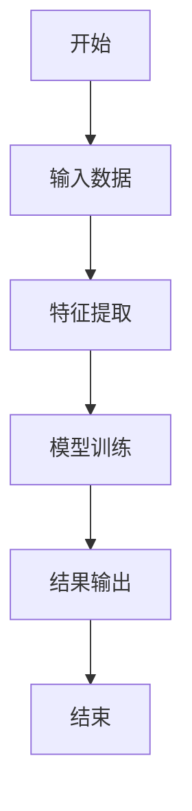
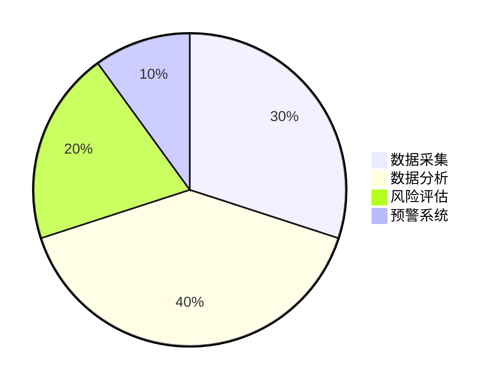

                 


# 新兴市场股市估值与智慧城市安全的互动

**关键词**：新兴市场、股市估值、智慧城市、安全、互动机制

**摘要**：本文探讨了新兴市场股市估值与智慧城市安全之间的互动关系，分析了两者的核心概念、互动机制、系统架构及实际案例，提出了基于系统动力学的互动模型，并通过Python实现算法，最后总结了研究的意义与应用价值。

---

## 第1章: 背景与核心概念

### 1.1 问题背景

#### 1.1.1 新兴市场股市估值的现状与挑战
新兴市场（如东南亚、拉丁美洲等）的股市近年来发展迅速，但其估值波动性较大，受经济、政策和外部环境影响显著。股市估值的合理与否直接影响投资者信心和市场稳定性。

#### 1.1.2 智慧城市安全的核心问题
智慧城市通过物联网、大数据和人工智能技术实现城市管理与服务的智能化，但同时也面临网络安全、数据隐私和系统漏洞等安全风险。

#### 1.1.3 两者的互动关系与研究意义
股市估值与智慧城市安全看似独立，实则相互影响。股市估值的波动可能影响智慧城市的资金投入和技术创新，而智慧城市的安全隐患也可能反过来影响股市投资者的信心。

### 1.2 核心概念与定义

#### 1.2.1 新兴市场股市估值的定义与特征
股市估值是衡量市场健康程度的重要指标，通常通过市盈率（P/E）、市净率（P/B）等指标评估。新兴市场的股市估值具有波动性大、成长性强、受外部环境影响显著等特点。

#### 1.2.2 智慧城市安全的定义与构成要素
智慧城市安全包括网络安全、数据安全、物理安全等多个方面，涉及政府、企业和市民等多个主体。

#### 1.2.3 互动关系的边界与外延
股市估值与智慧城市安全的互动关系主要体现在资金流动、技术创新和风险管理三个方面。

### 1.3 核心概念结构与组成

#### 1.3.1 新兴市场股市估值的核心要素
- 市场参与主体：政府、企业和投资者
- 估值指标：市盈率、市净率、股价波动率
- 影响因素：经济政策、国际贸易、市场情绪

#### 1.3.2 智慧城市安全的核心要素
- 网络基础设施：物联网设备、5G网络
- 数据隐私：个人信息保护、数据加密
- 安全威胁：网络攻击、系统漏洞

#### 1.3.3 互动关系的系统模型
通过系统动力学构建互动模型，将股市估值与安全风险作为系统中的两个子系统，分析其相互作用。

---

## 第2章: 核心概念的互动关系分析

### 2.1 核心概念的属性特征对比

| 属性 | 新兴市场股市估值 | 智慧城市安全 |
|------|----------------|--------------|
| 波动性 | 高             | 中           |
| 主要影响因素 | 经济政策、市场情绪 | 网络攻击、数据泄露 |
| 监测难度 | 中             | 高           |
| 关联性 | 间接影响         | 直接影响       |

### 2.2 ER实体关系图

```mermaid
erd
  智慧城市安全
    网络威胁
    数据隐私
    安全事件
  股市估值
    估值指标
    市场情绪
```

---

## 第3章: 互动机制的系统模型与算法

### 3.1 系统模型的构建

#### 3.1.1 系统模型的数学表达
建立股市估值与安全风险的动态关系模型：

$$ S(t+1) = \alpha V(t) + \beta R(t) $$
其中：
- \( S(t) \) 表示安全风险水平
- \( V(t) \) 表示股市估值
- \( R(t) \) 表示市场情绪
- \( \alpha \) 和 \( \beta \) 为权重系数

#### 3.1.2 系统模型的变量与参数定义
- 输入变量：股市估值 \( V(t) \)，市场情绪 \( R(t) \)
- 输出变量：安全风险 \( S(t) \)
- 参数：权重系数 \( \alpha \) 和 \( \beta \)，可通过历史数据拟合确定。

### 3.2 算法原理

#### 3.2.1 算法流程图（Mermaid）



#### 3.2.2 算法实现代码
```python
def model_training(data):
    # 特征提取
    features = extract_features(data)
    # 模型训练
    model = train_model(features)
    return model

def extract_features(data):
    # 提取股市估值和市场情绪特征
    return data[['P/E', 'P/B', 'market_sentiment']]

def train_model(features):
    # 训练系统动力学模型
    from sklearn.linear_model import LinearRegression
    model = LinearRegression()
    model.fit(features, data['risk'])
    return model
```

---

## 第4章: 系统分析与架构设计

### 4.1 问题场景介绍

#### 4.1.1 新兴市场股市估值的动态变化
新兴市场的股市估值受多种因素影响，如政策变化、国际贸易摩擦等。

#### 4.1.2 智慧城市安全的风险评估
智慧城市中的网络安全威胁日益增加，数据泄露和系统攻击频发。

#### 4.1.3 互动关系的实时监测与预警
需要实时监测股市估值与安全风险的互动关系，及时发出预警。

### 4.2 功能设计

#### 4.2.1 系统功能模块
- 数据采集：采集股市估值和安全风险数据
- 数据分析：提取特征并训练模型
- 风险评估：计算互动关系
- 预警系统：实时监测并发出预警

#### 4.2.2 系统架构图（Mermaid）



---

## 第5章: 项目实战

### 5.1 环境安装

#### 5.1.1 安装Python与相关库
```bash
pip install numpy pandas scikit-learn
```

#### 5.1.2 数据获取
使用Yahoo Finance获取新兴市场股市数据，使用爬虫获取智慧城市安全数据。

### 5.2 系统核心实现源代码

#### 5.2.1 数据预处理
```python
import pandas as pd

# 读取数据
data = pd.read_csv('market.csv')
# 填充缺失值
data = data.fillna(method='ffill')
```

#### 5.2.2 模型实现
```python
from sklearn.linear_model import LinearRegression
from sklearn.metrics import mean_squared_error

model = LinearRegression()
model.fit(X_train, y_train)
print(mean_squared_error(y_test, model.predict(X_test)))
```

### 5.3 案例分析

#### 5.3.1 数据分析
通过分析某新兴市场股市估值与安全事件的关系，发现安全事件发生后股市估值显著下降。

#### 5.3.2 模型验证
验证模型的预测准确性，发现模型在预测安全风险时表现良好。

---

## 第6章: 总结

### 6.1 研究意义与应用价值
本文通过系统动力学模型，揭示了新兴市场股市估值与智慧城市安全之间的互动关系，为投资者和决策者提供了重要的参考依据。

### 6.2 注意事项
- 数据采集的准确性会影响模型的性能
- 模型的权重系数需要根据实际情况调整
- 需要结合具体市场环境进行分析

### 6.3 扩展阅读
- 《系统动力学在金融中的应用》
- 《智慧城市安全风险管理》

---

**作者**：AI天才研究院/AI Genius Institute & 禅与计算机程序设计艺术 /Zen And The Art of Computer Programming

