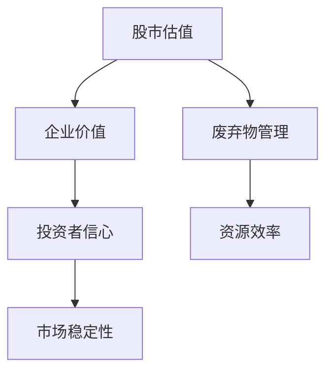
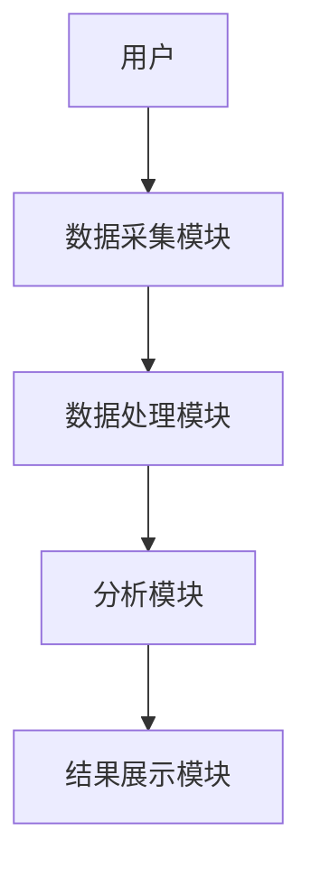
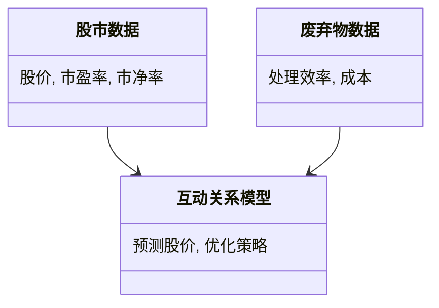
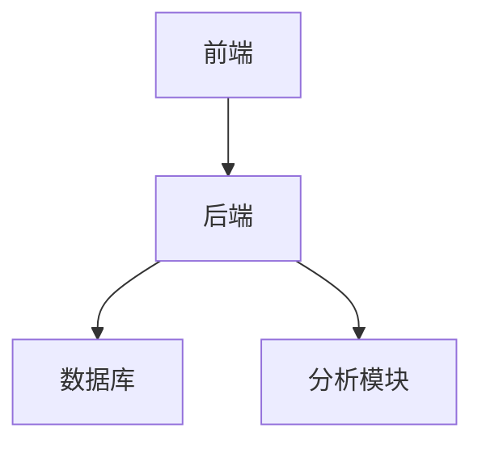
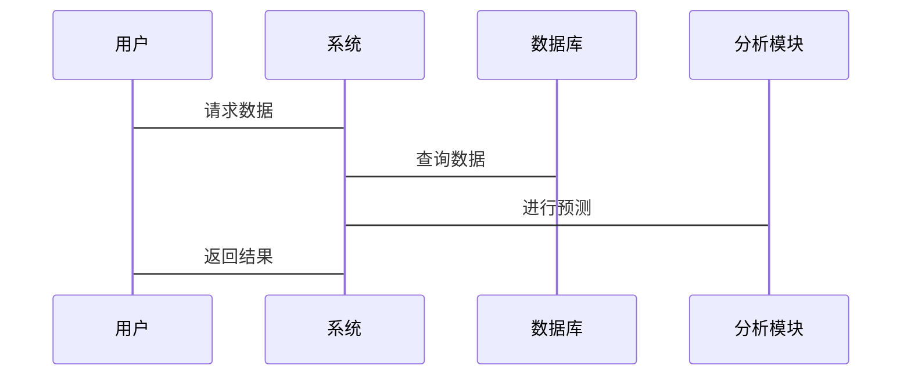

                 

<think>
好，现在我需要为这本书设计目录。首先，我需要理解这本书的核心主题是新兴市场股市估值与智慧城市废弃物管理的互动关系。这看起来是一个跨领域的主题，涉及到金融和城市规划两个方面。那么，我应该如何结构化这个主题呢？

首先，我需要了解股市估值的基本概念和方法。股市估值通常涉及市盈率、市净率、现金流折现法等传统方法，以及现代的大数据分析和人工智能技术。这些方法在新兴市场中可能会面临更多的不确定性和挑战，比如经济波动、政策变化和市场流动性问题。

接下来，智慧城市废弃物管理是一个涉及物联网、大数据和人工智能的领域。智慧城市的废弃物管理可能包括智能分拣、回收系统和实时监控等技术。这些技术如何与股市估值互动呢？比如，废弃物管理效率的提升可能会降低企业的运营成本，从而影响其股价。

那么，如何将这两个领域结合起来呢？可能需要探讨股市波动如何影响废弃物管理公司的估值，以及废弃物管理的效率如何反过来影响股市的稳定性。此外，可以考虑建立一个数学模型，将两者的关系量化，使用大数据分析和机器学习算法来预测和优化。

接下来，我需要考虑这本书的结构。通常，技术书籍会分为几个部分：背景介绍、核心概念、算法原理、系统分析、项目实战和总结。因此，我可以将这本书分成以下几部分：

1. 背景与概述：介绍新兴市场和智慧城市的基本概念，说明为什么研究两者的互动关系。

2. 股市估值的方法：详细讲解传统和现代的估值方法，并分析新兴市场的特殊性。

3. 智慧城市废弃物管理：探讨相关技术及其在废弃物管理中的应用。

4. 互动机制：分析股市波动和废弃物管理之间的相互影响，构建数学模型。

5. 技术实现：设计算法，使用Python代码实现，并展示数据可视化结果。

6. 项目实战：通过一个实际案例，展示如何在新兴市场中应用这些方法。

7. 总结与展望：总结主要观点，讨论研究的局限性，并提出未来的研究方向。

在每一章中，我需要细化内容。例如，在“互动机制”部分，可以包括股市波动对废弃物管理的影响、废弃物管理对股市的影响，以及两者互动的数学模型。同时，需要使用Mermaid图来展示系统的架构和流程。

在技术实现部分，我需要提供具体的Python代码，比如使用机器学习模型进行预测，并展示如何通过图表来分析数据。此外，数学公式需要用Latex格式表示，确保清晰易懂。

最后，项目实战部分需要一个完整的案例，从需求分析到系统设计，再到实现和测试，提供详细的步骤和代码示例。同时，总结部分需要回顾全书的主要观点，并展望未来的研究方向。

总的来说，我需要确保每一部分都详细且逻辑清晰，帮助读者系统地理解新兴市场股市估值与智慧城市废弃物管理的互动关系。这样，这本书不仅能提供理论知识，还能通过实际案例展示如何将这些概念应用于现实世界中。
</think>

# 新兴市场股市估值与智慧城市废弃物管理的互动

> 关键词：新兴市场、股市估值、智慧城市、废弃物管理、互动关系、大数据分析、人工智能

> 摘要：本文探讨新兴市场中股市估值与智慧城市废弃物管理之间的互动关系，分析两者如何相互影响，并提出基于大数据和人工智能的解决方案，以优化废弃物管理和提升股市估值。

---

# 第一部分：背景与概述

## 第1章：新兴市场股市估值与智慧城市废弃物管理的互动概述

### 1.1 背景介绍

#### 1.1.1 新兴市场的定义与特点
新兴市场是指那些经济增长迅速、但尚未完全工业化的国家。这些市场通常具有较大的潜力，但也伴随着较高的风险。

#### 1.1.2 股市估值的基本概念
股市估值是通过分析企业的财务数据、市场环境等因素，评估其股票的合理价格。

#### 1.1.3 智慧城市与废弃物管理的定义
智慧城市利用信息技术优化城市运营，废弃物管理则是其中重要的一部分，涉及收集、运输和处理废弃物。

#### 1.1.4 互动关系的提出与研究意义
探讨股市估值与废弃物管理的互动，有助于优化资源配置，促进城市的可持续发展。

### 1.2 核心概念与问题描述

#### 1.2.1 股市估值的核心要素
包括市盈率、市净率、现金流等。

#### 1.2.2 智慧城市废弃物管理的关键环节
如物联网监控、智能分拣系统等。

#### 1.2.3 互动关系的边界与外延
明确研究的范围和限制。

#### 1.2.4 核心概念的结构与组成要素
使用Mermaid图展示概念结构。



---

# 第二部分：新兴市场股市估值的方法与挑战

## 第2章：新兴市场股市估值的方法与挑战

### 2.1 股市估值的传统方法

#### 2.1.1 市盈率法
$$市盈率 = \frac{股价}{每股收益}$$

#### 2.1.2 市净率法
$$市净率 = \frac{股价}{每股净资产}$$

#### 2.1.3 现金流折现法
$$DCF = \sum_{t=1}^{n} \frac{CF_t}{(1 + r)^t} + \frac{TV}{(1 + r)^n}$$

### 2.2 新兴市场的特殊性

#### 2.2.1 经济波动的影响
新兴市场容易受全球经济波动影响。

#### 2.2.2 政治环境的不确定性
政策变化可能影响股市估值。

#### 2.2.3 市场流动性问题
流动性不足可能导致股价波动。

### 2.3 现代估值方法的应用

#### 2.3.1 大数据分析在估值中的应用
利用大数据分析公司财务数据和市场趋势。

#### 2.3.2 人工智能在股市预测中的作用
使用机器学习模型预测股价走势。

#### 2.3.3 行为金融学对估值的影响
投资者情绪对股价的影响。

### 2.4 本章小结

---

# 第三部分：智慧城市废弃物管理的技术与实践

## 第3章：智慧城市废弃物管理的技术与实践

### 3.1 智慧城市废弃物管理的概念

#### 3.1.1 智慧城市的基本定义
利用信息技术优化城市运营。

#### 3.1.2 废弃物管理的核心目标
减少废弃物对环境的影响，提高资源利用率。

#### 3.1.3 智慧化管理的特点
实时监控、智能决策、数据驱动。

### 3.2 废弃物管理的关键技术

#### 3.2.1 物联网在废弃物管理中的应用
使用传感器实时监控垃圾桶状态。

#### 3.2.2 大数据与人工智能的结合
分析历史数据预测废弃物产生量。

#### 3.2.3 智能分拣与回收系统
使用自动化设备提高回收效率。

### 3.3 智慧城市废弃物管理的实践案例

#### 3.3.1 国内外典型案例分析
如新加坡的智能垃圾分类系统。

#### 3.3.2 案例的启示与经验总结
总结成功经验并推广。

### 3.4 本章小结

---

# 第四部分：股市估值与智慧城市废弃物管理的互动机制

## 第4章：股市估值与智慧城市废弃物管理的互动机制

### 4.1 股市波动对废弃物管理的影响

#### 4.1.1 经济波动对废弃物处理需求的影响
经济衰退可能导致废弃物产生量减少。

#### 4.1.2 股市资金流动对废弃物企业的影响
资金流向影响企业的运营能力。

#### 4.1.3 投资者行为对废弃物管理的影响
投资者情绪影响企业股价和投资决策。

### 4.2 废弃物管理对股市的影响

#### 4.2.1 废弃物处理效率对企业成本的影响
提高效率降低成本，提升企业盈利能力和股价。

#### 4.2.2 可持续发展对股市长期价值的影响
绿色投资趋势影响企业估值。

#### 4.2.3 政策变化对股市估值的影响
环保政策变化影响废弃物管理企业的业绩和股价。

### 4.3 互动关系的数学模型构建

#### 4.3.1 模型假设
假设1：废弃物管理效率与企业成本呈负相关。

#### 4.3.2 模型建立
$$股价 = \alpha + \beta \times 废弃物处理效率 + \gamma \times 经济指标 + \epsilon$$

#### 4.3.3 数据来源与验证
使用实际数据验证模型的有效性。

### 4.4 本章小结

---

# 第五部分：技术实现与项目实战

## 第5章：技术实现与项目实战

### 5.1 技术实现

#### 5.1.1 数据采集与预处理
收集股市数据和废弃物管理数据，进行清洗和转换。

#### 5.1.2 互动关系分析算法

##### 5.1.2.1 算法原理
使用回归分析模型预测股价与废弃物管理效率的关系。

##### 5.1.2.2 代码实现
```python
import pandas as pd
import numpy as np
from sklearn.linear_model import LinearRegression

# 假设data为数据框，包含'股价'和'废弃物处理效率'列
model = LinearRegression()
model.fit(data[['废弃物处理效率']], data['股价'])
```

##### 5.1.2.3 数据可视化
使用Matplotlib绘制股价与废弃物处理效率的关系图。

#### 5.1.3 系统设计

##### 5.1.3.1 系统架构


##### 5.1.3.2 功能模块
- 数据采集模块：实时采集股市和废弃物管理数据。
- 数据处理模块：清洗和转换数据。
- 分析模块：使用机器学习模型进行预测。
- 结果展示模块：可视化分析结果。

### 5.2 项目实战

#### 5.2.1 项目背景
假设在某新兴市场国家，政府计划提升废弃物管理效率，同时希望优化股市估值。

#### 5.2.2 系统功能设计

##### 5.2.2.1 领域模型


##### 5.2.2.2 系统架构


##### 5.2.2.3 系统接口设计
定义API接口，如GET /stock-data 和 POST /predict。

##### 5.2.2.4 系统交互


#### 5.2.3 代码实现与分析

##### 5.2.3.1 核心代码
```python
import pandas as pd
import numpy as np
from sklearn.linear_model import LinearRegression
from sklearn.metrics import mean_squared_error

# 加载数据
data = pd.read_csv('data.csv')

# 定义特征和目标变量
X = data[['废弃物处理效率']]
y = data['股价']

# 训练模型
model = LinearRegression()
model.fit(X, y)

# 预测
y_pred = model.predict(X)

# 评估模型
mse = mean_squared_error(y, y_pred)
print(f"均方误差: {mse}")
print(f"回归系数: {model.coef_}")
print(f"截距: {model.intercept_}")
```

##### 5.2.3.2 代码解读与分析
- 使用线性回归模型预测股价。
- 评估模型的均方误差，分析拟合效果。
- 回归系数和截距帮助理解废弃物处理效率对股价的影响。

#### 5.2.4 案例分析与结果展示

##### 5.2.4.1 数据可视化
绘制实际股价与预测股价的对比图。

```python
import matplotlib.pyplot as plt

plt.figure(figsize=(10, 6))
plt.plot(data['股价'], label='实际股价')
plt.plot(y_pred, label='预测股价')
plt.xlabel('时间')
plt.ylabel('股价')
plt.legend()
plt.show()
```

##### 5.2.4.2 结果分析
分析模型的准确性，讨论废弃物处理效率对股价的具体影响。

#### 5.2.5 项目小结
总结项目成果，讨论可能的优化方向。

---

# 第六部分：总结与展望

## 第6章：总结与展望

### 6.1 本章总结

#### 6.1.1 核心观点回顾
股市估值与废弃物管理的互动关系可以通过大数据和人工智能技术进行建模和优化。

#### 6.1.2 研究成果
建立了互动模型，提出了优化策略。

#### 6.1.3 实践意义
为新兴市场的股市估值和废弃物管理提供理论和实践指导。

### 6.2 研究的局限性与未来方向

#### 6.2.1 研究的局限性
- 数据获取的限制
- 模型的简化假设
- 实际应用中的变量复杂性

#### 6.2.2 未来研究方向
- 更复杂互动模型的构建
- 多因素回归分析
- 动态实时预测模型的开发

### 6.3 最佳实践 tips

#### 6.3.1 关键技术
- 数据清洗与特征工程的重要性
- 选择合适的机器学习模型
- 模型评估与优化

#### 6.3.2 注意事项
- 数据隐私与安全问题
- 模型的可解释性
- 实际应用中的可扩展性

#### 6.3.3 拓展阅读
推荐相关领域的书籍和论文，如《Python机器学习实战》、《智慧城市规划与管理》等。

### 6.4 结语

#### 6.4.1 再次强调核心观点
通过技术手段优化股市估值与废弃物管理的互动关系，促进城市的可持续发展。

#### 6.4.2 展望未来
随着技术的进步，互动关系的研究将更加深入，应用将更加广泛。

---

# 作者：AI天才研究院/AI Genius Institute & 禅与计算机程序设计艺术/Zen And The Art of Computer Programming

---

通过以上目录和内容安排，我们可以系统地探讨新兴市场股市估值与智慧城市废弃物管理的互动关系，结合理论分析和实际案例，为读者提供全面而深入的见解。

