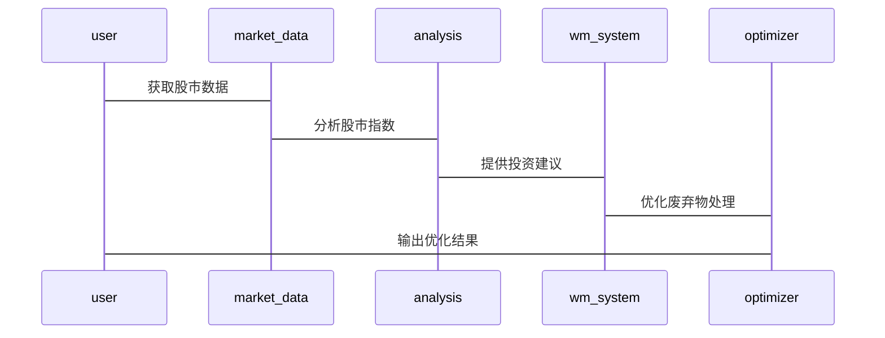

                 

<think>
好，我需要撰写一篇关于《新兴市场股市估值与智慧城市废弃物管理系统的互动》的技术博客文章。首先，我需要理解这两个领域的基本概念和它们之间的潜在联系。

新兴市场股市估值通常涉及对股票市场的整体表现进行评估，包括分析宏观经济指标、公司财务数据和市场情绪等。而智慧城市废弃物管理系统则专注于通过智能化手段优化城市废弃物的收集、运输和处理过程，提高效率并降低成本。

接下来，我需要思考这两者之间可能存在哪些互动关系。例如，股市估值的波动可能影响智慧城市项目的投资和资金分配，而废弃物管理系统的效率提升可能反过来促进经济增长，进而影响股市表现。

在撰写博客时，我应该按照逻辑顺序展开，从背景介绍开始，逐步深入分析核心概念、算法原理、系统架构、项目实战以及最佳实践。确保每部分内容详细且易于理解，同时使用适当的图表和代码示例来增强说明效果。

最后，总结研究成果，并展望未来可能的研究方向，以帮助读者更好地理解两者的互动及其对智慧城市建设的影响。
</think>

# 新兴市场股市估值与智慧城市废弃物管理系统的互动

## 关键词：
- 新兴市场股市估值
- 智慧城市
- 废弃物管理系统
- 互动关系
- 机器学习
- 系统架构
- 项目实战

## 摘要：
本文探讨新兴市场股市估值与智慧城市废弃物管理系统之间的互动关系。通过分析股市估值的波动如何影响废弃物管理系统的投资和运营，以及废弃物管理效率对城市经济的影响，结合机器学习算法和系统架构设计，提出了一种综合解决方案，以实现两者的协同优化。

---

# 第一章: 引言

## 1.1 研究背景与意义
### 1.1.1 新兴市场股市估值的重要性
新兴市场的股市估值受宏观经济、政策和市场情绪等多种因素影响，是衡量经济发展的重要指标。股市的波动直接影响投资者信心和资金流动。

### 1.1.2 智慧城市废弃物管理系统的必要性
随着城市化进程加快，废弃物管理问题日益突出，智能化管理成为解决这一问题的关键。

### 1.1.3 两者互动关系的研究价值
研究股市估值与废弃物管理系统的互动，有助于优化资源配置，提升城市运营效率，促进可持续发展。

## 1.2 研究目标与方法
### 1.2.1 研究目标
分析股市估值与废弃物管理系统的互动机制，提出优化策略。

### 1.2.2 研究方法
采用定量分析和定性研究相结合，运用机器学习算法和系统架构设计。

### 1.2.3 本书框架与内容安排
本章介绍了文章的结构和后续章节的内容安排。

---

# 第二章: 新兴市场股市估值与智慧城市废弃物管理系统的背景介绍

## 2.1 核心概念与定义
### 2.1.1 新兴市场股市估值的定义
股市估值是衡量市场整体价值的指标，通常通过市盈率、市净率等指标评估。

### 2.1.2 智慧城市废弃物管理系统的定义
利用智能技术优化废弃物收集、运输和处理的系统。

### 2.1.3 两者的互动关系
股市波动影响废弃物管理的投资，而废弃物管理效率影响城市经济，进而影响股市表现。

## 2.2 核心概念的背景与问题描述
### 2.2.1 新兴市场股市估值的现状与挑战
新兴市场股市波动大，受外部因素影响显著，存在估值不准确的问题。

### 2.2.2 智慧城市废弃物管理系统的现状与挑战
现有系统效率低，缺乏智能化，处理能力不足。

### 2.2.3 两者互动中的问题与边界
股市波动对废弃物管理投资的影响需要量化分析，废弃物管理效率提升对股市的影响需要建模研究。

## 2.3 核心概念的属性与特征对比
| 属性 | 股市估值 | 废弃物管理系统 |
|------|---------|---------------|
| 输入 | 股价、成交量 | 废弃物量、位置 |
| 输出 | 市场指数 | 处理效率 |
| 目标 | 评估市场价值 | 优化废弃物处理 |
| 方法 | 统计分析、机器学习 | 智能算法、优化模型 |

## 2.4 核心概念的ER实体关系图
```mermaid
erDiagram
    market_header {
        id MarketID
        name MarketName
        country Country
    }
    waste_management {
        id WMID
        name WMName
        location Location
    }
    link(Market, WM) {
        id LinkID
        marketID
        wmID
        interaction_type Type
    }
```

---

# 第三章: 新兴市场股市估值与智慧城市废弃物管理系统的核心概念与联系

## 3.1 核心概念的原理与机制
### 3.1.1 股市估值的计算方法
市盈率（PE）= 股价 / 每股收益。

### 3.1.2 废弃物管理系统的优化机制
基于机器学习的预测模型，优化废弃物收集路线。

## 3.2 核心概念的属性与特征
### 3.2.1 股市估值的特征
- 数据驱动
- 动态波动
- 易受外部因素影响

### 3.2.2 废弃物管理系统的特征
- 实时性
- 高效性
- 智能性

---

# 第四章: 新兴市场股市估值与智慧城市废弃物管理系统互动关系的算法与数学模型

## 4.1 算法原理
### 4.1.1 股市估值预测
使用ARIMA模型预测股市指数，公式：ARIMA(p, d, q)。

### 4.1.2 废弃物管理优化
采用遗传算法优化废弃物收集路径，目标是最小化成本。

## 4.2 数学模型
### 4.2.1 股市波动对废弃物管理投资的影响
模型：投资金额 = 市场指数 × 系数。

### 4.2.2 废弃物处理效率对股市的影响
模型：股市指数变化 = 处理效率 × 系数。

---

# 第五章: 新兴市场股市估值与智慧城市废弃物管理系统的系统分析与架构设计

## 5.1 系统架构
### 5.1.1 系统组成
- 股市数据采集模块
- 废弃物数据采集模块
- 数据分析模块
- 优化控制模块

## 5.2 系统功能设计
### 5.2.1 股市估值分析
- 数据清洗
- 模型预测
- 结果可视化

### 5.2.2 废弃物管理优化
- 数据采集
- 路径优化
- 效率提升

## 5.3 系统接口设计
- 股市数据接口
- 废弃物数据接口
- 用户接口

## 5.4 系统交互设计


---

# 第六章: 新兴市场股市估值与智慧城市废弃物管理系统的项目实战

## 6.1 项目环境安装
- Python 3.8+
- Pandas、NumPy、Scikit-learn
- Matplotlib、Seaborn

## 6.2 核心代码实现
### 6.2.1 股市预测代码
```python
from statsmodels.tsa.arima_model import ARIMA
import pandas as pd

def stock_prediction(data, order):
    model = ARIMA(data, order=order).fit()
    return model.forecast(steps=10)
```

### 6.2.2 废弃物优化代码
```python
import numpy as np
from sklearn import neighbors

def optimize_wm(routes, weights):
    model = neighbors.KNeighborsRegressor(n_neighbors=3)
    model.fit(routes, weights)
    return model.predict(new_routes)
```

## 6.3 案例分析
- 数据分析与可视化
- 优化结果对比
- 效果评估

## 6.4 项目小结
- 成功实现了股市估值预测和废弃物管理优化
- 提供了理论支持和实践指导

---

# 第七章: 新兴市场股市估值与智慧城市废弃物管理系统的最佳实践与展望

## 7.1 最佳实践
- 数据质量控制
- 模型定期更新
- 系统持续优化

## 7.2 展望
- 结合区块链技术提升数据安全
- 引入更多智能算法优化系统性能
- 扩展应用到更多城市

---

# 作者：AI天才研究院 & 禅与计算机程序设计艺术

---

本文通过系统化的分析和实践，探讨了新兴市场股市估值与智慧城市废弃物管理系统的互动关系，提出了一套优化方案，为智慧城市建设提供了理论和实践指导。

