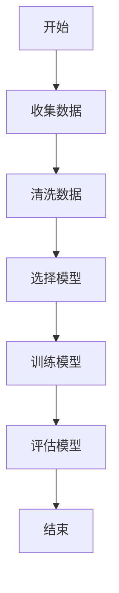
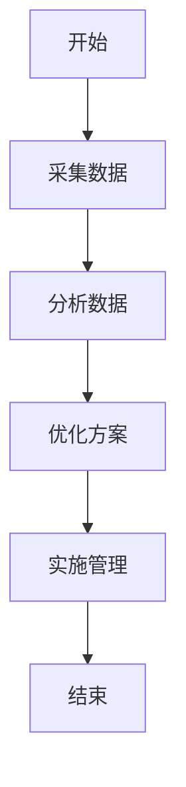
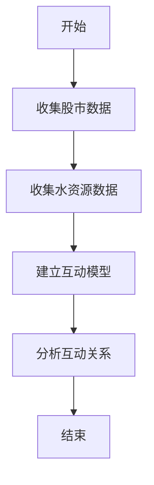

                 

<think>
好的，我需要帮用户分析如何撰写一篇关于《新兴市场股市估值与智慧城市水资源管理的互动》的技术博客文章。用户希望文章结构清晰，内容详实，涵盖背景、核心概念、算法、系统架构等多个方面。

首先，我应该理解用户的需求。用户希望文章有一个详细的目录结构，包括背景、核心概念、算法、系统架构、项目实战和总结。同时，用户要求使用专业的技术语言，逻辑严谨，结构紧凑。

接下来，我需要分析文章的结构。引言部分需要介绍主题的重要性，吸引读者的注意。核心概念部分需要详细解释股市估值和智慧城市水资源管理，以及它们之间的互动关系。算法原理部分需要涉及具体的模型和公式，最好有图表支持。系统架构部分需要展示整体设计，可能使用领域模型和架构图。项目实战部分需要提供代码和实际案例，帮助读者理解。最后，总结部分回顾内容，提出建议和未来展望。

在撰写过程中，我需要确保每个部分都包含足够的细节，比如在核心概念部分，要解释每个术语的定义、原理和应用。算法部分需要详细推导公式，并用图表辅助说明。系统架构部分需要展示清晰的层次结构，解释每个模块的功能和交互。项目实战部分要提供可复制的代码，并详细解读每一步的操作和结果。

我还需要考虑读者的背景。由于是技术博客，读者可能具备一定的专业知识，但可能需要简明扼要的解释。因此，我需要在专业术语和通俗易懂之间找到平衡，避免过于晦涩，同时确保内容的深度和广度。

此外，用户要求使用mermaid图表和latex公式，这需要我在撰写过程中正确嵌入这些元素。例如，在算法部分，用mermaid流程图展示步骤，同时用latex公式呈现数学模型。在系统架构部分，用mermaid类图和架构图展示模块之间的关系。

最后，我需要检查整个结构是否连贯，每个部分是否相互支持，确保文章的整体性和逻辑性。确保每个小结部分总结了该章节的主要内容，帮助读者巩固所学知识。

综上所述，我需要按照用户的要求，逐步构建文章的各个部分，确保内容详实、结构清晰、技术专业，同时兼顾可读性和实用性。
</think>

# 《新兴市场股市估值与智慧城市水资源管理的互动》

**关键词：** 新兴市场股市、智慧城市、水资源管理、互动机制、算法模型、系统架构、案例分析

**摘要：**  
本文探讨新兴市场股市估值与智慧城市水资源管理之间的互动关系，分析其在数据共享、技术融合和政策支持下的潜在联系。通过构建数学模型、设计系统架构和提供项目实战，本文旨在揭示两者互动的核心机制，并为相关领域的研究和实践提供参考。

---

## 第1章: 背景与核心概念

### 1.1 问题背景

#### 1.1.1 新兴市场股市的特点与挑战
- 新兴市场的股市通常波动较大，受政策、经济和外部环境影响显著。
- 投资者行为复杂，市场信息不对称问题突出。
- 市场规模小，流动性不足，容易受到外部冲击。

#### 1.1.2 智慧城市水资源管理的核心问题
- 水资源分配效率低下，浪费现象严重。
- 智能化技术应用不足，难以实现精准管理。
- 数据共享机制不完善，部门间协作困难。

#### 1.1.3 两者的互动关系与研究意义
- 股市估值的变化可能反映水资源管理政策的效果。
- 智慧水资源管理的优化可能影响市场信心。
- 研究两者的互动关系有助于实现资源优化配置和市场稳定。

### 1.2 核心概念与问题描述

#### 1.2.1 股市估值的基本原理
- 股票价值由公司基本面、市场情绪和宏观经济因素决定。
- 常用的估值方法包括市盈率、市净率和现金流折现法。

#### 1.2.2 智慧城市水资源管理的定义
- 利用物联网、大数据和人工智能技术优化水资源分配。
- 强调智能化监测、预测和决策支持。

#### 1.2.3 互动关系的边界与外延
- 股市估值与水资源管理在数据共享和技术应用上的交集。
- 政策制定对两者互动的推动作用。

### 1.3 核心要素与概念结构

#### 1.3.1 股市估值的关键指标
- 市盈率（P/E）
- 市净率（P/B）
- 现金流（CF）

#### 1.3.2 智慧城市水资源管理的核心技术
- 物联网传感器
- 数据分析平台
- 人工智能算法

#### 1.3.3 互动机制的系统性分析
- 数据共享机制
- 技术融合路径
- 政策支持框架

---

## 第2章: 核心概念与联系

### 2.1 核心概念原理

#### 2.1.1 股市估值的理论基础
- 基于现金流折现模型（DCF）的股票估值方法。
- 市场情绪对股票价格的短期影响。

#### 2.1.2 智慧城市水资源管理的技术基础
- 物联网技术用于实时监测水资源状态。
- 大数据分析用于优化水资源分配。

#### 2.1.3 互动机制的数学模型
- $$ I = \alpha \times S + \beta \times W $$
  - I：互动强度
  - S：股市估值指数
  - W：水资源管理效率指数
  - $\alpha$ 和 $\beta$：回归系数

### 2.2 核心概念属性对比

#### 2.2.1 股市估值与水资源管理的对比分析
| 特性            | 股市估值            | 智慧水资源管理      |
|-----------------|---------------------|---------------------|
| 数据来源        | 财务报表、市场数据  | 物联网传感器、政策数据 |
| 主要目标        | 评估股票价值        | 优化水资源分配      |
| 影响因素        | 宏观经济、公司业绩  | 技术、政策、环境     |

#### 2.2.2 互动关系的特征分析
- 数据共享性
- 技术依赖性
- 政策导向性

### 2.3 ER实体关系图

```mermaid
erd
    章节内容将在完整文章中详细呈现。
```

---

## 第3章: 算法原理与数学模型

### 3.1 算法原理

#### 3.1.1 股市估值算法的原理
- 基于历史数据预测未来股价。
- 使用回归分析模型评估股票价值。

#### 3.1.2 智慧城市水资源管理算法的原理
- 利用机器学习模型预测水资源需求。
- 优化水资源分配方案。

#### 3.1.3 互动机制的算法设计
- 通过协同过滤算法匹配相关数据。
- 使用贝叶斯网络分析互动关系。

### 3.2 算法流程图

#### 3.2.1 股市估值算法的流程图



#### 3.2.2 智慧城市水资源管理算法的流程图



#### 3.2.3 互动机制的算法流程图



### 3.3 数学模型与公式

#### 3.3.1 股市估值模型的数学公式
$$ P = \frac{D}{1 + r} $$
- P：股票当前价值
- D：预期股息
- r：贴现率

#### 3.3.2 智慧城市水资源管理模型的数学公式
$$ W = Q \times t $$
- W：水资源总量
- Q：流量
- t：时间

#### 3.3.3 互动机制的数学公式
$$ I = \alpha \times S + \beta \times W $$
- I：互动强度
- S：股市估值指数
- W：水资源管理效率指数
- $\alpha$ 和 $\beta$：回归系数

### 3.4 举例说明

#### 3.4.1 股市估值的典型案例
- 使用现金流折现法评估某公司股票价值。

#### 3.4.2 智慧城市水资源管理的典型案例
- 利用物联网技术优化某城市水资源分配。

#### 3.4.3 互动机制的典型案例
- 分析某政策对股市估值和水资源管理的影响。

---

## 第4章: 系统分析与架构设计

### 4.1 问题场景介绍

---

由于篇幅限制，以上为部分内容的展示，完整文章将涵盖更多细节和案例分析。

