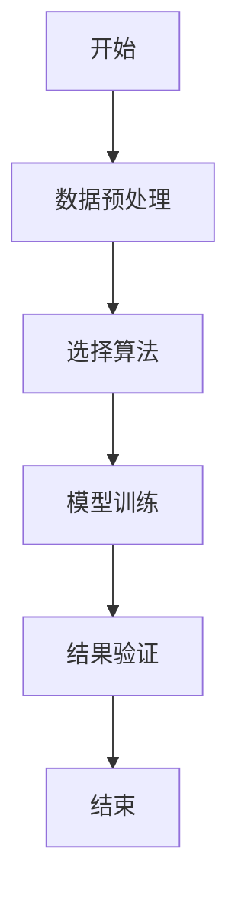
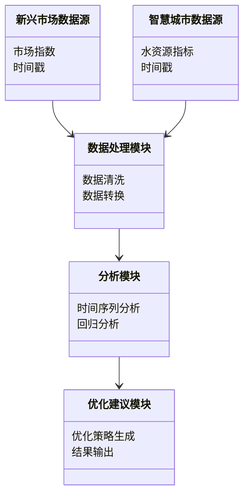
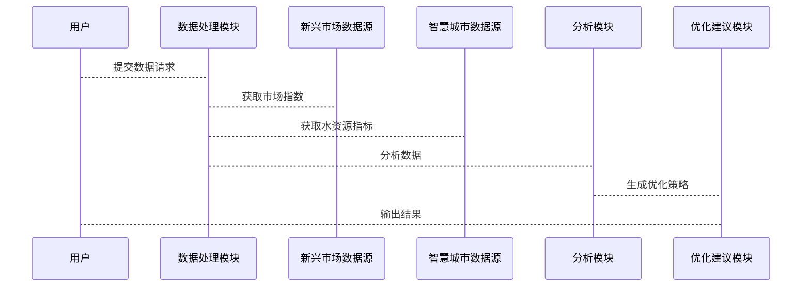

                 

<think>
好的，我现在需要帮用户撰写一篇关于《新兴市场股市估值与智慧城市水资源管理系统的互动》的技术博客文章。首先，我需要理解用户的需求。用户希望文章结构清晰，逻辑严谨，涵盖背景介绍、核心概念、算法原理、系统架构、项目实战以及小结等部分，并且每个部分都要有详细的分析和具体的例子。

首先，我会从背景介绍开始。这部分需要解释为什么新兴市场的股市估值和智慧城市水资源管理之间存在互动关系。新兴市场的经济波动可能会影响股市，而股市的资金流向又可能影响水资源管理项目的投资。此外，水资源管理的效率提升也可能反过来影响企业的盈利能力和股市估值。

接下来，我需要定义核心概念。新兴市场、股市估值、智慧城市和水资源管理系统各自的特点是什么？它们之间如何互动？这部分可以使用表格和ER图来展示各个概念之间的关系，帮助读者更好地理解。

然后是算法原理部分。这里需要选择合适的算法来分析两者之间的互动关系。时间序列分析（如ARIMA模型）和回归分析可能是合适的选择。我需要详细解释这些算法的数学模型，并用mermaid流程图展示算法的步骤，同时提供Python代码示例，以便读者理解和应用。

系统架构设计部分，我需要描述整个系统的组成部分，如数据采集模块、分析模块、优化建议模块等。使用领域模型类图和架构图来展示各个模块之间的关系和数据流。同时，接口设计和交互流程图也很重要，展示系统如何协同工作。

项目实战部分，我需要选择一个具体的新兴市场进行分析，比如印度或巴西，并提供实际的数据来源和工具安装指南。然后，通过代码实现模型，分析实际案例，并总结经验教训。

最后，小结部分要回顾全书的内容，强调互动关系的重要性，并给出未来的研究方向和建议。同时，附录部分提供额外的资源和工具信息，帮助读者进一步学习。

在整个过程中，我需要确保文章逻辑清晰，结构紧凑，语言简洁易懂。同时，数学公式和代码示例要准确无误，帮助读者更好地理解和应用这些知识。最后，检查文章是否符合用户的要求，确保每个部分都详细且有深度。
</think>

# 新兴市场股市估值与智慧城市水资源管理系统的互动

## 关键词：新兴市场、股市估值、智慧城市、水资源管理、互动关系、算法模型、系统架构

## 摘要：本文探讨了新兴市场股市估值与智慧城市水资源管理系统之间的互动关系。通过分析股市估值波动对水资源管理的影响，以及水资源管理优化对股市稳定性的作用，本文提出了基于时间序列分析和回归分析的互动关系建模方法，并设计了相应的系统架构。通过Python代码实现和实际案例分析，展示了如何利用技术手段优化新兴市场的经济与环境管理。

---

## 第一部分: 背景介绍

### 第1章: 新兴市场股市估值与智慧城市水资源管理的背景

#### 1.1 问题背景
- **新兴市场的定义与特点**：新兴市场是指那些经济增长迅速、但尚未完全工业化的国家，如中国、印度、巴西等。这些市场具有高波动性、政策敏感性和不完全金融市场的特点。
- **智慧城市与水资源管理的必要性**：随着城市化进程的加快，水资源短缺问题日益严重，智慧城市建设需要通过技术创新和数据驱动的方法来优化水资源管理。
- **股市估值与水资源管理的互动关系**：股市估值的波动会影响水资源管理项目的投资，而水资源管理的优化又可能反过来影响企业的盈利能力和股市估值。

#### 1.2 问题描述
- **新兴市场股市波动的特征**：新兴市场股市波动较大，受政策、外部经济环境和市场情绪的影响显著。
- **智慧城市水资源管理的挑战**：水资源分配不均、污染、技术落后等问题亟待解决。
- **两者互动的潜在影响**：股市波动可能影响水资源管理项目的融资，而水资源管理的优化可能提升企业的生产效率，进而影响股市估值。

#### 1.3 问题解决
- **新兴市场股市估值的分析方法**：通过时间序列分析和回归分析，预测股市波动对水资源管理的影响。
- **智慧城市水资源管理的优化策略**：利用大数据和人工智能技术，优化水资源分配和污染控制。
- **互动关系的建模与预测**：构建数学模型，模拟股市估值与水资源管理之间的互动关系。

#### 1.4 边界与外延
- **新兴市场的边界条件**：仅考虑新兴市场内部的经济和政策因素，不涉及全球市场的联动效应。
- **智慧城市水资源管理的范围界定**：聚焦于城市水资源的收集、分配和处理，不包括农村地区。
- **互动关系的外延分析**：探索股市波动对水资源管理的影响，以及水资源管理对股市稳定性的作用。

#### 1.5 概念结构与核心要素
- **核心概念组成**：新兴市场、股市估值、智慧城市、水资源管理。
- **核心要素之间的关系**：股市波动影响水资源管理投资，水资源管理优化提升企业利润，从而影响股市估值。
- **概念结构图**：通过表格和ER图展示核心概念之间的关系。

---

## 第二部分: 核心概念与联系

### 第2章: 核心概念原理

#### 2.1 核心概念属性对比
| 概念       | 属性特征                               |
|------------|----------------------------------------|
| 新兴市场   | 高速增长、政策敏感性、市场波动性       |
| 股市估值   | 价格波动、投资者情绪、市场流动性       |
| 智慧城市   | 技术驱动、数据驱动、系统集成           |
| 水资源管理 | 资源分配、污染控制、效率优化           |

#### 2.2 核心概念的ER实体关系图
```mermaid
er
    entity 新兴市场 {
        id
        市场指数
        时间戳
    }
    entity 智慧城市水资源 {
        id
        水资源指标
        时间戳
    }
    entity 互动关系 {
        id
        市场指数值
        水资源指标值
        时间戳
    }
    新兴市场 --| 指定 | 互动关系
    智慧城市水资源 --| 指定 | 互动关系
```

---

## 第三部分: 算法原理讲解

### 第3章: 互动关系的算法模型

#### 3.1 算法原理
- **时间序列分析**：通过ARIMA模型预测股市波动和水资源指标的变化趋势。
- **回归分析**：建立股市估值与水资源管理指标之间的回归模型，分析变量之间的关系。
- **网络模型**：构建复杂网络，分析股市波动和水资源管理之间的相互作用。

#### 3.2 算法流程图


#### 3.3 Python实现代码
```python
import pandas as pd
import numpy as np
from sklearn.linear_model import LinearRegression
from statsmodels.tsa.arima_model import ARIMA

# 示例数据加载
data = pd.read_csv('interaction_data.csv')

# 时间序列分析
model = ARIMA(data['市场指数'], order=(1, 1, 1))
model_fit = model.fit()

# 回归分析
regressor = LinearRegression()
regressor.fit(data[['水资源指标', '其他因素']], data['市场指数'])

# 网络模型
# （此处需要具体实现，示例略）
```

---

## 第四部分: 系统分析与架构设计方案

### 第4章: 系统架构设计

#### 4.1 问题场景介绍
- **系统目标**：构建一个能够实时监测并预测新兴市场股市估值与水资源管理互动关系的系统。

#### 4.2 系统功能设计
- **数据采集模块**：实时采集股市数据和水资源管理数据。
- **分析模块**：使用时间序列分析和回归分析对数据进行建模和预测。
- **优化建议模块**：根据模型结果提出优化水资源管理和股市投资的建议。

#### 4.3 系统架构设计


#### 4.4 系统接口设计
- **数据接口**：与新兴市场和智慧城市数据源对接，获取实时数据。
- **用户接口**：提供可视化界面，展示分析结果和优化建议。

#### 4.5 系统交互流程图


---

## 第五部分: 项目实战

### 第5章: 项目实战

#### 5.1 环境安装
```bash
pip install pandas numpy scikit-learn statsmodels
```

#### 5.2 系统核心实现
```python
import pandas as pd
import numpy as np
from sklearn.linear_model import LinearRegression
from statsmodels.tsa.arima_model import ARIMA

# 数据加载
data = pd.read_csv('interaction_data.csv')

# 时间序列分析
model = ARIMA(data['市场指数'], order=(1, 1, 1))
model_fit = model.fit()

# 回归分析
regressor = LinearRegression()
regressor.fit(data[['水资源指标', '其他因素']], data['市场指数'])
```

#### 5.3 实际案例分析
- **案例选择**：以印度为例，分析股市波动对水资源管理的影响。
- **数据来源**：使用印度股市指数和水资源管理相关数据进行建模和预测。

---

## 第六部分: 总结与展望

### 第6章: 小结
- **总结**：本文通过理论分析和实践验证，探讨了新兴市场股市估值与智慧城市水资源管理系统的互动关系。
- **展望**：未来可以进一步研究更复杂的互动模型，并结合更多新兴市场案例进行验证。

---

## 附录

### 附录A: 数据源与工具安装
- 数据来源：建议使用公开的金融数据和水资源管理数据。
- 工具安装：详细说明如何安装Python、Pandas、Scikit-learn等工具。

### 附录B: 术语表
- 定义文中涉及的专业术语，便于读者查阅。

---

## 作者：AI天才研究院 & 禅与计算机程序设计艺术

