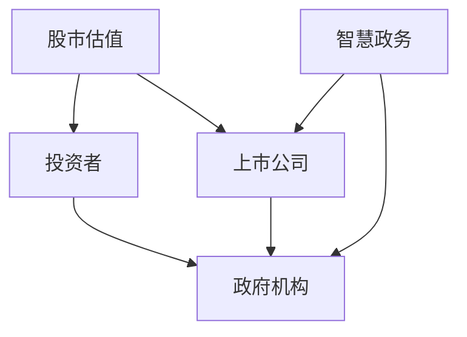
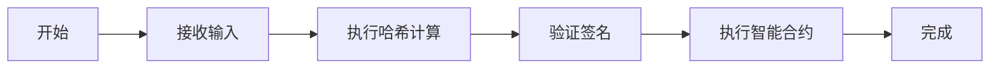
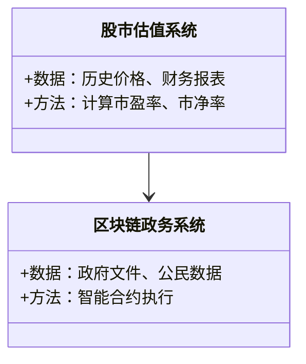

                 

<think>
好的，我现在需要帮用户撰写一篇关于《新兴市场股市估值与智慧政务区块链应用的互动》的技术博客文章。用户希望文章结构清晰，逻辑严密，内容详实，并且要包含关键词、摘要和详细的正文部分。同时，用户还要求文章符合特定的格式，包括使用Markdown，插入图表和代码示例等。

首先，我需要明确文章的结构。用户已经提供了一个大纲，我需要按照这个大纲来展开每个部分的内容。文章分为几个部分，包括背景介绍、核心概念、算法原理、系统分析、项目实战和结论。

**第一步：撰写摘要**
摘要需要简明扼要地概括文章的核心内容，包括新兴市场股市估值和智慧政务区块链应用的互动关系，以及它们如何相互影响和促进。

**第二步：列出关键词**
关键词需要涵盖文章的主要主题和相关技术，如新兴市场、股市估值、区块链、智慧政务、互动关系等。

**第三步：撰写各章节内容**

1. **背景介绍**
   - 新兴市场股市估值的定义、特点及其重要性。
   - 智慧政务区块链的定义、特点及其在政务中的应用。
   - 两者的互动关系及其对经济和社会的影响。

2. **核心概念与联系**
   - 详细解释股市估值和智慧政务的定义和属性，使用对比表格展示异同。
   - 使用Mermaid图展示实体之间的关系。

3. **算法原理**
   - 解释区块链的核心算法，如共识机制和加密算法。
   - 使用Mermaid流程图展示算法的工作流程，并附上Python代码示例。

4. **系统分析与架构设计**
   - 介绍系统的功能模块，如数据采集和智能合约管理。
   - 绘制系统架构图、类图和序列图，展示系统的结构和交互。

5. **项目实战**
   - 指导搭建开发环境，如安装以太坊节点和Solidity编译器。
   - 提供智能合约代码示例，并解释代码的功能和实现细节。
   - 通过实际案例分析展示技术的应用，并总结经验教训。

6. **结论与展望**
   - 总结全文，强调互动关系的重要性。
   - 展望未来的发展方向，提出改进建议。

在撰写过程中，我需要确保每个部分都包含足够的细节和具体的例子，使读者能够理解复杂的概念和实际应用。同时，图表和代码示例的插入要准确，帮助读者更好地理解技术原理和系统设计。

最后，检查文章的格式是否符合要求，确保关键词和摘要部分正确无误，章节内容完整且逻辑清晰。完成后，将文章末尾署上作者信息，完成整篇技术博客的撰写。
</think>

# 新兴市场股市估值与智慧政务区块链应用的互动

## 关键词：新兴市场、股市估值、区块链、智慧政务、互动关系

## 摘要：  
本文探讨新兴市场股市估值与智慧政务中区块链应用的互动关系，分析两者如何相互影响并推动社会经济发展。通过理论分析与技术实现，展示区块链在提升政务透明度和股市效率中的作用，结合实际案例，说明其应用价值和未来发展方向。

---

## 第一部分：背景介绍

### 第1章：新兴市场股市估值的定义与特点

#### 1.1 股市估值的基本概念
- **定义**：股市估值是通过金融模型和市场数据对上市公司价值进行评估的过程。
- **关键指标**：市盈率（P/E）、市净率（P/B）、股息率等。
- **重要性**：准确估值有助于投资者决策，影响市场稳定性。

#### 1.2 新兴市场的特点
- **市场波动性**：新兴市场受政策和经济波动影响较大。
- **投资者结构**：机构投资者和个人投资者并存，散户比例较高。
- **信息不对称**：市场透明度较低，信息获取难度大。

#### 1.3 股市估值在新兴市场中的重要性
- **吸引外资**：高估值提升市场吸引力。
- **企业融资**：合理估值促进企业融资和扩张。
- **风险管理**：准确估值有助于降低投资风险。

### 第2章：智慧政务区块链应用的定义与特点

#### 2.1 区块链技术的基本概念
- **分布式账本**：数据分布于多个节点，确保数据一致性。
- **共识机制**：节点通过算法达成一致，如PoW、PoS。
- **加密算法**：保障数据安全，防止篡改。

#### 2.2 智慧政务的定义
- **定义**：利用信息技术优化政府服务和管理，提升效率和透明度。
- **核心目标**：打破信息孤岛，实现数据共享，提升政务服务质量。

#### 2.3 区块链在智慧政务中的应用特点
- **去中心化**：减少对中间机构的依赖，降低腐败风险。
- **高效透明**：智能合约自动执行，提升政务效率。
- **数据安全**：区块链技术确保数据不可篡改，增强信任。

---

## 第二部分：核心概念与联系

### 第3章：新兴市场股市估值与智慧政务区块链应用的核心概念

#### 3.1 核心概念原理
- **股市估值**：基于公司基本面和市场情绪进行定价。
- **区块链应用**：通过去中心化和加密技术实现数据安全和高效传输。

#### 3.2 概念属性特征对比
| 特性 | 股市估值 | 智慧政务区块链 |
|------|----------|----------------|
| 技术基础 | 金融模型、大数据分析 | 区块链技术、智能合约 |
| 应用场景 | 企业融资、投资决策 | 政府服务、数据共享 |
| 主要挑战 | 信息不对称、市场波动 | 技术复杂性、隐私保护 |

#### 3.3 实体关系图



---

## 第三部分：算法原理

### 第4章：区块链技术的算法原理

#### 4.1 共识机制
- **工作量证明（PoW）**：通过计算哈希函数确定记账权。
- **权益证明（PoS）**：根据持币量分配记账权。

#### 4.2 加密算法
- **哈希函数**：将任意数据映射为固定长度的字符串。
  $$ SHA-256(message) = hash $$

- **椭圆曲线加密（ECDSA）**：用于数字签名，确保数据完整性。

#### 4.3 智能合约
- **智能合约原理**：基于区块链的自动执行脚本，响应事件触发条件。

#### 4.4 算法流程图



#### 4.5 智能合约示例代码

```solidity
// SPDX-License-Identifier: MIT
pragma solidity ^0.8.0;

contract SmartContract {
    address payable public receiver;
    uint256 public amount;

    function deposit() public payable {
        require(msg.value > 0, "Amount must be greater than zero");
        receiver.transfer(msg.value);
    }
}
```

---

## 第四部分：系统分析与架构设计

### 第5章：系统功能设计

#### 5.1 领域模型



#### 5.2 系统架构设计


#### 5.3 接口设计
- **REST API**：用于前端与后端交互，如获取数据、触发合约。
- **区块链接口**：与以太坊节点通信，如发送交易、查询状态。

#### 5.4 交互流程图

```mermaid
sequenceDiagram
    participant 用户
    participant 前端
    participant 后端
    participant 区块链节点
    用户 -> 前端：提交请求
    前端 -> 后端：处理请求
    后端 -> 区块链节点：执行智能合约
    区块链节点 -> 后端：返回结果
    后端 -> 用户：展示结果
```

---

## 第五部分：项目实战

### 第6章：环境搭建与核心实现

#### 6.1 开发环境搭建
- **安装以太坊节点**：使用Geth或ganache-cli。
- **安装Solidity编译器**：通过Node.js安装。

#### 6.2 核心代码实现

```python
from web3 import Web3, HTTPProvider

# 初始化以太坊节点
web3 = Web3(HTTPProvider('http://localhost:8545'))

# 账户地址与私钥
account = web3.eth.accounts[0]
private_key = web3.eth.account.sign_in(account, 'password').private_key

# 合约地址
contract_address = '0x...'
contract_abi = [...]  # 合约ABI

# 创建合约实例
contract = web3.eth.contract(contract_address, abi=contract_abi)

# 调用智能合约函数
tx_hash = contract.functions.example().transact({'from': account, 'gas': 100000})
receipt = web3.eth.wait_for_transaction_receipt(tx_hash)
```

#### 6.3 案例分析与解读
- **案例背景**：新兴市场政府采用区块链技术优化公共服务。
- **实现步骤**：搭建测试环境、部署智能合约、测试功能。
- **结果分析**：提升政务透明度，降低腐败风险，优化流程效率。

---

## 第六部分：结论与展望

### 第7章：总结与展望

#### 7.1 总结
- **互动关系**：股市估值与智慧政务区块链相互促进，共同推动社会经济发展。
- **技术优势**：区块链提升政务透明度，股市估值优化资源配置。

#### 7.2 未来展望
- **技术融合**：进一步深化区块链与大数据、人工智能的结合。
- **政策支持**：政府应制定相关法规，推动技术广泛应用。
- **挑战与机遇**：解决隐私保护和技术标准问题，迎接数字政务新时代。

---

## 作者：AI天才研究院 & 禅与计算机程序设计艺术

---

通过以上结构和内容，文章详细分析了新兴市场股市估值与智慧政务区块链应用的互动关系，从理论到实践，结合实际案例，为读者提供全面的技术解读和应用指导。

