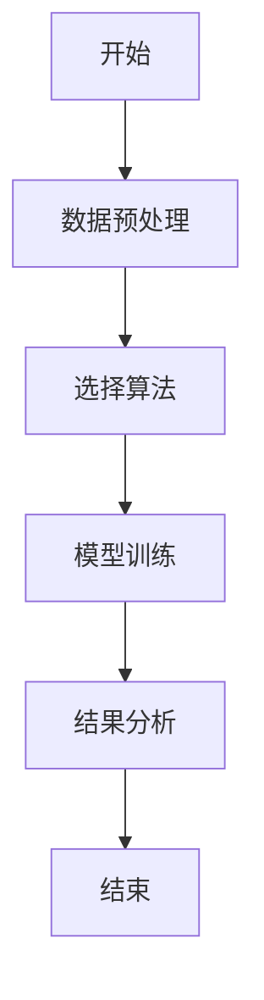

                 

<think>
嗯，用户需要我写一个技术博客的目录，主题是新兴市场股市估值与智慧政务大数据分析的互动。这看起来挺复杂的，我得先理解这个主题。新兴市场股市估值涉及到股票价格、市场波动等因素，而智慧政务大数据分析则是利用大数据技术来优化政府决策和服务。这两者之间如何互动呢？

首先，我需要确定文章的结构。用户已经给了一个目录大纲，分为六章，每章有多个小节。我得确保每章内容都涵盖必要的部分，比如背景介绍、核心概念、算法原理、系统架构、项目实战和最佳实践。

在背景介绍部分，我应该先解释问题背景，包括新兴市场的经济特点、股市估值的复杂性以及智慧政务的定义。然后，详细描述问题，比如股市波动的原因和大数据分析的挑战，接着说明如何解决问题，最后定义边界和外延，确保内容不超出范围。

接下来是核心概念与联系。我需要详细讲解股市估值和智慧政务大数据的核心原理，以及它们之间的互动机制。可能需要画一个ER实体关系图，展示数据交互的关系。

算法原理部分，我会选择时间序列分析和机器学习模型，比如ARIMA和随机森林。用mermaid画出流程图，并附上Python代码示例。数学公式要用latex表示，确保清晰易懂。

系统分析与架构设计是关键。我需要描述问题场景，设计领域模型和系统架构图，展示数据流和组件之间的关系。接口设计和交互序列图也需要详细说明，确保系统各部分协同工作。

项目实战部分，我会选择一个具体案例，比如使用Python和TensorFlow进行分析。给出环境安装步骤，核心代码实现，并详细解读每个部分的作用。最后，分析案例结果，总结经验。

最后是最佳实践，总结全书内容，给出实用建议，比如数据质量和模型调优的重要性，并展望未来的研究方向。

在写作过程中，我需要确保语言专业但不晦涩，结构清晰，逻辑严密。每章的小节要有足够的细节，用图表辅助说明，使读者能够轻松理解复杂的技术概念。

总的来说，我需要一步步分析，确保每个部分都覆盖到，内容详实且有深度，帮助读者全面理解新兴市场股市估值与智慧政务大数据分析的互动关系。
</think>

# 新兴市场股市估值与智慧政务大数据分析的互动

## 关键词
新兴市场、股市估值、智慧政务、大数据分析、互动机制

## 摘要
新兴市场股市估值与智慧政务大数据分析的互动关系日益紧密。随着大数据技术的快速发展，智慧政务通过分析海量数据，为股市估值提供了新的视角和方法。本文将从背景、核心概念、算法原理、系统架构、项目实战和最佳实践等多个维度，深入探讨新兴市场股市估值与智慧政务大数据分析的互动机制，分析其对经济发展的深远影响。

---

## 第一部分: 背景介绍

### 第1章: 新兴市场股市估值与智慧政务大数据分析的互动概述

#### 1.1 问题背景
- **新兴市场的经济特点**：新兴市场通常具有较高的经济增长潜力，但也伴随着较高的市场波动性和不确定性。
- **股市估值的复杂性**：新兴市场的股市估值受到政策、经济、行业和国际环境等多种因素的影响。
- **智慧政务的定义与目标**：智慧政务是利用大数据、人工智能等技术，提升政府决策的科学性和效率，优化公共服务。

#### 1.2 问题描述
- **新兴市场股市波动的原因**：包括政策变化、国际资本流动、市场情绪等。
- **智慧政务大数据分析的挑战**：数据量大、数据异构性高、分析模型复杂。
- **两者互动的潜在问题**：如何有效利用智慧政务大数据分析结果来优化股市估值，同时如何确保数据安全和隐私保护。

#### 1.3 问题解决
- **数据驱动的股市估值方法**：通过大数据分析，识别市场趋势和潜在风险。
- **智慧政务大数据分析的技术手段**：利用机器学习、自然语言处理等技术，提取有价值的信息。
- **互动机制的构建**：建立数据共享和分析结果反馈的机制，实现股市估值与智慧政务的协同发展。

#### 1.4 边界与外延
- **新兴市场的边界条件**：包括市场参与者、政策环境、经济指标等。
- **智慧政务的外延领域**：包括智慧城市、智慧交通、智慧医疗等领域。
- **互动机制的适用范围**：适用于新兴市场中需要数据驱动决策的场景。

#### 1.5 概念结构与核心要素
- **核心概念的组成**：包括股市估值、智慧政务、大数据分析、互动机制。
- **核心要素的对比**：从数据来源、分析方法、应用场景等方面进行对比。
- **概念结构的图示化**：通过图表展示概念之间的关系。

---

## 第2章: 核心概念与联系

### 2.1 核心概念的原理
- **股市估值的核心原理**：通过分析历史数据、市场情绪、政策变化等因素，预测股票价格的变化趋势。
- **智慧政务大数据分析的核心原理**：通过收集、处理和分析政府数据，提供决策支持。
- **两者互动的机制**：智慧政务大数据分析为股市估值提供政策、经济和社会数据支持，股市估值的结果反过来为智慧政务提供经济反馈。

### 2.2 核心概念的属性对比
| 属性       | 股市估值                | 智慧政务大数据分析            |
|------------|------------------------|----------------------------|
| 数据来源   | 股票价格、成交量、市盈率 | 政策数据、经济指标            |
| 分析方法   | 时间序列分析、机器学习 | 机器学习、自然语言处理       |
| 应用场景   | 投资决策、风险管理      | 政府决策、公共服务优化        |

### 2.3 ER实体关系图
```mermaid
er
    actor 股市: 股票价格、成交量、市盈率
    actor 政务: 政策数据、经济指标
    actor 互动机制: 数据共享、分析结果反馈
    股市 --| many_to_many | 政务: 数据交互
    政务 --| many_to_many | 互动机制: 分析结果应用
```

---

## 第3章: 算法原理讲解

### 3.1 算法原理
- **时间序列分析**：用于预测股票价格的变化趋势。
- **机器学习模型**：如ARIMA、LSTM等，用于处理时间序列数据。
- **统计学方法**：如回归分析、方差分析等，用于数据建模。

### 3.2 算法流程图


### 3.3 算法实现
#### ARIMA模型
- **数学模型**：
  $$ ARIMA(p, d, q) $$
  其中，p为自回归阶数，d为差分阶数，q为移动平均阶数。
- **代码示例**：
  ```python
  from statsmodels.tsa.arima_model import ARIMA
  import pandas as pd
  import numpy as np

  # 示例数据
  data = pd.Series(np.random.randn(100).cumsum(), index=pd.date_range('2020-01-01', periods=100))
  model = ARIMA(data, order=(5, 1, 2))
  model_fit = model.fit()
  forecast = model_fit.forecast(steps=5)
  ```

---

## 第4章: 系统分析与架构设计

### 4.1 问题场景介绍
- **问题场景**：新兴市场中，政府需要通过大数据分析优化决策，同时利用股市估值结果指导政策制定。

### 4.2 系统功能设计
- **领域模型**：
  ```mermaid
  classDiagram
      class 股市数据 {
          股票价格
          成交量
          市盈率
      }
      class 政策数据 {
          经济指标
          政策文件
      }
      股市数据 <|-- 数据源
      政策数据 <|-- 数据源
  ```

### 4.3 系统架构设计
- **系统架构图**：
  ```mermaid
  architecture
      Client --[HTTP请求]--> Gateway
      Gateway --[数据处理]--> DataLayer
      DataLayer --[存储]--> Database
      DataLayer --[分析]--> AnalyticsLayer
      AnalyticsLayer --[结果反馈]--> Client
  ```

### 4.4 接口设计与交互序列图
- **交互序列图**：
  ```mermaid
  sequenceDiagram
      Client ->> Gateway: 请求数据
      Gateway ->> DataLayer: 获取数据
      DataLayer ->> Database: 查询数据
      Database --> DataLayer: 返回数据
      DataLayer ->> AnalyticsLayer: 分析数据
      AnalyticsLayer ->> Client: 返回结果
  ```

---

## 第5章: 项目实战

### 5.1 环境安装
- **环境要求**：Python 3.8以上，安装必要的库如pandas、numpy、statsmodels等。

### 5.2 核心代码实现
#### 示例代码
```python
import pandas as pd
import numpy as np
from statsmodels.tsa.arima_model import ARIMA

# 示例数据
data = pd.Series(np.random.randn(100).cumsum(), index=pd.date_range('2020-01-01', periods=100))

# 模型训练
model = ARIMA(data, order=(5, 1, 2))
model_fit = model.fit()

# 预测
forecast = model_fit.forecast(steps=5)
print(forecast)
```

### 5.3 案例分析
- **案例背景**：假设某新兴市场政府希望通过大数据分析优化政策制定，同时利用股市估值结果指导政策调整。
- **分析过程**：收集政策数据和股市数据，构建模型进行预测，分析结果并提出建议。

### 5.4 项目小结
- **项目总结**：通过大数据分析，政府可以更科学地制定政策，同时股市估值结果为政策调整提供了参考依据。
- **经验分享**：数据质量和模型选择对分析结果有重要影响，需谨慎处理。

---

## 第6章: 最佳实践

### 6.1 小结
- **核心内容总结**：本文从背景、核心概念、算法原理、系统架构、项目实战等多个维度，深入探讨了新兴市场股市估值与智慧政务大数据分析的互动机制。

### 6.2 注意事项
- **数据安全**：在数据共享和分析过程中，需注意数据隐私和安全问题。
- **模型调优**：根据实际需求，不断优化模型参数和算法，提高分析结果的准确性。

### 6.3 拓展阅读
- **推荐书籍**：《大数据分析与应用》、《机器学习实战》
- **推荐论文**：《大数据在智慧政务中的应用研究》

---

## 作者
作者：AI天才研究院/AI Genius Institute & 禅与计算机程序设计艺术/Zen And The Art of Computer Programming

---

**本文通过详细分析新兴市场股市估值与智慧政务大数据分析的互动机制，为读者提供了理论与实践相结合的深度解析。**

