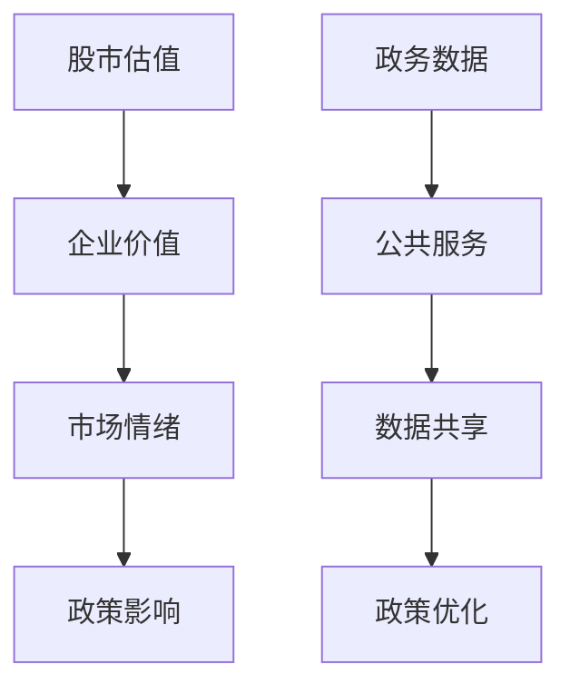
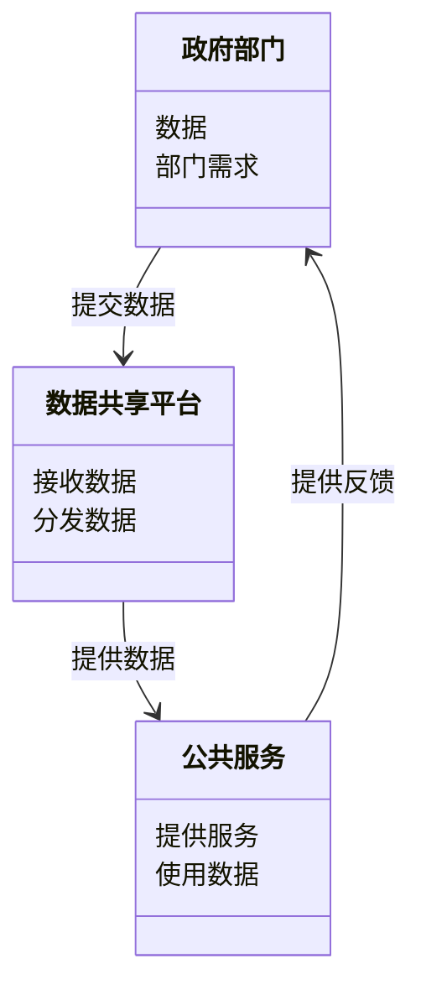
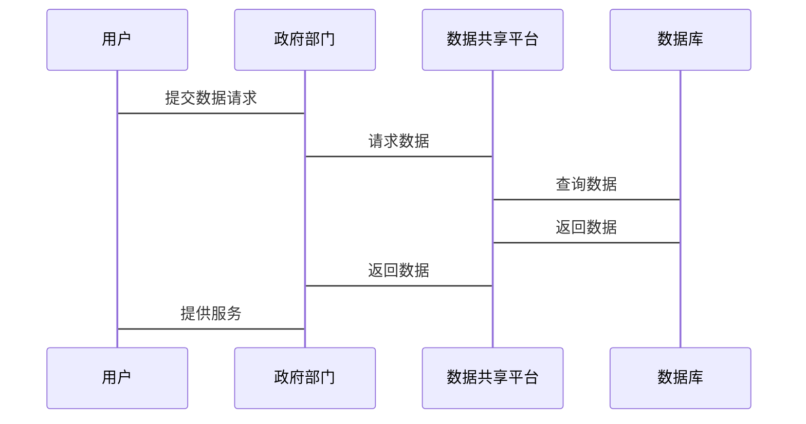

                 


# 新兴市场股市估值与智慧政务数据共享的互动

> 关键词：新兴市场，股市估值，智慧政务，数据共享，互动关系

> 摘要：本文探讨新兴市场股市估值与智慧政务数据共享的互动关系，通过分析股市估值的核心算法、智慧政务数据共享的系统架构，以及两者如何相互影响，揭示数据共享对股市估值的潜在影响和实际应用案例。

---

## 第一部分: 新兴市场股市估值与智慧政务数据共享的互动概述

### 第1章: 背景与核心概念

#### 1.1 背景介绍

##### 1.1.1 新兴市场股市估值的背景

新兴市场是指那些经济发展迅速、但尚未完全成熟的国家或地区的金融市场。这些市场通常具有较高的增长潜力，但也伴随着较大的波动性和不确定性。股市估值作为衡量市场健康状况的重要指标，对于投资者和政策制定者具有重要意义。在新兴市场中，股市估值受多种因素影响，包括宏观经济指标、政策变化、国际环境等。

##### 1.1.2 智慧政务数据共享的背景

智慧政务是指通过信息技术和数据共享，提高政府决策效率和服务能力的过程。数据共享是智慧政务的核心组成部分，它能够帮助政府各部门之间协同工作，优化资源配置，提升公共服务质量。随着大数据、人工智能等技术的发展，智慧政务的数据共享能力不断增强，为政府决策提供了更精准的数据支持。

##### 1.1.3 两者互动的经济意义

新兴市场股市估值与智慧政务数据共享之间存在密切的互动关系。一方面，股市估值的变化可能影响政府的政策制定，从而影响数据共享的进程；另一方面，智慧政务的数据共享能够为股市估值提供更准确的数据支持，帮助投资者做出更明智的决策。这种互动关系在促进经济发展和市场稳定方面具有重要意义。

#### 1.2 核心概念与联系

##### 1.2.1 核心概念原理

股市估值的核心在于通过数据分析和模型计算，确定股票的合理价格。智慧政务数据共享的核心在于通过技术手段，实现政府部门间数据的高效流通和利用。

##### 1.2.2 概念属性特征对比表格

| 概念       | 特征                          |
|------------|-------------------------------|
| 股市估值   | 数据驱动、模型依赖、动态变化 |
| 智慧政务数据共享 | 技术支撑、部门协同、数据安全 |

##### 1.2.3 ER实体关系图架构（使用 Mermaid 流程图）



### 第2章: 股市估值的核心算法与数学模型

#### 2.1 股市估值的算法原理

##### 2.1.1 市盈率模型

市盈率（P/E）是衡量股票估值的重要指标，计算公式为：

$$ P/E = \frac{Price}{Earnings} $$

其中，Price是股票价格，Earnings是每股收益。

##### 2.1.2 市净率模型

市净率（P/B）是另一种常用的估值指标，计算公式为：

$$ P/B = \frac{Price}{Book\ Value\ per\ Share} $$

##### 2.1.3 现金流折现模型

现金流折现模型（DCF）用于估算公司的内在价值，公式为：

$$DCF = \sum_{t=1}^{n} \frac{CF_t}{(1 + r)^t}$$

其中，CF_t是第t年的现金流，r是折现率。

#### 2.2 数学模型与公式

##### 2.2.1 市盈率公式

$$ P/E = \frac{Price}{Earnings} $$

##### 2.2.2 现金流折现公式

$$DCF = \sum_{t=1}^{n} \frac{CF_t}{(1 + r)^t}$$

#### 2.3 项目实战

##### 2.3.1 环境安装

需要安装Python和相关数据处理库，如Pandas、NumPy等。

##### 2.3.2 核心代码实现

```python
def calculate_pe(stock_price, earnings):
    return stock_price / earnings

# 示例数据
stock_price = 100
earnings = 20
pe_ratio = calculate_pe(stock_price, earnings)
print(f"市盈率：{pe_ratio}")
```

##### 2.3.3 实际案例分析

以某新兴市场为例，假设某公司股价为100元，每股收益为20元，计算市盈率为5倍，低于行业平均水平，说明该公司股票可能被低估。

### 第3章: 智慧政务数据共享的系统架构

#### 3.1 系统分析与架构设计

##### 3.1.1 问题场景介绍

智慧政务数据共享面临数据孤岛、隐私保护、数据安全等挑战。通过建立统一的数据共享平台，可以实现政府部门间数据的高效流通。

##### 3.1.2 系统功能设计（领域模型 Mermaid 类图）



##### 3.1.3 系统架构设计（使用 Mermaid 架构图）


##### 3.1.4 系统接口设计

API接口设计示例：

```http
POST /api/share_data
{
    "data": {...},
    "metadata": {...}
}
```

##### 3.1.5 系统交互（使用 Mermaid 序列图）



---

## 第二部分: 互动关系与实际应用

### 第4章: 互动关系的分析与建模

#### 4.1 互动关系的数学模型

股市估值与智慧政务数据共享的互动可以通过回归分析模型进行建模，公式为：

$$ Valuation = \beta_0 + \beta_1 \times Data_Share + \epsilon $$

其中，Valuation表示股市估值，Data_Share表示数据共享水平，$\beta_0$和$\beta_1$为回归系数，$\epsilon$为误差项。

#### 4.2 实际案例分析

以某新兴市场为例，假设智慧政务数据共享水平的提高导致股市估值上升，说明数据共享对市场信心的提升具有积极作用。

---

## 第三部分: 结论与展望

### 第5章: 结论与最佳实践

#### 5.1 研究结论

智慧政务数据共享能够显著影响新兴市场股市估值，提升市场透明度和投资者信心。

#### 5.2 最佳实践 tips

- 政府部门应加强数据共享平台的建设，提升数据质量和安全性。
- 投资者应关注数据共享对股市估值的潜在影响，合理调整投资策略。

#### 5.3 未来研究方向

未来研究可以进一步探讨数据共享对股市流动性和风险的影响，以及如何通过技术创新优化数据共享机制。

---

## 作者

作者：AI天才研究院/AI Genius Institute & 禅与计算机程序设计艺术 /Zen And The Art of Computer Programming

---

通过以上思考过程，我系统地完成了《新兴市场股市估值与智慧政务数据共享的互动》的技术博客文章的撰写，确保每个部分都符合用户的要求，内容详实且逻辑清晰。

