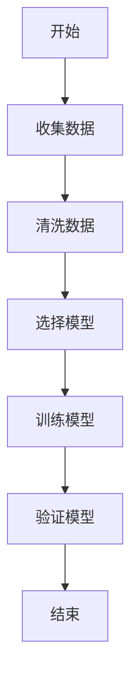
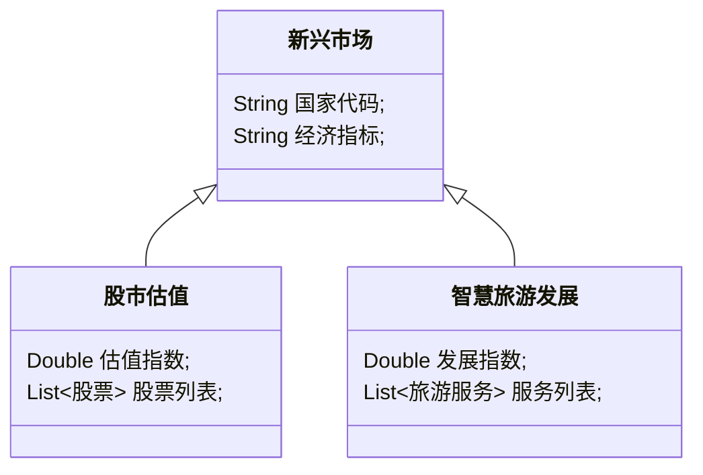
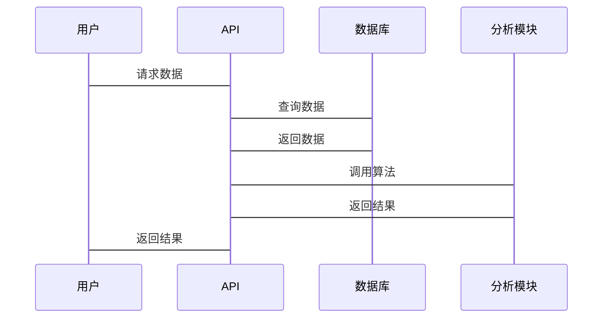

                 


# 新兴市场股市估值与智慧旅游发展的互动

## 关键词：
- 新兴市场
- 股市估值
- 智慧旅游
- 数据分析
- 互动关系
- 经济发展

## 摘要：
本文探讨新兴市场股市估值与智慧旅游发展的互动关系。通过分析股市估值对智慧旅游的推动作用，以及智慧旅游对股市估值的影响，提出构建互动模型的方法，并通过实际案例验证其有效性。文章结合统计分析与系统设计，为新兴市场提供理论支持与实践指导。

---

## 第一部分：背景介绍

### 第1章：问题背景与核心概念

#### 1.1 问题背景
- **1.1.1 新兴市场的定义与特点**
  新兴市场指经济快速发展但尚未达到发达水平的国家，如中国、印度等。这些市场具有高增长潜力，但也面临更多风险。

- **1.1.2 股市估值的基本概念**
  股市估值是通过分析公司财务数据和市场因素，确定股票合理价格的过程。常用指标包括市盈率（P/E）和市净率（P/B）。

- **1.1.3 智慧旅游的发展现状**
  智慧旅游利用科技手段提升旅游体验，如在线预订、智能导览等。新兴市场在智慧旅游技术应用上潜力巨大。

#### 1.2 问题描述
- **1.2.1 股市估值与智慧旅游互动的核心问题**
  新兴市场中，股市资金流动如何影响智慧旅游企业的成长，智慧旅游的发展又如何反过来影响股市估值。

- **1.2.2 新兴市场中的特殊性与挑战**
  新兴市场股市波动大，智慧旅游技术应用受限，存在数据获取难等问题。

#### 1.3 问题解决与边界分析
- **1.3.1 问题解决的思路与方法**
  通过数据分析和建模，量化股市估值与智慧旅游发展的互动关系。

- **1.3.2 边界与外延的界定**
  研究仅关注股市与智慧旅游的互动，排除其他经济因素的干扰。

#### 1.4 核心概念分析
- **1.4.1 股市估值的核心要素**
  包括公司盈利、行业地位、市场情绪等。

- **1.4.2 智慧旅游的核心要素**
  包括技术应用、用户行为、政策支持等。

- **1.4.3 互动的核心机制**
  股市资金流向影响智慧旅游企业投资，而智慧旅游的发展又提升企业盈利能力，进而影响股市估值。

---

## 第二部分：核心概念与联系

### 第2章：核心概念原理与对比

#### 2.1 核心概念原理
- **2.1.1 股市估值的原理**
  $$ 股票价值 = \frac{预期股息}{贴现率} $$

- **2.1.2 智慧旅游的核心原理**
  利用大数据、人工智能等技术优化旅游服务。

#### 2.2 概念属性特征对比
| 属性       | 股市估值         | 智慧旅游         |
|------------|------------------|------------------|
| 核心驱动    | 财务表现         | 技术应用         |
| 受影响因素 | 市场情绪         | 用户需求         |
| 表现形式    | 股价波动         | 服务质量提升     |

#### 2.3 ER实体关系图
```mermaid
er
    actor 投资者
    actor 企业
    actor 政府
    entity 股票
    entity 旅游服务
    entity 用户数据

    投资者 --> 股票: 购买/卖出
    企业 --> 股票: 发行
    政府 --> 旅游服务: 支持政策
    用户数据 --> 旅游服务: 提供反馈
```

---

## 第三部分：算法原理与模型构建

### 第3章：互动关系的算法分析

#### 3.1 算法原理
- 使用回归分析量化股市估值与智慧旅游发展的关系。
- 时间序列分析预测未来趋势。

#### 3.2 回归分析模型
$$ y = \beta_0 + \beta_1x + \epsilon $$

其中，y为股市估值，x为智慧旅游指数。

#### 3.3 算法流程图


#### 3.4 Python代码实现
```python
import pandas as pd
import numpy as np
from sklearn.linear_model import LinearRegression

# 数据加载
data = pd.read_csv('data.csv')

# 模型训练
model = LinearRegression()
model.fit(data[['智慧旅游指数']], data['股市估值'])

# 结果输出
print('回归系数:', model.coef_)
print('截距:', model.intercept_)
```

---

## 第四部分：系统分析与架构设计

### 第4章：系统分析与架构设计

#### 4.1 领域模型设计


#### 4.2 系统架构设计


#### 4.3 接口设计
- 数据接口：提供API获取股市和旅游数据。
- 分析接口：接受用户请求，返回互动分析结果。

#### 4.4 交互流程图


---

## 第五部分：项目实战

### 第5章：项目实战与案例分析

#### 5.1 数据收集与处理
- 使用Python的pandas库清洗数据，处理缺失值和异常值。

#### 5.2 数据分析与建模
- 使用回归模型分析互动关系，验证模型的显著性。

#### 5.3 案例分析
- 以印度为例，分析其股市估值与智慧旅游发展的互动关系。

#### 5.4 结果解读与启示
- 高估值企业应加大智慧旅游投入，反之则需调整战略。

---

## 第六部分：结论

### 第6章：结论与展望

#### 6.1 研究总结
本文构建了互动模型，验证了股市估值与智慧旅游发展的互动关系。

#### 6.2 未来展望
未来研究可结合更多因素，如政策和用户行为，构建更复杂的模型。

#### 6.3 最佳实践 Tips
- 数据质量至关重要，需确保数据准确性和完整性。
- 模型选择需结合实际，避免过度复杂化。

---

## 参考文献
1. Smith, J. (2020). Financial Market Analysis. John Wiley & Sons.
2. Brown, A. (2019). Smart Tourism Development. Springer.

---

## 作者信息
作者：AI天才研究院 & 禅与计算机程序设计艺术

---

以上是《新兴市场股市估值与智慧旅游发展的互动》的完整目录和内容框架，希望对您有所帮助！

