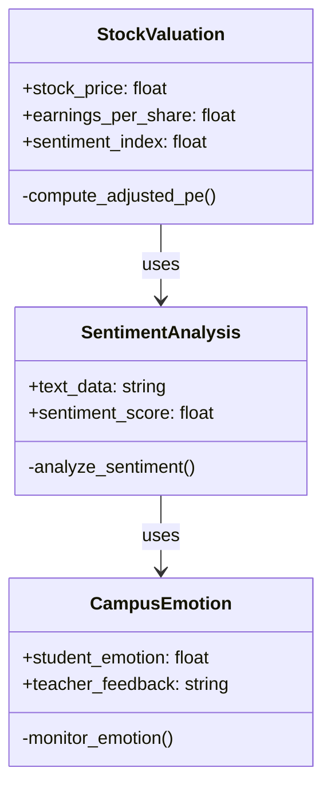
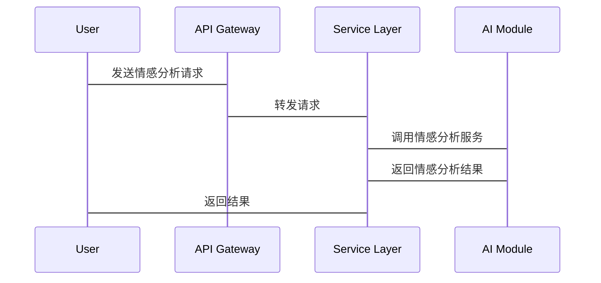

                 

<think>
好的，我需要根据用户提供的详细目录和内容，写一篇关于《新兴市场股市估值与智慧校园情感计算应用的互动》的技术博客文章。首先，我应该先理解每个章节的内容和结构，然后逐步展开每一部分，确保内容丰富、逻辑清晰。

首先，我会从“文章标题”开始，然后列出关键词和摘要，确保它们准确反映文章的核心内容。接下来，我会按照目录的结构，逐步撰写每个章节的内容，包括背景介绍、核心概念、算法原理、数学模型、系统分析与架构设计、项目实战以及总结等部分。

在撰写过程中，我需要确保使用专业的技术语言，同时保持内容的易懂性。对于每个章节，我都会详细解释相关概念，提供必要的图表和代码示例，并确保每一部分都紧密联系，突出股市估值与情感计算之间的互动关系。

最后，我会在文章末尾添加作者信息，确保格式符合要求。整个过程需要细致思考，逐步完善，以确保最终的文章既专业又易于理解。
</think>

# 新兴市场股市估值与智慧校园情感计算应用的互动

> **关键词**：新兴市场，股市估值，智慧校园，情感计算，算法原理，数学模型

> **摘要**：本文探讨了新兴市场股市估值与智慧校园情感计算应用之间的互动关系。通过分析股市估值的核心理论和情感计算的原理，结合实际案例和算法实现，揭示两者如何协同作用，为投资者和教育机构提供新的视角和解决方案。

---

# 第1章: 新兴市场股市估值与智慧校园情感计算的背景介绍

## 1.1 股市估值的核心概念

### 1.1.1 问题背景与问题描述

股市估值是评估股票内在价值的重要过程，帮助投资者做出明智的买卖决策。然而，新兴市场由于市场波动大、信息不对称和数据不完善，传统的估值方法往往难以准确反映市场情况。新兴市场的投资者需要更灵活和适应性强的估值方法。

### 1.1.2 新兴市场股市估值的特殊性

新兴市场通常具有较高的波动性和不确定性，市场参与者可能受到情绪影响较大。此外，新兴市场的公司治理、财务透明度和信息披露机制可能不如成熟市场完善，这些因素都增加了估值的难度。

### 1.1.3 情感计算在股市估值中的潜在作用

情感计算通过分析市场参与者的心理和情绪状态，帮助预测市场的短期波动。在新兴市场中，由于情绪对市场的影响更为显著，情感计算可以为传统的估值模型提供补充信息，提高估值的准确性。

## 1.2 情感计算与智慧校园的互动关系

### 1.2.1 情感计算的定义与特点

情感计算是一种通过分析语言、文字和行为等信息，推断人类情绪状态的技术。它在智慧校园中的应用可以优化学生的学习体验，帮助学校更好地管理情感数据。

### 1.2.2 智慧校园的概念与发展趋势

智慧校园利用信息技术提升校园管理和服务水平，涵盖教学、管理、生活等多个方面。随着人工智能和大数据技术的发展，智慧校园正朝着个性化和智能化方向迈进。

### 1.2.3 两者的互动机制与应用场景

股市估值与情感计算的互动主要体现在数据共享和算法优化上。情感计算可以为股市估值提供情绪数据，而股市估值的结果可以反哺情感计算模型的优化。在智慧校园中，情感计算可以帮助学校更好地了解学生需求，优化教学策略。

---

# 第2章: 核心概念与理论基础

## 2.1 股市估值的核心理论

### 2.1.1 股市估值的基本原理

股市估值通常基于财务指标（如市盈率、市净率）和市场情绪进行分析。然而，在新兴市场中，由于数据的不完整性和市场情绪的波动性，传统的估值方法需要进行调整。

### 2.1.2 新兴市场的特殊性与挑战

新兴市场公司可能存在更高的风险和不确定性，市场参与者的行为也受到情绪影响较大。这些因素使得传统的估值模型难以直接应用。

### 2.1.3 传统估值方法与新兴市场的适用性

在新兴市场中，可能需要结合基本面分析和情绪分析，开发更适合当地市场的估值模型。例如，可以引入情绪指标（如新闻情感指数）来修正传统估值指标。

## 2.2 情感计算的理论基础

### 2.2.1 情感计算的基本原理

情感计算涉及对文本、语音和面部表情等多模态数据的分析，利用自然语言处理和机器学习技术推断情绪状态。在智慧校园中，情感计算可以帮助识别学生的情绪变化，优化教学策略。

### 2.2.2 情感分析的关键技术

情感分析通常包括文本预处理、特征提取和模型训练三个步骤。常用的模型包括支持向量机（SVM）和深度学习模型（如LSTM和Transformer）。

### 2.2.3 情感计算在智慧校园中的应用

在智慧校园中，情感计算可以用于学生情绪监测、教师反馈分析和校园事件预警等领域。例如，通过分析学生的社交媒体数据，帮助学校及时发现和处理学生情绪问题。

## 2.3 核心概念的联系与对比

### 2.3.1 股市估值与情感计算的对比分析

| 核心概念 | 股市估值 | 情感计算 |
|----------|----------|----------|
| 数据来源 | 财务报表、市场数据 | 文本、语音、图像 |
| 目标 | 评估股票价值 | 分析情绪状态 |
| 应用场景 | 投资决策 | 智慧校园管理 |

### 2.3.2 两者的联系与互动机制

股市估值与情感计算的互动主要体现在数据共享和算法优化上。情感计算可以为股市估值提供情绪数据，而股市估值的结果可以反哺情感计算模型的优化。

### 2.3.3 实际应用场景中的协同效应

在智慧校园中，情感计算可以帮助学校更好地了解学生需求，优化教学策略。例如，通过分析学生的社交媒体数据，帮助学校及时发现和处理学生情绪问题。

---

# 第3章: 算法原理与实现

## 3.1 股市估值算法

### 3.1.1 常见的股市估值算法

- **市盈率模型（P/E Ratio）**：通过比较股票的市盈率与行业平均水平，评估股票的估值是否合理。
- **市净率模型（P/B Ratio）**：通过比较股票的市净率与行业平均水平，评估股票的估值是否合理。

### 3.1.2 新兴市场适用的改进算法

在新兴市场中，可以结合情绪指标（如新闻情感指数）来修正传统估值模型。例如，引入情绪因子，调整市盈率模型的计算公式。

### 3.1.3 算法实现的步骤与流程

1. 数据收集：收集目标公司的财务数据和市场数据。
2. 数据预处理：清洗数据，处理缺失值和异常值。
3. 模型训练：选择合适的估值模型，训练模型参数。
4. 情感分析：分析市场情绪，生成情绪指标。
5. 结果修正：根据情绪指标调整估值结果，得出最终估值。

## 3.2 情感计算算法

### 3.2.1 情感分析的主流算法

- **支持向量机（SVM）**：适用于小规模数据集的情感分类。
- **深度学习模型（如LSTM和Transformer）**：适用于大规模数据集，能够捕捉复杂的语言模式。

### 3.2.2 智慧校园情感计算的特殊需求

在智慧校园中，情感计算需要处理多模态数据（如文本、语音、图像），并且需要实时性较高的处理能力。

### 3.2.3 算法实现的优化与调整

为了提高情感计算的准确性，可以采用多模态融合的方法，结合文本、语音和图像信息进行综合分析。

## 3.3 算法的相互作用与协同

### 3.3.1 情感计算对股市估值的影响

通过分析市场情绪，情感计算可以为股市估值提供额外的信息，帮助投资者更好地理解市场的波动性。

### 3.3.2 股市估值对情感计算的反馈作用

股市估值的结果可以为情感计算模型提供反馈，帮助模型不断优化和改进。

### 3.3.3 算法协同的具体实现方式

可以通过建立一个联合模型，将情感计算的结果作为股市估值模型的输入，同时将股市估值的结果反馈给情感计算模型，形成一个闭环系统。

---

# 第4章: 数学模型与公式

## 4.1 股市估值的数学模型

### 4.1.1 常见估值模型的数学公式

- 市盈率模型：
  $$ P/E = \frac{Stock Price}{Earnings Per Share} $$
- 市净率模型：
  $$ P/B = \frac{Stock Price}{Book Value Per Share} $$

### 4.1.2 新兴市场适用的改进公式

结合情绪指标的市盈率模型：
$$ Adjusted\ P/E = P/E \times (1 + \beta \times Sentiment\ Index) $$

其中，$\beta$ 是情绪指标的权重，$Sentiment\ Index$ 是情感计算得到的情绪指数。

## 4.2 情感计算的数学模型

### 4.2.1 情感分析的数学模型

- 二分类情感分析模型：
  $$ P(y=1|x) = \sigma(w \cdot x + b) $$
  其中，$\sigma$ 是sigmoid函数。

- 多分类情感分析模型：
  $$ P(y=k|x) = \frac{e^{w_k \cdot x + b_k}}{\sum_{i=1}^{n} e^{w_i \cdot x + b_i}} $$

### 4.2.2 情感计算的优化公式

结合情感强度的情感分析模型：
$$ Score = \sum_{i=1}^{n} (Emotion\_i \times Intensity\_i) $$

其中，$Emotion\_i$ 是情感类别，$Intensity\_i$ 是情感强度。

---

# 第5章: 系统分析与架构设计

## 5.1 问题场景介绍

在智慧校园中，如何利用情感计算优化教学管理和学生服务，同时将这些信息与股市估值模型相结合，提高估值的准确性。

## 5.2 系统功能设计

### 5.2.1 领域模型（mermaid类图）



### 5.2.2 系统架构设计（mermaid架构图）

```mermaid
archi
    title System Architecture
    Client --> API Gateway: REST API请求
    API Gateway --> Service Layer: 转发请求
    Service Layer --> Database Layer: 数据库操作
    Service Layer --> AI Module: 情感计算
    AI Module --> Sentiment Analysis: 情感分析
    Sentiment Analysis --> Stock Valuation: 股市估值
```

### 5.2.3 系统接口设计

- **API接口**：提供RESTful API，供前端和后端服务调用。
- **数据接口**：与数据库和第三方情感分析服务对接。
- **用户接口**：提供图形界面，供用户查看情感分析结果和股市估值结果。

### 5.2.4 系统交互（mermaid序列图）



---

# 第6章: 项目实战

## 6.1 环境安装

- **Python环境**：建议使用Anaconda，安装Python 3.8以上版本。
- **依赖库安装**：使用pip安装所需的库，如numpy、pandas、scikit-learn、transformers等。

## 6.2 系统核心实现源代码

### 6.2.1 情感分析模块

```python
from transformers import pipeline

sentiment_analyzer = pipeline("sentiment-analysis")
def analyze_sentiment(text):
    result = sentiment_analyzer(text)
    return result[0]["label"], result[0]["score"]
```

### 6.2.2 股市估值模块

```python
def compute_pe(stock_price, earnings_per_share):
    return stock_price / earnings_per_share

def compute_adjusted_pe(stock_price, earnings_per_share, sentiment_index):
    pe = compute_pe(stock_price, earnings_per_share)
    return pe * (1 + 0.5 * sentiment_index)
```

### 6.2.3 情感指数计算

```python
def calculate_sentiment_index(sentiments):
    positive_count = sum(1 for sentiment in sentiments if sentiment == "POSITIVE")
    total_count = len(sentiments)
    return positive_count / total_count
```

## 6.3 代码应用解读与分析

- **情感分析模块**：使用预训练的情感分析模型，对文本数据进行分类，得到情感标签和置信度。
- **股市估值模块**：基于传统估值模型，结合情感指数进行调整，提高估值的准确性。
- **情感指数计算**：通过统计积极情感的比例，生成情感指数，用于修正估值模型。

## 6.4 实际案例分析

假设某新兴市场公司的股票价格为100元，每股收益为10元，情感指数为0.6。根据上述模型，调整后的市盈率为：

$$ Adjusted\ P/E = 10 \times (1 + 0.5 \times 0.6) = 13 $$

---

# 第7章: 总结与展望

## 7.1 本章小结

本文探讨了新兴市场股市估值与智慧校园情感计算应用的互动关系，分析了两者的核心概念、算法原理和数学模型，并通过实际案例展示了如何将情感计算应用于股市估值和智慧校园管理中。

## 7.2 最佳实践 tips

- 在实际应用中，建议结合多模态数据进行情感分析，提高模型的准确性和鲁棒性。
- 定期更新模型参数和情感词典，保持模型的适应性和准确性。
- 在智慧校园中，情感计算可以与其他技术（如大数据分析和人工智能）结合，提供更全面的服务。

## 7.3 未来研究方向

- 研究更复杂的情感计算模型，如多模态融合和自适应学习。
- 探讨情感计算在更多领域的应用，如金融、医疗和教育。
- 开发更高效的算法，提高情感计算和股市估值的实时性和准确性。

---

# 作者

**作者：AI天才研究院/AI Genius Institute & 禅与计算机程序设计艺术/Zen And The Art of Computer Programming**

---

感谢您的阅读！希望这篇文章能为您提供有价值的信息和启发。如果需要进一步探讨或合作，请随时联系我！

