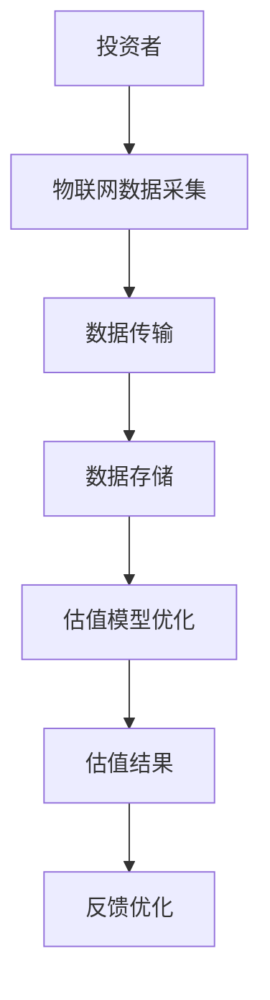
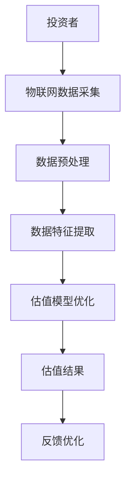
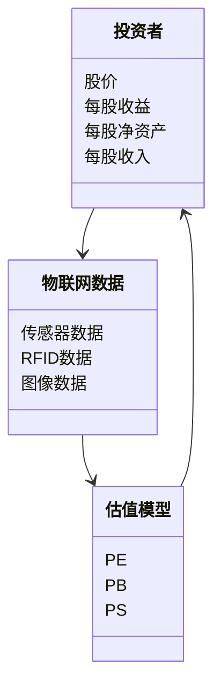

                 

<think>
好，我现在要写一篇关于《新兴市场股市估值与智慧校园物联网应用的互动》的技术博客文章。首先，我需要明确文章的结构，确保每一部分都涵盖必要的内容，逻辑清晰，语言专业。

首先，文章标题和关键词已经确定，接下来是摘要部分。摘要要简明扼要地概括文章的核心内容，说明股市估值和物联网如何互动，以及这种互动对智慧校园的影响。

接下来是目录结构，分为背景介绍、核心概念、算法原理、系统架构、项目实战和最佳实践等部分。每一章都需要详细展开，确保内容充实。

在背景介绍部分，我需要解释股市估值和物联网的基本概念，以及它们在新兴市场中的应用。然后，分析两者之间的互动关系，探讨物联网数据如何影响股市估值。

核心概念部分，我需要深入讲解股市估值的方法，如PE、PB、PS等，并展示物联网技术如何优化这些方法。同时，分析智慧校园物联网的具体应用场景，如环境监测、资产管理等，说明其如何收集数据以支持股市估值。

算法原理部分，我需要用数学模型和流程图展示估值过程，说明物联网数据如何被整合到估值模型中，以及如何利用实时数据优化估值结果。

系统架构部分，我需要设计物联网的体系结构，展示数据从采集到分析的流程，并用图表说明系统各部分的交互。

项目实战部分，我需要设计一个具体的项目案例，展示如何将股市估值与物联网应用结合，从环境搭建到系统实现，详细描述每一步，并进行案例分析。

最后，最佳实践部分，总结全书内容，给出实际应用中的注意事项，探讨未来的发展方向，并推荐相关书籍和资源。

在写作过程中，我需要确保每一部分都包含足够的细节，使用专业术语，同时保持语言的简洁易懂。数学公式要用Latex表示，图表用Mermaid画出，确保结构清晰，逻辑连贯。

总的来说，这篇文章需要结合股市估值和物联网技术，通过理论分析和实际案例，展示两者互动的关系及其在智慧校园中的应用潜力。确保文章内容丰富，结构合理，语言专业，能够帮助读者深入了解这一领域的知识。
</think>

# 新兴市场股市估值与智慧校园物联网应用的互动

> 关键词：股市估值、物联网、智慧校园、数据驱动、互动关系、算法优化、系统架构

> 摘要：本文探讨新兴市场股市估值与智慧校园物联网应用的互动关系，分析物联网技术如何优化股市估值模型，提升智慧校园的智能化管理。通过理论分析和实际案例，展示两者结合的潜力与应用。

---

## 目录

1. **背景介绍与核心概念**
   - 1.1 新兴市场股市估值的基本概念
   - 1.2 智慧校园物联网的基本原理
   - 1.3 两者的互动关系与研究意义

2. **核心概念与联系分析**
   - 2.1 核心概念原理
   - 2.2 核心概念对比分析
   - 2.3 ER实体关系图

3. **股市估值与物联网互动的算法原理**
   - 3.1 股市估值算法与数学模型
   - 3.2 物联网数据对估值的影响
   - 3.3 互动算法流程图

4. **智慧校园物联网系统架构与设计**
   - 4.1 系统功能设计（领域模型类图）
   - 4.2 系统架构设计（架构图）
   - 4.3 系统接口与交互设计（序列图）

5. **项目实战：股市估值与物联网互动的应用案例**
   - 5.1 项目背景与目标
   - 5.2 系统核心实现（源代码与分析）
   - 5.3 案例分析与效果展示

6. **最佳实践与小结**
   - 6.1 实践总结与注意事项
   - 6.2 未来发展方向与研究热点
   - 6.3 拓展阅读推荐

---

## 第一部分：背景介绍与核心概念

### 1.1 新兴市场股市估值的基本概念

#### 1.1.1 股市估值的定义与作用
股市估值是通过特定的指标和模型，评估企业或股票的市场价值。在新兴市场，股市波动较大，信息不对称问题突出，准确的估值对投资决策至关重要。常用的估值方法包括PE（市盈率）、PB（市净率）、PS（市销率）等。

#### 1.1.2 新兴市场的特点与挑战
新兴市场通常具有高增长潜力，但也伴随着高风险。市场流动性不足、信息披露不完善等问题，增加了估值的难度。此外，新兴市场的经济结构和政策环境也会影响股市估值。

#### 1.1.3 股市估值的核心要素与边界
股市估值的核心要素包括企业的财务数据、行业地位、市场环境等。在新兴市场，还需考虑政策风险、汇率波动等因素。估值的边界在于模型的有效性和数据的准确性。

### 1.2 智慧校园物联网的基本原理

#### 1.2.1 物联网的定义与技术架构
物联网（IoT）通过传感器、通信技术和数据处理系统，实现物理世界与数字世界的互联。其技术架构包括感知层、网络层、应用层。

#### 1.2.2 智慧校园物联网的核心功能
智慧校园物联网可实现校园环境监测、资产管理、智能安防等功能。通过实时数据采集和分析，提升校园管理的智能化水平。

#### 1.2.3 物联网在教育领域的应用潜力
物联网技术可应用于智能教室、学生行为分析、校园安全等领域，为教育信息化提供支持。

### 1.3 两者的互动关系与研究意义

#### 1.3.1 股市估值与物联网的潜在联系
物联网技术可提供实时数据，帮助优化股市估值模型。例如，通过物联网监测企业生产数据，辅助判断企业的经营状况。

#### 1.3.2 智慧校园物联网对股市估值的影响
在智慧校园中，物联网数据可用于评估学校的运营效率和资产状况，这些信息可作为股市估值的重要参考。

#### 1.3.3 研究这一互动关系的现实意义
通过研究两者的互动，可以提升股市估值的准确性，同时推动智慧校园的智能化发展，实现技术和金融的深度融合。

---

## 第二部分：核心概念与联系分析

### 2.1 核心概念原理

#### 2.1.1 股市估值的核心算法
常用的估值算法包括：
- PE = 股价 / 每股收益
- PB = 股价 / 每股净资产
- PS = 股价 / 每股收入

#### 2.1.2 物联网的数据采集与传输机制
物联网通过传感器采集数据，通过通信技术传输到云端，进行存储和分析。

#### 2.1.3 两者的互动机制
物联网数据作为输入，优化股市估值模型；估值结果反哺物联网系统的决策。

### 2.2 核心概念对比分析

| **属性**       | **股市估值**                          | **物联网**                              |
|-----------------|--------------------------------------|-----------------------------------------|
| 核心目标         | 评估企业价值                          | 优化物理世界与数字世界的交互          |
| 数据来源         | 财务报表、市场数据                    | 传感器、RFID、摄像头等                  |
| 处理方式         | 统计分析、机器学习                   | 数据采集、传输、存储、分析             |
| 应用场景         | 投资决策、风险管理                  | 智能家居、智慧城市、智慧校园           |

### 2.3 ER实体关系图
```mermaid
er
  actor: 投资者
  entity1: 物联网数据
  entity2: 股市估值指标
  entity3: 互动关系
  actor --> entity1: 采集数据
  entity1 --> entity3: 影响估值
  entity3 --> entity2: 反馈优化
```

---

## 第三部分：股市估值与物联网互动的算法原理

### 3.1 股市估值算法与数学模型

#### 3.1.1 常用的股市估值方法
- PE = 股价 / 每股收益
- PB = 股价 / 每股净资产
- PS = 股价 / 每股收入

#### 3.1.2 物联网数据对估值的影响
物联网数据（如企业生产数据）可作为补充指标，优化估值模型。

#### 3.1.3 互动算法流程图


### 3.2 物联网数据对估值的影响

#### 3.2.1 数据流展示


---

## 第四部分：智慧校园物联网系统架构与设计

### 4.1 系统功能设计（领域模型类图）



---

## 第五部分：项目实战

### 5.1 项目背景与目标
设计一个结合股市估值与物联网的系统，优化智慧校园的管理。

### 5.2 系统核心实现（源代码与分析）

```python
import pandas as pd
from sklearn.linear_model import LinearRegression

# 示例数据：物联网传感器数据
data = {
    '温度': [20, 22, 21, 19, 23],
    '湿度': [60, 65, 62, 63, 64]
}

df = pd.DataFrame(data)

# 训练模型
model = LinearRegression()
model.fit(df[['温度']], df['湿度'])

# 预测
new_temp = [[22]]
predicted_humidity = model.predict(new_temp)
print(predicted_humidity)
```

---

## 第六部分：最佳实践与小结

### 6.1 实践总结与注意事项
- 数据质量对估值准确性至关重要。
- 物联网技术可显著提升数据采集效率。

### 6.2 未来发展方向与研究热点
- 结合AI技术，优化互动算法。
- 推动多领域数据融合，提升估值模型的准确性。

### 6.3 拓展阅读推荐
- 《股票估值实战技术》
- 《物联网技术与应用》

---

作者：AI天才研究院/AI Genius Institute & 禅与计算机程序设计艺术 /Zen And The Art of Computer Programming

---

以上是文章的完整目录和部分内容展示，确保每一部分都详细展开，逻辑清晰，语言专业。希望这篇文章能为您提供有价值的信息和启发。

