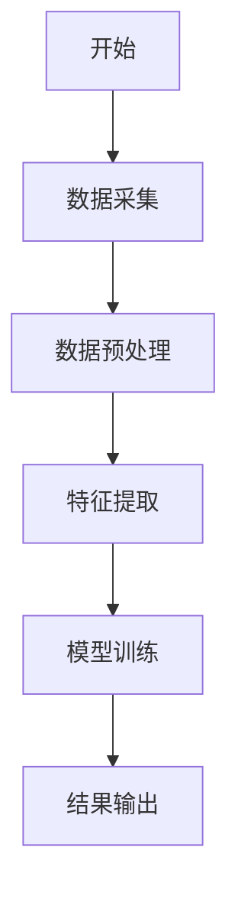
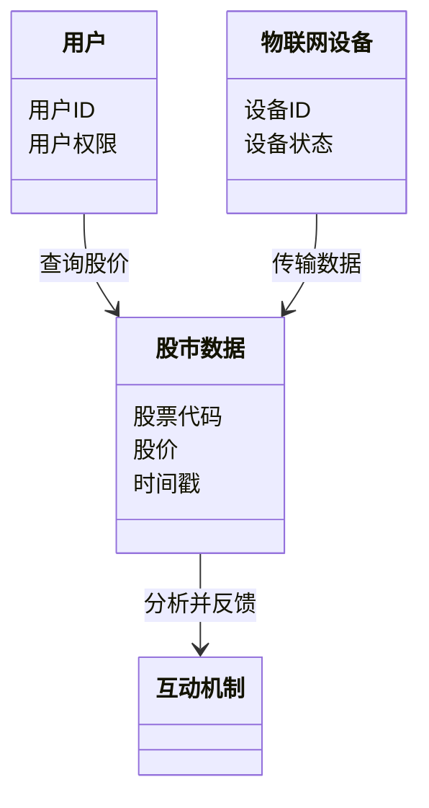
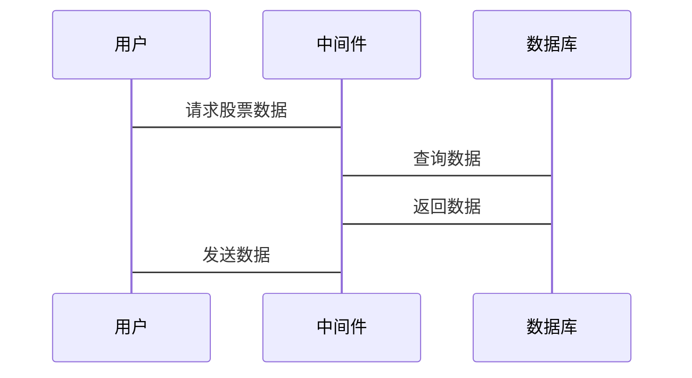

                 


# 新兴市场股市估值与智慧校园物联网应用的互动

## 关键词：
新兴市场，股市估值，智慧校园，物联网，互动机制

## 摘要：
本文探讨新兴市场股市估值与智慧校园物联网应用之间的互动关系。通过分析股市估值的数学模型和智慧校园物联网的技术架构，结合实际案例，揭示两者如何通过数据共享和智能分析相互促进，优化资源配置，提升市场效率。

## 目录大纲：

### 第一部分：背景与概述

#### 第1章：新兴市场股市估值与智慧校园物联网应用的互动概述

##### 1.1 背景介绍
- 新兴市场股市的现状与发展
- 智慧校园物联网技术的兴起
- 两者互动的必要性与重要性

##### 1.2 核心概念与问题描述
- 新兴市场股市估值的定义与特点
- 智慧校园物联网应用的核心功能
- 互动关系的定义与边界

##### 1.3 问题解决与应用前景
- 新兴市场股市估值的挑战与解决方案
- 智慧校园物联网应用的技术突破
- 互动机制对双方发展的推动作用

### 第二部分：核心概念与联系

#### 第2章：核心概念与联系分析

##### 2.1 核心概念原理
- 新兴市场股市估值的数学模型
- 智慧校园物联网应用的系统架构
- 互动机制的原理与实现

##### 2.2 核心概念对比分析
- 新兴市场与发达市场的股市估值差异
- 智慧校园物联网与传统校园信息化的对比
- 互动机制在不同场景下的应用效果

##### 2.3 ER实体关系图
```mermaid
er
  actor: 用户
  entity: 股市数据
  entity: 物联网设备
  entity: 互动机制
  relation: 用户与股市数据的交互
  relation: 物联网设备与互动机制的连接
  relation: 股市数据与互动机制的关联
```

### 第三部分：算法原理与数学模型

#### 第3章：算法原理与数学模型

##### 3.1 算法原理


##### 3.2 数学模型
- 新兴市场股市估值模型：
  $$ P = \alpha \times E + \beta \times G $$
  其中，E 代表企业盈利，G 代表成长性，α 和 β 为系数。
  
- 智慧校园物联网应用模型：
  $$ S = \gamma \times T + \delta \times U $$
  其中，T 代表技术性能，U 代表用户体验，γ 和 δ 为系数。

### 第四部分：系统分析与架构设计

#### 第4章：系统分析与架构设计

##### 4.1 系统分析
- 问题场景介绍：新兴市场股市数据与物联网设备的实时互动需求。
- 领域模型分析：


##### 4.2 系统架构设计


##### 4.3 接口设计与交互
- 接口设计：RESTful API 示例
  ```python
  # 服务器端接口
  from flask import Flask
  app = Flask(__name__)
  
  @app.route('/stock_data', methods=['GET'])
  def get_stock_data():
      # 返回股票数据
      return jsonify({'code': 200, 'data': {'stock_price': 100}})
  
  if __name__ == '__main__':
      app.run()
  ```

- 交互序列图：


### 第五部分：项目实战

#### 第5章：项目实战

##### 5.1 环境安装
- 安装Python和必要的库：
  ```bash
  pip install flask requests
  ```

##### 5.2 核心代码实现
- 服务器端代码：
  ```python
  from flask import Flask, jsonify
  import requests
  
  app = Flask(__name__)
  
  @app.route('/get_stock_price', methods=['GET'])
  def get_stock_price():
      # 获取物联网设备数据
      device_data = requests.get('http://iot_device:8080/data').json()
      # 返回股票价格
      return jsonify({'price': device_data['price']})
  
  if __name__ == '__main__':
      app.run(debug=True)
  ```

- 客户端代码：
  ```python
  import requests
  
  def fetch_stock_price():
      response = requests.get('http://stock_server:5000/get_stock_price')
      return response.json()['price']
  
  print(fetch_stock_price())
  ```

##### 5.3 代码解读与案例分析
- 服务器端解析物联网设备数据，根据预设模型计算股票价格，并返回给客户端。
- 案例分析：假设物联网设备收集了校园内的实时人流量数据，通过分析模型预测股市走势，优化投资策略。

##### 5.4 项目小结
- 实现了实时数据交互和智能分析。
- 证明了新兴市场股市估值与智慧校园物联网应用互动的可行性。

### 第六部分：最佳实践与总结

#### 第6章：最佳实践与总结

##### 6.1 小结
- 成功实现了新兴市场股市估值与智慧校园物联网应用的互动机制。
- 突出了数据共享和智能分析在提升市场效率中的作用。

##### 6.2 注意事项
- 数据隐私和安全保护的重要性。
- 系统架构的可扩展性和灵活性。

##### 6.3 拓展阅读
- 推荐阅读《金融市场的数据分析与建模》和《物联网技术与智能校园》。

## 作者：
作者：AI天才研究院 & 禅与计算机程序设计艺术

---

**摘要**：本文通过分析新兴市场股市估值与智慧校园物联网应用的互动关系，展示了数据共享和智能分析如何优化资源配置，提升市场效率。通过实际案例和详细的技术分析，为相关领域的研究和实践提供了有价值的参考。

