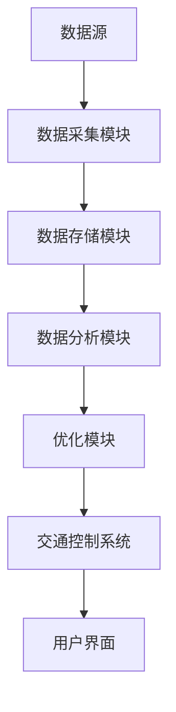
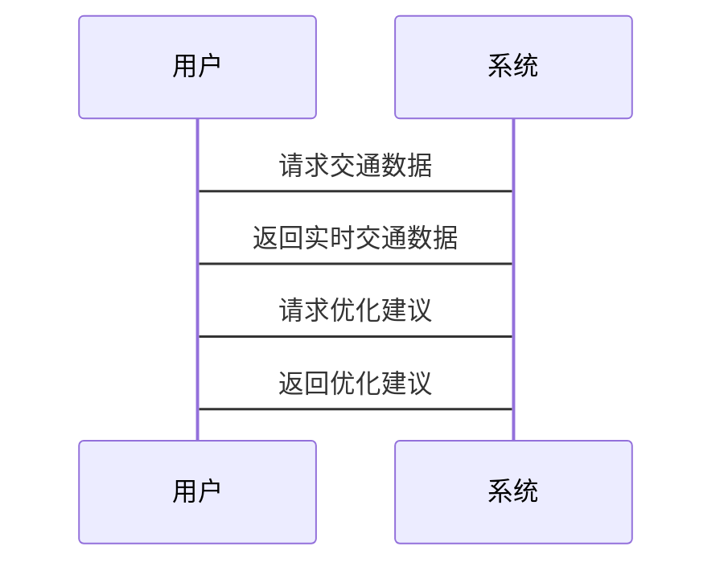

                 

# 第五章 系统分析与架构设计方案

## 5.1 问题场景介绍

### 5.1.1 新兴市场股市波动的复杂性
新兴市场的股市波动通常较大，受政策、经济和外部环境的影响显著。这些波动可能通过多种途径影响智能交通系统的运行效率和成本。

### 5.1.2 智能交通系统的实时性要求
智能交通系统需要实时处理大量的数据，以优化交通流量和减少拥堵。系统的实时性和稳定性对城市经济运行至关重要。

### 5.1.3 两者的互动对经济运行的影响
智能交通系统的高效运行可以降低物流成本，提高经济效率，反过来，股市的波动也可能通过影响企业的融资和投资行为，间接影响智能交通系统的建设和维护。

## 5.2 系统功能设计

### 5.2.1 系统功能模块划分
系统主要包括以下功能模块：
- 数据采集模块：负责采集交通和股市相关数据。
- 数据分析模块：对数据进行处理和分析，建立模型。
- 优化模块：根据分析结果优化交通信号和路线。

### 5.2.2 系统数据流设计
数据流从数据源流向数据处理模块，经过分析后生成优化策略，最后反馈到交通系统中。

### 5.2.3 系统接口设计
系统需要与交通传感器、股市数据库以及其他第三方系统进行接口对接。

## 5.3 系统架构设计

### 5.3.1 系统架构 overview
以下是系统的总体架构图：

## 5.4 系统接口设计

### 5.4.1 数据接口
- 数据采集模块与交通传感器接口
- 数据存储模块与数据库接口
- 数据分析模块与模型接口

### 5.4.2 优化接口
- 优化模块与交通信号控制系统接口
- 优化模块与路线规划系统接口

## 5.5 系统交互设计

### 5.5.1 用户与系统交互

## 5.6 本章小结
本章详细介绍了系统的功能模块、数据流、架构设计、接口设计和用户交互设计，为后续的系统实现奠定了基础。

---

# 第六章 智能交通系统对股市的影响机制

## 6.1 交通效率提升对股市的影响
- 提高物流效率，降低企业成本，增强企业盈利能力。
- 优化交通网络，促进区域经济发展，提升相关股票的估值。

## 6.2 交通成本变化对股市的影响
- 成本降低可能通过企业利润的增加反映到股价上。
- 成本上升可能导致企业利润减少，股价下跌。

## 6.3 交通政策调整对股市的影响
- 政策变化可能影响交通企业的运营模式，进而影响其股价。
- 政策鼓励智能交通技术发展，可能带动相关科技股的上涨。

## 6.4 本章小结
本章分析了智能交通系统对股市的多种影响机制，强调了交通效率、成本和政策变化对股市估值的综合影响。

---

# 第七章 总结与展望

## 7.1 全文总结
本文探讨了新兴市场股市估值与智能交通系统的互动关系，分析了智能交通系统对股市估值的影响机制，并提出了系统的架构设计方案。

## 7.2 未来研究方向
- 更复杂的城市交通模型与股市预测的结合。
- 大数据分析技术在智能交通与股市互动中的应用。
- 人工智能算法的优化与应用。

## 7.3 最佳实践 Tips
- 在实际应用中，建议结合具体城市特点进行系统优化。
- 注意数据质量和模型的实时性要求。
- 定期更新模型参数，以适应市场变化。

## 7.4 注意事项
- 数据隐私和安全问题需严格把控。
- 系统的稳定性和可靠性是确保其有效运行的关键。
- 与政府和企业的合作是系统成功实施的重要保障。

## 7.5 拓展阅读
建议读者进一步阅读智能交通系统和金融数据分析相关的学术论文和行业报告。

## 7.6 本章小结
总结全文，展望未来，为读者提供了全面的理论和实践参考。

---

# 作者信息

作者：AI天才研究院/AI Genius Institute & 禅与计算机程序设计艺术 /Zen And The Art of Computer Programming

---

感谢您的阅读！如果对本文有任何疑问或建议，欢迎留言讨论。

