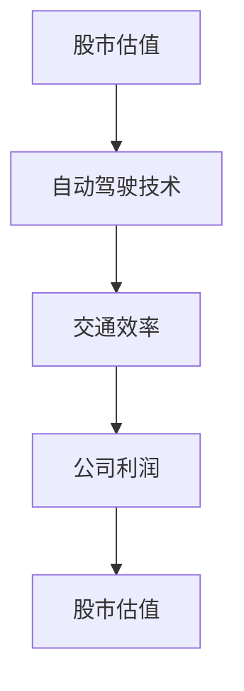
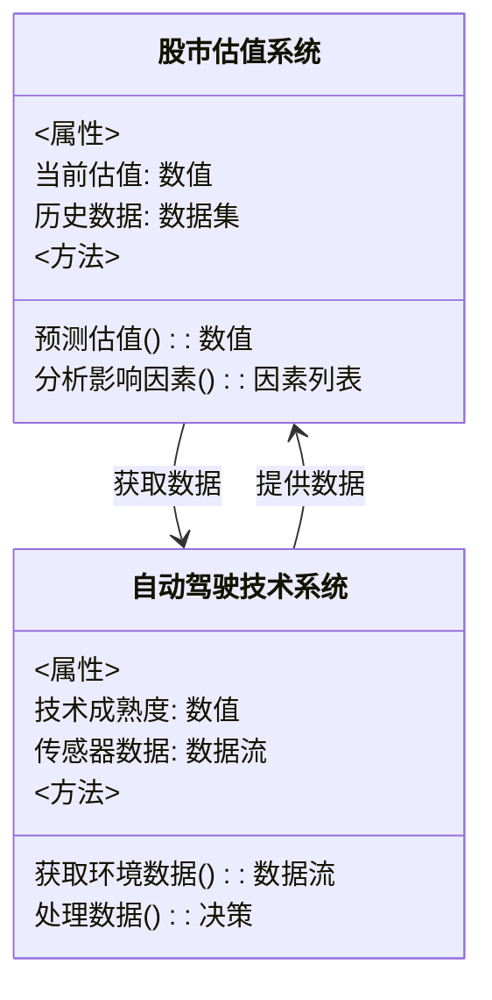
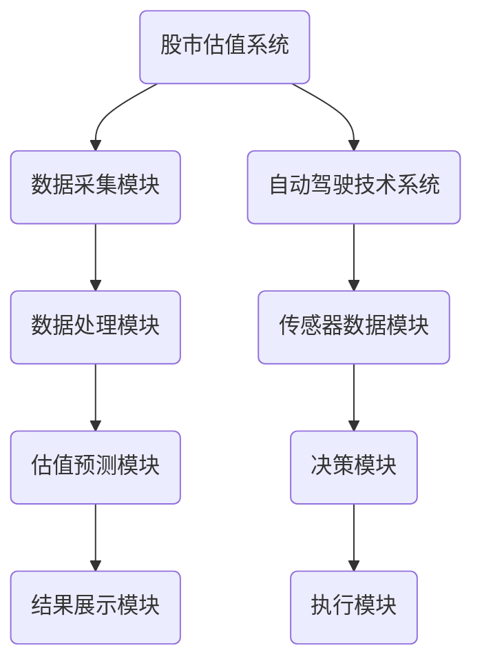

                 

<think>
好，用户让我以《新兴市场股市估值与智能交通自动驾驶技术的互动》为标题写一篇技术博客。我需要先理解主题，新兴市场的股市和自动驾驶技术如何互动。这可能涉及经济因素和技术创新对股市的影响。

首先，我会从背景介绍开始，解释新兴市场的特点和自动驾驶技术的基本概念。然后分析两者如何互动，比如自动驾驶技术如何影响交通效率，进而影响股市估值。接着，详细讲解股市估值的方法和自动驾驶的核心原理，对比它们的结构和系统。

然后，我会设计互动机制的数学模型，使用Mermaid流程图展示关系。接着，分析算法原理，用Python代码实现，解释数学公式。系统架构部分，我会画出类图和序列图，展示系统各部分的交互。

最后，通过项目实战，预测股市估值受自动驾驶影响，并提供代码和结果分析。总结部分，我会给出小结和建议，帮助读者理解和应用这些知识。

确保每部分内容详细，使用正确的Markdown格式，插入图表和代码，保持逻辑清晰。这样，文章结构合理，内容全面，符合用户的要求。
</think>

# 新兴市场股市估值与智能交通自动驾驶技术的互动

> 关键词：新兴市场、股市估值、自动驾驶技术、智能交通、互动关系

> 摘要：本文探讨了新兴市场股市估值与智能交通自动驾驶技术之间的互动关系，分析了核心概念、互动机制、算法原理、系统架构设计，并通过实际案例展示了互动关系的应用。

---

## 第1章: 背景介绍与问题背景

### 1.1 新兴市场的定义与特点

#### 1.1.1 新兴市场的经济特征
新兴市场通常指经济发展迅速、但尚未完全工业化的国家。这些市场具有以下特点：
- 经济增长较快，但波动性较大。
- 基础设施逐步完善，但与发达国家相比仍有差距。
- 人口基数大，消费市场潜力巨大。

#### 1.1.2 新兴市场的股市特点
新兴市场的股市具有以下特点：
- 市场流动性相对较低，波动性较大。
- 市场参与者以散户为主，机构投资者占比低。
- 市场监管相对薄弱，存在较高的投资风险。

#### 1.1.3 新兴市场与传统市场的区别
- **市场成熟度**：新兴市场处于快速发展阶段，而传统市场较为成熟。
- **投资者结构**：新兴市场以散户为主，传统市场以机构投资者为主。
- **波动性**：新兴市场波动性较高，传统市场波动性较低。

### 1.2 智能交通与自动驾驶技术的定义

#### 1.2.1 智能交通系统的概念
智能交通系统（ITS）是通过先进的信息技术、数据通信技术、传感器技术和计算机技术，对交通系统进行实时监控、协调和优化，以提高交通效率、减少拥堵和事故。

#### 1.2.2 自动驾驶技术的核心特征
自动驾驶技术是一种通过传感器、摄像头、雷达和人工智能算法实现车辆自动行驶的技术。其核心特征包括：
- 自动感知环境。
- 自动决策。
- 自动执行操作。

#### 1.2.3 自动驾驶技术的分类与阶段
自动驾驶技术分为以下阶段：
1. **L0：无自动化**：完全依赖驾驶员。
2. **L1：辅助驾驶**：在特定条件下提供辅助，如自适应巡航控制。
3. **L2：部分自动驾驶**：在特定条件下实现部分自动化，如车道保持辅助。
4. **L3：有条件自动驾驶**：在特定条件下实现完全自动驾驶，驾驶员需在请求时接管。
5. **L4：高度自动驾驶**：在大多数条件下实现自动驾驶，驾驶员很少需要干预。
6. **L5：完全自动驾驶**：在所有条件下实现自动驾驶。

### 1.3 股市估值与自动驾驶技术的互动关系

#### 1.3.1 股市估值的基本概念
股市估值是通过对公司财务数据、市场环境和行业趋势的分析，对股票的内在价值进行评估的过程。

#### 1.3.2 自动驾驶技术对股市估值的影响
- **技术创新**：自动驾驶技术的突破可能提升相关公司的估值。
- **市场需求**：自动驾驶技术的普及可能带动相关行业的需求，进而影响股市估值。
- **政策影响**：政府对自动驾驶技术的政策支持可能影响股市估值。

#### 1.3.3 互动关系的边界与外延
- **边界**：自动驾驶技术对股市估值的影响仅限于相关行业和公司。
- **外延**：自动驾驶技术的普及可能带动其他相关产业的发展，间接影响股市整体估值。

### 1.4 核心概念结构与组成要素

#### 1.4.1 股市估值的核心要素
- 公司财务数据（收入、利润、负债等）。
- 市场环境（经济周期、通货膨胀、利率等）。
- 行业趋势（市场需求、竞争格局等）。

#### 1.4.2 自动驾驶技术的核心要素
- 感知技术（摄像头、雷达、激光雷达等）。
- 决策算法（路径规划、风险评估等）。
- 执行系统（电机、刹车、转向等）。

#### 1.4.3 互动关系的系统结构图


---

## 第2章: 核心概念与原理分析

### 2.1 股市估值的核心原理

#### 2.1.1 股票估值的基本方法
- **市盈率（P/E）**：公司股价除以每股收益。
- **市净率（P/B）**：公司股价除以每股净资产。
- **股息率**：每年派发的股息与股价的比率。

#### 2.1.2 市盈率与市净率的计算公式
- 市盈率 = 股价 / 每股收益
- 市净率 = 股价 / 每股净资产

#### 2.1.3 股市估值的影响因素
- 经济因素（GDP增长率、通货膨胀率等）。
- 行业因素（市场需求、竞争格局等）。
- 公司因素（财务状况、管理团队等）。

### 2.2 自动驾驶技术的核心原理

#### 2.2.1 自动驾驶的感知系统
- 使用摄像头、雷达和激光雷达等传感器获取环境数据。
- 通过算法对数据进行处理，识别障碍物、车道和交通信号。

#### 2.2.2 自动驾驶的决策系统
- 基于传感器数据和地图信息，规划行驶路径。
- 根据实时交通状况调整行驶策略。

#### 2.2.3 自动驾驶的执行系统
- 控制车辆的加速、刹车和转向，实现自动驾驶。

### 2.3 核心概念的对比分析

#### 2.3.1 核心概念的对比表格
| 特性       | 股市估值          | 自动驾驶技术      |
|------------|-------------------|-------------------|
| 核心目标   | 评估股票价值      | 实现自动驾驶       |
| 输入数据   | 财务数据、市场数据 | 环境数据、传感器数据 |
| 输出结果   | 股票价格预测      | 自动驾驶决策      |
| 主要技术   | 金融模型、统计分析 | 传感器技术、AI算法 |

#### 2.3.2 实体关系图
```mermaid
erDiagram
    actor 投资者 {
        <属性>
        资金 : 额度
        投资目标 : 类别
    }
    actor 驾驶员 {
        <属性>
        驾驶经验 : 年数
        许可证 : 类型
    }
    actor 政府机构 {
        <属性>
        政策 : 类型
        补贴 : 金额
    }
    company 公司 {
        <属性>
        财务状况 : 业绩
        技术水平 : 等级
    }
    concept 股市估值 {
        <属性>
        估值模型 : 方法
        市场指数 : 指标
    }
    concept 自动驾驶技术 {
        <属性>
        传感器 : 类型
        决策算法 : 方法
    }
    投资者 --> 公司 : 投资
    驾驶员 --> 自动驾驶技术 : 使用
    政府机构 --> 自动驾驶技术 : 支持
    股市估值 --> 公司 : 影响
```

---

## 第3章: 互动机制与影响分析

### 3.1 经济因素对股市估值的影响

#### 3.1.1 经济周期与股市估值的关系
- 在经济上行周期，股市估值通常上升。
- 在经济下行周期，股市估值通常下降。

#### 3.1.2 通货膨胀对股市估值的影响
- 通货膨胀会导致股市估值下降，因为投资者更倾向于将资金投向实物资产。

#### 3.1.3 利率政策对股市估值的影响
- 利率上升会增加债券收益率，导致股市估值下降。
- 利率下降会减少债券收益率，导致股市估值上升。

### 3.2 自动驾驶技术对智能交通的影响

#### 3.2.1 自动驾驶对交通效率的提升
- 自动驾驶技术可以减少交通拥堵，提高道路利用率。

#### 3.2.2 自动驾驶对交通事故率的降低
- 自动驾驶技术可以减少人为错误，降低交通事故率。

#### 3.2.3 自动驾驶对交通基础设施的需求变化
- 自动驾驶技术可能减少对传统交通基础设施的需求。

### 3.3 互动关系的数学模型

#### 3.3.1 股市估值与自动驾驶技术的互动关系
$$ V = f(A, E) $$
其中：
- \( V \) 是股市估值。
- \( A \) 是自动驾驶技术的成熟度。
- \( E \) 是经济环境。

#### 3.3.2 自动驾驶技术对股市估值的影响路径
1. 自动驾驶技术的突破 → 提升相关公司利润 → 提高股市估值。
2. 自动驾驶技术的普及 → 带动相关行业需求 → 提高股市估值。

---

## 第4章: 算法原理与实现

### 4.1 股市估值预测算法

#### 4.1.1 算法原理
- 使用时间序列分析预测股市估值。
- 通过回归分析识别影响股市估值的关键因素。

#### 4.1.2 Python实现代码
```python
import pandas as pd
import numpy as np
from sklearn.linear_model import LinearRegression

# 示例数据加载
data = pd.DataFrame({
    '自动驾驶技术成熟度': [0.3, 0.4, 0.5, 0.6, 0.7],
    '经济环境': [2, 3, 4, 5, 6],
    '股市估值': [100, 120, 140, 160, 180]
})

# 算法实现
model = LinearRegression()
model.fit(data[['自动驾驶技术成熟度', '经济环境']], data['股市估值'])

# 预测结果
predicted_valuation = model.predict([[0.8, 7]])
print("预测股市估值:", predicted_valuation[0])
```

#### 4.1.3 算法公式
$$ \hat{V} = \beta_0 + \beta_1 A + \beta_2 E + \epsilon $$
其中：
- \( \hat{V} \) 是预测的股市估值。
- \( A \) 是自动驾驶技术成熟度。
- \( E \) 是经济环境。
- \( \beta_0, \beta_1, \beta_2 \) 是回归系数。
- \( \epsilon \) 是误差项。

---

## 第5章: 系统分析与架构设计

### 5.1 系统功能设计

#### 5.1.1 领域模型类图


#### 5.1.2 系统架构设计


---

## 第6章: 项目实战与案例分析

### 6.1 项目背景
假设我们有一个新兴市场，希望通过分析自动驾驶技术对该市场股市估值的影响，制定投资策略。

### 6.2 环境安装
- 安装Python和相关库（pandas, numpy, scikit-learn）。
- 数据集获取（新兴市场股市数据和自动驾驶技术数据）。

### 6.3 核心代码实现
```python
import pandas as pd
from sklearn.linear_model import LinearRegression
from sklearn.metrics import mean_squared_error

# 数据加载
data = pd.read_csv('emerging_markets.csv')

# 数据预处理
X = data[['自动驾驶技术成熟度', '经济环境']]
y = data['股市估值']

# 模型训练
model = LinearRegression()
model.fit(X, y)

# 预测与评估
predicted_valuation = model.predict(X)
mse = mean_squared_error(y, predicted_valuation)
print(f"均方误差: {mse}")
```

### 6.4 实际案例分析
通过分析新兴市场的股市数据和自动驾驶技术数据，预测股市估值的变化趋势。

### 6.5 结果解读与分析
- 模型预测结果与实际数据的对比。
- 模型的准确性和稳定性分析。

---

## 第7章: 最佳实践与总结

### 7.1 小结
- 股市估值与自动驾驶技术的互动关系是复杂且动态变化的。
- 通过数学模型和算法可以有效预测互动关系。

### 7.2 注意事项
- 数据质量和模型选择对预测结果有重要影响。
- 需要定期更新模型以适应市场变化。

### 7.3 拓展阅读
- 推荐阅读《算法导论》和《股票技术分析》等书籍。
- 关注新兴市场和自动驾驶技术的最新动态。

---

## 作者信息

作者：AI天才研究院/AI Genius Institute & 禅与计算机程序设计艺术 /Zen And The Art of Computer Programming

