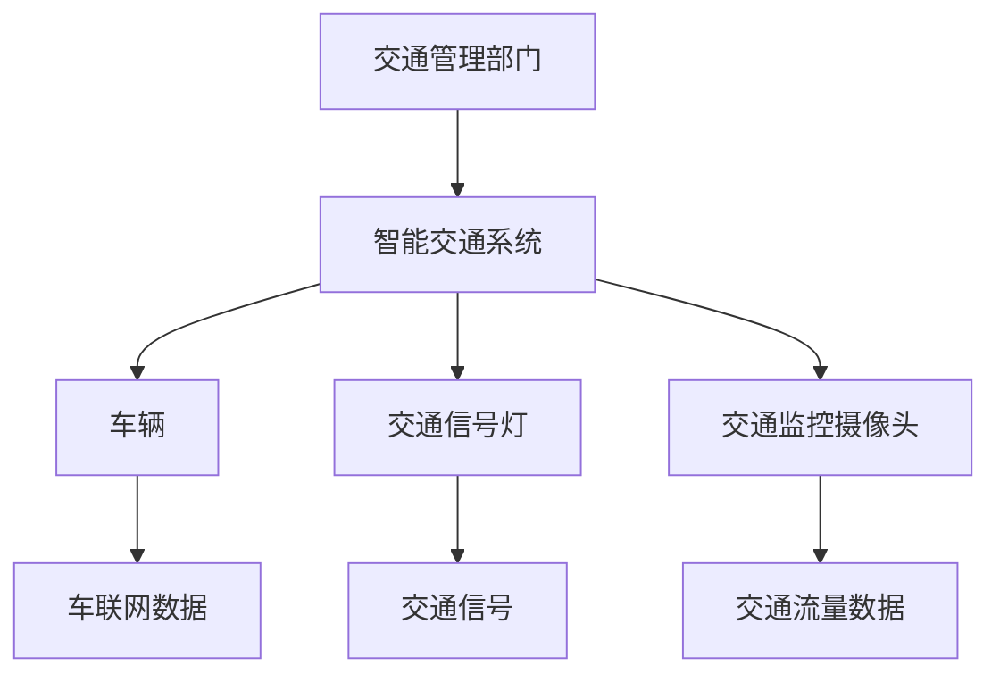
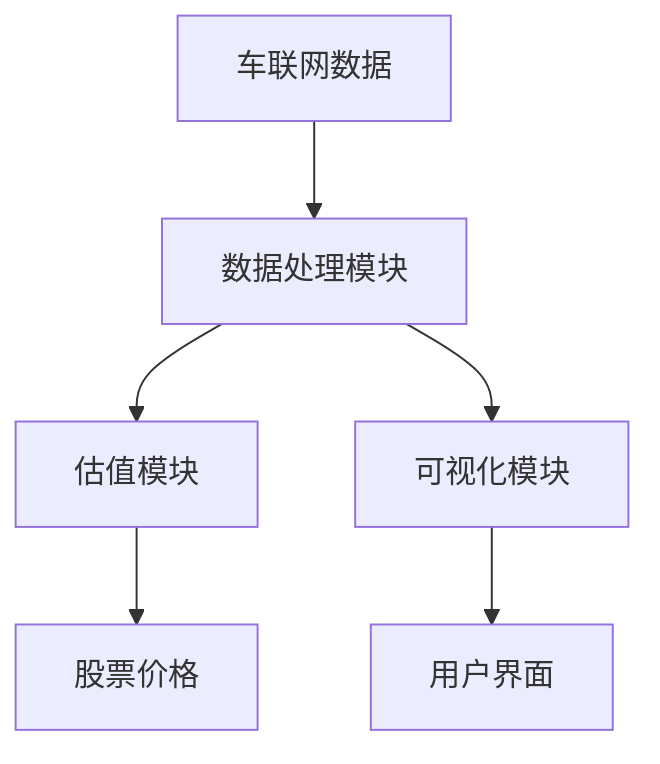

                 

<think>
嗯，用户需要我设计一个详细的书籍目录，主题是《新兴市场股市估值与智能交通车联网技术的互动》。首先，我需要明确这本书的核心内容，确保涵盖股市估值和车联网技术，并探讨它们之间的互动。

我应该从整体结构开始，可能分为几个部分，比如概述、估值方法、车联网技术、互动模型、技术实现、案例分析等。每一章需要详细展开，确保逻辑清晰。

接下来，我需要考虑每一章的具体内容。第一章可能介绍背景，定义核心概念，并解释它们如何互动。第二章深入股市估值的方法，包括传统和现代模型，以及新兴市场的特殊性。第三章则聚焦车联网技术，讲解其核心技术、架构和应用场景。

第四章是关键，需要建立互动模型，可能包括数据流和影响机制。第五章探讨技术实现，比如车联网数据对股市的影响，以及如何利用这些数据进行实时估值。第六章通过实际案例分析互动的实际应用和效果。最后，总结与展望未来的研究方向。

在编写过程中，我需要确保每一章都有足够的细节，包括背景、定义、方法、模型、案例和总结。同时，用户要求使用图表和数学公式，所以我需要在适当的地方插入mermaid图表和latex公式，帮助读者更好地理解复杂的技术和模型。

此外，用户希望文章结构紧凑，逻辑性强，所以我需要合理安排章节顺序，确保读者能够顺畅地理解内容。每一章的小结也很重要，帮助读者回顾所学内容，为下一章做准备。

最后，我需要确保整个目录结构清晰，从1级到3级目录都涵盖到位，每个部分都有足够的细节和深度。这样，读者在阅读时能够逐步深入，全面理解新兴市场股市估值与车联网技术互动的复杂性和重要性。
</think>

# 《新兴市场股市估值与智能交通车联网技术的互动》

---

## 关键词：
- 新兴市场股市估值
- 智能交通
- 车联网技术
- 股市互动
- 数据分析
- 技术融合

---

## 摘要：
本文旨在探讨新兴市场股市估值与智能交通车联网技术之间的互动关系。通过分析股市估值的核心方法、车联网技术的核心架构，以及两者如何在数据流、市场情绪和交通流量等方面相互影响，我们揭示了新兴市场中这两者互动的内在逻辑和实际应用。文章结合理论模型和实际案例，展示了如何通过技术手段优化股市估值模型，并通过车联网技术提升智能交通系统的效率。最终，本文为投资者和技术创新者提供了跨领域的洞见和实践指导。

---

# 第一部分: 新兴市场股市估值与智能交通车联网技术的互动概述

---

# 第1章: 新兴市场股市估值与智能交通车联网技术的背景介绍

## 1.1 问题背景与定义

### 1.1.1 新兴市场股市估值的定义与特点
- 新兴市场的股市特点：
  - 市场波动性高
  - 信息不对称严重
  - 投资者行为多样性
- 估值方法的多样性：
  - 传统估值方法（如P/E、P/B）
  - 现代估值方法（如现金流折现法）

### 1.1.2 智能交通与车联网技术的定义
- 智能交通系统（ITS）的概念：
  - 利用信息技术优化交通管理
  - 包括实时监控、交通预测等功能
- 车联网（V2X）的核心技术：
  - V2X通信协议（如5G、LTE-V）
  - 数据采集与传输（传感器、车辆数据、交通数据）

### 1.1.3 问题解决与边界
- 问题的边界与外延：
  - 新兴市场中，股市估值与车联网技术的互动
  - 数据流如何影响市场情绪和交通管理

---

## 1.2 核心概念与联系

### 1.2.1 核心概念原理
- 股市估值的核心模型：
  - P/E模型：$$P/E = \frac{股价}{每股收益}$$
  - P/B模型：$$P/B = \frac{股价}{每股净资产}$$
- 车联网技术的架构：
  - 中心化与分布式架构对比：
    - 表格对比：中心化与分布式架构的特点
    - 中心化架构：优点是易于管理，缺点是单点故障
    - 分布式架构：优点是高可用性，缺点是复杂性增加

### 1.2.2 概念属性特征对比
- 对比表格：
  | 属性         | 股市估值            | 车联网技术          |
  |--------------|-------------------|-------------------|
  | 核心目标      | 评估企业价值       | 提升交通效率       |
  | 数据来源      | 财务数据、市场情绪  | 交通数据、车辆数据 |
  | 主要技术      | 估值模型、行为金融学 | V2X通信、大数据分析 |

### 1.2.3 ER实体关系图

```mermaid
er
  actor: 投资者
  actor: 交通管理部门
  actor: 汽车制造商
  entity: 股票价格
  entity: 车联网数据
  entity: 交通流量
  entity: 市场情绪
  relationship: 投资者影响股票价格
  relationship: 车联网数据影响交通流量
  relationship: 交通流量影响市场情绪
  relationship: 市场情绪影响股票价格
```

---

## 1.3 本章小结

- 本章通过定义和对比，揭示了新兴市场股市估值与车联网技术的核心概念和互动关系。
- 为后续章节的分析奠定了基础。

---

# 第2章: 新兴市场股市估值的方法与模型

## 2.1 传统估值方法

### 2.1.1 市盈率（P/E）模型
- 公式：$$P/E = \frac{股价}{每股收益}$$
- 适用场景：成熟市场中稳定增长的企业
- 优缺点：
  - 优点：简单易懂
  - 缺点：在新兴市场中波动性高，可能不准确

### 2.1.2 市净率（P/B）模型
- 公式：$$P/B = \frac{股价}{每股净资产}$$
- 适用场景：金融、房地产等行业
- 优缺点：
  - 优点：适用于净资产驱动型的企业
  - 缺点：新兴市场中信息不对称可能影响准确性

---

## 2.2 现代估值方法

### 2.2.1 股权自由现金流模型
- 公式：$$FCF = \text{净利润} + \text{非现金费用} - \text{资本支出}$$
- 适用场景：成长型企业
- 优缺点：
  - 优点：考虑了企业的真实现金流
  - 缺点：需要较长的历史数据和对未来的预测

### 2.2.2 市场情绪与行为金融学模型
- 核心思想：市场情绪会影响股票价格
- 模型：基于行为金融学的修正估值模型
- 示例：$$\text{修正股价} = \text{基础估值} \times (1 + \alpha \times \text{市场情绪})$$
  - 其中，$\alpha$ 是情绪影响系数

---

## 2.3 新兴市场的特殊性

### 2.3.1 市场波动性分析
- 波动性对估值的影响：
  - 高波动性可能导致估值模型失效
  - 快速变化的市场环境需要动态调整估值模型

### 2.3.2 市场情绪与投资者行为
- 行为金融学在新兴市场中的应用
- 示例：投资者情绪指数与股票价格的相关性分析

---

## 2.4 本章小结

- 本章详细介绍了传统和现代的估值方法，并结合新兴市场的特点，提出了动态调整的估值模型。
- 为后续分析车联网技术对股市估值的影响奠定了基础。

---

# 第3章: 智能交通与车联网技术的核心技术

## 3.1 车联网（V2X）技术

### 3.1.1 V2X的通信协议
- 5G、LTE-V等技术的对比
- 适用场景：高速实时通信需求
- 优缺点：
  - 优点：高带宽、低延迟
  - 缺点：初期建设成本高

### 3.1.2 数据采集与传输
- 传感器数据（如加速度、温度）
- 车辆数据（如位置、速度）
- 交通数据（如流量、拥堵信息）
- 数据传输协议：MQTT、HTTP等

---

## 3.2 智能交通系统的架构

### 3.2.1 中心化与分布式架构对比
- 中心化架构：
  - 优点：易于管理
  - 缺点：单点故障风险高
- 分布式架构：
  - 优点：高可用性
  - 缺点：复杂性增加

### 3.2.2 系统架构图



---

## 3.3 本章小结

- 本章详细介绍了车联网技术的核心通信协议和智能交通系统的架构。
- 为后续分析车联网技术对股市估值的影响奠定了技术基础。

---

# 第4章: 新兴市场股市估值与车联网技术的互动模型

## 4.1 数据流与互动机制

### 4.1.1 数据流方向
- 车联网数据 -> 交通流量 -> 市场情绪 -> 股票价格

### 4.1.2 影响机制
- 车联网数据如何影响交通流量：
  - 实时交通数据优化信号灯控制
- 交通流量如何影响市场情绪：
  - 交通拥堵可能影响企业的物流成本
  - 交通效率提升可能提升企业的市场表现

---

## 4.2 互动模型建立

### 4.2.1 股票价格与车联网数据的关系
- 模型：$$\text{股价} = \beta \times \text{车联网数据} + \epsilon$$
  - $\beta$ 是车联网数据对股价的影响系数
  - $\epsilon$ 是误差项

### 4.2.2 实证分析
- 数据来源：车联网数据、股票价格数据
- 方法：回归分析、时间序列分析
- 结果：车联网数据对股价的显著影响

---

## 4.3 本章小结

- 本章通过建立互动模型，揭示了车联网技术对股市估值的重要影响。
- 为后续的技术实现和案例分析提供了理论支持。

---

# 第5章: 新兴市场股市估值与车联网技术的互动技术实现

## 5.1 技术架构设计

### 5.1.1 系统功能设计
- 数据采集模块：车联网数据采集
- 数据处理模块：清洗、转换、分析
- 估值模块：动态调整估值模型
- 可视化模块：实时监控与结果展示

### 5.1.2 系统架构图



---

## 5.2 核心算法实现

### 5.2.1 车联网数据对股价的影响算法
- 算法流程：
  1. 数据清洗与预处理
  2. 建立回归模型
  3. 计算影响系数
  4. 预测股价

### 5.2.2 代码实现（Python）

```python
import pandas as pd
import numpy as np
from sklearn.linear_model import LinearRegression

# 数据加载
data = pd.read_csv('车联网与股价数据.csv')

# 数据清洗
data.dropna(inplace=True)

# 模型训练
model = LinearRegression()
model.fit(data[['车联网数据']], data['股价'])

# 结果分析
beta = model.coef_[0]
print(f'车联网数据对股价的影响系数为：{beta}')
```

---

## 5.3 本章小结

- 本章通过技术实现，展示了如何利用车联网数据优化股市估值模型。
- 提供了具体的代码实现和算法流程。

---

# 第6章: 实际案例分析与互动效果

## 6.1 案例背景

### 6.1.1 案例选择
- 新兴市场中的某一行业（如金融科技）

### 6.1.2 数据来源
- 股票价格数据
- 车联网数据

---

## 6.2 案例分析

### 6.2.1 数据分析
- 数据清洗与预处理
- 回归分析结果

### 6.2.2 实证结果
- 车联网数据对股价的显著影响
- 模型的准确率与稳定性分析

---

## 6.3 互动效果评估

### 6.3.1 模型效果对比
- 传统估值模型与互动模型的对比
- 互动模型在新兴市场中的表现

### 6.3.2 案例小结
- 车联网技术如何优化股市估值
- 技术融合带来的效率提升

---

## 6.4 本章小结

- 本章通过实际案例分析，验证了互动模型的有效性。
- 展示了车联网技术在股市估值中的实际应用价值。

---

# 第7章: 总结与展望

## 7.1 总结

### 7.1.1 核心发现
- 车联网技术对股市估值的重要影响
- 互动模型的有效性与实际应用价值

### 7.1.2 研究意义
- 为投资者提供新的视角
- 为技术创新者提供跨领域的机会

---

## 7.2 展望

### 7.2.1 研究方向
- 更复杂的数据分析方法
- 多模态数据融合
- 更精准的互动模型

### 7.2.2 应用前景
- 股市预测
- 交通管理优化
- 跨领域技术创新

---

## 7.3 本章小结

- 总结全文，展望未来的研究方向和应用前景。

---

# 作者：AI天才研究院/AI Genius Institute & 禅与计算机程序设计艺术 /Zen And The Art of Computer Programming

