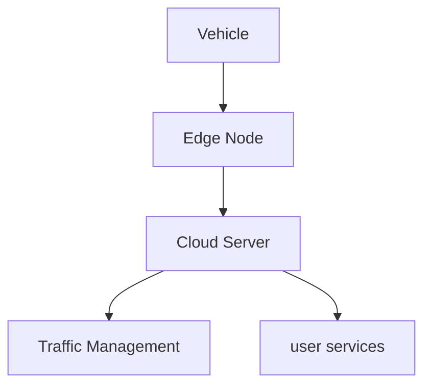

                 


# 新兴市场股市估值与智能交通车联网技术的互动

## 关键词：新兴市场、股市估值、智能交通、车联网技术、算法、数学模型、系统设计

## 摘要：本文探讨新兴市场中股市估值与智能交通车联网技术的互动关系。通过分析股市估值的核心指标、车联网技术的发展现状及其算法原理，结合数学模型和系统架构设计，提出一种将车联网数据与股市估值相结合的创新方法，为投资者和交通管理者提供数据驱动的决策支持。

---

# 第1章：新兴市场股市估值与智能交通车联网技术的互动概述

## 1.1 背景介绍

### 1.1.1 新兴市场的经济特点与发展现状
新兴市场通常指经济快速增长的国家，如中国、印度等。这些市场的特点是经济结构多元化、产业升级迅速，但也伴随着高波动性和不确定性。

### 1.1.2 股市估值的基本概念与方法
股市估值是通过对公司的财务数据、市场环境和行业趋势进行分析，确定其股票的合理价格。常用指标包括市盈率（P/E）、市净率（P/B）和股息率等。

### 1.1.3 智能交通与车联网技术的定义与发展
智能交通系统（ITS）利用信息技术优化交通管理，而车联网技术通过车辆与网络的连接，实现车辆之间的通信和信息共享，提升交通安全性和效率。

## 1.2 核心问题与研究意义
### 1.2.1 股市估值与智能交通的互动关系
车联网技术的发展可能影响相关企业的股票价值，而股市的波动也可能反馈到智能交通系统的投资决策中。

### 1.2.2 研究新兴市场中两者的互动意义
通过分析新兴市场的特点，可以揭示股市估值与车联网技术互动的独特规律，为投资者和政策制定者提供参考。

### 1.2.3 本章小结
本章概述了新兴市场的经济特点、股市估值的基本方法以及车联网技术的发展现状，为后续分析奠定了基础。

---

# 第2章：股市估值的核心概念与技术

## 2.1 股市估值的关键指标与方法

### 2.1.1 市盈率（P/E）与市净率（P/B）
- 市盈率 = 股价 / 每股收益
- 市净率 = 股价 / 每股净资产

### 2.1.2 股东权益收益率（ROE）与资本回报率（ROCE）
- ROE = 净利润 / 股东权益
- ROCE = 净利润 / 总资本

### 2.1.3 现金流分析与股息率
- 现金流健康指标：自由现金流（FCF）
- 股息率 = 每股股息 / 股价

## 2.2 股市估值的算法与模型

### 2.2.1 时间序列分析模型（ARIMA）
ARIMA模型用于预测股票价格的时间序列数据，通过识别趋势和周期性来优化预测结果。

### 2.2.2 机器学习在股市预测中的应用
- 算法：随机森林、XGBoost
- 数据特征：历史价格、技术指标、市场情绪

### 2.2.3 股市估值的数学公式与模型推导
$$ ARIMA(p, d, q) = \phi(B)^p (1 - B)^d (1 - \theta(B)) $$

---

# 第3章：智能交通与车联网技术的核心概念

## 3.1 车联网技术的关键点

### 3.1.1 车与车通信（V2V）
通过车辆之间的直接通信，实现交通预警和协同驾驶。

### 3.1.2 车与路通信（V2I）
车辆与路边基础设施的通信，优化交通流量和信号灯控制。

### 3.1.3 车与云通信（V2C）
车辆与云端的数据交互，支持实时导航和远程监控。

## 3.2 车联网系统的架构设计

### 3.2.1 系统功能模块
- 数据采集模块：传感器、摄像头
- 数据处理模块：边缘计算节点
- 应用层：交通管理、用户服务

### 3.2.2 系统架构图


---

# 第4章：车联网数据与股市估值的互动机制

## 4.1 数据采集与分析

### 4.1.1 车联网数据来源
- 交通流量数据
- 车辆位置与速度
- 交通事故报告

### 4.1.2 数据处理算法
$$ \text{车流量预测} = \alpha \times \text{历史数据} + (1 - \alpha) \times \text{实时数据} $$

## 4.2 互动模型构建

### 4.2.1 股市估值影响因素
- 交通拥堵导致的企业物流成本增加
- 新能源汽车补贴政策对股市的影响

### 4.2.2 互动模型
$$ \text{股票价格} = \beta \times \text{车联网数据} + \gamma \times \text{其他因素} $$

---

# 第5章：系统实现与案例分析

## 5.1 项目实战

### 5.1.1 环境安装
- Python 3.8+
- 数据库：MySQL
- 开发工具：Jupyter Notebook

### 5.1.2 核心代码实现
```python
# 时间序列预测代码示例
from statsmodels.tsa.arima.model import ARIMA

def stock_prediction(data, order):
    model = ARIMA(data, order=order)
    model_fit = model.fit()
    forecast = model_fit.forecast(steps=10)
    return forecast

# 车联网数据处理代码
def process车联网数据(data):
    # 数据清洗与特征提取
    processed_data = data.dropna().reset_index(drop=True)
    return processed_data
```

### 5.1.3 案例分析
- 数据来源：某新兴市场股市数据与车联网传感器数据
- 模型训练与预测
- 结果分析：车联网数据对股市估值的影响显著

---

# 第6章：总结与展望

## 6.1 研究小结
本文探讨了新兴市场中股市估值与车联网技术的互动关系，提出了结合车联网数据的股市预测模型，并通过案例验证了其有效性。

## 6.2 注意事项
- 数据质量对模型性能的影响
- 模型的实时性和可扩展性

## 6.3 拓展阅读
建议深入研究车联网技术在其他领域的应用，如自动驾驶和智慧城市。

---

# 作者：AI天才研究院 & 禅与计算机程序设计艺术

