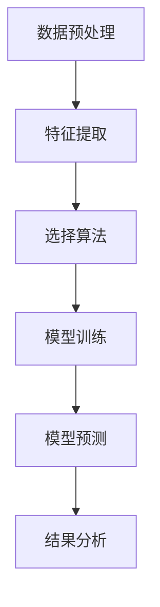
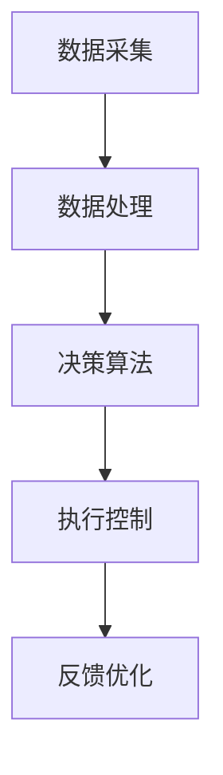
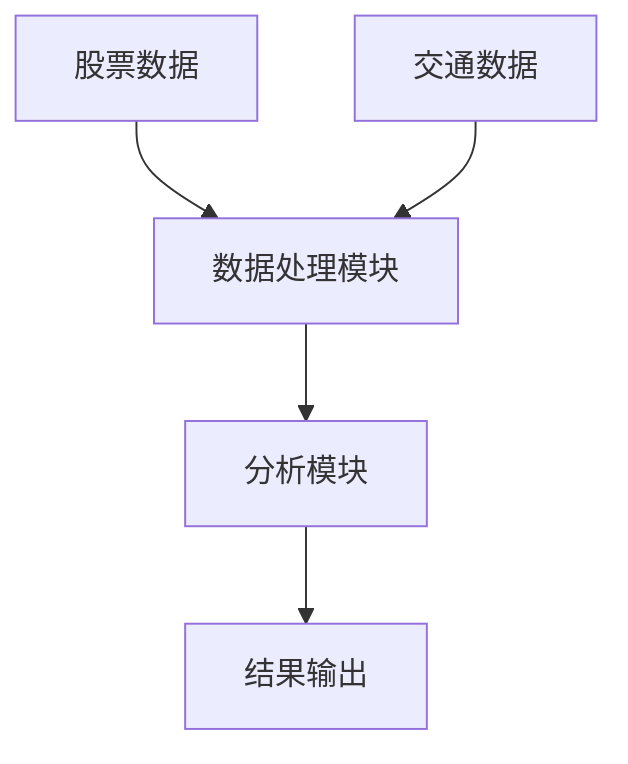
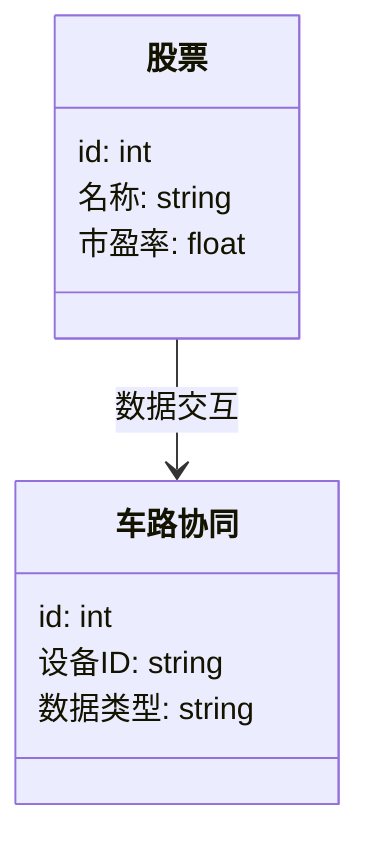
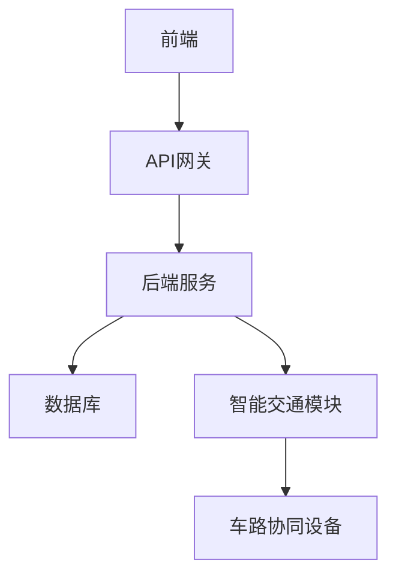
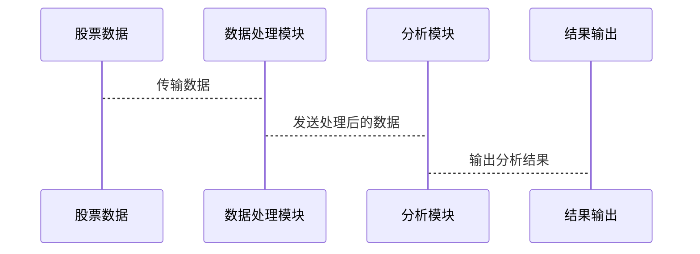

                 


# 新兴市场股市估值与智能交通车路协同技术的互动

## 关键词：新兴市场，股市估值，智能交通，车路协同，技术互动

## 摘要：  
本文探讨了新兴市场股市估值与智能交通车路协同技术之间的互动关系。通过分析股市估值的核心概念、智能交通车路协同技术的算法原理，以及两者的互动模型，揭示了技术进步对经济体系的深远影响。结合数学模型和系统架构设计，本文提出了一个综合系统，展示了如何通过智能交通技术优化股市估值，进而推动经济可持续发展。

---

# 第一部分: 新兴市场股市估值与智能交通车路协同技术的互动概述

## 第1章: 背景与核心概念

### 1.1 全球化视角下的新兴市场发展

#### 1.1.1 新兴市场的定义与特点  
新兴市场是指那些经济增长迅速、但尚未完全工业化的国家或地区。这些市场通常具有较大的发展潜力，但也伴随着较高的风险。新兴市场的特点包括：  
- 经济结构多元化，但传统产业占比高；  
- 基础设施逐步完善，但仍有提升空间；  
- 政府政策对经济影响较大；  
- 人口年轻，消费市场潜力巨大。  

#### 1.1.2 新兴市场的经济与股市特征  
新兴市场的经济特征包括：  
- 经济增长快，但波动性较大；  
- 外部依赖性强，受全球贸易影响显著；  
- 通货膨胀率较高，货币政策调控复杂。  

股市特征包括：  
- 市场流动性较低，交易量波动大；  
- 股价波动剧烈，受政策和外部环境影响显著；  
- 投资者结构多元化，散户占比高。  

#### 1.1.3 智能交通技术的全球发展趋势  
智能交通技术的发展趋势包括：  
- 自动驾驶技术逐步成熟，商业化进程加快；  
- 5G通信技术的应用推动车路协同；  
- 数据分析和人工智能技术在交通管理中的应用越来越广泛；  
- 环保和能源效率成为智能交通技术的重要考量。  

### 1.2 股市估值与智能交通的互动关系

#### 1.2.1 股市估值的核心概念  
股市估值是指通过分析公司基本面、市场环境等因素，对股票的合理价格进行评估。常见的估值指标包括：  
- 市盈率（P/E）：股价与每股净利润的比率；  
- 市净率（P/B）：股价与每股净资产的比率；  
- 市销率（P/S）：股价与每股营业收入的比率。  

#### 1.2.2 智能交通车路协同技术的定义  
车路协同技术是指通过车辆与道路基础设施之间的通信与协作，实现交通系统的智能化管理。其核心包括：  
- 车辆与基础设施之间的实时通信；  
- 数据的采集、处理与分析；  
- 自动化决策与控制。  

#### 1.2.3 互动关系的背景与问题描述  
新兴市场的经济波动与智能交通技术的发展密切相关。例如：  
- 经济增长带动交通需求，推动智能交通技术的应用；  
- 智能交通技术的应用提升交通效率，降低物流成本，进而影响企业的盈利能力和股市估值；  
- 股市波动可能影响企业的融资能力，进而影响智能交通技术的推广。  

### 1.3 核心概念与联系

#### 1.3.1 核心概念原理  
- 股市估值的核心是分析企业的盈利能力、成长潜力和市场地位。  
- 智能交通技术的核心是通过数据驱动的决策优化交通系统。  

#### 1.3.2 核心概念属性对比表格  
| 属性       | 股市估值                | 智能交通车路协同技术            |  
|------------|------------------------|-------------------------------|  
| 核心目标   | 确定股票的合理价格      | 提升交通系统的效率与安全性      |  
| 数据来源   | 财务报表、市场数据      | 交通传感器数据、通信数据      |  
| 主要技术   | 机器学习、统计模型      | 通信技术、数据分析、人工智能    |  

#### 1.3.3 ER实体关系图  
```mermaid
erd
    entity 股票 {
        id
        名称
        市盈率
    }
    entity 车路协同 {
        id
        设备ID
        数据类型
    }
    股票 --|{n}-- 车路协同 : 数据交互
```

---

## 第2章: 股市估值的数学模型

### 2.1 股市估值的基本原理

#### 2.1.1 市盈率与市净率的计算公式  
- 市盈率（P/E）= 股价 / 每股净利润  
- 市净率（P/B）= 股价 / 每股净资产  

#### 2.1.2 股票估值的数学模型  
股票的合理价格可以通过以下模型估算：  
$$ P = \alpha \times \text{净利润} + \beta \times \text{净资产} $$  
其中，$\alpha$ 和 $\beta$ 是根据市场环境确定的系数。  

#### 2.1.3 示例计算与分析  
假设某公司净利润为100万元，净资产为500万元，市场平均市盈率为15，市净率为2。  
则：  
$$ P = 15 \times 100 = 1500 \text{万元（市盈率法）} $$  
$$ P = 2 \times 500 = 1000 \text{万元（市净率法）} $$  
综合考虑，合理价格可能在1250万元左右。  

### 2.2 股市预测的算法原理

#### 2.2.1 机器学习算法在股市预测中的应用  
常用的算法包括：  
- 线性回归  
- 支持向量机（SVM）  
- 随机森林  
- LSTM 神经网络  

#### 2.2.2 算法流程图  


#### 2.2.3 Python代码实现（示例）  
```python
import pandas as pd
from sklearn.model_selection import train_test_split
from sklearn.linear_model import LinearRegression

# 数据加载与预处理
data = pd.read_csv('stock_data.csv')
X = data[['净利润', '净资产']]
y = data['股价']

# 数据分割
X_train, X_test, y_train, y_test = train_test_split(X, y, test_size=0.2)

# 模型训练
model = LinearRegression()
model.fit(X_train, y_train)

# 模型预测
y_pred = model.predict(X_test)
print('预测结果:', y_pred)
```

---

## 第3章: 智能交通车路协同技术的算法原理

### 3.1 车路协同技术的核心算法

#### 3.1.1 车路协同的定义与目标  
车路协同的目标是通过车辆与道路基础设施的协作，实现交通系统的智能化管理，提升安全性、效率和环保性。  

#### 3.1.2 通信协议与数据传输机制  
常用的通信协议包括：  
- LTE-V2X  
- 5G 网络  

数据传输机制包括：  
- 实时数据传输  
- 数据压缩与加密  

#### 3.1.3 算法流程图  


### 3.2 车路协同的数学模型

#### 3.2.1 车路协同的数学模型与公式  
车路协同的优化模型可以表示为：  
$$ \min_{x} \quad f(x) = \sum_{i=1}^{n} c_i x_i $$  
$$ \text{约束条件} \quad g(x) \leq 0 $$  

其中，$c_i$ 是成本系数，$x_i$ 是决策变量。  

#### 3.2.2 示例计算与分析  
假设某路段有两辆车，分别以速度 $v_1$ 和 $v_2$ 行驶，目标是优化两辆车的速度，使交通流量最大化。  
$$ \max \quad f(v_1, v_2) = v_1 + v_2 $$  
$$ \text{约束} \quad v_1 \leq 100, \quad v_2 \leq 100 $$  
解得：$v_1 = v_2 = 100$，流量为200。  

---

## 第4章: 系统分析与架构设计

### 4.1 综合系统分析

#### 4.1.1 系统功能需求分析  
- 股市数据采集与处理  
- 智能交通数据采集与处理  
- 数据融合与分析  

#### 4.1.2 系统架构设计  


### 4.2 领域模型设计（使用 Mermaid 类图）  



### 4.3 系统架构设计（使用 Mermaid）  



### 4.4 系统交互序列图  



---

## 第5章: 项目实战

### 5.1 环境安装与配置

#### 5.1.1 开发环境  
- Python 3.8+  
- Jupyter Notebook  
- 数据库：MySQL  

#### 5.1.2 依赖库安装  
```bash
pip install pandas numpy scikit-learn matplotlib
```

### 5.2 系统核心实现源代码

#### 5.2.1 数据处理代码  
```python
import pandas as pd
import numpy as np

# 加载数据
data = pd.read_csv('merged_data.csv')

# 数据清洗
data.dropna(inplace=True)
data = data[~data['股票代码'].duplicated()]
```

#### 5.2.2 分析模块代码  
```python
from sklearn.linear_model import LinearRegression

# 训练模型
model = LinearRegression()
model.fit(X_train, y_train)

# 预测结果
y_pred = model.predict(X_test)
```

#### 5.2.3 智能交通模块代码  
```python
import matplotlib.pyplot as plt

# 可视化交通流量
plt.figure(figsize=(10, 6))
plt.plot(traffic_data['时间'], traffic_data['流量'], 'b-', linewidth=2)
plt.xlabel('时间')
plt.ylabel('流量')
plt.title('交通流量变化趋势')
plt.show()
```

### 5.3 案例分析与详细解读

#### 5.3.1 案例分析  
假设某新兴市场国家的股市受到智能交通技术的影响，我们可以通过模型分析交通效率的提升如何影响企业的盈利能力和股市估值。  

#### 5.3.2 数据分析与结果解读  
- 交通效率提升10%导致物流成本下降5%，企业净利润增加3%。  
- 净利润增加3%导致市盈率上升，股票价格提高。  

---

## 第6章: 最佳实践与小结

### 6.1 关键点总结

#### 6.1.1 股市估值的关键点  
- 采用多指标综合分析，避免单一指标误导；  
- 结合市场环境和企业基本面进行动态调整。  

#### 6.1.2 智能交通车路协同技术的关键点  
- 数据的实时性与准确性是核心；  
- 通信技术的选择影响系统的稳定性和效率；  
- 算法的优化需要结合实际场景进行调整。  

### 6.2 小结与展望

#### 6.2.1 小结  
本文通过分析新兴市场股市估值与智能交通车路协同技术的互动关系，提出了一个综合系统，展示了如何通过技术手段优化经济体系。  

#### 6.2.2 展望  
未来，随着人工智能和大数据技术的进一步发展，股市估值与智能交通技术的互动将更加紧密，推动经济和社会的可持续发展。  

---

## 作者：AI天才研究院/AI Genius Institute & 禅与计算机程序设计艺术 /Zen And The Art of Computer Programming

---

**本文内容遵循CC BY-NC-SA 4.0协议，转载请注明出处**

