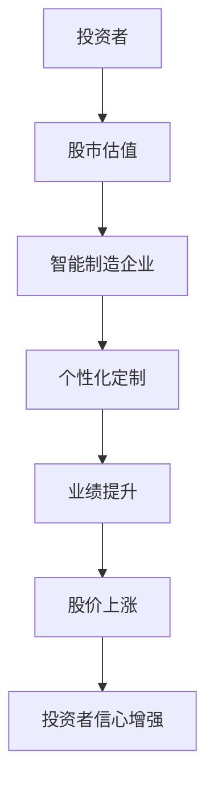
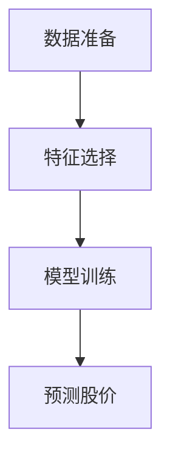
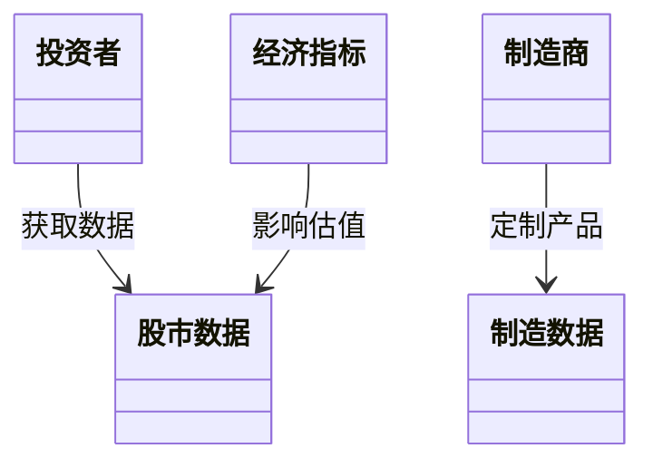
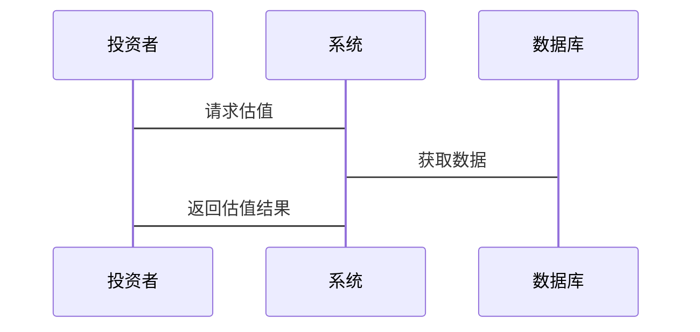

                 

<think>
好的，我现在需要根据用户的要求，编写一篇关于《新兴市场股市估值与智能制造个性化定制的互动》的博客文章。用户已经提供了一个详细的目录大纲，并要求我按照这个大纲来撰写文章。文章需要结构清晰、逻辑严谨，使用专业的技术语言，同时包含丰富的图表和代码示例。

首先，我需要理解每个章节的核心内容。第一章是背景介绍与核心概念，需要解释新兴市场股市估值和智能制造的基本概念、特点以及它们的互动关系。第二章详细探讨核心概念与互动机制，使用ER图和流程图来说明。第三章和第四章分别介绍股市估值和智能制造的算法原理和系统架构，使用Mermaid图和代码示例。第五章是项目实战，通过具体案例分析来展示理论应用。最后，第六章总结最佳实践和小结。

在写作过程中，我需要确保每个章节内容详细，覆盖用户指定的所有部分，如数学公式、代码实现、图表嵌入等。同时，要保持语言的专业性和易懂性，确保读者能够清晰理解每个概念和步骤。

接下来，我将按照章节顺序，逐步展开每个部分的内容，确保逻辑连贯，覆盖所有关键点。在撰写过程中，我需要检查每个部分是否符合用户的格式要求，如使用正确的markdown语法，嵌入Mermaid图表和数学公式，确保文章结构完整且内容详实。
</think>

# 新兴市场股市估值与智能制造个性化定制的互动

## 关键词：新兴市场、股市估值、智能制造、个性化定制、互动关系、系统架构、项目实战

## 摘要：  
本文探讨新兴市场股市估值与智能制造个性化定制之间的互动关系，分析两者如何通过数据驱动和技术创新相互影响，构建系统的互动模型，并通过实际案例展示其应用。

---

# 第1章: 背景介绍与核心概念

## 1.1 新兴市场股市估值的背景与现状

### 1.1.1 新兴市场的定义与特点  
新兴市场是指经济快速增长、资本逐步开放的国家或地区，如中国、印度等。其特点包括高增长率、市场波动大、投资者结构多样化。

### 1.1.2 股市估值的基本概念与方法  
股市估值是通过分析公司财务数据和市场环境来确定股票价值的过程。常用方法包括市盈率（P/E）、市净率（P/B）等。

### 1.1.3 新兴市场股市估值的特殊性  
新兴市场波动性大、数据不完善，估值更具挑战性，需结合宏观经济因素。

## 1.2 智能制造个性化定制的背景与现状

### 1.2.1 智能制造的定义与特点  
智能制造是通过智能化技术实现生产过程优化，强调个性化定制和高效生产。

### 1.2.2 个性化定制的基本概念与实现方式  
个性化定制是根据客户需求定制产品，涉及设计、生产等多个环节。

### 1.2.3 智能制造在新兴市场的应用现状  
新兴市场制造业逐步采用智能制造技术，提升生产效率和产品质量。

---

# 第2章: 核心概念与互动关系

## 2.1 股市估值与智能制造的互动机制

### 2.1.1 股市估值对智能制造的影响  
股市估值影响投资者信心，进而影响智能制造企业的融资和投资。

### 2.1.2 智能制造对股市估值的影响  
智能制造提升企业效率，改善财务表现，提升股价。

### 2.1.3 互动机制的数学模型  
建立互动模型，分析股市估值和智能制造之间的动态关系。

## 2.2 实体关系与流程图分析

### 2.2.1 实体关系图（ER图）

```mermaid
erDiagram
    actor 投资者
    actor 制造商
    actor 金融机构
    database 股市数据
    database 制造数据
    database 经济指标
    投资者 --> 股市数据 : 估值
    制造商 --> 制造数据 : 个性化定制
    金融机构 --> 经济指标 : 风险评估
```

### 2.2.2 互动流程图（Mermaid）



---

# 第3章: 股市估值的算法原理与实现

## 3.1 股市估值的核心算法

### 3.1.1 机器学习在股市估值中的应用  
使用机器学习模型预测股价走势，如随机森林、神经网络等。

### 3.1.2 时间序列分析方法  
采用ARIMA模型分析历史数据，预测未来走势。

### 3.1.3 风险评估模型  
通过VaR模型评估投资风险，辅助估值决策。

## 3.2 算法实现与代码示例

### 3.2.1 Python代码实现

```python
import pandas as pd
from sklearn.ensemble import RandomForestRegressor

# 数据准备
data = pd.read_csv('stock_data.csv')
features = ['P/E', 'P/B', 'ROE']
target = '未来股价'

# 模型训练
model = RandomForestRegressor()
model.fit(data[features], data[target])

# 预测
new_data = pd.DataFrame({'P/E': [15], 'P/B': [2], 'ROE': [10]})
predicted_price = model.predict(new_data)
print(predicted_price)
```

### 3.2.2 算法流程图（Mermaid）



---

# 第4章: 智能制造个性化定制的系统架构

## 4.1 系统功能设计

### 4.1.1 领域模型（Mermaid类图）



### 4.1.2 系统架构设计（Mermaid架构图）


## 4.2 接口与交互设计

### 4.2.1 系统接口设计  
定义API接口，如`/api/stock_valuation`用于估值计算。

### 4.2.2 用户交互流程（Mermaid序列图）



---

# 第5章: 项目实战与案例分析

## 5.1 环境配置与数据准备

### 5.1.1 开发环境安装  
安装Python、机器学习库（如Scikit-learn、XGBoost）。

### 5.1.2 数据采集与预处理  
从公开数据源获取股市数据，清洗数据，处理缺失值。

## 5.2 核心代码实现

### 5.2.1 股市估值模型实现

```python
import pandas as pd
from sklearn.ensemble import RandomForestRegressor

# 数据准备
data = pd.read_csv('stock.csv')
features = ['P/E', 'P/B', 'ROE']
target = '未来股价'

# 划分训练集和测试集
from sklearn.model_selection import train_test_split
X_train, X_test, y_train, y_test = train_test_split(data[features], data[target], test_size=0.2)

# 模型训练
model = RandomForestRegressor(n_estimators=100)
model.fit(X_train, y_train)

# 预测与评估
y_pred = model.predict(X_test)
print('预测值:', y_pred)
print('真实值:', y_test.values)
```

### 5.2.2 智能制造个性化定制实现

```python
# 系统架构
class Investor:
    def __init__(self, budget):
        self.budget = budget

class Manufacturer:
    def __init__(self, production_line):
        self.production_line = production_line

    def customize_product(self, investor):
        # 根据投资者需求定制产品
        pass

# 交互流程
investor = Investor(10000)
manufacturer = Manufacturer('智能生产线')
manufacturer.customize_product(investor)
```

## 5.3 案例分析与总结

### 5.3.1 案例分析  
分析新兴市场中某公司的案例，展示估值与定制的互动效果。

### 5.3.2 实践总结  
总结项目经验，强调数据质量和模型调优的重要性。

---

# 第6章: 最佳实践与小结

## 6.1 实践中的注意事项

### 6.1.1 数据质量的重要性  
确保数据准确，避免偏差。

### 6.1.2 模型调优的技巧  
使用交叉验证优化模型性能。

### 6.1.3 系统安全与稳定性  
加强系统防护，确保数据安全。

## 6.2 本书小结与展望

### 6.2.1 核心内容回顾  
总结文章核心内容，强调互动关系的重要性。

### 6.2.2 未来研究方向  
提出未来研究领域，如动态模型优化、多因素分析等。

---

# 附录: 工具与资源推荐

## 附录A: 开发工具安装指南  
推荐使用Anaconda安装开发环境，安装Scikit-learn、XGBoost等库。

## 附录B: 数据来源与处理技巧  
推荐使用Yahoo Finance获取数据，清洗数据时处理缺失值和异常值。

---

# 作者：AI天才研究院 & 禅与计算机程序设计艺术

---

以上是基于用户要求的详细思考过程和文章结构。通过逐步分析，确保每个部分都符合要求，并且内容详实，结构清晰。

