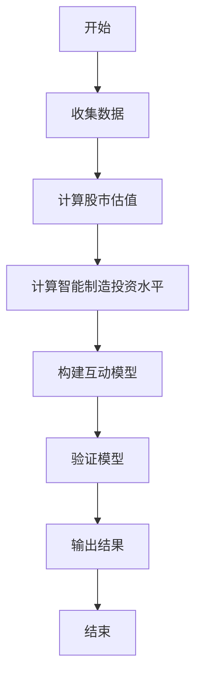

                 


# 新兴市场股市估值与智能制造升级的互动

## 关键词：
新兴市场，股市估值，智能制造，互动关系，产业升级，经济影响

## 摘要：
本文探讨新兴市场股市估值与智能制造升级之间的互动关系，分析股市估值对智能制造投资的促进作用，以及智能制造升级如何影响股市估值。通过理论分析和实证研究，本文提出了一种结合股市数据与智能制造技术的互动模型，并提供了实际案例分析，以期为投资者和政策制定者提供参考。

---

## 第一部分：背景介绍

### 第1章：问题背景与概念结构

#### 1.1 问题背景
- 1.1.1 新兴市场的经济特点
  新兴市场通常具有较高的经济增长潜力，但股市波动性较大，受政策、外部环境等多种因素影响。

- 1.1.2 智能制造的发展趋势
  智能制造通过数字化、自动化和智能化技术提升生产效率，降低成本，成为全球制造业升级的重要方向。

- 1.1.3 股市估值的重要性
  股市估值反映了市场对企业的价值判断，影响企业的融资能力，进而影响投资和生产活动。

#### 1.2 问题描述
- 1.2.1 新兴市场股市的波动性
  新兴市场的股市受政策变化和外部经济环境影响较大，波动性显著高于成熟市场。

- 1.2.2 智能制造升级的需求
  为了在全球竞争中占据优势，新兴市场的企业迫切需要通过智能制造提升竞争力。

- 1.2.3 两者互动的潜在影响
  智能制造升级可能通过提升企业盈利能力间接影响股市估值，而股市估值的变化也可能反过来影响企业的投资决策。

#### 1.3 问题解决
- 1.3.1 理论分析方法
  通过构建互动模型，分析股市估值与智能制造升级之间的相互作用机制。

- 1.3.2 实证研究方法
  利用新兴市场的股市数据和智能制造相关指标，进行实证分析，验证理论模型的合理性。

- 1.3.3 政策建议
  根据分析结果，提出促进智能制造升级和稳定股市估值的政策建议。

#### 1.4 边界与外延
- 1.4.1 研究范围的界定
  本文主要关注新兴市场的股市估值与智能制造升级的互动，不涉及成熟市场的比较分析。

- 1.4.2 相关领域的区分
  区分股市估值与企业实际盈利之间的差异，以及智能制造与传统制造的区别。

- 1.4.3 研究的局限性
  数据获取的限制可能影响实证分析的结果，未来研究可进一步扩展样本范围。

#### 1.5 概念结构与核心要素
- 1.5.1 核心概念的组成
  核心概念包括股市估值、智能制造升级及其互动机制。

- 1.5.2 要素之间的关系
  股市估值影响企业融资能力，进而影响智能制造投资；智能制造升级通过提升企业效率间接影响股市估值。

- 1.5.3 模型的框架
  构建包含股市指数、智能制造投资、政策支持等变量的互动模型。

---

## 第二部分：核心概念与联系

### 第2章：股市估值的核心概念

#### 2.1 股市估值的定义与特点
- 2.1.1 股市估值的基本定义
  股市估值是市场参与者对企业价值的评估，通常通过市盈率（P/E）、市净率（P/B）等指标衡量。

- 2.1.2 股市估值的关键特点
  - 受市场情绪影响较大
  - 反映企业的盈利能力和成长潜力
  - 受宏观经济环境影响

- 2.1.3 与传统估值方法的对比
  传统估值方法注重企业财务指标，而现代估值方法更加关注企业的创新能力和成长性。

### 第3章：智能制造的核心概念

#### 3.1 智能制造的定义与特点
- 3.1.1 智能制造的定义
  智能制造是通过物联网、大数据、人工智能等技术实现生产过程的智能化和自动化。

- 3.1.2 智能制造的关键特点
  - 高度自动化
  - 数据驱动
  - 个性化生产

#### 3.2 智能制造与传统制造的对比
- 3.2.1 技术手段的差异
  传统制造依赖人工操作，而智能制造依靠数字化技术。

- 3.2.2 生产效率的差异
  智能制造显著提高生产效率，降低生产成本。

- 3.2.3 产品多样性的差异
  智能制造支持个性化和定制化生产，满足多样化的市场需求。

### 第4章：股市估值与智能制造的互动关系

#### 4.1 互动关系的定义
  股市估值与智能制造升级之间的互动关系是指，股市估值的变化影响企业智能制造投资，而智能制造升级又通过提升企业绩效反过来影响股市估值。

#### 4.2 核心概念对比分析
  | 概念       | 股市估值 | 智能制造升级 |
  |------------|----------|--------------|
  | 定义       | 股票价格与企业价值的比值 | 利用先进技术提升生产效率和产品质量 |
  | 关键指标   | 市盈率、市净率 | 自动化水平、智能化设备投资 |
  | 影响因素   | 市场情绪、宏观经济 | 技术创新、政策支持 |

#### 4.3 实体关系图
```mermaid
er
  actor 投资者
  actor 企业
  actor 政府
  entity 股市估值
  entity 智能制造投资
  entity 宏观经济环境
  relationship 投资者 -> 股市估值 : 投资决策影响
  relationship 企业 -> 智能制造投资 : 投资行为
  relationship 智能制造投资 -> 股市估值 : 间接影响
  relationship 政府 -> 宏观经济环境 : 政策调控
  relationship 宏观经济环境 -> 股市估值 : 宏观影响
```

---

## 第三部分：算法原理

### 第5章：互动机制的数学模型

#### 5.1 模型构建
  股市估值与智能制造升级之间的互动关系可以通过以下公式表示：

  $$ V = f(M, E) $$
  
  其中，\( V \) 表示股市估值，\( M \) 表示智能制造投资水平，\( E \) 表示宏观经济环境。

#### 5.2 算法流程图


---

## 第四部分：系统分析与架构设计

### 第6章：系统架构

#### 6.1 系统功能设计
- 数据采集模块：收集股市数据和智能制造相关数据。
- 数据分析模块：计算股市估值和智能制造投资水平。
- 模型构建模块：基于数据构建互动模型。
- 可视化模块：展示分析结果。

#### 6.2 系统架构图


---

## 第五部分：项目实战

### 第7章：案例分析

#### 7.1 环境安装
  - 安装Python、Pandas、Matplotlib等工具。

#### 7.2 核心代码实现
```python
import pandas as pd
import numpy as np

# 假设数据已加载为df
df = pd.read_csv('data.csv')

# 计算股市估值指标
df['市盈率'] = df['股价'] / df['每股收益']
df['市净率'] = df['股价'] / df['每股净资产']

# 计算智能制造投资水平
df['智能制造投资'] = df['研发投入'] * 0.5 + df['设备投资'] * 0.3

# 构建互动模型
from sklearn.linear_model import LinearRegression

model = LinearRegression()
model.fit(df[['市盈率', '市净率']], df['智能制造投资'])
```

#### 7.3 代码解读与分析
  - 数据采集：从CSV文件中读取数据。
  - 数据预处理：计算市盈率和市净率。
  - 模型构建：使用线性回归模型预测智能制造投资。

---

## 第六部分：总结与展望

### 第8章：总结与展望

#### 8.1 小结
  本文通过理论分析和实证研究，探讨了新兴市场股市估值与智能制造升级之间的互动关系，提出了互动模型，并进行了案例分析。

#### 8.2 展望
  未来研究可以进一步扩展样本范围，引入更多变量，如政策支持、技术创新等，构建更加复杂的互动模型。

---

## 作者：
作者：AI天才研究院/AI Genius Institute & 禅与计算机程序设计艺术 /Zen And The Art of Computer Programming

