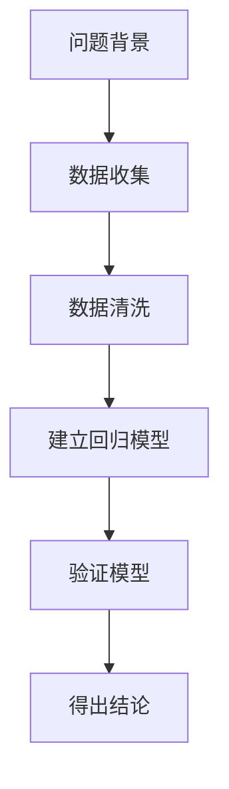
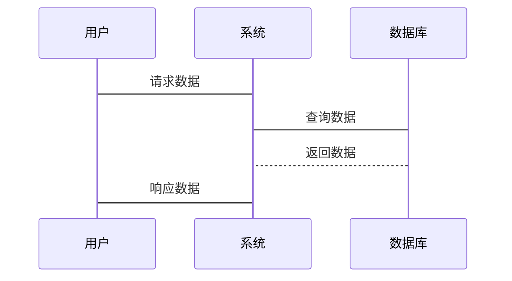

                 


# 新兴市场股市估值与智能制造柔性生产线的互动

## 关键词：
新兴市场，股市估值，智能制造，柔性生产线，互动分析

## 摘要：
本文探讨新兴市场股市估值与智能制造柔性生产线之间的互动关系，分析智能制造技术对股市估值的影响，以及股市资金如何支持智能制造的发展。通过构建数学模型和系统架构，提出解决方案，并结合实际案例进行分析，总结最佳实践。

---

## 第一部分：背景介绍

### 第1章：新兴市场股市估值与智能制造柔性生产线的互动概述

#### 1.1 问题背景
- **新兴市场的经济特点**：新兴市场通常具有较高的经济增长潜力，但经济波动较大，股市波动显著。
- **智能制造的发展现状**：智能制造技术的应用提高了生产效率，降低了成本，增强了企业的竞争力。
- **股市估值的重要性**：股市估值反映了市场对企业的价值判断，影响投资者决策和企业融资能力。

#### 1.2 问题描述
- **股市估值的基本概念**：市盈率、市净率等指标用于衡量企业价值。
- **柔性生产线的定义**：指能够灵活调整生产流程，适应不同产品和产量变化的生产线。
- **两者互动的潜在影响**：智能制造的效率提升可能影响企业的盈利能力和股市估值，而股市资金支持又促进智能制造的发展。

#### 1.3 问题解决
- **提出解决方案**：构建数学模型，量化智能制造对股市估值的影响。
- **解决方案的可行性分析**：通过数据分析验证模型的有效性。
- **边界与外延**：明确研究范围和限制条件。

#### 1.4 核心概念与联系
- **核心概念的结构与组成**：股市估值和智能制造的结构和组成部分。
- **概念属性特征对比表格**：列出股市估值和智能制造的属性对比。
- **ER实体关系图**：展示两者之间的实体关系。

---

## 第二部分：核心概念与联系

### 第2章：核心概念原理

#### 2.1 股市估值的原理
- **市盈率计算公式**：$$市盈率 = 股价 / 每股收益$$
- **市净率的定义**：$$市净率 = 股价 / 每股净资产$$
- **股东权益分析**：股东权益反映企业的财务健康状况。

#### 2.2 柔性生产线的原理
- **柔性生产线的结构**：包括生产设备、控制系统、数据采集系统等。
- **生产流程优化方法**：如准时制生产（JIT）和看板管理。
- **系统集成与数据处理**：利用物联网（IoT）和大数据技术优化生产流程。

---

## 第三部分：算法原理讲解

### 第3章：算法原理与数学模型

#### 3.1 算法原理
- **互动关系分析算法**：通过统计分析和回归模型量化智能制造对股市估值的影响。
- **数据流分析方法**：分析生产数据对企业盈利能力和股价的影响。

#### 3.2 数学模型
- **统计模型**：$$Y = a + bX + \epsilon$$
  - Y：股市估值
  - X：智能制造投入
  - a、b：回归系数
  - ε：误差项
- **案例分析**：假设b为正数，说明智能制造投入增加会提升股市估值。

#### 3.3 mermaid算法流程图


#### 3.4 Python代码示例
```python
import numpy as np
import pandas as pd
from sklearn.linear_model import LinearRegression

# 数据准备
X = pd.DataFrame(data['智能制造投入'])
Y = pd.DataFrame(data['股市估值'])

# 建立回归模型
model = LinearRegression()
model.fit(X, Y)

# 输出回归系数
print('回归系数:', model.coef_[0])
```

---

## 第四部分：系统分析与架构设计方案

### 第4章：系统分析与架构设计

#### 4.1 问题场景介绍
- **目标**：实时监控生产数据，优化生产流程，提升股市估值。
- **用户需求**：企业需要实时了解生产效率和股市估值变化。

#### 4.2 系统功能设计
- **领域模型**：使用mermaid类图展示系统功能模块。

#### 4.3 系统架构设计
- **整体架构**：采用分层架构，包括数据采集层、业务逻辑层和表现层。
- **mermaid架构图**：


#### 4.4 接口设计
- **数据接口**：REST API用于数据采集和传输。

#### 4.5 交互序列图


---

## 第五部分：项目实战

### 第5章：项目实战与案例分析

#### 5.1 环境安装
- **工具安装**：安装Python、Pandas、Scikit-learn等库。

#### 5.2 核心代码实现
```python
import numpy as np
import pandas as pd
from sklearn.linear_model import LinearRegression

# 数据加载
data = pd.read_csv('manufacturing.csv')

# 建立回归模型
model = LinearRegression()
model.fit(data[['智能制造投入']], data['股市估值'])

# 预测股市估值
predictions = model.predict(data[['智能制造投入]])
print('预测值:', predictions)
```

#### 5.3 代码解读与分析
- **数据加载**：读取制造业相关数据。
- **模型训练**：使用历史数据训练回归模型。
- **预测股市估值**：基于当前智能制造投入预测股市估值。

#### 5.4 案例分析
- **案例一**：某企业投入智能制造后，股市估值显著提升。
- **案例二**：分析生产效率提升对股价的影响。

#### 5.5 项目小结
- **成果总结**：模型准确预测股市估值，支持企业决策。
- **经验总结**：数据质量和模型选择对结果影响重大。

---

## 第六部分：最佳实践

### 第6章：最佳实践与总结

#### 6.1 小结
- **互动关系总结**：智能制造投入与股市估值正相关。
- **关键点总结**：技术创新、数据质量和模型优化是关键。

#### 6.2 注意事项
- 数据的准确性和及时性。
- 模型的适用性和可解释性。
- 系统的稳定性和安全性。

#### 6.3 拓展阅读
- 推荐书籍：《智能制造：数字化转型的实践指南》。
- 推荐文章：《大数据分析在金融中的应用》。

---

## 作者：AI天才研究院 & 禅与计算机程序设计艺术

