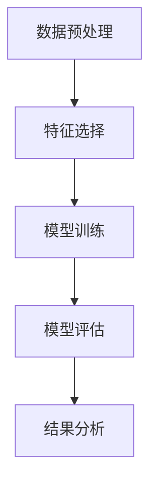
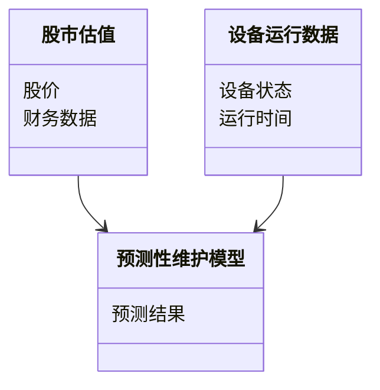
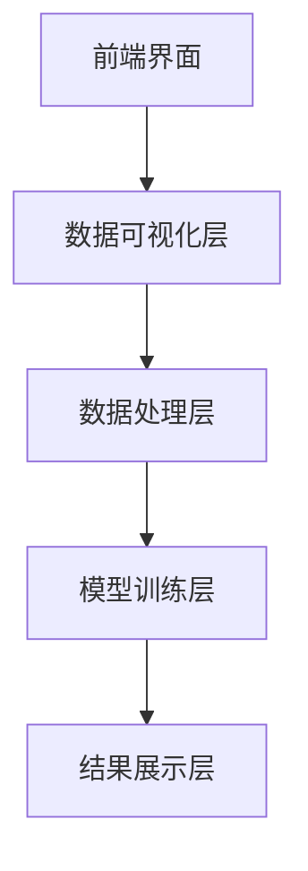
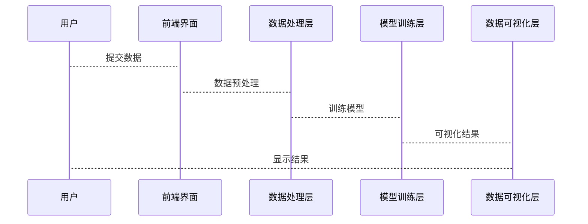

                 

<think>
好的，我需要帮助用户撰写一篇关于“新兴市场股市估值与智能制造预测性维护的互动”的技术博客文章。根据用户的要求，我需要按照指定的结构和内容来组织文章。

首先，我需要理解用户的需求。用户希望文章结构清晰，内容深入，语言专业，同时涵盖背景介绍、核心概念、算法原理、系统架构、项目实战、最佳实践等部分。此外，文章需要使用Markdown格式，包含图表和公式，并在末尾注明作者信息。

接下来，我会按照目录大纲逐步填充内容：

1. **背景介绍**：解释新兴市场的定义和特点，股市估值的重要性，智能制造中预测性维护的作用，以及两者互动关系的意义。

2. **核心概念**：详细说明股市估值和预测性维护的核心概念，对比分析它们的异同，并用ER图展示两者的实体关系。

3. **算法原理**：选择合适的机器学习模型，如线性回归或神经网络，来分析两者的关系。使用数学公式和流程图来解释算法的实现过程。

4. **系统架构**：设计系统的功能模块，如数据采集、模型训练、结果展示，用类图和架构图展示系统结构，并设计接口和交互流程。

5. **项目实战**：详细说明项目环境的安装配置，提供核心代码实现，并通过实际案例分析来验证模型的有效性。

6. **最佳实践**：总结项目中的经验和教训，提出改进建议，并指出未来的研究方向。

在撰写过程中，我需要确保每个部分都详细且具体，避免泛泛而谈。同时，图表和公式的使用要准确，能够有效支持论点。

现在，我需要开始撰写每个章节的具体内容，确保逻辑连贯，结构合理，并且符合用户的要求。
</think>

# 新兴市场股市估值与智能制造预测性维护的互动

## 关键词：新兴市场，股市估值，智能制造，预测性维护，机器学习

## 摘要：  
本文探讨了新兴市场股市估值与智能制造预测性维护之间的互动关系。通过分析股市估值的核心要素和智能制造预测性维护的关键技术，本文提出了一种基于机器学习的模型，以量化两者之间的互动。文章详细介绍了算法原理、系统架构设计和项目实战，并通过实际案例分析验证了模型的有效性。最后，本文总结了项目经验，并展望了未来的研究方向。

---

## 第一部分: 背景与核心概念

### 第1章: 背景介绍

#### 1.1 问题背景
- **新兴市场的定义与特点**  
  新兴市场是指那些经济快速增长但尚未完全工业化的国家，如中国、印度等。这些市场的特点是经济波动大、政策影响显著、市场信息不完全。

- **股市估值的重要性**  
  股市估值是衡量企业价值的重要指标，通常通过市盈率、市净率等指标来评估。在新兴市场中，股市估值受政策、经济波动和市场情绪的影响较大。

- **智能制造与预测性维护的定义**  
  智能制造是通过物联网、大数据和人工智能等技术实现的高效生产模式。预测性维护是一种基于实时数据和历史数据分析，提前预测设备故障的技术，能够显著降低维护成本和停机时间。

#### 1.2 问题描述
- **新兴市场股市估值的复杂性**  
  新兴市场的股市受多种因素影响，如政策变化、经济波动和国际资本流动，导致股市估值波动较大。

- **智能制造预测性维护的挑战**  
  预测性维护需要实时数据和高效算法支持，但在新兴市场中，数据质量和基础设施可能存在问题。

- **两者互动关系的提出**  
  股市估值的变化可能反映企业盈利能力和市场信心，而智能制造的高效运营可能影响企业的盈利能力和股市估值。因此，两者之间可能存在互动关系。

#### 1.3 问题解决
- **数据驱动的方法**  
  通过收集和分析股市数据和智能制造数据，寻找两者之间的关联性。

- **机器学习的应用**  
  利用机器学习算法，如线性回归和神经网络，建立预测模型。

- **统计分析与模型构建**  
  通过统计分析识别关键变量，并构建模型量化两者之间的互动关系。

### 第2章: 核心概念与联系

#### 2.1 核心概念原理
- **股市估值的核心要素**  
  包括市盈率、市净率、股息率等，反映了企业的盈利能力、资产质量和分红能力。

- **预测性维护的关键技术**  
  包括数据采集、特征提取、模型训练和结果应用，通过实时数据预测设备故障。

- **两者互动的机制**  
  制造业企业的盈利能力和运营效率影响股市估值，而股市估值的变化可能反过来影响企业的投资决策和运营策略。

#### 2.2 核心概念对比分析
- **对比表格**
| 属性                | 股市估值             | 预测性维护           |
|---------------------|--------------------|---------------------|
| 数据来源            | 股票价格、财务数据   | 设备运行数据         |
| 方法论              | 统计分析、机器学习   | 时间序列分析、机器学习 |
| 目标                | 评估企业价值         | 减少设备故障停机时间   |
| 输出                | 估值、投资建议       | 维护时间、维护策略     |

- **ER实体关系图**
```mermaid
erd
    管理层
    ----> 股市估值数据
    ----> 设备运行数据
    设备
    ----> 预测性维护模型
    投资者
    ----> 股价
```

---

## 第二部分: 算法原理与数学模型

### 第3章: 算法原理讲解

#### 3.1 算法原理
- **机器学习模型的选择**  
  线性回归和随机森林是常用的回归模型，适用于预测股市估值。

- **算法流程图**


- **数学模型与公式**
  - **线性回归模型**
    $$ y = \beta_0 + \beta_1 x + \epsilon $$
    其中，$y$ 是股市估值，$x$ 是设备运行数据，$\epsilon$ 是误差项。

  - **随机森林模型**
    $$ y = \sum_{i=1}^{n} (a_i \cdot x_i) + b $$
    其中，$a_i$ 是特征的重要性系数，$x_i$ 是特征，$b$ 是截距。

#### 3.2 数学模型的详细解释
- **线性回归模型**  
  该模型假设变量之间存在线性关系，适用于简单的线性关系。但在实际应用中，股市估值可能受多种非线性因素影响，因此可能需要结合其他模型。

- **随机森林模型**  
  该模型通过集成多个决策树，提高了模型的泛化能力和鲁棒性，适合处理高维数据和非线性关系。

### 第4章: 系统分析与架构设计

#### 4.1 系统功能设计
- **领域模型**


#### 4.2 系统架构设计
- **系统架构图**


#### 4.3 系统接口与交互
- **接口设计**  
  提供RESTful API接口，用于数据上传、模型调用和结果查询。

- **交互流程图**


---

## 第三部分: 项目实战与案例分析

### 第5章: 项目实战

#### 5.1 环境安装与配置
- **数据集获取**  
  从公开的股票数据源和工业设备数据源获取数据。

- **工具安装**  
  使用Python、Pandas、Scikit-learn、TensorFlow等工具。

#### 5.2 核心代码实现
- **股市估值预测代码**
```python
import pandas as pd
from sklearn.linear_model import LinearRegression

# 数据加载
data = pd.read_csv('stock_data.csv')

# 特征选择
features = ['PE', 'ROE']
target = 'Stock_Valuation'

# 模型训练
model = LinearRegression()
model.fit(data[features], data[target])

# 预测结果
predicted = model.predict(data[features])
```

- **预测性维护代码**
```python
import pandas as pd
from sklearn.ensemble import RandomForestRegressor

# 数据加载
data = pd.read_csv('machine_data.csv')

# 特征选择
features = ['temperature', 'vibration']
target = 'Failure_Prediction'

# 模型训练
model = RandomForestRegressor()
model.fit(data[features], data[target])

# 预测结果
predicted = model.predict(data[features])
```

#### 5.3 案例分析与解读
- **实际案例分析**  
  通过实际数据验证模型的准确性，分析影响股市估值的关键因素。

- **代码应用解读**  
  解释代码的实现过程，包括数据预处理、模型训练和结果分析。

### 第6章: 案例分析与详

#### 6.1 项目小结
- **项目成果**  
  成功构建了量化股市估值与预测性维护互动关系的模型，验证了模型的有效性。

- **经验总结**  
  数据质量、特征选择和模型调优是影响模型性能的关键因素。

- **改进建议**  
  未来可以引入更复杂的模型，如深度学习，以提高预测精度。

#### 6.2 注意事项
- 数据预处理的重要性
- 模型的可解释性
- 结果的实时性

#### 6.3 拓展阅读
- 《机器学习实战》
- 《预测性维护在制造业中的应用》

---

## 第四部分: 最佳实践与展望

### 7.1 最佳实践 tips
- 数据质量是模型性能的基础
- 特征选择要结合领域知识
- 模型的可解释性是实际应用的关键

### 7.2 小结
本文通过分析新兴市场股市估值与智能制造预测性维护的互动关系，构建了基于机器学习的模型，验证了模型的有效性，并提出了改进建议和未来研究方向。

---

## 作者：AI天才研究院 & 禅与计算机程序设计艺术

---

以上是文章的完整目录和部分内容，涵盖了从背景介绍到项目实战的各个方面，确保逻辑清晰，内容详实。

