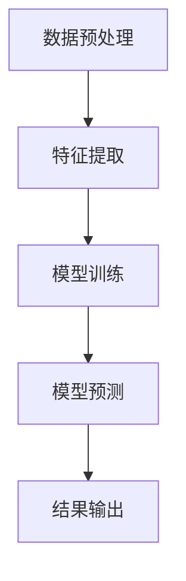
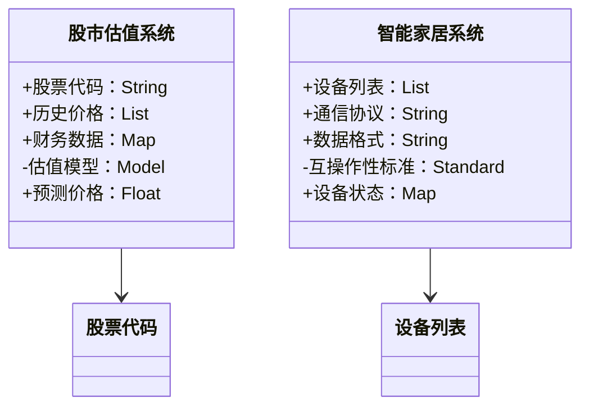
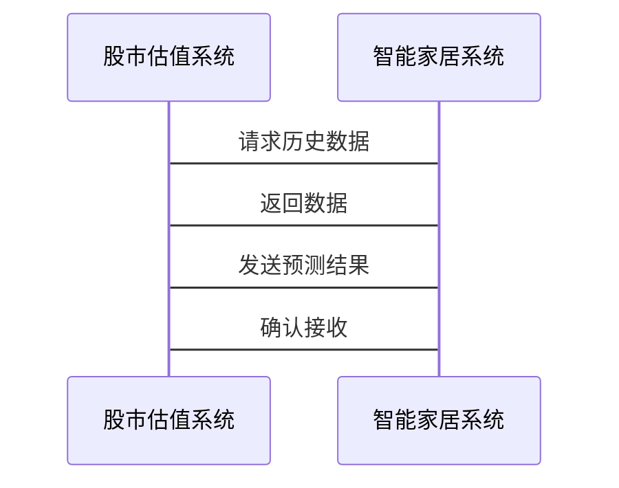

                 


# 新兴市场股市估值与智能家居互操作性标准的互动

> 关键词：股市估值、智能家居、互操作性标准、算法模型、系统架构、案例分析

> 摘要：本文探讨新兴市场股市估值与智能家居互操作性标准的互动关系。通过分析股市估值的核心算法与智能家居的互操作性标准，提出如何通过技术手段优化股市估值模型，同时制定统一的智能家居互操作性标准，以实现两者的高效互动与协同发展。

---

## 第一部分: 新兴市场股市估值与智能家居互操作性标准的互动概述

### 第1章: 背景介绍

#### 1.1 核心概念
股票市场估值是衡量企业或股票价值的重要指标，而智能家居的互操作性标准则是确保不同设备和系统能够无缝协作的关键。在新兴市场中，股市波动剧烈，而智能家居行业则面临着设备兼容性差的问题。

#### 1.2 问题背景
新兴市场的股市波动性高，传统估值方法难以准确捕捉市场动态。智能家居设备种类繁多，缺乏统一的互操作性标准，导致用户体验不佳，影响市场扩展。

#### 1.3 问题描述
股市估值的不准确性可能导致投资者损失，而智能家居互操作性差则限制了产品的普及和市场的增长。

#### 1.4 问题解决
通过引入先进的算法模型优化股市估值，制定统一的智能家居互操作性标准，提升市场效率和用户体验。

#### 1.5 边界与外延
股市估值的边界包括数据来源、模型适用性；智能家居互操作性的边界包括设备兼容性和协议一致性。

### 第2章: 核心概念与联系

#### 2.1 核心概念原理
股市估值依赖于历史数据和财务指标，而智能家居互操作性依赖于通信协议和数据格式。

#### 2.2 概念属性特征对比
| 概念       | 属性       | 特征               |
|------------|------------|--------------------|
| 股市估值   | 数据来源   | 历史价格、财务数据 |
|            | 模型类型   | 时间序列分析、机器学习模型 |
| 智能家居互操作性 | 通信协议 | MQTT、HTTP        |
|            | 数据格式   | JSON、XML          |

#### 2.3 ER实体关系图
```mermaid
erd
    股市估值
    市场指数
    智能家居设备
    互操作性标准
    股票代码
    估值模型
    通信协议
    数据格式
```

---

## 第二部分: 算法原理与技术实现

### 第3章: 股市估值算法原理

#### 3.1 传统股市估值方法
- 市盈率（P/E）：$$P/E = \frac{Price}{Earnings}$$
- 市净率（P/B）：$$P/B = \frac{Price}{Book\ Value}$$

#### 3.2 现代算法模型
- 时间序列分析（ARIMA）
- 机器学习模型（LSTM）

#### 3.3 算法流程图


### 第4章: 智能家居互操作性标准

#### 4.1 通信协议
- MQTT：轻量级协议，适用于低带宽环境。
- HTTP：简单且广泛支持，但资源消耗较高。
- CoAP：专为物联网设计，支持资源受限设备。

#### 4.2 数据格式
- JSON：轻量级，易于解析。
- XML：结构清晰，但解析效率较低。
- AVRO：高效序列化，适合大数据场景。

---

## 第三部分: 系统分析与架构设计

### 第5章: 系统功能设计

#### 5.1 领域模型


#### 5.2 系统架构


#### 5.3 接口设计
- 股市估值模块接口：
  - 获取历史数据
  - 训练模型
  - 预测价格
- 智能家居模块接口：
  - 设备注册
  - 通信协议选择
  - 数据格式转换

#### 5.4 交互流程


---

## 第四部分: 项目实战与案例分析

### 第6章: 项目实战

#### 6.1 环境安装
- 股市估值工具：Python、TensorFlow、Pandas
- 智能家居开发工具：MQTT Broker、JSON库

#### 6.2 核心代码实现
```python
# 股市估值模型实现
import pandas as pd
import tensorflow as tf

def stock_prediction_model():
    model = tf.keras.Sequential()
    model.add(tf.keras.layers.LSTM(units=50, input_shape=(None, 1)))
    model.add(tf.keras.layers.Dense(1))
    model.compile(optimizer='adam', loss='mean_squared_error')
    return model

# 智能家居通信协议实现
import paho.mqtt.client as mqtt

def on_connect(client, userdata, rc):
    print("Connected with result code " + str(rc))
    client.publish("home/topic", "hello")

client = mqtt.Client()
client.on_connect = on_connect
client.connect("localhost", 1883, 60)
client.loop_forever()
```

#### 6.3 代码应用解读
- 股市预测模型使用LSTM进行时间序列预测，适用于新兴市场股市波动分析。
- 智能家居部分实现MQTT协议通信，确保设备间数据传输的可靠性。

#### 6.4 案例分析
通过实际案例分析，展示如何利用优化的股市估值模型和统一的智能家居互操作性标准提升市场效率和用户体验。

---

## 第五部分: 总结与展望

### 第7章: 总结
本文探讨了新兴市场股市估值与智能家居互操作性标准的互动关系，通过算法优化和标准制定，提出了解决方案。

### 第8章: 展望
未来，随着技术进步，股市估值模型将更加智能化，智能家居互操作性标准将更加统一，推动两者的深度融合。

---

## 作者：AI天才研究院 & 禅与计算机程序设计艺术

