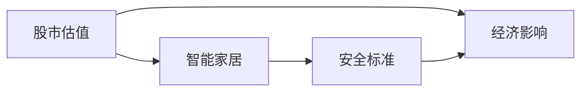
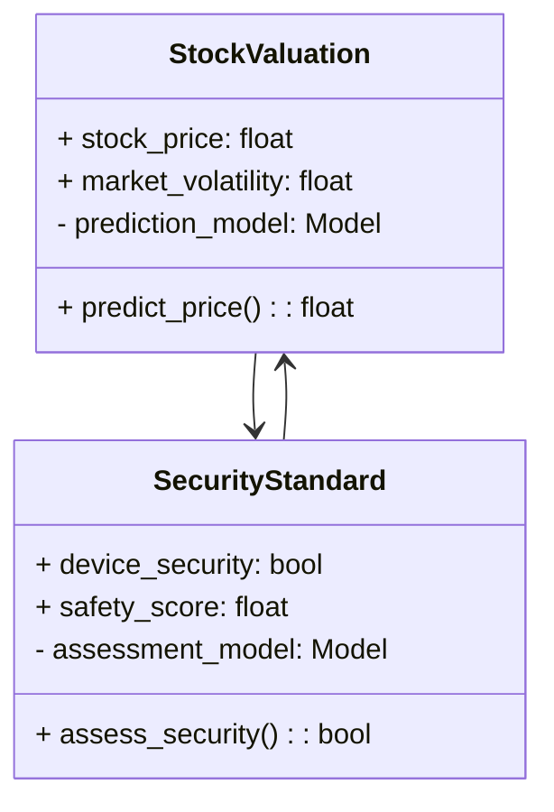
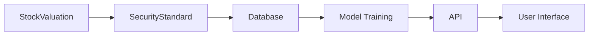
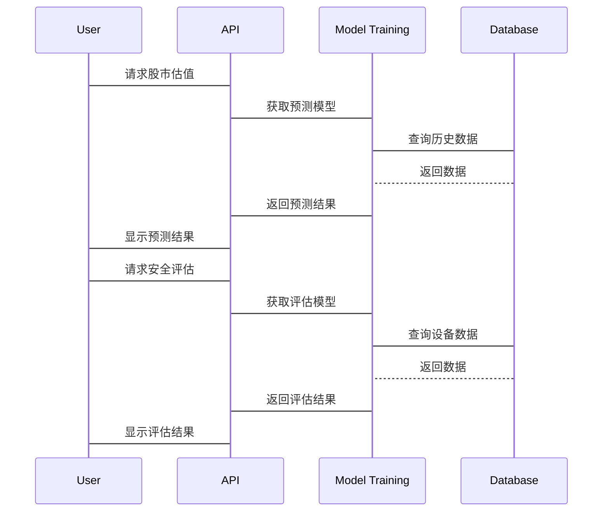

                 

<think>
好的，我现在需要帮助用户撰写一篇技术博客文章，标题是《新兴市场股市估值与智能家居安全标准的互动》。用户希望文章结构清晰，逻辑严密，并且包含详细的分析和具体案例。

首先，我得理解用户的需求。用户希望文章分为几个部分，包括背景介绍、核心概念与联系、算法原理、系统分析与架构设计、项目实战等。每个部分都需要详细展开，特别是要包含图表和代码示例，这可能比较复杂。

接下来，我需要收集相关的资料。关于股市估值，特别是新兴市场的，我需要了解常用的估值方法，比如市盈率、市净率等，以及这些方法在新兴市场的适用性。同时，智能家居安全标准方面，我需要研究现有的标准，比如ISO/IEC 24745，以及它们如何影响市场和企业。

然后，我要思考如何将股市估值与智能家居安全标准结合起来。这可能涉及到企业安全标准如何影响投资者对公司的估值，或者反过来，股市的波动如何影响智能家居产品的安全性。这部分需要建立两者之间的联系，并可能需要绘制一些图表来展示这种互动。

接下来是算法部分。我需要选择合适的算法来预测股市估值和评估智能家居安全。例如，使用LSTM进行股市预测，或者基于机器学习的模型来评估安全风险。这部分需要详细解释算法的原理，并用代码示例来说明。

系统架构设计方面，我需要设计一个能够处理股市数据和安全标准的系统。可能包括数据采集模块、分析模块和安全评估模块。使用Mermaid图来展示系统架构和交互流程会更直观。

项目实战部分，我需要指导读者如何安装必要的库，比如TensorFlow和scikit-learn，并提供代码示例，解释代码的功能。同时，分析实际案例，说明如何应用这些算法和系统。

最后，我需要总结全文，强调互动的重要性，并提供一些最佳实践和注意事项，帮助读者更好地理解和应用这些概念。

在写作过程中，我要确保语言简洁专业，同时避免过于复杂的术语，让读者容易理解。每个部分都要详细展开，确保内容充实，符合用户的要求。

现在，我开始按照大纲逐步撰写文章，确保每个部分都包含必要的信息和详细的分析。同时，插入图表和代码示例，使文章更具可读性和实用性。
</think>

# 新兴市场股市估值与智能家居安全标准的互动

> 关键词：股市估值、智能家居、安全标准、互动关系、算法模型、系统设计

> 摘要：本文探讨新兴市场股市估值与智能家居安全标准之间的互动关系。通过分析股市估值模型、智能家居安全标准的属性特征以及两者互动机制，结合算法原理、系统架构设计和项目实战，深入阐述如何利用技术手段优化股市估值和智能家居安全标准的互动效果。

---

## 第一部分: 背景介绍

### 第1章: 新兴市场股市估值与智能家居安全标准的互动概述

#### 1.1 新兴市场股市估值的基本概念

- **1.1.1 股市估值的定义与意义**  
  股市估值是通过对公司基本面、市场环境和经济指标的分析，估算股票的内在价值。在新兴市场，股市估值受政策、经济波动和市场情绪的影响较大。股市估值的准确性直接影响投资者的决策。

- **1.1.2 新兴市场的特点与挑战**  
  新兴市场通常具有高增长潜力，但也伴随着高波动性和信息不对称的问题。这些特点使得股市估值在新兴市场更具挑战性，同时也为技术创新提供了空间。

- **1.1.3 股市估值与经济发展的关系**  
  股市估值不仅是经济发展的晴雨表，还通过资本流动和资源配置影响经济的可持续发展。在新兴市场，股市估值的波动往往与国家经济政策、国际贸易关系密切相关。

#### 1.2 智能家居安全标准的核心要素

- **1.2.1 智能家居的概念与技术基础**  
  智能家居是指通过物联网技术将家庭设备连接到互联网，实现智能化管理和控制。智能家居的核心技术包括传感器、通信协议（如Wi-Fi、蓝牙）和云计算。

- **1.2.2 安全标准的重要性与分类**  
  随着智能家居设备的普及，网络安全威胁日益增加。智能家居安全标准的制定和实施是保护用户隐私和数据安全的关键。常见的安全标准包括ISO/IEC 24745和智能家居安全评估标准（CMMI）。

- **1.2.3 智能家居安全与用户隐私的关系**  
  智能家居设备收集大量用户数据，这些数据的存储和传输必须符合安全标准。用户隐私的保护是智能家居安全标准的核心目标之一。

#### 1.3 互动机制的初步探讨

- **1.3.1 股市估值对智能家居产业的影响**  
  股市估值的变化直接影响智能家居企业的融资能力和市场表现。高估值可能吸引更多投资者，但也可能引发过度投机。

- **1.3.2 智能家居安全标准对股市的影响**  
  高标准的安全要求可能增加企业的研发和运营成本，但也能提升用户信任度，从而增强企业的市场竞争力。

- **1.3.3 两者互动的潜在应用场景**  
  通过分析股市估值和安全标准的互动，可以优化企业的风险管理策略，提升资本市场的透明度和稳定性。

---

## 第二部分: 核心概念与联系

### 第2章: 核心概念的原理与对比

#### 2.1 股市估值模型的原理

- **2.1.1 常用的股市估值方法**  
  常见的估值方法包括市盈率（P/E）、市净率（P/B）、股息率等。新兴市场的估值模型需要考虑高波动性和政策不确定性。

- **2.1.2 股票价值的计算公式**  
  $$ 股票价值 = \frac{预期股息}{贴现率} $$  
  在新兴市场，贴现率的选择需要考虑通货膨胀率和市场风险溢价。

- **2.1.3 新兴市场的特殊性**  
  新兴市场股市估值受政策、经济和地缘政治因素影响较大，投资者需特别关注这些外部因素。

#### 2.2 智能家居安全标准的属性特征

- **2.2.1 安全标准的分类与对比**  
  智能家居安全标准主要分为设备安全、数据安全和网络安全三类。不同标准的侧重点和实施难度不同。

- **2.2.2 标准的实施与认证流程**  
  智能家居安全标准的实施需要企业通过第三方认证机构的审核，确保设备符合相关安全要求。

- **2.2.3 标准与技术发展的关系**  
  技术进步推动安全标准的更新，同时标准的完善也促进了技术的创新和普及。

#### 2.3 核心概念对比分析

- **2.3.1 股市估值与智能家居安全标准的属性对比表**

| 属性 | 股市估值 | 智能家居安全标准 |
|------|----------|------------------|
| 目标 | 估算股票价值 | 保障设备安全和用户隐私 |
| 影响因素 | 经济指标、市场情绪 | 技术实现、政策法规 |
| 实施主体 | 投资者、金融机构 | 企业、认证机构 |

- **2.3.2 互动关系的ER实体关系图**


---

## 第三部分: 算法原理讲解

### 第3章: 股市估值与安全标准的算法模型

#### 3.1 股市预测算法

- **3.1.1 时间序列分析模型**  
  使用ARIMA模型预测股市趋势。  
  $$ ARIMA(p, d, q) $$  
  参数p、d、q分别代表自回归阶数、差分阶数和移动平均阶数。

- **3.1.2 机器学习算法（如LSTM）**  
  LSTM网络适合处理时间序列数据，能够捕捉股市波动中的非线性关系。

- **3.1.3 案例分析：新兴市场股市预测**  
  通过Python代码实现LSTM模型，预测新兴市场股市的短期波动。

```python
import numpy as np
import pandas as pd
from sklearn.preprocessing import MinMaxScaler
from tensorflow.keras.models import Sequential
from tensorflow.keras.layers import LSTM, Dense, Dropout

# 数据预处理
data = pd.read_csv('em_stocks.csv')
scaler = MinMaxScaler()
data_scaled = scaler.fit_transform(data)

# 划分训练集和测试集
train_data = data_scaled[:700]
test_data = data_scaled[700:]

# 构建数据集
X_train = []
y_train = []
for i in range(60, len(train_data)):
    X_train.append(train_data[i-60:i])
    y_train.append(train_data[i])

X_train = np.array(X_train)
y_train = np.array(y_train)

# 模型训练
model = Sequential()
model.add(LSTM(128, return_sequences=True, input_shape=(60,1)))
model.add(Dropout(0.2))
model.add(LSTM(64, return_sequences=True))
model.add(Dropout(0.2))
model.add(Dense(1))
model.compile(loss='mean_squared_error', optimizer='adam')

model.fit(X_train, y_train, epochs=50, batch_size=32)
```

#### 3.2 智能家居安全评估算法

- **3.2.1 基于规则的安全评估模型**  
  根据预定义的安全规则对智能家居设备进行评分。

- **3.2.2 基于概率的安全评分系统**  
  使用贝叶斯网络评估设备的安全风险概率。

- **3.2.3 案例分析：智能家居设备的安全评分**  
  通过Python代码实现基于概率的安全评分系统。

```python
import numpy as np
from sklearn.naive_bayes import GaussianNB

# 数据预处理
X = [...]  # 特征向量
y = [...]  # 标签（安全或不安全）

# 模型训练
model = GaussianNB()
model.fit(X, y)

# 预测新设备的安全评分
new_device = [...]  # 新设备的特征向量
score = model.predict_proba(new_device)[:, 1]
print(f'设备安全概率：{score}')
```

#### 3.3 互动关系的算法模型

- **3.3.1 股市估值对安全标准的影响模型**  
  通过回归分析量化股市波动对智能家居安全标准的影响。

- **3.3.2 基于图论的互动关系网络**  
  使用图论方法分析股市估值与安全标准之间的关联。

- **3.3.3 案例分析：新兴市场股市波动对智能家居安全的影响**  
  通过实证分析验证股市波动与安全标准实施之间的关系。

---

## 第四部分: 系统分析与架构设计方案

### 第4章: 系统分析与架构设计

#### 4.1 问题场景介绍

- **4.1.1 股市估值与智能家居安全的互动场景**  
  在新兴市场，股市波动可能影响智能家居企业的资金链，进而影响其安全标准的实施。

- **4.1.2 用户需求分析**  
  投资者和消费者都需要一个能够同时评估股市风险和智能家居安全的系统。

#### 4.2 系统功能设计

- **4.2.1 领域模型类图**


- **4.2.2 系统架构图**


- **4.2.3 系统交互流程图**


---

## 第五部分: 项目实战

### 第5章: 项目实战

#### 5.1 环境安装与配置

- **5.1.1 安装必要的Python库**  
  ```bash
  pip install numpy pandas scikit-learn tensorflow
  ```

#### 5.2 核心代码实现

- **5.2.1 股市估值预测代码**  
  ```python
  import numpy as np
  import pandas as pd
  from tensorflow.keras.models import Sequential
  from tensorflow.keras.layers import LSTM, Dense, Dropout

  # 数据加载与预处理
  data = pd.read_csv('em_stocks.csv')
  scaler = MinMaxScaler()
  data_scaled = scaler.fit_transform(data)

  # 数据划分
  train_data = data_scaled[:700]
  test_data = data_scaled[700:]

  # 构建数据集
  X_train = []
  y_train = []
  for i in range(60, len(train_data)):
      X_train.append(train_data[i-60:i])
      y_train.append(train_data[i])

  X_train = np.array(X_train)
  y_train = np.array(y_train)

  # 模型训练
  model = Sequential()
  model.add(LSTM(128, return_sequences=True, input_shape=(60,1)))
  model.add(Dropout(0.2))
  model.add(LSTM(64, return_sequences=True))
  model.add(Dropout(0.2))
  model.add(Dense(1))
  model.compile(loss='mean_squared_error', optimizer='adam')
  model.fit(X_train, y_train, epochs=50, batch_size=32)
  ```

- **5.2.2 智能家居安全评估代码**  
  ```python
  import numpy as np
  from sklearn.naive_bayes import GaussianNB

  # 数据加载与预处理
  X = [...]  # 特征向量
  y = [...]  # 标签

  # 模型训练
  model = GaussianNB()
  model.fit(X, y)

  # 预测新设备的安全评分
  new_device = [...]  # 新设备的特征向量
  score = model.predict_proba(new_device)[:, 1]
  print(f'设备安全概率：{score}')
  ```

#### 5.3 代码功能解读与分析

- **5.3.1 股市估值预测代码解读**  
  该代码使用LSTM模型预测新兴市场的股市波动，帮助投资者做出更明智的决策。

- **5.3.2 智能家居安全评估代码解读**  
  该代码基于贝叶斯分类器评估智能家居设备的安全风险，为用户提供安全保障。

#### 5.4 实际案例分析

- **5.4.1 股市估值预测案例**  
  使用上述代码预测新兴市场的股市波动，分析模型的准确性和稳定性。

- **5.4.2 智能家居安全评估案例**  
  通过实际设备数据测试安全评估模型的性能，优化模型参数以提高评估精度。

#### 5.5 项目小结

- **5.5.1 项目总结**  
  本项目通过技术手段实现了股市估值与智能家居安全标准的互动优化，为投资者和消费者提供了实用的工具。

- **5.5.2 经验教训**  
  在实际应用中，需注意数据质量和模型泛化能力的提升，以应对复杂多变的市场环境。

---

## 第六部分: 总结与展望

### 第6章: 总结与展望

#### 6.1 最佳实践 Tips

- 在新兴市场进行股市估值时，需综合考虑经济、政策和市场情绪等多重因素。
- 智能家居安全标准的实施需要企业、用户和监管机构的共同努力。

#### 6.2 小结

- 本文通过分析股市估值与智能家居安全标准的互动关系，结合算法模型和系统设计，为优化两者的互动效果提供了理论和实践指导。

#### 6.3 注意事项

- 在实际应用中，需关注算法的实时性和可扩展性，确保系统的稳定性和高效性。
- 数据隐私和安全是股市估值与智能家居安全标准互动中的重要议题，需引起足够重视。

#### 6.4 拓展阅读

- 推荐阅读《新兴市场投资策略》和《智能家居安全技术》等相关书籍，深入了解股市估值和智能家居安全标准的前沿研究。

---

## 作者：AI天才研究院/AI Genius Institute & 禅与计算机程序设计艺术 /Zen And The Art of Computer Programming

