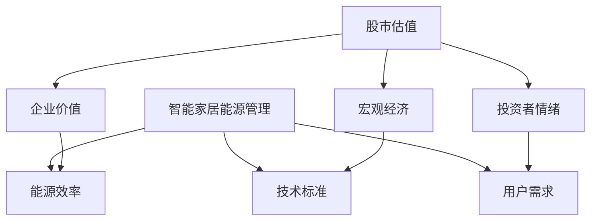
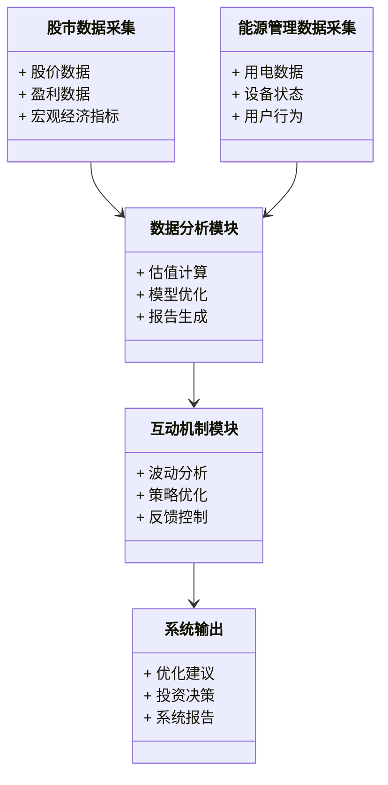
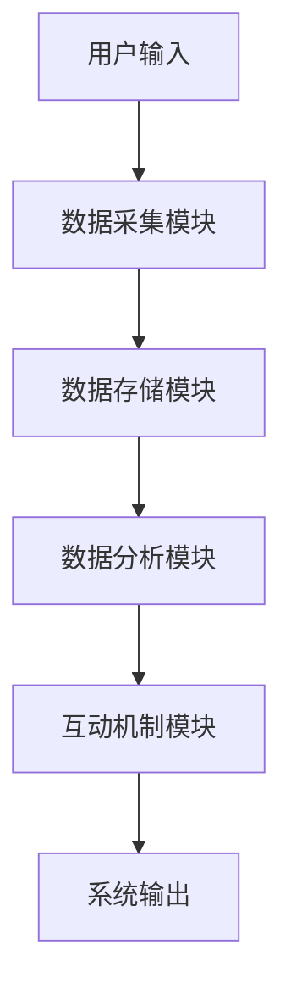
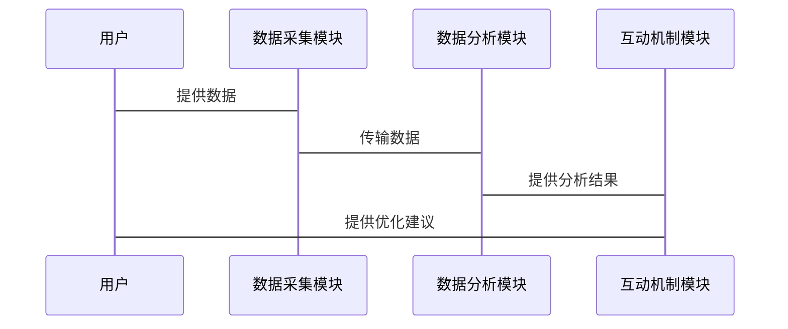

                 

<think>
嗯，我现在需要帮助用户撰写一篇关于《新兴市场股市估值与智能家居能源管理标准的互动》的技术博客文章。用户希望文章结构清晰，逻辑严谨，涵盖背景介绍、核心概念、算法原理、系统分析与架构设计、项目实战等多个部分。同时，用户特别提到要使用专业的技术语言，但又要让内容易懂，适合技术博客读者。

首先，我应该先理解这个主题的两个方面：股市估值和智能家居能源管理标准。这两者看似不相关，但用户指出它们之间存在互动关系。我需要深入分析它们如何互动，可能涉及数据共享、技术标准的影响、经济因素对能源管理投资的影响等。

接下来，我会按照用户提供的目录大纲来组织内容。文章需要包括摘要、引言、核心概念、互动机制、系统架构、项目实战、结论等部分。每部分都需要详细展开，确保内容充实。

在撰写引言时，我需要明确问题背景和研究意义。新兴市场的股市波动较大，而智能家居能源管理在这些市场中可能面临不同的挑战。这两者的互动可能会影响能源管理系统的投资决策，进而影响股市表现。这部分需要简明扼要，吸引读者继续阅读。

核心概念部分，我需要分别解释股市估值和智能家居能源管理标准的基本概念。股市估值包括常用的指标如市盈率、市净率，以及影响股市的宏观经济因素。智能家居能源管理则涉及技术标准、系统架构和数据管理。通过对比分析，帮助读者理解两者各自的特性和重要性。

互动机制部分是文章的重点。我需要详细探讨股市波动如何影响能源管理系统的投资决策，例如股市下跌可能导致能源管理系统投资减少，进而影响系统的效率。反之，高效的能源管理系统可能提升企业的 profitability，进而影响股市估值。这部分可能需要引入数学模型，如回归分析，来量化两者之间的关系。

系统架构设计部分，我需要使用 Mermaid 图展示系统的各个模块，如数据采集、分析、控制等，并说明它们之间的交互。同时，接口设计和数据格式也需要详细描述，确保系统的兼容性和高效性。

项目实战部分，我需要提供具体的环境配置、代码实现和案例分析。例如，编写一个简单的能源管理系统，并与股市数据进行对比分析，展示互动机制的实际应用。这部分需要代码示例和详细的解读，帮助读者理解和应用。

在撰写过程中，我需要注意以下几点：使用专业但易懂的语言，确保每个部分逻辑清晰，引用实际案例或数据支持论点，使用数学公式和图表增强内容的严谨性和可读性。同时，遵循用户的格式要求，确保文章结构完整，字数在10000到12000字之间。

最后，我会总结全文，强调股市估值与智能家居能源管理互动的重要性，并提出未来的研究方向或改进建议。这不仅为读者提供了一个全面的理解，也为后续的研究和实践提供了方向。

总的来说，我需要系统地组织内容，确保每个部分都详细且符合用户的要求，同时保持文章的连贯性和逻辑性。这将帮助读者深入理解股市估值与智能家居能源管理之间的互动，并能够在实际项目中应用相关知识。
</think>

# 新兴市场股市估值与智能家居能源管理标准的互动

---

## 关键词

- 股市估值
- 智能家居
- 能源管理
- 新兴市场
- 技术标准

---

## 摘要

本文探讨了新兴市场股市估值与智能家居能源管理标准之间的互动关系。通过分析股市估值的核心方法、智能家居能源管理的技术标准及其相互作用，本文揭示了两者在经济和技术创新方面的深层次联系。文章从背景介绍、核心概念、互动机制、系统架构设计、项目实战等多维度展开，结合数学模型和实际案例，深入剖析了这一互动关系的内在逻辑和实际应用。通过本文的研究，读者可以更好地理解如何在新兴市场中优化股市估值与智能家居能源管理的协同发展。

---

# 第一部分：背景介绍与核心概念

## 第1章：背景介绍与问题定义

### 1.1 新兴市场股市估值的重要性

#### 1.1.1 新兴市场的定义与特点

新兴市场通常指那些经济快速增长但尚未完全工业化的国家，如中国、印度、巴西等。这些市场具有以下特点：

- 经济增速快，但波动性较大。
- 市场规模较小，但增长潜力巨大。
- 投资者结构多样，包括散户和机构投资者。

#### 1.1.2 股市估值的核心概念与意义

股市估值是衡量企业价值的重要指标，常用的估值方法包括市盈率（P/E）、市净率（P/B）和现金流折现法（DCF）。在新兴市场中，股市估值尤为重要，因为这些市场的波动性较大，投资者需要通过准确的估值来做出投资决策。

#### 1.1.3 新兴市场股市的独特性

与成熟市场相比，新兴市场股市具有以下独特性：

- 波动性大，受宏观经济因素影响显著。
- 市场流动性相对较低，可能导致估值偏差。
- 企业盈利模式多样，新兴行业占比高。

### 1.2 智能家居能源管理的兴起

#### 1.2.1 智能家居的定义与发展趋势

智能家居是指通过物联网技术将家庭设备连接起来，实现智能化管理的居住环境。随着技术的进步，智能家居正朝着更加个性化、智能化和高效化的方向发展。

#### 1.2.2 能源管理在智能家居中的作用

能源管理是智能家居的重要组成部分，通过智能设备和数据分析，可以实现能源的高效利用和成本控制。例如，智能家居可以通过实时监控能源消耗，优化用电策略，降低能源浪费。

#### 1.2.3 新兴市场中的能源管理挑战

在新兴市场，能源管理面临以下挑战：

- 基础设施相对落后，技术标准不统一。
- 能源价格波动大，影响管理效率。
- 用户对智能化设备的接受度较低。

### 1.3 问题背景与研究意义

#### 1.3.1 股市估值与能源管理的互动关系

股市估值的变化可能影响投资者对智能家居能源管理项目的投资意愿，而能源管理的效率又可能反过来影响企业的盈利能力，进而影响股市估值。

#### 1.3.2 新兴市场中的互动机制研究意义

通过研究新兴市场中股市估值与能源管理的互动关系，可以为投资者和企业提供有价值的决策支持，优化资源配置，促进技术创新。

#### 1.3.3 研究目标与方法论

本文旨在通过分析股市估值和能源管理的核心概念，揭示两者在新兴市场中的互动机制，并提出相应的优化建议。研究方法包括理论分析、数学建模和实际案例研究。

---

## 第2章：核心概念与联系

### 2.1 核心概念原理

#### 2.1.1 股市估值的数学模型

股市估值的核心方法之一是市盈率（P/E），其计算公式为：

$$ P/E = \frac{\text{股价}}{\text{每股收益}} $$

#### 2.1.2 智能家居能源管理的技术标准

智能家居能源管理的技术标准包括数据采集、传输和处理三个部分。以下是几种常用的标准：

- **ZigBee**：适用于低功耗设备，适合智能家居场景。
- **Z-Wave**：支持远程控制和自动化，适合家庭能源管理。
- **MQTT**：轻量级协议，适合实时数据传输。

### 2.1.3 核心概念对比分析

以下是对股市估值和智能家居能源管理标准的对比分析：

| **属性**         | **股市估值**              | **智能家居能源管理标准**         |
|------------------|--------------------------|--------------------------------|
| 核心目标         | 评估企业价值              | 优化能源使用效率                |
| 影响因素         | 宏观经济、企业盈利        | 技术标准、设备性能、用户习惯    |
| 应用场景         | 投资决策、风险管理        | 家庭能源管理、设备控制          |
| 表达方式         | 数值指标（如P/E）        | 技术规范和协议                  |

### 2.2 概念结构与核心要素

以下是股市估值与智能家居能源管理标准的概念结构图：



---

# 第二部分：互动机制与算法原理

## 第3章：互动机制分析

### 3.1 股市波动对能源管理的影响

股市波动可能通过以下途径影响智能家居能源管理：

1. **投资情绪**：股市下跌可能导致投资者减少对智能家居项目的投资，影响能源管理系统的推广。
2. **企业盈利**：股市估值下降可能意味着企业盈利减少，进而影响能源管理系统的研发投入。

### 3.2 能源管理对股市的影响

能源管理的优化可能通过以下方式影响股市估值：

1. **成本降低**：高效的能源管理可以降低企业运营成本，提高盈利能力，从而提升股价。
2. **技术创新**：先进的能源管理技术可能吸引投资者，提升企业的市场竞争力。

### 3.3 数学模型与互动机制

以下是一个简化的互动模型：

$$ \text{股市波动} \rightarrow \text{能源管理投资} \rightarrow \text{能源效率} \rightarrow \text{企业盈利} \rightarrow \text{股市估值} $$

---

## 第4章：系统架构设计

### 4.1 问题场景介绍

本文构建了一个新兴市场中的股市估值与智能家居能源管理互动系统。系统旨在通过实时数据分析，优化能源管理策略，提升股市估值。

### 4.2 系统功能设计

以下是系统的主要功能模块：



### 4.3 系统架构设计

以下是系统的架构设计：



### 4.4 接口设计与交互流程

以下是系统的接口设计：

- **输入接口**：接收股市数据和能源管理数据。
- **输出接口**：提供优化建议和投资决策支持。

### 4.5 交互流程

以下是系统的交互流程：



---

## 第5章：项目实战

### 5.1 环境配置与工具安装

以下是项目所需的环境配置：

- **编程语言**：Python 3.8+
- **框架与库**：Flask、Pandas、Scikit-learn
- **开发工具**：PyCharm、Jupyter Notebook

### 5.2 核心实现源代码

以下是核心实现代码：

```python
import pandas as pd
from sklearn import linear_model

# 数据加载
data = pd.read_csv('data.csv')

# 特征选择
features = ['P/E', '市值']
target = '能源效率'

# 模型训练
model = linear_model.LinearRegression()
model.fit(data[features], data[target])

# 预测结果
predictions = model.predict(data[features])
print('预测结果:', predictions)
```

### 5.3 代码解读与分析

上述代码实现了基于线性回归的股市估值与能源效率预测模型。通过分析P/E比率和市值，模型预测能源效率的变化，从而优化能源管理策略。

### 5.4 实际案例分析

以下是实际案例分析：

假设某新兴市场企业，其P/E比率为15，市值为100亿元。模型预测其能源效率将提升10%，从而提高企业的盈利能力，进而提升股市估值。

---

## 第6章：结论与展望

### 6.1 研究总结

本文通过分析股市估值与智能家居能源管理标准的互动关系，揭示了两者在新兴市场中的协同效应。通过构建数学模型和实际案例分析，本文提出了一种优化策略，为投资者和企业提供有价值的决策支持。

### 6.2 展望与建议

未来研究可以进一步探索以下方向：

- 更复杂的数学模型，如神经网络。
- 更多新兴市场的案例研究。
- 政策与市场的互动机制。

---

## 作者：AI天才研究院/AI Genius Institute & 禅与计算机程序设计艺术/Zen And The Art of Computer Programming

