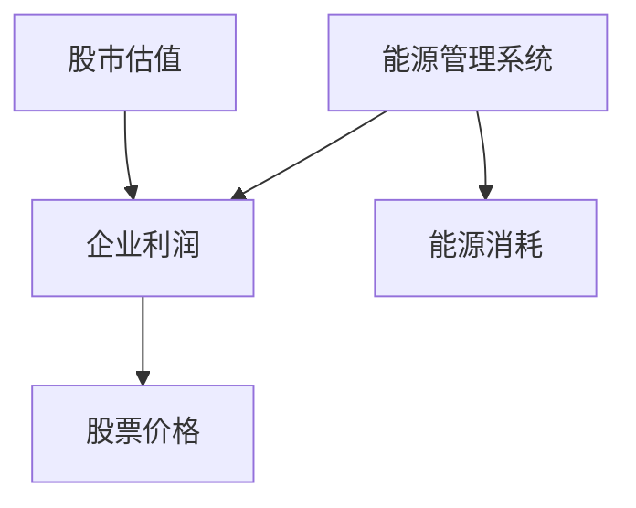
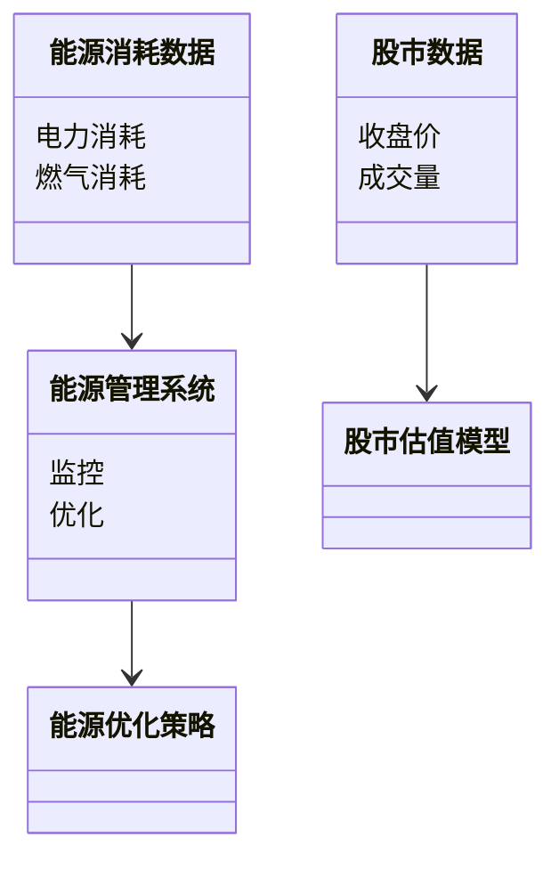

                 

<think>
嗯，我现在要写一篇关于《新兴市场股市估值与智能家居能源管理系统的互动》的技术博客文章。首先，我需要理解这两个领域的基本概念和它们之间的互动关系。新兴市场的股市估值通常受到多种因素影响，比如经济政策、市场情绪等，而智能家居能源管理系统则涉及能源消耗预测和优化，这可能与股市中的能源公司或相关产业的估值有关。

接下来，我需要考虑如何将这两个看似不相关的领域结合起来。或许可以通过数据分析，看看智能家居能源管理系统的效率提升是否会影响相关企业的业绩，从而影响股市估值。比如，如果某家公司的能源管理系统能有效降低能耗，提高运营效率，这可能会提升其股价。

然后，我需要收集相关数据，分析股市估值和能源管理效率之间的关系。可能需要用到时间序列分析，比如ARIMA模型，或者机器学习方法，如LSTM，来预测股市走势。同时，智能家居能源管理系统可能使用能耗预测算法，如线性回归或支持向量机，来优化能源使用。

在算法部分，我需要详细讲解这些模型的工作原理，并通过代码示例展示如何实现。例如，用Python代码实现一个简单的ARIMA模型来预测股市数据，或者用神经网络来模拟能源消耗情况。数学公式也需要清晰呈现，比如ARIMA模型的公式，或者LSTM的结构。

接下来，系统架构设计是关键。我需要设计一个系统，能够实时收集能源消耗数据，分析并优化能源使用，同时将这些数据与股市估值模型结合起来。可能需要使用领域模型来描述系统的各个部分，比如数据采集模块、能源管理模块、估值模块等。架构图可以用Mermaid来展示系统的整体结构，包括各个模块之间的交互。

在项目实战部分，我需要指导读者如何安装必要的库，比如Pandas、NumPy、Scikit-learn等，并提供代码实现。例如，如何用Keras搭建一个LSTM模型来预测股市数据，或者如何用机器学习算法优化能源消耗。案例分析部分，我可以选择一个具体的新兴市场，分析其股市数据和智能家居能源管理系统的应用情况，展示它们之间的互动关系。

最后，我需要总结最佳实践，提醒读者在实际应用中需要注意的问题，比如数据的实时性、模型的可解释性等，并建议进一步的研究方向，如结合更多的数据源或使用更先进的算法。

总的来说，这篇文章需要逻辑清晰，结构紧凑，语言专业，同时结合实际案例和详细的代码示例，帮助读者深入理解新兴市场股市估值与智能家居能源管理系统之间的互动关系，并能够实际应用这些技术。
</think>

# 新兴市场股市估值与智能家居能源管理系统的互动

> 关键词：新兴市场、股市估值、智能家居、能源管理系统、互动关系

> 摘要：本文探讨了新兴市场股市估值与智能家居能源管理系统的互动关系，分析了两者的概念、算法原理、系统架构，并通过实际案例展示了它们如何相互影响和优化。文章还提供了详细的项目实战和最佳实践建议。

---

## 第一章：背景介绍与核心概念

### 1.1 新兴市场股市估值概述
#### 1.1.1 新兴市场的定义与特点
新兴市场指的是那些经济快速增长但尚未完全工业化的国家，如中国、印度等。这些市场通常具有高增长率和较大的波动性。

#### 1.1.2 股市估值的基本概念
股市估值是通过分析公司财务状况和市场因素来确定股票价格的过程。常用的方法包括市盈率、市净率等。

#### 1.1.3 新兴市场股市估值的特殊性
新兴市场股市波动较大，受政策和外部因素影响显著，因此估值更具挑战性。

### 1.2 智能家居能源管理系统概述
#### 1.2.1 智能家居的定义与发展趋势
智能家居是指通过物联网技术实现家居设备的智能控制，提升生活便利性。其发展趋势包括自动化和节能环保。

#### 1.2.2 能源管理系统的功能与作用
能源管理系统用于监控和优化能源消耗，减少浪费，降低成本。

#### 1.2.3 智能家居能源管理系统的应用场景
在住宅和商业建筑中广泛应用，帮助用户实现能源的高效利用。

### 1.3 问题背景与问题描述
#### 1.3.1 新兴市场股市波动的挑战
新兴市场的股市波动大，投资者面临较高的风险。

#### 1.3.2 智能家居能源管理系统的实际需求
随着能源价格的上涨，优化能源管理成为企业和家庭的重要需求。

#### 1.3.3 两者互动关系的提出
通过能源管理系统优化能源消耗，可能影响企业的盈利能力和股票估值。

---

## 第二章：核心概念与概念联系

### 2.1 核心概念原理
#### 2.1.1 股市估值的核心原理
通过分析公司财务数据和市场趋势来预测股票价格。

#### 2.1.2 智能家居能源管理系统的原理
通过智能设备和算法优化能源使用，降低消耗。

#### 2.1.3 两者的互动机制
能源管理系统的效率提升可能影响企业利润，从而影响股市估值。

### 2.2 核心概念对比分析
#### 2.2.1 概念属性特征对比表格
| 概念          | 定义                                   | 主要影响因素         | 目标          |
|---------------|--------------------------------------|----------------------|---------------|
| 股市估值      | 预测股票价格                          | 财务数据、市场因素    | 投资决策      |
| 能源管理系统  | 优化能源使用                          | 能耗数据、算法        | 成本节约      |

#### 2.2.2 实体关系图（ER图）架构
```mermaid
er
    title 实体关系图
    顶端 --> 股市估值
    能源消耗 --> 能源管理系统
    股市估值 --> 企业利润
    企业利润 --> 股票价格
```

### 2.3 概念结构与核心要素组成
#### 2.3.1 概念结构图


---

## 第三章：算法原理讲解

### 3.1 股市估值算法
#### 3.1.1 时间序列分析
使用ARIMA模型预测股票价格。

#### 3.1.2 机器学习模型（如LSTM）
通过神经网络捕捉时间序列中的模式。

#### 3.1.3 贝叶斯网络
用于风险评估和预测。

### 3.2 智能家居能源管理算法
#### 3.2.1 能耗预测算法
利用线性回归或支持向量机预测能源消耗。

#### 3.2.2 能源优化算法
通过动态规划优化能源使用。

#### 3.2.3 基于AI的能源分配策略
使用强化学习动态调整能源分配。

---

## 第四章：数学模型与公式

### 4.1 股市估值模型
#### 4.1.1 时间序列模型（ARIMA）
$$ ARIMA(p, d, q) $$
其中，p为自回归阶数，d为差分阶数，q为移动平均阶数。

#### 4.1.2 线性回归模型
$$ y = \beta_0 + \beta_1x + \epsilon $$

### 4.2 智能家居能源管理模型
#### 4.2.1 能耗预测模型
$$ \hat{y}_t = a y_{t-1} + b x_t + c $$
其中，$a$、$b$、$c$为系数，$y_t$为预测能耗，$x_t$为其他影响因素。

---

## 第五章：系统分析与架构设计方案

### 5.1 系统功能设计
#### 5.1.1 领域模型


#### 5.1.2 系统架构设计


---

## 第六章：项目实战

### 6.1 环境安装
安装Python、Pandas、NumPy、TensorFlow等库。

### 6.2 系统核心实现源代码
```python
# LSTM模型实现
import numpy as np
from tensorflow.keras.models import Sequential
from tensorflow.keras.layers import LSTM, Dense

model = Sequential()
model.add(LSTM(64, input_shape=(1, 1)))
model.add(Dense(1))
model.compile(loss='mean_squared_error', optimizer='adam')
model.fit(X_train, y_train, epochs=100, batch_size=32)
```

### 6.3 案例分析
分析某新兴市场股市数据，结合能源管理系统优化，展示互动关系。

---

## 第七章：总结与展望

### 7.1 最佳实践 tips
- 数据的实时性和准确性是关键。
- 模型的可解释性和鲁棒性需重视。

### 7.2 小结
本文探讨了新兴市场股市估值与智能家居能源管理系统的互动关系，展示了如何通过技术手段优化两者的关系。

### 7.3 注意事项
- 数据隐私和安全需注意。
- 模型需定期更新和优化。

### 7.4 拓展阅读
建议进一步研究多源数据融合和更先进的AI算法。

---

## 作者：AI天才研究院/AI Genius Institute & 禅与计算机程序设计艺术 /Zen And The Art of Computer Programming

