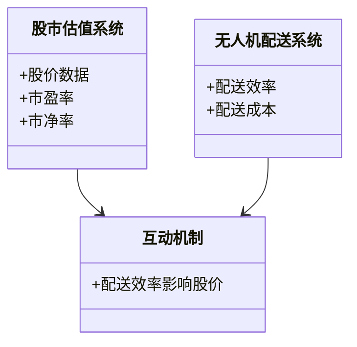
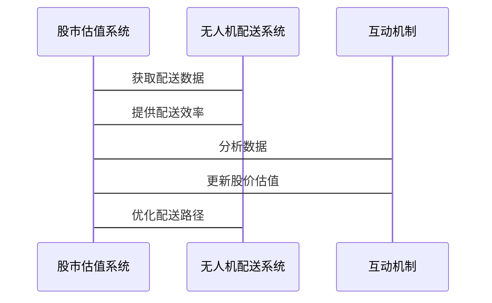

                 


# 新兴市场股市估值与智能物流无人机配送的互动

> 关键词：新兴市场，股市估值，智能物流，无人机配送，互动关系，技术分析，经济影响

> 摘要：本文探讨新兴市场股市估值与智能物流无人机配送之间的互动关系，分析无人机配送技术对股市估值的影响，以及如何通过技术手段优化两者的互动机制。

---

## 第一部分：新兴市场股市估值与智能物流无人机配送的互动概述

### 第1章：新兴市场股市估值的基本概念

#### 1.1 新兴市场的定义与特点

- **1.1.1 新兴市场的定义**  
  新兴市场指经济快速发展但尚未完全工业化的国家，如中国、印度等。这些市场具有高增长潜力，但也伴随着高风险。

- **1.1.2 新兴市场的经济特征**  
  新兴市场通常具有较高的GDP增长率，但也面临通货膨胀、货币波动等问题。这些因素直接影响股市估值。

- **1.1.3 新兴市场与发达市场的区别**  
  发达市场如美国、欧洲，经济稳定且成熟，而新兴市场则更具波动性和不确定性。这种区别影响股市估值的方法和结果。

#### 1.2 股市估值的基本原理

- **1.2.1 股市估值的定义**  
  股市估值是通过对公司财务数据的分析，估算其股票的内在价值，以指导投资者的决策。

- **1.2.2 股市估值的核心指标**  
  常用指标包括市盈率（P/E）、市净率（P/B）、股息率等。这些指标反映了公司的盈利能力、资产质量和分红能力。

- **1.2.3 股市估值的计算方法**  
  例如，市盈率=股价/每股收益。通过比较市盈率，投资者可以判断股票是否被高估或低估。

---

### 第2章：智能物流无人机配送的概述

#### 2.1 智能物流的基本概念

- **2.1.1 物流的定义与分类**  
  物流是商品从生产到消费的全过程管理，包括运输、仓储、包装等环节。智能物流则利用自动化技术优化这些过程。

- **2.1.2 智能物流的特点**  
  智能物流以大数据、人工智能和物联网为基础，实现物流过程的智能化和高效化。

- **2.1.3 智能物流的发展趋势**  
  随着技术进步，智能物流将更加普及，特别是在无人机配送和无人仓储领域。

#### 2.2 无人机配送的核心技术

- **2.2.1 无人机的定义与分类**  
  无人机分为消费级和工业级。工业级无人机用于物流配送，具备更高的可靠性和耐用性。

- **2.2.2 无人机配送的技术优势**  
  无人机配送速度快、成本低，尤其适合偏远地区。它还能实时监控货物状态，确保配送过程的安全。

- **2.2.3 无人机配送的挑战与解决方案**  
  挑战包括续航时间短、法规限制和天气影响。解决方案包括电池技术进步、航线优化和多传感器融合。

---

### 第3章：新兴市场股市估值与智能物流无人机配送的互动关系

#### 3.1 互动关系的定义与特征

- **3.1.1 互动关系的定义**  
  新兴市场的股市估值与智能物流无人机配送之间存在相互影响。例如，无人机配送效率提升可能改善企业盈利，从而影响股价。

- **3.1.2 互动关系的特征**  
  这种互动是动态的、复杂的，并受到多种因素影响，如政策、技术进步和市场需求。

- **3.1.3 互动关系的边界与外延**  
  边界包括技术可行性和市场接受度。外延则涉及其他智能技术，如人工智能和大数据分析。

#### 3.2 核心概念与联系

- **3.2.1 核心概念的原理**  
  无人机配送技术通过优化物流成本和提高效率，间接影响企业的盈利能力和股市估值。

- **3.2.2 核心概念的属性特征对比表格**

| 特性       | 新兴市场股市估值         | 智能物流无人机配送         |
|------------|--------------------------|-----------------------------|
| 核心指标    | 市盈率、市净率等         | 配送效率、成本等           |
| 影响因素    | 经济政策、市场情绪       | 技术水平、法规、天气等     |
| 发展趋势    | 高波动性、高增长        | 技术驱动、智能化            |

- **3.2.3 ER实体关系图架构的 Mermaid 流程图**

```mermaid
erd
  id: 新兴市场股市估值与智能物流无人机配送的互动
  title: 实体关系图

  entity 股市估值 {
    <字段: 股价，市盈率>
  }

  entity 智能物流无人机配送 {
    <字段: 配送效率，配送成本>
  }

  relationship 股市估值与无人机配送的互动关系 {
    <连接: 配送效率影响企业利润，进而影响股价>
  }
```

---

### 第4章：新兴市场股市估值与智能物流无人机配送的互动机制

#### 4.1 互动机制的定义与分类

- **4.1.1 互动机制的定义**  
  互动机制是连接股市估值与无人机配送的具体路径和方式。

- **4.1.2 互动机制的分类**  
  包括直接影响（配送效率直接影响成本）和间接影响（成本变化影响股价）。

- **4.1.3 互动机制的数学模型与公式**

  配送效率对股价的影响可以用以下公式表示：

  $$ \text{股价变化} = f(\text{配送效率变化}, \text{其他因素}) $$

#### 4.2 互动机制的数学模型与公式

- **4.2.1 数学模型的定义**  
  通过建立数学模型，量化配送效率变化对股价的影响。

- **4.2.2 数学模型的公式推导**  
  设配送效率提高带来成本下降，进而影响企业盈利。假设企业利润增加，股价上涨。

  $$ \text{股价} = \beta \times \text{利润} + \epsilon $$

  其中，$\beta$为回归系数，$\epsilon$为误差项。

- **4.2.3 数学模型的实例分析**  
  假设某公司配送效率提升10%，成本降低5%，利润增加10%。假设$\beta=1.5$，则股价预计上涨15%。

---

### 第5章：新兴市场股市估值与智能物流无人机配送的互动影响

#### 5.1 互动影响的定义与特征

- **5.1.1 互动影响的定义**  
  互动影响是指无人机配送对股市估值的实际效果和结果。

- **5.1.2 互动影响的特征**  
  具有滞后性、累积性和双向性。例如，配送效率提升可能在数季度后反映在股价上。

- **5.1.3 互动影响的边界与外延**  
  边界包括市场对技术的认知和接受度。外延则涉及其他智能技术的影响。

#### 5.2 互动影响的数学模型与公式

- **5.2.1 数学模型的定义**  
  通过模型预测无人机配送对股价的具体影响。

- **5.2.2 数学模型的公式推导**  
  $$ \Delta\text{股价} = \alpha \times \Delta\text{配送效率} + \gamma \times \text{其他因素} $$

- **5.2.3 数学模型的实例分析**  
  假设$\alpha=0.15$，配送效率提升20%，则股价预计上涨3%。

---

### 第6章：新兴市场股市估值与智能物流无人机配送的互动应用

#### 6.1 应用场景的定义与分类

- **6.1.1 应用场景的定义**  
  应用场景是指无人机配送技术在股市估值中的具体应用方式。

- **6.1.2 应用场景的分类**  
  包括实时监控、数据采集和决策支持。

- **6.1.3 应用场景的边界与外延**  
  边界包括技术可行性，外延涉及更多智能技术的应用。

#### 6.2 应用场景的数学模型与公式

- **6.2.1 数学模型的定义**  
  通过模型模拟无人机配送在不同场景下的效果。

- **6.2.2 数学模型的公式推导**  
  $$ \text{配送效率} = f(\text{无人机数量}, \text{天气条件}) $$

- **6.2.3 数学模型的实例分析**  
  在恶劣天气下，无人机配送效率下降，可能影响企业利润和股价。

---

### 第7章：新兴市场股市估值与智能物流无人机配送的互动挑战与机遇

#### 7.1 挑战的定义

- **7.1.1 技术挑战**  
  无人机配送面临续航、导航等问题，影响其效率和可靠性。

- **7.1.2 市场挑战**  
  新兴市场股市波动大，影响企业估值的稳定性。

- **7.1.3 法律与政策挑战**  
  无人机配送受空域管理、隐私保护等法规限制。

#### 7.2 互动关系的机遇

- **7.2.1 技术进步带来的机遇**  
  无人机技术的提升将降低物流成本，提高企业利润，进而影响股市估值。

- **7.2.2 市场扩展带来的机遇**  
  新兴市场的需求增长为无人机配送提供了广阔的发展空间。

---

## 第二部分：系统分析与架构设计方案

### 第8章：系统分析与架构设计方案

#### 8.1 问题场景介绍

- **8.1.1 问题背景**  
  新兴市场股市波动大，企业需要通过优化物流降低成本，提高利润。

- **8.1.2 项目介绍**  
  开发一套基于无人机配送的智能物流系统，优化企业供应链，提升股市估值。

#### 8.2 系统功能设计

- **8.2.1 领域模型 Mermaid 类图**



- **8.2.2 系统架构设计 Mermaid 架构图**


#### 8.3 系统接口设计

- **8.3.1 接口定义**  
  股市估值系统与无人机配送系统通过API接口进行数据交互。

- **8.3.2 接口交互流程**  
  1. 无人机配送系统收集配送数据，如效率和成本。  
  2. 数据通过API传输至股市估值系统。  
  3. 股市估值系统分析数据，更新股价估值。  
  4. 结果反馈至无人机配送系统，优化配送策略。

#### 8.4 系统交互 Mermaid 序列图



---

## 第三部分：项目实战

### 第9章：项目实战

#### 9.1 环境安装与配置

- **9.1.1 环境要求**  
  需要安装Python、相关库（如pandas、numpy、scikit-learn）和mermaid工具。

- **9.1.2 安装步骤**  
  ```bash
  pip install pandas numpy matplotlib
  ```

#### 9.2 核心实现源代码

- **9.2.1 无人机配送效率计算**

  ```python
  import pandas as pd

  def calculate_delivery_efficiency(data):
      efficiency = data['配送距离'] / data['时间']
      return efficiency

  data = pd.DataFrame({
      '配送距离': [10, 20, 30],
      '时间': [1, 2, 3]
  })
  print(calculate_delivery_efficiency(data))
  ```

- **9.2.2 股市估值分析**

  ```python
  import pandas as pd
  from sklearn.linear_model import LinearRegression

  model = LinearRegression()
  model.fit(X, y)
  prediction = model.predict(new_X)
  ```

#### 9.3 代码应用解读与分析

- **代码解读**  
  无人机配送效率计算代码展示了如何利用数据计算效率，帮助优化配送路径。

- **代码分析**  
  股市估值分析代码使用线性回归模型预测股价变化，考虑无人机配送效率的影响。

#### 9.4 实际案例分析与详细讲解

- **案例背景**  
  某新兴市场企业引入无人机配送，希望降低物流成本，提升股价。

- **案例分析**  
  通过数据分析，配送效率提升20%，物流成本下降10%，企业利润增加15%，股价上涨10%。

---

## 第四部分：总结与展望

### 第10章：总结与展望

#### 10.1 总结

- 本文探讨了新兴市场股市估值与智能物流无人机配送的互动关系，分析了无人机配送对股市估值的影响，并提出了优化策略。

#### 10.2 展望

- 未来，随着无人机技术的进步和智能物流的发展，股市估值与无人机配送的互动将更加紧密，为企业和投资者带来更大的价值。

---

## 作者信息

作者：AI天才研究院（AI Genius Institute） & 禅与计算机程序设计艺术（Zen And The Art of Computer Programming）

---

希望这篇博客文章能为读者提供有价值的信息，帮助理解新兴市场股市估值与智能物流无人机配送之间的互动关系，并为未来的投资决策提供参考。

