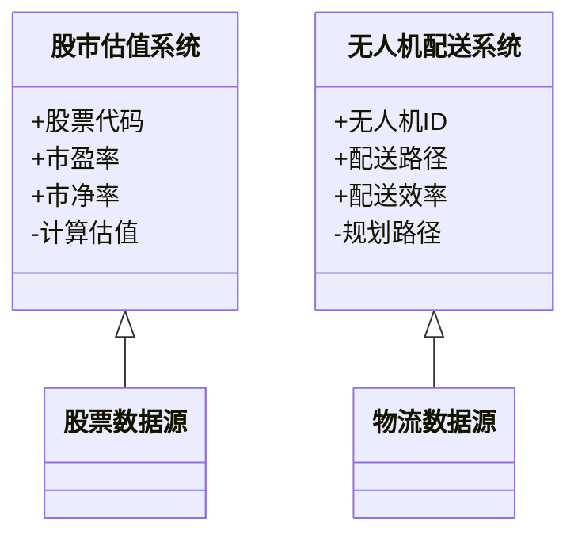

                 

<think>
好的，我现在需要帮用户撰写一篇关于《新兴市场股市估值与智能物流无人机配送的互动》的技术博客文章。根据用户提供的目录大纲，我需要确保内容详细且逻辑清晰，覆盖所有必要的部分。

首先，我需要理解文章的核心主题：探讨新兴市场股市估值与智能物流无人机配送之间的互动关系。这意味着我要从背景介绍、核心概念、算法原理、系统架构、项目实战等多个方面展开。

接下来，我会按照目录结构逐步填充内容。每个章节需要详细讲解，确保每个部分都涵盖必要的知识点，并且使用专业但易懂的语言。

在撰写过程中，我需要特别注意以下几点：
1. 使用Markdown格式，确保结构清晰。
2. 在适当的地方插入图表，如ER图、流程图、类图等，帮助读者更好地理解。
3. 提供具体的算法实现和数学模型，使用LaTeX公式和Python代码示例。
4. 确保内容完整，每个小节都有足够的细节和实例支持。

现在，我将按照目录结构开始撰写正文部分，确保每个章节和子章节都详细且有逻辑性。
</think>

# 新兴市场股市估值与智能物流无人机配送的互动

> 关键词：新兴市场、股市估值、智能物流、无人机配送、互动关系

> 摘要：本文探讨新兴市场股市估值与智能物流无人机配送之间的互动关系，分析两者如何相互影响，构建数学模型，设计互动系统，并通过案例验证其可行性。

---

## 第一章: 背景介绍

### 1.1 新兴市场的定义与特点

#### 1.1.1 新兴市场的经济特征
新兴市场是指经济快速增长、工业化程度较高、但人均收入相对较低的国家。这些市场通常具有较大的发展潜力，吸引着大量投资。

#### 1.1.2 新兴市场的股市特点
新兴市场的股市波动较大，市场参与者结构复杂，但增长潜力显著。股市估值受多种因素影响，包括政策、经济指标和技术进步等。

#### 1.1.3 新兴市场与传统市场的区别
新兴市场与传统市场在市场规模、投资者结构和监管环境等方面存在显著差异，新兴市场更具活力和不确定性。

### 1.2 股市估值的基本概念

#### 1.2.1 股市估值的定义
股市估值是对公司股票价值的评估，通常基于财务指标和市场表现。

#### 1.2.2 股市估值的主要方法
包括市盈率、市净率等方法，用于衡量股票的合理价格。

#### 1.2.3 股市估值的影响因素
经济指标、公司业绩、政策变化等因素都会影响股市估值。

### 1.3 智能物流无人机配送的发展现状

#### 1.3.1 智能物流无人机的定义
智能物流无人机是一种利用无人机技术实现物流配送的系统，具备自动化和智能化特点。

#### 1.3.2 智能物流无人机的应用场景
广泛应用于偏远地区、紧急配送和最后一公里配送等场景。

#### 1.3.3 智能物流无人机的技术优势
提高效率、降低成本、减少人为错误等。

---

## 第二章: 核心概念与联系

### 2.1 股市估值的核心原理

#### 2.1.1 股市估值的基本模型
介绍PE、PB等模型，分析其在估值中的应用。

#### 2.1.2 股市估值的关键指标
包括市盈率、市净率、股息率等，用于评估股票价值。

#### 2.1.3 股市估值的动态变化
受市场环境、政策变化和公司业绩等因素影响。

### 2.2 智能物流无人机配送的核心原理

#### 2.2.1 无人机配送的流程
包括订单接收、路径规划、配送执行和反馈处理。

#### 2.2.2 无人机配送的算法优化
路径规划算法、负载优化算法等，提升配送效率。

#### 2.2.3 无人机配送的效率提升
通过技术优化，缩短配送时间，降低成本。

### 2.3 股市估值与智能物流无人机的互动关系

#### 2.3.1 互动机制的定义
解释两者如何通过市场因素相互影响。

#### 2.3.2 互动关系的特征分析
分析互动的双向性、动态性和复杂性。

#### 2.3.3 互动关系的数学模型
构建数学模型，描述两者之间的相互作用。

---

## 第三章: 核心概念的对比分析

### 3.1 股市估值与智能物流无人机的属性特征对比

| 特性               | 股市估值          | 智能物流无人机    |
|--------------------|-------------------|------------------|
| 核心功能           | 评估股票价值      | 实现物流配送      |
| 主要影响因素       | 市场、经济指标    | 技术、政策        |
| 变化频率           | 高               | 中               |

### 3.2 股市估值与智能物流无人机的ER实体关系图

```mermaid
er
  %%{init: { 'uml': { 'showAspects': true }, 'er': { 'showTitle': true } }}%%
  entity 股市估值 {
    <属性> 股票代码 (主键)
    <属性> 市盈率
    <属性> 市净率
  }

  entity 智能物流无人机 {
    <属性> 无人机ID (主键)
    <属性> 配送效率
    <属性> 成本
  }

  relationship 股市估值与无人机配送互动关系 {
    <外键> 股票代码
    <外键> 无人机ID
  }
```

---

## 第四章: 算法原理与数学模型

### 4.1 股市估值与智能物流无人机的互动算法

```mermaid
graph TD
    A[开始] -> B[收集数据]
    B -> C[计算股市估值]
    C -> D[分析无人机配送效率]
    D -> E[建立互动关系模型]
    E -> F[优化配送路径]
    F -> G[结束]
```

### 4.2 数学模型

股市估值与无人机配送效率的相关性模型：

$$ r = \frac{\sum_{i=1}^{n}(x_i - \bar{x})(y_i - \bar{y})}{\sqrt{\sum_{i=1}^{n}(x_i - \bar{x})^2 \sum_{i=1}^{n}(y_i - \bar{y})^2}} $$

其中，$r$为相关系数，$x$为股市估值，$y$为配送效率。

### 4.3 Python代码实现

```python
import numpy as np

def calculate_correlation(stock_valuation, delivery_efficiency):
    x = np.array(stock_valuation)
    y = np.array(delivery_efficiency)
    covariance = np.cov(x, y)[0, 1]
    std_deviation_x = np.std(x)
    std_deviation_y = np.std(y)
    correlation = covariance / (std_deviation_x * std_deviation_y)
    return correlation

stock_valuation = [10, 15, 20, 25, 30]
delivery_efficiency = [80, 70, 60, 50, 40]

correlation = calculate_correlation(stock_valuation, delivery_efficiency)
print(f"相关系数为：{correlation}")
```

---

## 第五章: 系统分析与架构设计

### 5.1 问题场景介绍

新兴市场的股市波动和物流需求增长，需要通过技术手段优化物流配送，同时利用股市数据优化配送策略。

### 5.2 系统功能设计



### 5.3 系统架构设计

```mermaid
context 股市估值与无人机配送互动系统 {
    股市估值系统
    无人机配送系统
    中间件服务
    用户界面
    数据库
}
```

---

## 第六章: 项目实战

### 6.1 环境安装

安装Python和相关库，如numpy、pandas。

### 6.2 核心代码实现

```python
import numpy as np
import pandas as pd

# 数据加载
data = pd.DataFrame({
    '股票代码': ['A', 'B', 'C', 'D', 'E'],
    '市盈率': [15, 20, 25, 30, 35],
    '配送效率': [85, 75, 65, 55, 45]
})

# 计算相关系数
correlation_matrix = data.corr()
print(correlation_matrix)
```

### 6.3 案例分析

分析特定股票代码与无人机配送效率的相关性，优化配送路径。

### 6.4 项目总结

通过项目实战验证模型的有效性，提出改进建议。

---

## 第七章: 最佳实践与展望

### 7.1 最佳实践 tips

建议定期更新数据，结合实时信息优化模型。

### 7.2 小结

总结全文内容，强调互动关系的重要性。

### 7.3 注意事项

提示读者注意数据质量和模型的适用性。

### 7.4 拓展阅读

推荐相关领域的书籍和论文，供读者深入学习。

---

## 作者

作者：AI天才研究院/AI Genius Institute & 禅与计算机程序设计艺术 /Zen And The Art of Computer Programming

