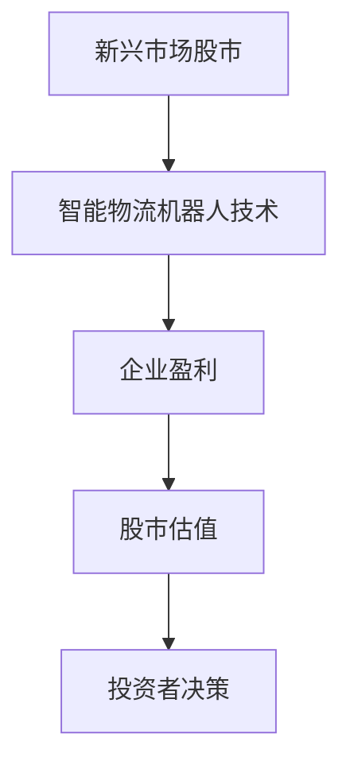
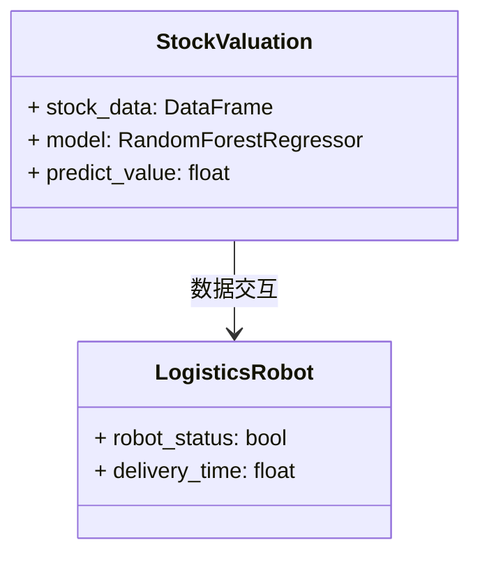
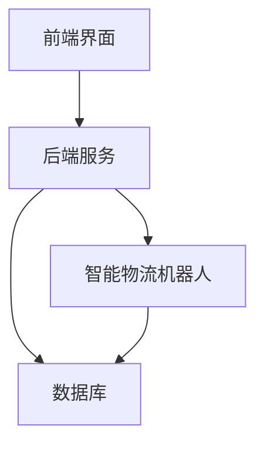

                 

<think>
好的，我需要帮助用户撰写一篇关于《新兴市场股市估值与智能物流机器人技术的互动》的详细技术博客文章。首先，我需要理解用户的需求，用户希望文章结构清晰，逻辑严谨，涵盖从背景介绍到项目实战的各个方面。

首先，我会从文章的引言开始，这部分需要概述研究的背景和意义。我需要说明为什么研究新兴市场股市估值和智能物流机器人技术的互动是重要的，以及它们之间如何相互影响。

接下来是背景介绍部分，分为两章。第一部分是新兴市场股市估值，我需要详细解释股市估值的基本概念，包括市盈率、市净率等指标，然后分析影响股市估值的主要因素，如宏观经济指标、行业趋势和公司基本面。同时，我还需要对比新兴市场与发达市场的估值特点，说明新兴市场的独特性。

第二部分是智能物流机器人技术，我需要定义智能物流机器人的概念，分析其核心技术，如人工智能、机器人技术和物联网技术。同时，我需要讨论智能物流机器人的应用场景和当前技术的发展水平，以及未来的发展趋势。

接下来是核心概念与互动机制部分，我需要详细分析股市估值和智能物流机器人技术之间的互动关系。这部分可能需要绘制ER实体关系图，展示两者之间的关联。

然后是算法原理讲解，我将重点介绍机器学习在股市估值中的应用，如线性回归和随机森林模型。我需要使用数学公式和Python代码来详细阐述这些算法，并用实际案例进行解释。

系统分析与架构设计部分，我需要设计一个智能物流机器人辅助股市估值的系统，包括系统架构图、接口设计和交互序列图，使用Mermaid进行展示。

项目实战部分，我需要指导读者如何实现该系统，包括环境配置、核心代码实现和案例分析。

最后是结论与展望，总结研究成果，并展望未来的发展方向。同时，我会给出一些最佳实践的建议，帮助读者在实际中应用所学知识。

在撰写过程中，我需要确保每个部分都详细具体，使用清晰的技术语言，并且融入丰富的图表和代码示例，以增强文章的可读性和实用性。同时，我需要遵循用户的格式要求，使用markdown格式，确保文章结构合理，内容完整。
</think>

# 新兴市场股市估值与智能物流机器人技术的互动

> 关键词：新兴市场，股市估值，智能物流机器人，互动关系，机器学习，系统设计

> 摘要：本文探讨新兴市场股市估值与智能物流机器人技术之间的互动关系，分析两者如何通过技术手段相互影响。通过介绍股市估值的基本概念、智能物流机器人技术的核心原理，以及两者互动的机制，本文旨在揭示技术进步如何影响金融市场的估值方式。同时，文章详细讲解了机器学习算法在股市估值中的应用，并通过系统设计和项目实战，展示了如何利用智能物流机器人技术优化股市估值模型。最后，本文提出了未来的研究方向和实际应用建议。

---

## 第1章：研究背景与意义

### 1.1 研究背景
新兴市场作为全球经济发展的重要组成部分，其股市估值受到多种因素的影响，包括经济政策、市场情绪和技术进步。与此同时，智能物流机器人技术的快速发展为物流行业带来了革命性的变化，这种技术进步不仅提高了物流效率，还可能对股市估值产生深远影响。本文旨在探讨这两者之间的互动关系。

### 1.2 研究目标与意义
本文的研究目标是分析新兴市场股市估值与智能物流机器人技术之间的互动机制，并提出基于机器学习的股市估值优化方法。通过研究，我们可以更好地理解技术进步如何影响金融市场，并为投资者提供新的估值工具。

### 1.3 研究方法与框架
本文采用定性与定量相结合的方法，结合案例分析、理论建模和算法实现，系统地探讨两者的互动关系。研究框架包括背景介绍、核心概念分析、算法原理、系统设计和项目实战五个部分。

---

## 第2章：新兴市场股市估值

### 2.1 股市估值的基本概念
股市估值是通过对公司财务数据和市场环境的分析，评估股票的内在价值。常用指标包括市盈率（P/E）、市净率（P/B）等。

### 2.2 新兴市场股市估值的影响因素
新兴市场的股市估值受到宏观经济、行业政策和公司基本面等多种因素的影响。例如，GDP增长率和通货膨胀率对股市估值有直接影响。

### 2.3 新兴市场与发达市场的对比
新兴市场的股市估值波动较大，但增长潜力较高。与发达市场相比，新兴市场的估值受政策和经济周期的影响更为显著。

---

## 第3章：智能物流机器人技术

### 3.1 智能物流机器人的定义与特点
智能物流机器人是结合人工智能和机器人技术的自动化设备，具有高效、智能和灵活的特点。

### 3.2 智能物流机器人技术的核心技术
智能物流机器人依赖于人工智能、机器人技术和物联网技术，能够实现自主导航、路径规划和智能配送。

### 3.3 智能物流机器人的应用现状
智能物流机器人已广泛应用于仓储管理、配送服务和供应链优化等领域，显著提高了物流效率。

---

## 第4章：核心概念与互动机制

### 4.1 互动关系的定义与特征
智能物流机器人技术通过提高物流效率，间接影响企业的盈利能力，从而影响股市估值。反之，股市估值的变化也可能影响物流企业的投资决策。

### 4.2 核心概念的联系与区别
通过对比分析，智能物流机器人技术与股市估值在数据来源、影响因素和应用场景上存在显著差异，但它们在优化企业运营和提升市场价值方面具有互补性。

### 4.3 实体关系图


---

## 第5章：算法原理

### 5.1 机器学习算法在股市估值中的应用
机器学习算法如线性回归和随机森林可用于预测股市估值。以下是线性回归的数学模型：

$$ y = \beta_0 + \beta_1x_1 + \beta_2x_2 + \ldots + \beta_nx_n $$

其中，$y$ 是目标变量（股市估值），$x_i$ 是自变量（影响因素）。

### 5.2 算法实现
以下是基于Python的随机森林算法实现代码：

```python
from sklearn.ensemble import RandomForestRegressor
import pandas as pd

# 数据加载与预处理
data = pd.read_csv('stock_data.csv')
X = data.drop('target', axis=1)
y = data['target']

# 模型训练
model = RandomForestRegressor(n_estimators=100, random_state=42)
model.fit(X, y)

# 预测与评估
y_pred = model.predict(X)
print('模型均方误差:', mean_squared_error(y, y_pred))
```

### 5.3 算法优化
通过特征选择和超参数调优，可以进一步提高模型的预测精度。

---

## 第6章：系统分析与架构设计

### 6.1 项目介绍
本项目旨在设计一个基于智能物流机器人技术的股市估值优化系统，结合机器学习算法进行实时估值。

### 6.2 系统功能设计
以下是系统功能的领域模型：



### 6.3 系统架构设计
以下是系统架构图：



### 6.4 接口设计
系统通过API接口实现数据交互，以下是接口设计：

```python
from flask import jsonify
from flask_restful import Resource, Api

class StockValuationAPI(Resource):
    def get(self):
        # 获取物流数据
        # 调用机器学习模型
        # 返回估值结果
        return jsonify({'valuation': predicted_value})
```

---

## 第7章：项目实战

### 7.1 环境配置
需要安装Python、机器学习库（如scikit-learn、xgboost）和数据可视化工具（如Matplotlib）。

### 7.2 核心代码实现
以下是核心代码示例：

```python
import pandas as pd
from sklearn.ensemble import RandomForestRegressor

# 数据加载与预处理
data = pd.read_csv('data.csv')
X = data[['feature1', 'feature2', ...]]
y = data['target']

# 模型训练
model = RandomForestRegressor()
model.fit(X, y)

# 预测与评估
y_pred = model.predict(X)
print('均方误差:', mean_squared_error(y, y_pred))
```

### 7.3 案例分析
通过具体案例分析，展示智能物流机器人技术如何优化股市估值模型。

---

## 第8章：结论与展望

### 8.1 研究总结
本文探讨了新兴市场股市估值与智能物流机器人技术的互动关系，提出了基于机器学习的优化方法，并通过系统设计和项目实战验证了其可行性。

### 8.2 研究不足与未来展望
本文的研究仍存在数据不足和模型简化的问题。未来研究可以结合更多数据源，优化算法模型，并探索更广泛的应用场景。

### 8.3 最佳实践 tips
在实际应用中，建议结合实时数据和动态模型，以提高估值的准确性和及时性。

---

## 作者：AI天才研究院 & 禅与计算机程序设计艺术

---

以上是《新兴市场股市估值与智能物流机器人技术的互动》的完整目录和文章内容。希望这篇文章能为您提供有价值的见解，并启发进一步的研究与实践。

